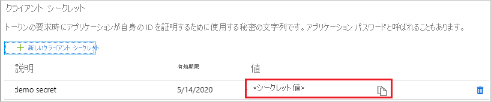

# チュートリアル: Azure AD SSO と Civic Platform の統合

このチュートリアルでは、Civic Platform と Azure Active Directory (Azure AD) を統合する方法について説明します。 Azure AD と Civic Platform を統合すると、次のことができます。

* Civic Platform にアクセスできるユーザーを Azure AD で制御する。
* ユーザーが自分の Azure AD アカウントを使用して Civic Platform に自動的にサインインできるようにする。
* 1 つの中央サイト (Azure Portal) で自分のアカウントを管理します。

## 前提条件

開始するには、次が必要です。

* Azure AD サブスクリプション。 サブスクリプションがない場合は、[無料アカウント](https://azure.microsoft.com/free/)を取得できます。
* Civic Platform でのシングル サインオン (SSO) が有効なサブスクリプション。

## シナリオの説明

このチュートリアルでは、テスト環境で Azure AD の SSO を構成してテストします。

* Civic Platform では、**SP** Initiated SSO がサポートされます。

> [!NOTE]
> このアプリケーションの識別子は固定文字列値であるため、1 つのテナントで構成できるインスタンスは 1 つだけです。

## ギャラリーからの Civic Platform の追加

Azure AD への Civic Platform の統合を構成するには、ギャラリーからマネージド SaaS アプリの一覧に Civic Platform を追加する必要があります。

1. 職場または学校アカウントか、個人の Microsoft アカウントを使用して、Azure portal にサインインします。
1. 左のナビゲーション ウィンドウで **[Azure Active Directory]** サービスを選択します。
1. **[エンタープライズ アプリケーション]** に移動し、 **[すべてのアプリケーション]** を選択します。
1. 新しいアプリケーションを追加するには、 **[新しいアプリケーション]** を選択します。
1. **[ギャラリーから追加する]** セクションで、検索ボックスに、「**Civic Platform**」と入力します。
1. 結果ウィンドウで **[Civic Platform]** を選択し、アプリを追加します。 お使いのテナントにアプリが追加されるのを数秒待機します。

## Civic Platform の Azure AD SSO の構成とテスト

**B.Simon** というテスト ユーザーを使用して、Civic Platform に対する Azure AD SSO を構成してテストします。 SSO が機能するために、Azure AD ユーザーと Civic Platform の関連ユーザーの間で、リンク関係を確立する必要があります。

Civic Platform で Azure AD SSO を構成してテストするには、次の手順を行います。

1. **[Azure AD SSO の構成](#configure-azure-ad-sso)** - ユーザーがこの機能を使用できるようにします。
    1. **[Azure AD のテスト ユーザーの作成](#create-an-azure-ad-test-user)** - B.Simon で Azure AD のシングル サインオンをテストします。
    1. **[Azure AD テスト ユーザーの割り当て](#assign-the-azure-ad-test-user)** - B.Simon が Azure AD シングル サインオンを使用できるようにします。
1. **[Civic Platform SSO の構成](#configure-civic-platform-sso)** - アプリケーション側でシングル サインオン設定を構成します。
    1. **[Civic Platform のテスト ユーザーの作成](#create-civic-platform-test-user)** - Civic Platform で B.Simon に対応するユーザーを作成し、Azure AD の B.Simon にリンクさせます。
1. **[SSO のテスト](#test-sso)** - 構成が機能するかどうかを確認します。

## Azure AD SSO の構成

これらの手順に従って、Azure portal で Azure AD SSO を有効にします。

1. Azure portal の **Civic Platform** アプリケーション統合ページで、 **[管理]** セクションを探して、 **[シングル サインオン]** を選択します。
1. **[シングル サインオン方式の選択]** ページで、 **[SAML]** を選択します。
1. **[SAML によるシングル サインオンのセットアップ]** ページで、 **[基本的な SAML 構成]** の鉛筆アイコンをクリックして設定を編集します。

   

1. **[基本的な SAML 構成]** セクションで、次の手順を実行します。

    a. **[識別子 (エンティティ ID)]** ボックスに、`civicplatform.accela.com` という値を入力します。

    b. **[サインオン URL]** ボックスに、次のパターンを使用して URL を入力します。`https://<SUBDOMAIN>.accela.com`

    > [!NOTE]
    > サインオン URL は実際の値ではありません。 この値は実際のサインオン URL で更新します。 この値を取得するには、[Civic Platform クライアント サポート チーム](mailto:skale@accela.com)に問い合わせてください。 Azure portal の **[基本的な SAML 構成]** セクションに示されているパターンを参照することもできます。

1. **Set up Single Sign-On with SAML\(SAML でのシングルサインオンの設定** ページの **SAML 署名証明書** セクションで、コピー ボタンをクリックして **App Federation Metadata Url\(アプリのフェデレーション メタデータ URL)** をコピーして、コンピューターに保存します。

    ![スクリーンショットは、アプリのフェデレーション メタデータ URL をコピーできる [SAML 署名証明書] ページを示しています。](common/copy-metadataurl.png)

1. **Azure Active Directory** >  Azure AD の **[アプリの登録]** の順に移動し、アプリケーションを選択します。

1. **ディレクトリ (テナント) ID** をコピーし、メモ帳に保存します。

    

1. **アプリケーション ID** をコピーし、メモ帳に保存します。

   

1. **Azure Active Directory** >  Azure AD の **[アプリの登録]** の順に移動し、アプリケーションを選択します。 **[証明書とシークレット]** を選択します。

1. **[クライアント シークレット] -> [新しいクライアント シークレット]** を選択します。

1. シークレットの説明と期間を指定します。 完了したら、 **[追加]** をクリックします。

   > [!NOTE]
   > クライアント シークレットを保存すると、クライアント シークレットの値が表示されます。 キーは後で取得できないため、この値をコピーしておきます。

   

### Azure AD のテスト ユーザーの作成

このセクションでは、Azure portal 内で B.Simon というテスト ユーザーを作成します。

1. Azure portal の左側のウィンドウから、 **[Azure Active Directory]** 、 **[ユーザー]** 、 **[すべてのユーザー]** の順に選択します。
1. 画面の上部にある **[新しいユーザー]** を選択します。
1. **[ユーザー]** プロパティで、以下の手順を実行します。
   1. **[名前]** フィールドに「`B.Simon`」と入力します。  
   1. **[ユーザー名]** フィールドに「username@companydomain.extension」と入力します。 たとえば、「 `B.Simon@contoso.com` 」のように入力します。
   1. **[パスワードを表示]** チェック ボックスをオンにし、 **[パスワード]** ボックスに表示された値を書き留めます。
   1. **Create** をクリックしてください。

### Azure AD テスト ユーザーの割り当て

このセクションでは、B.Simon に Civic Platform へのアクセスを許可することで、このユーザーが Azure シングル サインオンを使用できるようにします。

1. Azure portal で **[エンタープライズ アプリケーション]** を選択し、 **[すべてのアプリケーション]** を選択します。
1. アプリケーションの一覧で **[Civic Platform]** を選択します。
1. アプリの概要ページで、 **[管理]** セクションを見つけて、 **[ユーザーとグループ]** を選択します。
1. **[ユーザーの追加]** を選択し、 **[割り当ての追加]** ダイアログで **[ユーザーとグループ]** を選択します。
1. **[ユーザーとグループ]** ダイアログの [ユーザー] の一覧から **[B.Simon]** を選択し、画面の下部にある **[選択]** ボタンをクリックします。
1. SAML アサーション内に任意のロール値が必要な場合、 **[ロールの選択]** ダイアログでユーザーに適したロールを一覧から選択し、画面の下部にある **[選択]** をクリックします。
1. **[割り当ての追加]** ダイアログで、 **[割り当て]** をクリックします。

## Civic Platform の SSO の構成

1. 新しい Web ブラウザー ウィンドウを開き、Atlassian Cloud 企業サイトに管理者としてサインインします。

1. **[Standard Choices]\(標準選択項目\)** をクリックします。

    ![スクリーンショットは、[Administrator Tools]\(管理ツール\) で [Standard Choices]\(標準選択項目\) が選択されている Atlassian Cloud サイトを示しています。](media/civic-platform-tutorial/standard-choices.png)

1. 標準選択項目 **ssoconfig** を作成します。

1. **ssoconfig** を検索して送信します。

    ![スクリーンショットは、ssoconfig という名前が入力された [Standard Choices - Search]\(標準選択項目 - 検索\) を示しています。](media/civic-platform-tutorial/item.png)

1. 赤い点をクリックして、[SSOCONFIG] を展開します。

    ![スクリーンショットは、S S O CONFIG が利用できる [Standard Choices - Browse]\(標準選択項目 - 参照\) を示しています。](media/civic-platform-tutorial/details.png)

1. 次の手順に従って、SSO 関連の構成情報を指定します。

    ![スクリーンショットは、S S O CONFIG の [Standard Choices Item - Edit]\(標準選択項目 - 編集\) を示しています。](media/civic-platform-tutorial/values.png)

    1. **[applicationid]** フィールドに、Azure portal からコピーした **アプリケーション ID** の値を入力します。

    1. **[clientSecret]** フィールドに、Azure portal からコピーした **シークレット** の値を入力します。

    1. **[directoryId]** フィールドに、Azure portal からコピーした **ディレクトリ (テナント) ID** の値を入力します。

    1. [idpName] を入力します。 例: `Azure`。

### Civic Platform のテスト ユーザーの作成

このセクションでは、Civic Platform で B.Simon というユーザーを作成します。 Civic Platform サポート チームと連携し、[Civic Platform クライアント サポート チーム](mailto:skale@accela.com)にユーザーを追加してください。 シングル サインオンを使用する前に、ユーザーを作成し、有効化する必要があります。

## SSO のテスト 

このセクションでは、次のオプションを使用して Azure AD のシングル サインオン構成をテストします。 

* Azure portal で **[このアプリケーションをテストします]** をクリックします。 これにより、ログイン フローを開始できる Civic Platform のサインオン URL にリダイレクトされます。 

* Civic Platform のサインオン URL に直接移動し、そこからログイン フローを開始します。

* Microsoft マイ アプリを使用することができます。 マイ アプリで [Civic Platform] タイルをクリックすると、Civic Platform のサインオン URL にリダイレクトされます。 マイ アプリの詳細については、[マイ アプリの概要](../user-help/my-apps-portal-end-user-access.md)に関するページを参照してください。

## 次のステップ

Civic Platform を構成したら、組織の機密データを流出と侵入からリアルタイムで保護するセッション制御を適用できます。 セッション制御は、条件付きアクセスを拡張したものです。 [Microsoft Defender for Cloud Apps でセッション制御を適用する方法をご覧ください](/cloud-app-security/proxy-deployment-aad)。
