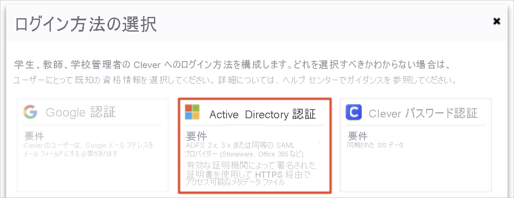

# チュートリアル:Azure Active Directory シングル サインオン (SSO) と Clever の統合

このチュートリアルでは、Clever と Azure Active Directory (Azure AD) を統合する方法について説明します。 Azure AD と Clever を統合すると、次のことができます。

* Clever にアクセスできるユーザーを Azure AD で制御できます。
* ユーザーが自分の Azure AD アカウントを使用して Clever に自動的にサインインするように設定できます。
* 1 つの中央サイト (Azure Portal) で自分のアカウントを管理します。

## 前提条件

開始するには、次が必要です。

* Azure AD サブスクリプション。 サブスクリプションがない場合は、[無料アカウント](https://azure.microsoft.com/free/)を取得できます。
* Clever でのシングル サインオン (SSO) が有効なサブスクリプション。

## シナリオの説明

このチュートリアルでは、テスト環境で Azure AD の SSO を構成してテストします。

* Clever では、**SP** Initiated SSO がサポートされます。

> [!NOTE]
> このアプリケーションの識別子は固定文字列値であるため、1 つのテナントで構成できるインスタンスは 1 つだけです。

## ギャラリーからの Clever の追加

Azure AD への Clever の統合を構成するには、ギャラリーから管理対象 SaaS アプリの一覧に Clever を追加する必要があります。

1. 職場または学校アカウントか、個人の Microsoft アカウントを使用して、Azure portal にサインインします。
1. 左のナビゲーション ウィンドウで **[Azure Active Directory]** サービスを選択します。
1. **[エンタープライズ アプリケーション]** に移動し、 **[すべてのアプリケーション]** を選択します。
1. 新しいアプリケーションを追加するには、 **[新しいアプリケーション]** を選択します。
1. **[ギャラリーから追加する]** セクションで、検索ボックスに、「**Clever**」と入力します。
1. 結果ウィンドウで **Clever** を選択してそのアプリを追加します。 お使いのテナントにアプリが追加されるのを数秒待機します。

## Clever の Azure AD SSO の構成とテスト

**B.Simon** というテスト ユーザーを使用して、Clever に対する Azure AD SSO を構成してテストします。 SSO が機能するために、Azure AD ユーザーと Clever の関連ユーザーの間で、リンク関係を確立する必要があります。

Clever に対する Azure AD SSO を構成してテストするには、次の手順を実行します。

1. **[Azure AD SSO の構成](#configure-azure-ad-sso)** - ユーザーがこの機能を使用できるようにします。
    1. **[Azure AD のテスト ユーザーの作成](#create-an-azure-ad-test-user)** - B.Simon で Azure AD のシングル サインオンをテストします。
    1. **[Azure AD テスト ユーザーの割り当て](#assign-the-azure-ad-test-user)** - B.Simon が Azure AD シングル サインオンを使用できるようにします。
1. **[Clever の SSO の構成](#configure-clever-sso)** - アプリケーション側でシングル サインオン設定を構成します。
    1. **[Clever のテスト ユーザーの作成](#create-clever-test-user)** - Clever で B.Simon に対応するユーザーを作成し、Azure AD の B.Simon にリンクさせます。
1. **[SSO のテスト](#test-sso)** - 構成が機能するかどうかを確認します。

## Azure AD SSO の構成

これらの手順に従って、Azure portal で Azure AD SSO を有効にします。

1. Azure portal の **Clever** アプリケーション統合ページで、 **[管理]** セクションを見つけて、 **[シングル サインオン]** を選択します。
1. **[シングル サインオン方式の選択]** ページで、 **[SAML]** を選択します。
1. **[SAML によるシングル サインオンのセットアップ]** ページで、 **[基本的な SAML 構成]** の鉛筆アイコンをクリックして設定を編集します。

   

1. **[基本的な SAML 構成]** セクションで、次の手順を実行します。

    a. **[識別子 (エンティティ ID)]** ボックスに `https://clever.com/oauth/saml/metadata.xml` という URL を入力します。

    b. **[応答 URL]** ボックスに、`https://clever.com/<COMPANY_NAME>` のパターンを使用して URL を入力します

    c. **[サインオン URL]** ボックスに、次のパターンを使用して URL を入力します。`https://clever.com/in/<COMPANY_NAME>`

    > [!NOTE]
    >  これらは実際の値ではありません。 これらの値を、実際の応答 URL およびサインオン URL で更新してください。 この値を取得するには、[Clever クライアント サポート チーム](https://clever.com/about/contact/)にお問い合わせください。 Azure portal の **[基本的な SAML 構成]** セクションに示されているパターンを参照することもできます。

1. **[Set up single sign-on with SAML]\(SAML でシングル サインオンをセットアップします\)** ページの **[SAML 署名証明書]** セクションで、コピー ボタンをクリックして **[アプリのフェデレーション メタデータ URL]** をコピーして、お使いのコンピューターに保存します。

    

### Azure AD のテスト ユーザーの作成

このセクションでは、Azure portal 内で B.Simon というテスト ユーザーを作成します。

1. Azure portal の左側のウィンドウから、 **[Azure Active Directory]** 、 **[ユーザー]** 、 **[すべてのユーザー]** の順に選択します。
1. 画面の上部にある **[新しいユーザー]** を選択します。
1. **[ユーザー]** プロパティで、以下の手順を実行します。
   1. **[名前]** フィールドに「`B.Simon`」と入力します。  
   1. **[ユーザー名]** フィールドに「username@companydomain.extension」と入力します。 たとえば、「 `B.Simon@contoso.com` 」のように入力します。
   1. **[パスワードを表示]** チェック ボックスをオンにし、 **[パスワード]** ボックスに表示された値を書き留めます。
   1. **Create** をクリックしてください。

### Azure AD テスト ユーザーの割り当て

このセクションでは、B.Simon に Clever へのアクセスを許可することで、このユーザーが Azure シングル サインオンを使用できるようにします。

1. Azure portal で **[エンタープライズ アプリケーション]** を選択し、 **[すべてのアプリケーション]** を選択します。
1. アプリケーションの一覧で **[Clever]** を選択します。
1. アプリの概要ページで、 **[管理]** セクションを見つけて、 **[ユーザーとグループ]** を選択します。
1. **[ユーザーの追加]** を選択し、 **[割り当ての追加]** ダイアログで **[ユーザーとグループ]** を選択します。
1. **[ユーザーとグループ]** ダイアログの [ユーザー] の一覧から **[B.Simon]** を選択し、画面の下部にある **[選択]** ボタンをクリックします。
1. ユーザーにロールが割り当てられることが想定される場合は、 **[ロールの選択]** ドロップダウンからそれを選択できます。 このアプリに対してロールが設定されていない場合は、[既定のアクセス] ロールが選択されていることを確認します。
1. **[割り当ての追加]** ダイアログで、 **[割り当て]** をクリックします。

## Clever の SSO の構成

1. 別の Web ブラウザー ウィンドウで、Clever ディストリクト ダッシュボードに管理者としてログインします。

2. 左側のナビゲーションから **[Menu]\(メニュー\)**  >  **[Portal]\(ポータル\)**  >  **[SSO Settings]\(SSO の設定\)** をクリックします。

3. **[SSO Settings]\(SSO の設定\)** ページで、次の手順を実行します。
    
    a。 **[Add Login Method]\(ログイン方法の追加\)** を選択します。

    b. **[Active Directory Authentication]\(Active Directory 認証\)** を選択します。 

     
    
    c. Azure portal からダウンロードした **アプリのフェデレーション メタデータ URL** をメモ帳で開き、その内容を **[Metadata URL]\(メタデータ URL\)** ボックスに貼り付けます。

     

    d. **[Save]\(保存\)** をクリックします。

### Clever テスト ユーザーの作成

Azure AD ユーザーが Clever にサインインできるようにするには、ユーザーを Clever にプロビジョニングする必要があります。

Clever の場合は、[Clever クライアント サポート チーム](https://clever.com/about/contact/)と協力して、Clever プラットフォームにユーザーを追加します。 シングル サインオンを使用する前に、ユーザーを作成し、有効化する必要があります。

> [!NOTE]
> Clever から提供されている他の Clever ユーザー アカウント作成ツールまたは API を使用して、Azure AD ユーザー アカウントをプロビジョニングできます。

## SSO のテスト 

このセクションでは、次のオプションを使用して Azure AD のシングル サインオン構成をテストします。 

* Azure portal で **[このアプリケーションをテストします]** をクリックします。 これにより、ログイン フローを開始できる Clever のサインオン URL にリダイレクトされます。 

* Clever のサインオン URL に直接移動し、そこからログイン フローを開始します。

* Microsoft マイ アプリを使用することができます。 マイ アプリで [Clever] タイルをクリックすると、Clever のサインオン URL にリダイレクトされます。 マイ アプリの詳細については、[マイ アプリの概要](https://support.microsoft.com/account-billing/sign-in-and-start-apps-from-the-my-apps-portal-2f3b1bae-0e5a-4a86-a33e-876fbd2a4510)に関するページを参照してください。

## 次のステップ

Clever を構成したら、組織の機密データを流出と侵入からリアルタイムで保護するセッション制御を適用できます。 セッション制御は、条件付きアクセスを拡張したものです。 [Microsoft Defender for Cloud Apps でセッション制御を強制する方法](/cloud-app-security/proxy-deployment-aad)をご覧ください。
