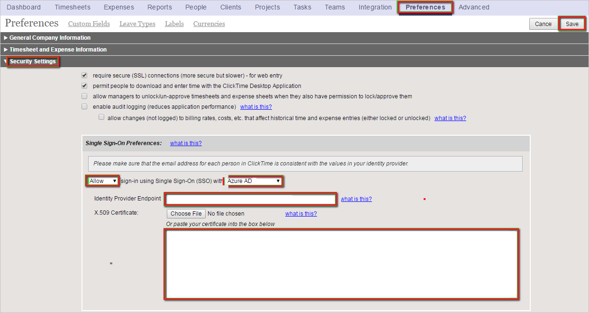
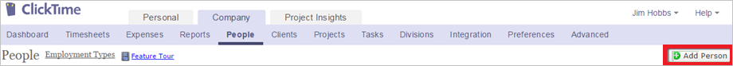

# チュートリアル: Azure AD SSO と ClickTime の統合

このチュートリアルでは、ClickTime と Azure Active Directory (Azure AD) を統合する方法について説明します。 Azure AD と ClickTime を統合すると、次のことができます。

* ClickTime にアクセスできるユーザーを Azure AD で制御できます。
* ユーザーが自分の Azure AD アカウントを使用して ClickTime に自動的にサインインできるように設定できます。
* 1 つの中央サイト (Azure Portal) で自分のアカウントを管理します。

## 前提条件

開始するには、次が必要です。

* Azure AD サブスクリプション。 サブスクリプションがない場合は、[無料アカウント](https://azure.microsoft.com/free/)を取得できます。
* ClickTime でのシングル サインオン (SSO) が有効なサブスクリプション。

## シナリオの説明

このチュートリアルでは、テスト環境で Azure AD のシングル サインオンを構成してテストします。

* ClickTime では、**IDP** Initiated SSO がサポートされます。

> [!NOTE]
> このアプリケーションの識別子は固定文字列値であるため、1 つのテナントで構成できるインスタンスは 1 つだけです。

## ギャラリーから ClickTime を追加する

Azure AD への ClickTime の統合を構成するには、ギャラリーから管理対象 SaaS アプリの一覧に ClickTime を追加する必要があります。

1. 職場または学校アカウントか、個人の Microsoft アカウントを使用して、Azure portal にサインインします。
1. 左のナビゲーション ウィンドウで **[Azure Active Directory]** サービスを選択します。
1. **[エンタープライズ アプリケーション]** に移動し、 **[すべてのアプリケーション]** を選択します。
1. 新しいアプリケーションを追加するには、 **[新しいアプリケーション]** を選択します。
1. **[ギャラリーから追加する]** セクションで、検索ボックスに「**ClickTime**」と入力します。
1. 結果のパネルから **[ClickTime]** を選択し、アプリを追加します。 お使いのテナントにアプリが追加されるのを数秒待機します。

## ClickTime のための Azure AD SSO の構成とテスト

**B.Simon** というテスト ユーザーを使用して、ClickTime 用に Azure AD SSO を構成してテストします。 SSO を機能させるためには、Azure AD ユーザーと ClickTime の関連ユーザーとの間にリンク関係を確立する必要があります。

ClickTime 用に Azure AD SSO を構成してテストするには、次の手順を実行します。

1. **[Azure AD SSO の構成](#configure-azure-ad-sso)** - ユーザーがこの機能を使用できるようにします。
    1. **[Azure AD のテスト ユーザーの作成](#create-an-azure-ad-test-user)** - B.Simon で Azure AD のシングル サインオンをテストします。
    1. **[Azure AD テスト ユーザーの割り当て](#assign-the-azure-ad-test-user)** - B.Simon が Azure AD シングル サインオンを使用できるようにします。
1. **[ClickTime SSO の構成](#configure-clicktime-sso)** - アプリケーション側でシングル サインオン設定を構成します。
    1. **[ClickTime のテスト ユーザーの作成](#create-clicktime-test-user)** - ClickTime で B.Simon に対応するユーザーを作成し、Azure AD の B.Simon にリンクさせます。
1. **[SSO のテスト](#test-sso)** - 構成が機能するかどうかを確認します。

## Azure AD SSO の構成

これらの手順に従って、Azure portal で Azure AD SSO を有効にします。

1. Azure portal の **ClickTime** アプリケーション統合ページで、 **[管理]** セクションを見つけて、 **[シングル サインオン]** を選択します。
1. **[シングル サインオン方式の選択]** ページで、 **[SAML]** を選択します。
1. **[SAML によるシングル サインオンのセットアップ]** ページで、 **[基本的な SAML 構成]** の鉛筆アイコンをクリックして設定を編集します。

   

4. **[SAML でシングル サインオンをセットアップします]** ページで、次の手順を実行します。

    a. **[識別子]** ボックスに、`https://app.clicktime.com/sp/` という URL を入力します。

    b. **[応答 URL]** ボックスに、次のいずれかの URL を入力します。

    | **応答 URL** |
    |----|
    | `https://app.clicktime.com/Login/` |
    | `https://app.clicktime.com/App/Login/Consume.aspx` |

4. **[SAML でシングル サインオンをセットアップします]** ページの **[SAML 署名証明書]** セクションで、 **[ダウンロード]** をクリックして要件のとおりに指定したオプションからの **証明書 (Base64)** をダウンロードして、お使いのコンピューターに保存します。

    

6. **[ClickTime のセットアップ]** セクションで、要件のとおりに適切な URL をコピーします。

    

### Azure AD のテスト ユーザーの作成 

このセクションでは、Azure portal 内で B.Simon というテスト ユーザーを作成します。

1. Azure portal の左側のウィンドウから、 **[Azure Active Directory]** 、 **[ユーザー]** 、 **[すべてのユーザー]** の順に選択します。
1. 画面の上部にある **[新しいユーザー]** を選択します。
1. **[ユーザー]** プロパティで、以下の手順を実行します。
   1. **[名前]** フィールドに「`B.Simon`」と入力します。  
   1. **[ユーザー名]** フィールドに「username@companydomain.extension」と入力します。 たとえば、「 `B.Simon@contoso.com` 」のように入力します。
   1. **[パスワードを表示]** チェック ボックスをオンにし、 **[パスワード]** ボックスに表示された値を書き留めます。
   1. **Create** をクリックしてください。

### Azure AD テスト ユーザーの割り当て

このセクションでは、ClickTime へのアクセスを許可することで、B.Simon が Azure シングル サインオンを使用できるようにします。

1. Azure portal で **[エンタープライズ アプリケーション]** を選択し、 **[すべてのアプリケーション]** を選択します。
1. アプリケーションの一覧で **[ClickTime]** を選択します。
1. アプリの概要ページで、 **[管理]** セクションを見つけて、 **[ユーザーとグループ]** を選択します。
1. **[ユーザーの追加]** を選択し、 **[割り当ての追加]** ダイアログで **[ユーザーとグループ]** を選択します。
1. **[ユーザーとグループ]** ダイアログの [ユーザー] の一覧から **[B.Simon]** を選択し、画面の下部にある **[選択]** ボタンをクリックします。
1. ユーザーにロールが割り当てられることが想定される場合は、 **[ロールの選択]** ドロップダウンからそれを選択できます。 このアプリに対してロールが設定されていない場合は、[既定のアクセス] ロールが選択されていることを確認します。
1. **[割り当ての追加]** ダイアログで、 **[割り当て]** をクリックします。

## ClickTime SSO を構成する

1. 別の Web ブラウザー ウィンドウで、ClickTime 企業サイトに管理者としてログインします。

1. 上部にあるツールバーで **[Preferences]** 、 **[Security Settings]** の順にクリックします。

1. **[Single Sign-On Preferences]** 構成セクションで、次の手順を実行します。

    

    a.  **[Azure AD]** を指定し、シングル サインオン (SSO) を使用したサインインの **[Allow (許可)]** を選択します。

    b. **[Identity Provider Endpoint]\(ID プロバイダー エンドポイント\)** ボックスに、Azure portal からコピーした **ログイン URL** を貼り付けます。

    c.  Azure Portal からダウンロードされた **Base-64 でエンコードされた証明書** を **メモ帳** で開き、その内容をコピーしてから、それを **[X.509 証明書]** ボックスに貼り付けます。

    d.  **[保存]** をクリックします。

### ClickTime のテスト ユーザーの作成

Azure AD ユーザーが ClickTime にログインできるようにするには、そのユーザーを ClickTime にプロビジョニングする必要があります。  
ClickTime の場合、プロビジョニングは手動で行います。

> [!NOTE]
> ClickTime から提供されている他の ClickTime ユーザー アカウント作成ツールまたは API を使用して、Azure AD ユーザー アカウントをプロビジョニングできます。

**ユーザー アカウントをプロビジョニングするには、次の手順に従います。**

1. **ClickTime** テナントにログインします。

1. 上部のツールバーで、 **[Company]** をクリックし、 **[People]** をクリックします。

    ![スクリーンショットは、[Company]\(会社\) と [People]\(ユーザー\) が選択されている ClickTime テナントを示しています。](./media/clicktime-tutorial/account.png "ユーザー")

1. **[Add Person]** をクリックします。

    

1. [New Person] セクションで、次の手順を実行します。

    ![スクリーンショットは、この手順の情報を追加できる [Add Person]\(ユーザーの追加\) セクションを示しています。](./media/clicktime-tutorial/information.png "新しいユーザー")

    a.  **[フル ネーム]** ボックスに、ユーザーの氏名 (**Britta Simon** など) を入力します。 

    b.  **[電子メール アドレス]** ボックスに、ユーザーのメール アドレス (**brittasimon\@contoso.com** など) を入力します。

    > [!NOTE]
    > 必要に応じて、新しいユーザー オブジェクトの追加プロパティを設定できます。

    c.  **[保存]** をクリックします。

## SSO のテスト

このセクションでは、次のオプションを使用して Azure AD のシングル サインオン構成をテストします。

* Azure portal で [このアプリケーションをテストします] をクリックすると、SSO を設定した ClickTime に自動的にサインインされます。

* Microsoft マイ アプリを使用することができます。 マイ アプリで [ClickTime] タイルをクリックすると、SSO を設定した ClickTime に自動的にサインインされます。 マイ アプリの詳細については、[マイ アプリの概要](../user-help/my-apps-portal-end-user-access.md)に関するページを参照してください。

## 次のステップ

ClickTime を構成したら、組織の機密データを流出と侵入からリアルタイムで保護するセッション制御を適用できます。 セッション制御は、条件付きアクセスを拡張したものです。 [Microsoft Defender for Cloud Apps でセッション制御を適用する方法をご覧ください](/cloud-app-security/proxy-deployment-aad)。
