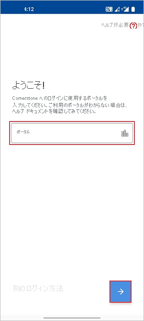
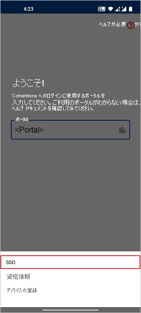
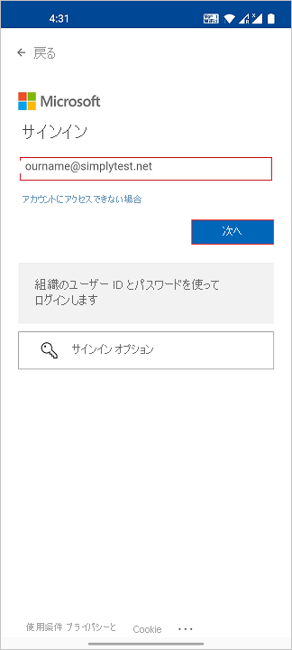
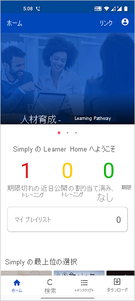

# チュートリアル: Azure Active Directory シングル サインオン (SSO) と Cornerstone の統合

このチュートリアルでは、Cornerstone と Azure Active Directory (Azure AD) 間のシングル サインオン統合を設定する方法について説明します。 Azure AD と Cornerstone を統合すると、次のことができます。

* Cornerstone に SSO アクセスできるユーザーを Azure AD で制御します。
* ユーザーが自分の Azure AD アカウントを使用して Cornerstone に自動的にサインインできるようにします。
* 1 つの中央サイト (Azure Portal) で自分のアカウントを管理します。

## 前提条件

開始するには、次が必要です。

* Azure AD サブスクリプション。 サブスクリプションがない場合は、[無料アカウント](https://azure.microsoft.com/free/)を取得できます。
* Cornerstone での SSO の有効化。

> [!NOTE]
> この統合は、Azure AD 米国政府クラウド環境から利用することもできます。 このアプリケーションは、Azure AD 米国政府クラウドのアプリケーション ギャラリーにあります。パブリック クラウドの場合と同じように構成してください。

## シナリオの説明

このチュートリアルでは、テスト環境で Azure AD の SSO を構成してテストします。

* Cornerstone では、**SP** Initiated SSO がサポートされます。

* Cornerstone では、[自動化されたユーザー プロビジョニング](cornerstone-ondemand-provisioning-tutorial.md)がサポートされます。

* この特定の一覧にある 1 つまたは複数の製品を統合する場合は、ギャラリーから、Cornerstone Single Sign-On アプリを使用する必要があります。

    以下のソリューションが提供されています。

    1. 採用
    2. 学習
    3. 開発
    4. Content
    5. パフォーマンス
    6. キャリア
    7. HR

## ギャラリーからの Cornerstone Single Sign-On の追加

Azure AD SSO と Cornerstone の統合を構成するには、次の操作を実行する必要があります。

1. 職場または学校アカウントか、個人の Microsoft アカウントを使用して、Azure portal にサインインします。
1. 左のナビゲーション ウィンドウで **[Azure Active Directory]** サービスを選択します。
1. **[エンタープライズ アプリケーション]** に移動し、 **[すべてのアプリケーション]** を選択します。
1. 新しいアプリケーションを追加するには、 **[新しいアプリケーション]** を選択します。
1. **[ギャラリーから追加する]** セクションで、検索ボックスに「**Cornerstone Single Sign-On**」と入力します。
1. 結果パネルから **[Cornerstone Single Sign-On]** を選択し、アプリを追加します。 お使いのテナントにアプリが追加されるのを数秒待機します。

## Cornerstone の Azure AD SSO の構成とテスト

**B.Simon** というテスト ユーザーを使用して、Cornerstone に対する Azure AD SSO を構成してテストします。 SSO を機能させるには、Azure AD ユーザーと Cornerstone の関連ユーザーとの間にリンク関係を確立する必要があります。

Cornerstone に対して Azure AD SSO を構成してテストするには、次の手順を実行します。

1. **[Azure AD SSO の構成](#configure-azure-ad-sso)** - ユーザーがこの機能を使用できるようにします。
    1. **[Azure AD のテスト ユーザーの作成](#create-an-azure-ad-test-user)** - B.Simon で Azure AD のシングル サインオンをテストします。
    1. **[Azure AD テスト ユーザーの割り当て](#assign-the-azure-ad-test-user)** - B.Simon が Azure AD シングル サインオンを使用できるようにします。
2. **[Cornerstone シングル サインオンの構成](#configure-cornerstone-single-sign-on)** - Cornerstone で SSO を構成します。
    1. **[Cornerstone Single Sign-On のテスト ユーザーの作成](#create-cornerstone-single-sign-on-test-user)** - Cornerstone で B.Simon に対応するユーザーを作成し、Azure AD のこのユーザーにリンクさせます。
3. **[SSO のテスト](#test-sso)** - 構成が機能するかどうかを確認します。
4. **[Cornerstone (モバイル) の SSO のテスト](#test-sso-for-cornerstone-mobile)** - 構成が機能するかどうかを確認します。

## Azure AD SSO の構成

これらの手順に従って、Azure portal で Azure AD SSO を有効にします。

1. Azure portal の **Cornerstone Single Sign-On** アプリケーション統合ページで、 **[管理]** セクションを見つけて、 **[シングル サインオン]** を選択します。
1. **[シングル サインオン方式の選択]** ページで、 **[SAML]** を選択します。
1. **[SAML によるシングル サインオンのセットアップ]** ページで、 **[基本的な SAML 構成]** の鉛筆アイコンをクリックして設定を編集します。

   

1. **[基本的な SAML 構成]** セクションで、次の手順を実行します。

    a. **[識別子]** ボックスに、`https://<PORTAL_NAME>.csod.com` の形式で URL を入力します。

    b. **[応答 URL]** ボックスに、`https://<PORTAL_NAME>.csod.com/samldefault.aspx?ouid=<OUID>` のパターンを使用して URL を入力します

    c. **[サインオン URL]** ボックスに、次のパターンを使用して URL を入力します。`https://<PORTAL_NAME>.csod.com/samldefault.aspx?ouid=<OUID>`

    > [!NOTE]
    > これらは実際の値ではありません。 実際の応答 URL、識別子、およびサインオン URL でこれらの値を更新します。 これらの値を取得するには、Cornerstone 実装プロジェクト チームにお問い合わせください。 Azure portal の **[基本的な SAML 構成]** セクションに示されているパターンを参照することもできます。

4. **[SAML でシングル サインオンをセットアップします]** ページの **[SAML 署名証明書]** セクションで、 **[証明書 (Base64)]** を見つけて、 **[ダウンロード]** を選択し、証明書をダウンロードして、お使いのコンピューターに保存します。

    

6. **[Cornerstone Single Sign-On のセットアップ]** セクションで、要件に基づいて適切な URL をコピーします。

    

### Azure AD のテスト ユーザーの作成

このセクションでは、Azure portal 内で B.Simon というテスト ユーザーを作成します。

1. Azure portal の左側のウィンドウから、 **[Azure Active Directory]** 、 **[ユーザー]** 、 **[すべてのユーザー]** の順に選択します。
1. 画面の上部にある **[新しいユーザー]** を選択します。
1. **[ユーザー]** プロパティで、以下の手順を実行します。
    1. **[名前]** フィールドに「`B.Simon`」と入力します。  
    1. **[ユーザー名]** フィールドに「username@companydomain.extension」と入力します。 たとえば、「 `B.Simon@contoso.com` 」のように入力します。
    1. **[パスワードを表示]** チェック ボックスをオンにし、 **[パスワード]** ボックスに表示された値を書き留めます。
    1. **Create** をクリックしてください。

### Azure AD テスト ユーザーの割り当て

このセクションでは、B.Simon に Cornerstone へのアクセスを許可することで、Azure シングル サインオンを使用できるようにします。

1. Azure portal で **[エンタープライズ アプリケーション]** を選択し、 **[すべてのアプリケーション]** を選択します。
1. アプリケーション一覧で **[Cornerstone Single Sign-On]** を選択します。
1. アプリの概要ページで、 **[管理]** セクションを見つけて、 **[ユーザーとグループ]** を選択します。
1. **[ユーザーの追加]** を選択し、 **[割り当ての追加]** ダイアログで **[ユーザーとグループ]** を選択します。
1. **[ユーザーとグループ]** ダイアログの [ユーザー] の一覧から **[B.Simon]** を選択し、画面の下部にある **[選択]** ボタンをクリックします。
1. ユーザーにロールが割り当てられることが想定される場合は、 **[ロールの選択]** ドロップダウンからそれを選択できます。 このアプリに対してロールが設定されていない場合は、[既定のアクセス] ロールが選択されていることを確認します。
1. **[割り当ての追加]** ダイアログで、 **[割り当て]** をクリックします。

## Cornerstone シングル サインオンの構成

Cornerstone で SSO を構成するには、Cornerstone 実装プロジェクト チームに連絡する必要があります。 サポート チームはこれを設定して、SAML SSO 接続が両方の側で正しく設定されるようにします。

### Cornerstone Single Sign-On のテスト ユーザーの作成

このセクションでは、Cornerstone で Britta Simon というユーザーを作成します。 Cornerstone 実装プロジェクト チームと協力して、Cornerstone にユーザーを追加してください。 シングル サインオンを使用する前に、ユーザーを作成し、有効化する必要があります。

Cornerstone Single Sign-On では、自動ユーザー プロビジョニングもサポートされています。自動ユーザー プロビジョニングの構成方法について詳しくは、[こちら](./cornerstone-ondemand-provisioning-tutorial.md)をご覧ください。

## SSO のテスト 

このセクションでは、次のオプションを使用して Azure AD のシングル サインオン構成をテストします。 

* Azure portal で **[このアプリケーションをテストします]** をクリックします。 これにより、ログイン フローを開始できる Cornerstone のサインオン URL にリダイレクトされます。 

* Cornerstone のサインオン URL に直接移動し、そこからログイン フローを開始します。

* Microsoft マイ アプリを使用することができます。 マイ アプリで [Cornerstone Single Sign-On] タイルをクリックすると、Cornerstone のサインオン URL にリダイレクトされます。 マイ アプリの詳細については、[マイ アプリの概要](https://support.microsoft.com/account-billing/sign-in-and-start-apps-from-the-my-apps-portal-2f3b1bae-0e5a-4a86-a33e-876fbd2a4510)に関するページを参照してください。

## Cornerstone (モバイル) の SSO のテスト

1. 別のブラウザー ウィンドウで、Cornerstone の Web サイトに管理者としてサインインして、次の手順を実行します。

    a。 **[Admin]\(管理者\) > [Tools]\(ツール\) > [CORE FUNCTIONS]\(コア機能\) > [Core Preferences]\(コア設定\) > [Authentication Preferences]\(認証設定\)** に移動します。

    

    b. 検索ボックスで部署名を指定して、 **[Division Name]\(部署名\)** を検索します。

    c. 結果の **[Division Name]\(部署名\)** をクリックします。

    d. [SAML/IDP server URL]\(SAML/IDP サーバー URL\) ドロップダウンから、ユーザー認証に使用する適切な SAML/IDP サーバーを選択します。

    ![[Other credentials validated against client SAML/IDP server]\(クライアントの SAML/IDP サーバーに対して検証された他の資格情報\) のスクリーンショット。](./media/cornerstone-ondemand-tutorial/other-credentials.png)

    e. **[保存]** をクリックします。

1. **[Admin]\(管理者\) > [Tools]\(ツール\) > [Core Functions]\(コア機能\) > [Core Preferences]\(コア設定\) > [Mobile]\(モバイル\)** に移動します。

    a。 適切な **[Division OU]\(部署 OU\)** を選択します。

    b. この OU で、自分のモバイルとタブレット デバイスで Cornerstone Learn アプリにアクセスできる **[Allow users]\(許可ユーザー\)** を選択し、[Enable Mobile Access]\(モバイル アクセスを有効にする\) チェック ボックスをオンにします。

    c. **[保存]** をクリックします。

2. **[Cornerstone Learn]** モバイル アプリケーションを開きます。 サインイン ページで、ポータル名を入力します。

    

3. **[Alternative Login]\(代替ログイン\)** をクリックして、 **[SSO]** をクリックします。

    

4. .  Cornerstone アプリケーションにサインインするための **Azure AD 資格情報** を入力して、 **[Next]\(次へ\)** をクリックします。

    

5. サインインに成功すると、次に示すようにアプリケーションのホーム ページが表示されます。

    

## 次のステップ

Cornerstone Single Sign-On を構成したら、組織の機密データを流出と侵入からリアルタイムで保護するセッション制御を適用することができます。 セッション制御は、条件付きアクセスを拡張したものです。 [Microsoft Defender for Cloud Apps でセッション制御を適用する方法をご覧ください](/cloud-app-security/proxy-deployment-aad)。
