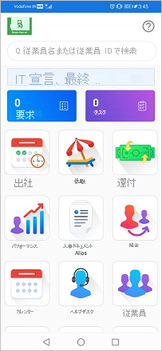

# チュートリアル:Azure Active Directory シングル サインオン (SSO) と Darwinbox の統合

このチュートリアルでは、Darwinbox と Azure Active Directory (Azure AD) を統合する方法について説明します。 Darwinbox を Azure AD と統合すると、次のことができます。

* Darwinbox にアクセスできるユーザーを Azure AD で制御できます。
* ユーザーが自分の Azure AD アカウントを使用して Darwinbox に自動的にサインインできるように設定できます。
* 1 つの中央サイト (Azure Portal) で自分のアカウントを管理します。

## 前提条件

開始するには、次が必要です。

* Azure AD サブスクリプション。 サブスクリプションがない場合は、[無料アカウント](https://azure.microsoft.com/free/)を取得できます。
* Darwinbox でのシングル サインオン (SSO) が有効なサブスクリプション。
> [!NOTE]
> この統合は、Azure AD 米国政府クラウド環境から利用することもできます。 このアプリケーションは、Azure AD 米国政府クラウドのアプリケーション ギャラリーにあります。パブリック クラウドの場合と同じように構成してください。

## シナリオの説明

このチュートリアルでは、テスト環境で Azure AD の SSO を構成してテストします。

* Darwinbox では、**SP** Initiated SSO がサポートされます。

## ギャラリーからの Darwinbox の追加

Azure AD への Darwinbox の統合を構成するには、ギャラリーからマネージド SaaS アプリの一覧に Darwinbox を追加する必要があります。

1. 職場または学校アカウントか、個人の Microsoft アカウントを使用して、Azure portal にサインインします。
1. 左のナビゲーション ウィンドウで **[Azure Active Directory]** サービスを選択します。
1. **[エンタープライズ アプリケーション]** に移動し、 **[すべてのアプリケーション]** を選択します。
1. 新しいアプリケーションを追加するには、 **[新しいアプリケーション]** を選択します。
1. **[ギャラリーから追加する]** セクションで、検索ボックスに「**Darwinbox**」と入力します。
1. 結果パネルで **[Darwinbox]** を選択し、アプリを追加します。 お使いのテナントにアプリが追加されるのを数秒待機します。

## Darwinbox の Azure AD SSO の構成とテスト

**B.Simon** というテスト ユーザーを使用して、Darwinbox に対する Azure AD SSO を構成してテストします。 SSO が機能するためには、Azure AD ユーザーと Darwinbox の関連ユーザーとの間にリンク関係を確立する必要があります。

Darwinbox に対する Azure AD SSO を構成してテストするには、次の手順を実行します。

1. **[Azure AD SSO の構成](#configure-azure-ad-sso)** - ユーザーがこの機能を使用できるようにします。
    1. **[Azure AD のテスト ユーザーの作成](#create-an-azure-ad-test-user)** - B.Simon で Azure AD のシングル サインオンをテストします。
    1. **[Azure AD テスト ユーザーの割り当て](#assign-the-azure-ad-test-user)** - B.Simon が Azure AD シングル サインオンを使用できるようにします。
1. **[Darwinbox SSO の構成](#configure-darwinbox-sso)** - アプリケーション側でシングル サインオン設定を構成します。
    1. **[Darwinbox のテスト ユーザーの作成](#create-darwinbox-test-user)** - Darwinbox で B.Simon に対応するユーザーを作成し、Azure AD の B.Simon にリンクさせます。
1. **[SSO のテスト](#test-sso)** - 構成が機能するかどうかを確認します。

## Azure AD SSO の構成

これらの手順に従って、Azure portal で Azure AD SSO を有効にします。

1. Azure portal の **Darwinbox** アプリケーション統合ページで、 **[管理]** セクションを見つけて、 **[シングル サインオン]** を選択します。
1. **[シングル サインオン方式の選択]** ページで、 **[SAML]** を選択します。
1. **[SAML によるシングル サインオンのセットアップ]** ページで、 **[基本的な SAML 構成]** の鉛筆アイコンをクリックして設定を編集します。

   

1. **[基本的な SAML 構成]** セクションで、次の手順を実行します。

   1. **[識別子 (エンティティ ID)]** ボックスに、次のパターンを使用して URL を入力します。`https://<SUBDOMAIN>.darwinbox.in/adfs/module.php/saml/sp/metadata.php/<CUSTOM_ID>`

    1. **[サインオン URL]** ボックスに、次のパターンを使用して URL を入力します。`https://<SUBDOMAIN>.darwinbox.in/`

      > [!NOTE]
      > これらは実際の値ではありません。 これらの値を実際の識別子とサインオン URL で更新してください。 これらの値を取得するには、[Darwinbox クライアント サポート チーム](https://darwinbox.com/contact-us.php)に問い合わせてください。 Azure portal の **[基本的な SAML 構成]** セクションに示されているパターンを参照することもできます。

1. **[SAML でシングル サインオンをセットアップします]** ページの **[SAML 署名証明書]** セクションで、 **[フェデレーション メタデータ XML]** を探して **[ダウンロード]** を選択し、証明書をダウンロードして、お使いのコンピューターに保存します。

    

1. **[Darwinbox のセットアップ]** セクションで、要件に基づいて適切な URL をコピーします。

    

### Azure AD のテスト ユーザーの作成

このセクションでは、Azure portal 内で B.Simon というテスト ユーザーを作成します。

1. Azure portal の左側のウィンドウから、 **[Azure Active Directory]** 、 **[ユーザー]** 、 **[すべてのユーザー]** の順に選択します。
1. 画面の上部にある **[新しいユーザー]** を選択します。
1. **[ユーザー]** プロパティで、以下の手順を実行します。
   1. **[名前]** フィールドに「`B.Simon`」と入力します。  
   1. **[ユーザー名]** フィールドに「username@companydomain.extension」と入力します。 たとえば、「 `B.Simon@contoso.com` 」のように入力します。
   1. **[パスワードを表示]** チェック ボックスをオンにし、 **[パスワード]** ボックスに表示された値を書き留めます。
   1. **Create** をクリックしてください。

### Azure AD テスト ユーザーの割り当て

このセクションでは、B.Simon に Darwinbox へのアクセスを許可することで、このユーザーが Azure シングル サインオンを使用できるようにします。

1. Azure portal で **[エンタープライズ アプリケーション]** を選択し、 **[すべてのアプリケーション]** を選択します。
1. アプリケーションの一覧で **[Darwinbox]** を選択します。
1. アプリの概要ページで、 **[管理]** セクションを見つけて、 **[ユーザーとグループ]** を選択します。
1. **[ユーザーの追加]** を選択し、 **[割り当ての追加]** ダイアログで **[ユーザーとグループ]** を選択します。
1. **[ユーザーとグループ]** ダイアログの [ユーザー] の一覧から **[B.Simon]** を選択し、画面の下部にある **[選択]** ボタンをクリックします。
1. SAML アサーション内に任意のロール値が必要な場合、 **[ロールの選択]** ダイアログでユーザーに適したロールを一覧から選択し、画面の下部にある **[選択]** をクリックします。
1. **[割り当ての追加]** ダイアログで、 **[割り当て]** をクリックします。

## Darwinbox SSO の構成

**Darwinbox** 側でシングル サインオンを構成するには、ダウンロードした **フェデレーション メタデータ XML** と Azure portal からコピーした適切な URL を [Darwinbox サポート チーム](https://darwinbox.com/contact-us.php)に送信する必要があります。 サポート チームはこれを設定して、SAML SSO 接続が両方の側で正しく設定されるようにします。

### Darwinbox のテスト ユーザーの作成

このセクションでは、Darwinbox で B.Simon というユーザーを作成します。 [Darwinbox サポート チーム](https://darwinbox.com/contact-us.php)と連携し、Darwinbox プラットフォームにユーザーを追加してください。 シングル サインオンを使用する前に、ユーザーを作成し、有効化する必要があります。

## SSO のテスト 

このセクションでは、次のオプションを使用して Azure AD のシングル サインオン構成をテストします。 

* Azure portal で **[このアプリケーションをテストします]** をクリックします。 これにより、ログイン フローを開始できる Darwinbox のサインオン URL にリダイレクトされます。 

* Darwinbox のサインオン URL に直接移動し、そこからログイン フローを開始します。

* Microsoft マイ アプリを使用することができます。 マイ アプリで [Darwinbox] タイルをクリックすると、Darwinbox のサインオン URL にリダイレクトされます。 マイ アプリの詳細については、[マイ アプリの概要](https://support.microsoft.com/account-billing/sign-in-and-start-apps-from-the-my-apps-portal-2f3b1bae-0e5a-4a86-a33e-876fbd2a4510)に関するページを参照してください。

## Darwinbox (モバイル) の SSO のテスト

1. Darwinbox モバイル アプリケーションを開きます。 **[Enter Organization URL]\(組織の URL の入力\)** をクリックし、テキストボックスに組織の URL を入力して、矢印ボタンをクリックします。

    ![[Enter Organization U R L]\(組織の U R L の入力\) が選択されている "Darwinbox" モバイル アプリを示すスクリーンショット。サンプルの組織と "矢印" ボタンが強調表示されています。](media/darwinbox-tutorial/login.png)

1. 複数のドメインがある場合は、対象のドメインをクリックします。

    ![サンプル ドメインが選択されている [Choose your domain]\(ドメインの選択\) 画面を示すスクリーンショット。](media/darwinbox-tutorial/domain.png)

1. Darwinbox アプリケーションに Azure AD のメール アドレスを入力し、 **[Next]\(次へ\)** をクリックします。

    ![[Next]\(次へ\) ボタンが強調表示されている [Sign in]\(サインイン\) 画面を示すスクリーンショット。](media/darwinbox-tutorial/email.png)

1. Darwinbox アプリケーションに Azure AD のパスワードを入力し、 **[Sign in]\(サインイン\)** をクリックします。

    ![[Next]\(次へ\) ボタンが強調表示されている [Sign into options]\(サインイン オプション\) 画面を示すスクリーンショット。](media/darwinbox-tutorial/account.png)

1. サインインに成功すると、アプリケーションのホーム ページが表示されます。

    

## 次のステップ

Darwinbox を構成したら、組織の機密データを流出と侵入からリアルタイムで保護するセッション制御を適用できます。 セッション制御は、条件付きアクセスを拡張したものです。 [Microsoft Defender for Cloud Apps でセッション制御を適用する方法をご覧ください](/cloud-app-security/proxy-deployment-aad)。
