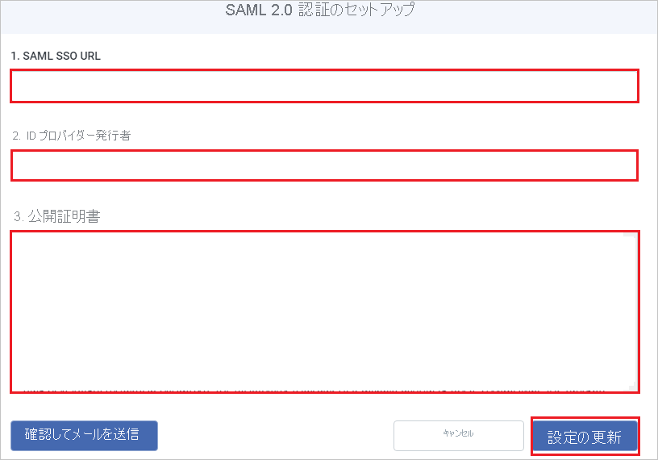

# チュートリアル: Azure AD SSO と Dealpath の統合

このチュートリアルでは、Dealpath と Azure Active Directory (Azure AD) を統合する方法について説明します。 Azure AD と Dealpath を統合すると、次のことが可能になります。

* Dealpath にアクセスするユーザーを Azure AD で制御します。
* ユーザーが自分の Azure AD アカウントを使用して Dealpath に自動的にサインインできるようにします。
* 1 つの中央サイト (Azure Portal) で自分のアカウントを管理します。

## 前提条件

開始するには、次が必要です。

* Azure AD サブスクリプション。 サブスクリプションがない場合は、[無料アカウント](https://azure.microsoft.com/free/)を取得できます。
* Dealpath でのシングル サインオン (SSO) が有効なサブスクリプション。

## シナリオの説明

このチュートリアルでは、テスト環境で Azure AD のシングル サインオンを構成してテストします。

* Dealpath では、**SP** Initiated SSO がサポートされます。

## ギャラリーから Dealpath を追加する

Azure AD への Dealpath の統合を構成するには、ギャラリーから管理対象 SaaS アプリの一覧に Dealpath を追加する必要があります。

1. 職場または学校アカウントか、個人の Microsoft アカウントを使用して、Azure portal にサインインします。
1. 左のナビゲーション ウィンドウで **[Azure Active Directory]** サービスを選択します。
1. **[エンタープライズ アプリケーション]** に移動し、 **[すべてのアプリケーション]** を選択します。
1. 新しいアプリケーションを追加するには、 **[新しいアプリケーション]** を選択します。
1. **[ギャラリーから追加する]** セクションで、検索ボックスに「**Dealpath**」と入力します。
1. 結果ウィンドウで **[Dealpath]** を選択し、アプリを追加します。 お使いのテナントにアプリが追加されるのを数秒待機します。

## Dealpath の Azure AD SSO の構成とテスト

**B.Simon** というテスト ユーザーを使用して、Dealpath に対する Azure AD SSO を構成してテストします。 SSO が機能するためには、Azure AD ユーザーと Dealpath の関連ユーザーとの間にリンク関係を確立する必要があります。

Dealpath に対して Azure AD SSO を構成してテストするには、次の手順を実行します。

1. **[Azure AD SSO の構成](#configure-azure-ad-sso)** - ユーザーがこの機能を使用できるようにします。
    1. **[Azure AD のテスト ユーザーの作成](#create-an-azure-ad-test-user)** - B.Simon で Azure AD のシングル サインオンをテストします。
    1. **[Azure AD テスト ユーザーの割り当て](#assign-the-azure-ad-test-user)** - B.Simon が Azure AD シングル サインオンを使用できるようにします。
1. **[Dealpath SSO の構成](#configure-dealpath-sso)** - アプリケーション側でシングル サインオン設定を構成します。
    1. **[Dealpath テスト ユーザーの作成](#create-dealpath-test-user)** - Dealpath で B.Simon に対応するユーザーを作成し、Azure AD のこのユーザーにリンクさせます。
1. **[SSO のテスト](#test-sso)** - 構成が機能するかどうかを確認します。

## Azure AD SSO の構成

これらの手順に従って、Azure portal で Azure AD SSO を有効にします。

1. Azure portal の **Dealpath** アプリケーション統合ページで、 **[管理]** セクションを見つけて、 **[シングル サインオン]** を選択します。
1. **[シングル サインオン方式の選択]** ページで、 **[SAML]** を選択します。
1. **[SAML によるシングル サインオンのセットアップ]** ページで、 **[基本的な SAML 構成]** の鉛筆アイコンをクリックして設定を編集します。

   

4. **[基本的な SAML 構成]** セクションで、次の手順を実行します。

    a. **[サインオン URL]** ボックスに、URL として「`https://app.dealpath.com/account/login`」と入力します。

    b. **[識別子 (エンティティ ID)]** ボックスに、次のパターンを使用して URL を入力します。`https://api.dealpath.com/saml/metadata/<ID>`

    > [!NOTE]
    > この識別子の値は実際のものではありません。 この値を実際の識別子で更新してください。 これらの値を取得するには、[Dealpath クライアント サポート チーム](mailto:kenter@dealpath.com)に問い合わせてください。 Azure portal の **[基本的な SAML 構成]** セクションに示されているパターンを参照することもできます。

4. **[SAML でシングル サインオンをセットアップします]** ページの **[SAML 署名証明書]** セクションで **[ダウンロード]** をクリックして、要件に適した特定のオプションの **証明書 (Base64)** をダウンロードし、コンピューターに保存します。

    

6. **[Dealpath のセットアップ]** セクションで、要件に従って適切な URL をコピーします。

    

### Azure AD のテスト ユーザーの作成 

このセクションでは、Azure portal 内で B.Simon というテスト ユーザーを作成します。

1. Azure portal の左側のウィンドウから、 **[Azure Active Directory]** 、 **[ユーザー]** 、 **[すべてのユーザー]** の順に選択します。
1. 画面の上部にある **[新しいユーザー]** を選択します。
1. **[ユーザー]** プロパティで、以下の手順を実行します。
   1. **[名前]** フィールドに「`B.Simon`」と入力します。  
   1. **[ユーザー名]** フィールドに「username@companydomain.extension」と入力します。 たとえば、「 `B.Simon@contoso.com` 」のように入力します。
   1. **[パスワードを表示]** チェック ボックスをオンにし、 **[パスワード]** ボックスに表示された値を書き留めます。
   1. **Create** をクリックしてください。

### Azure AD テスト ユーザーの割り当て

このセクションでは、B.Simon に Dealpath へのアクセスを許可して、このユーザーが Azure シングル サインオンを使用できるようにします。

1. Azure portal で **[エンタープライズ アプリケーション]** を選択し、 **[すべてのアプリケーション]** を選択します。
1. アプリケーションの一覧で **[Dealpath]** を選択します。
1. アプリの概要ページで、 **[管理]** セクションを見つけて、 **[ユーザーとグループ]** を選択します。
1. **[ユーザーの追加]** を選択し、 **[割り当ての追加]** ダイアログで **[ユーザーとグループ]** を選択します。
1. **[ユーザーとグループ]** ダイアログの [ユーザー] の一覧から **[B.Simon]** を選択し、画面の下部にある **[選択]** ボタンをクリックします。
1. ユーザーにロールが割り当てられることが想定される場合は、 **[ロールの選択]** ドロップダウンからそれを選択できます。 このアプリに対してロールが設定されていない場合は、[既定のアクセス] ロールが選択されていることを確認します。
1. **[割り当ての追加]** ダイアログで、 **[割り当て]** をクリックします。

## Dealpath SSO の構成

1. 別の Web ブラウザー ウィンドウで、Dealpath に管理者としてサインインします。

2. 右上で **[管理ツール]** をクリックし、 **[統合]** に移動して、 **[SAML 2.0 Authentication]\(SAML 2.0 認証\)** セクションで **[設定の更新]** をクリックします。

    ![[S A M L 2.0 Authentication]\(S A M L 2.0 認証\) セクションと [設定の更新] が選択された [管理ツール] - [統合] ページを示すスクリーンショット。](./media/dealpath-tutorial/admin.png)

3. **[Set up SAML 2.0 authentication]\(SAML 2.0 認証の設定\)** ページで、次の手順を実行します。

     

    a. **[SAML SSO URL]** ボックスに、Azure portal からコピーした **ログイン URL** の値を貼り付けます。

    b. **[ID プロバイダーの発行者]** ボックスに、Azure portal からコピーした **Azure AD 識別子** の値を貼り付けます。

    c. ダウンロードした **証明書 (Base64)** をメモ帳で開いて内容をコピーし、 **[公開証明書]** ボックスに貼り付けます。

    d. **[設定の更新]** をクリックします。

### Dealpath テスト ユーザーの作成

このセクションでは、Dealpath で Britta Simon というユーザーを作成します。 [Dealpath クライアント サポート チーム](mailto:kenter@dealpath.com)と連携し、Dealpath プラットフォームにユーザーを追加してください。 シングル サインオンを使用する前に、ユーザーを作成し、有効化する必要があります

## SSO のテスト 

このセクションでは、次のオプションを使用して Azure AD のシングル サインオン構成をテストします。 

* Azure portal で **[このアプリケーションをテストします]** をクリックします。 これにより、ログイン フローを開始できる Dealpath のサインオン URL にリダイレクトされます。 

* Dealpath のサインオン URL に直接移動し、そこからログイン フローを開始します。

* Microsoft マイ アプリを使用することができます。 マイ アプリの [Dealpath] タイルをクリックすると、Dealpath のサインオン URL にリダイレクトされます。 マイ アプリの詳細については、[マイ アプリの概要](../user-help/my-apps-portal-end-user-access.md)に関するページを参照してください。

## 次のステップ

Dealpath を構成したら、組織の機密データの流出と侵入をリアルタイムで保護するセッション制御を適用することができます。 セッション制御は、条件付きアクセスを拡張したものです。 [Microsoft Defender for Cloud Apps でセッション制御を適用する方法をご覧ください](/cloud-app-security/proxy-deployment-aad)。
