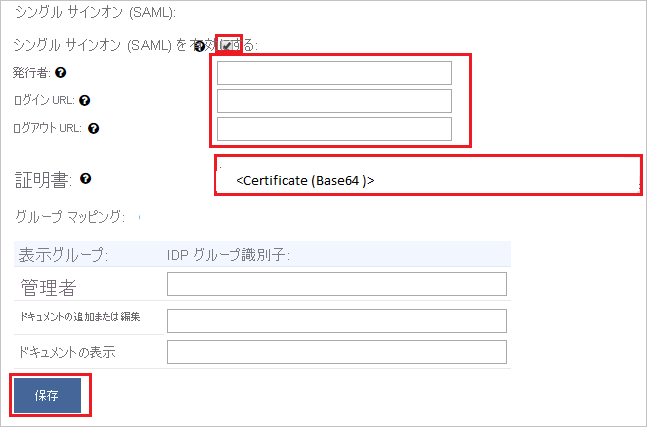

# チュートリアル:Displayr と Azure Active Directory との統合

このチュートリアルでは、Displayr と Azure Active Directory (Azure AD) を統合する方法について説明します。 Displayr を Azure AD に統合すると、次のことができます。

* Displayr にアクセスできるユーザーを Azure AD で制御する。
* ユーザーが自分の Azure AD アカウントを使用して Displayr に自動的にサインインできるようにする。
* 1 つの中央サイト (Azure Portal) で自分のアカウントを管理します。

## 前提条件

開始するには、次が必要です。

* Azure AD サブスクリプション。 サブスクリプションがない場合は、[無料アカウント](https://azure.microsoft.com/free/)を取得できます。
* Displayr でのシングル サインオン (SSO) が有効な会社。

## シナリオの説明

このチュートリアルでは、Displayr 社で Azure AD SSO を構成する方法について説明します。

* Displayr では、**SP** によって開始される SSO がサポートされます

## ギャラリーからの Displayr の追加

Azure AD への Displayr の統合を構成するには、ギャラリーから管理対象 SaaS アプリの一覧に Displayr を追加する必要があります。

1. 職場または学校アカウントか、個人の Microsoft アカウントを使用して、Azure portal にサインインします。
1. 左のナビゲーション ウィンドウで **[Azure Active Directory]** サービスを選択します。
1. **[エンタープライズ アプリケーション]** に移動し、 **[すべてのアプリケーション]** を選択します。
1. 新しいアプリケーションを追加するには、 **[新しいアプリケーション]** を選択します。
1. **[ギャラリーから追加する]** セクションで、検索ボックスに "**Displayr**" と入力します。
1. 結果のパネルから **[Displayr]** を選択し、アプリを追加します。 お使いのテナントにアプリが追加されるのを数秒待機します。

## Displayr 用に Azure AD SSO を構成する

Displayr で Azure AD SSO を構成するには、次の手順を実行します。

1. **[Azure AD SSO の構成](#configure-azure-ad-sso)** - ユーザーがこの機能を使用できるようにします。
1. **[Displayr SSO の構成](#configure-displayr-sso)** - アプリケーション側で SSO 設定を構成します。
1. **[特定のユーザーへのアクセスを](#restrict-access-to-specific-users)** 制限して、Displayr にサインインできる Azure AD ユーザーを制限します。
1. **[SSO のテスト](#test-sso)** - 構成が機能するかどうかを確認します。

## Azure AD SSO の構成

これらの手順に従って、Azure portal で Azure AD SSO を有効にします。

1. Azure portal の **Displayr** アプリケーション統合ページで、 **[管理]** セクションを見つけて、 **[シングル サインオン]** を選択します。
1. **[シングル サインオン方式の選択]** ページで、 **[SAML]** を選択します。
1. **[SAML によるシングル サインオンのセットアップ]** ページで、 **[基本的な SAML 構成]** の鉛筆アイコンをクリックして設定を編集します。

   

1. **[基本的な SAML 構成]** セクションで、次の手順を実行します。

    a. **[識別子 (エンティティ ID)]** ボックスに、次のパターンを使用して値を入力します。`<YOURDOMAIN>.displayr.com`
    
    b. **[応答 URL]** テキスト ボックスに、URL `https://app.displayr.com/Login/ProcessSamlResponse` を入力します。
    
    c. **[サインオン URL]** ボックスに、`https://<YOURDOMAIN>.displayr.com` という形式で URL を入力します。

    d. **[保存]** をクリックします。

    >[!NOTE]
    >これらは実際の値ではありません。 これらの値を実際の識別子とサインオン URL で更新してください。 これらの値を取得するには、[Displayr クライアント サポート チーム](mailto:support@displayr.com)に問い合わせてください。 Azure portal の [基本的な SAML 構成] セクションに示されているパターンを参照することもできます。

1. **[SAML でシングル サインオンをセットアップします]** ページの **[SAML 署名証明書]** セクションで、 **[ダウンロード]** をクリックして **証明書 (Base64)** をダウンロードし、コンピューターに保存します。

   

1. Displayr アプリケーションは、特定の形式の SAML アサーションを使用するため、カスタム属性のマッピングを SAML トークンの属性の構成に追加する必要があります。 次のスクリーンショットには、既定の属性一覧が示されています。 **[編集]** アイコンをクリックして、[ユーザー属性] ダイアログを開きます。

   ![[編集] アイコンが強調表示されている [ユーザー属性] セクションを示すスクリーンショット。](common/edit-attribute.png)

1. その他に、Displayr アプリケーションでは、いくつかの属性が SAML 応答で返されることが想定されています。 **[グループ要求 (プレビュー)]** ダイアログの **[ユーザー属性とクレーム]** セクションで、次の手順を実行します。

   a. **[グループ要求を追加する]** をクリックします。

      ![各設定が選択されている [グループ要求 (プレビュー)] ウィンドウを示すスクリーンショット。](./media/displayr-tutorial/claims.png)

   b. ラジオ ボタンのリストから **[すべてのグループ]** を選択します。

   c. **[グループ ID]** の **[ソース属性]** を選択します。

   f. **[保存]** をクリックします。

1. **[Displayr の設定]** セクションで、要件どおりの適切な URL をコピーします。

   

## Displayr SSO の構成

1. Displayr 内での構成を自動化するには、 **[拡張機能のインストール]** をクリックして **マイアプリによるセキュリティで保護されたサインイン拡張機能** をインストールする必要があります。

    

2. ブラウザーに拡張機能を追加した後、 **[Displayr の設定]** をクリックすると、Displayr アプリケーションに移動します。 そこから、管理者資格情報を提供して Displayr にサインインします。 ブラウザー拡張機能によりアプリケーションが自動的に構成され、手順 3 ～ 6 が自動化されます。

    

3. Displayr を手動でセットアップする場合は、新しい Web ブラウザー ウィンドウを開き、管理者として Displayr の企業サイトにサインインして、次の手順を実行します。

4. **[User]\(ユーザー\)** アイコンをクリックし、 **[Account settings]\(アカウント設定\)** に移動します。

    ![[設定] アイコンと [アカウント] が選択されていることを示すスクリーンショット。](./media/displayr-tutorial/account.png)

5. 上部のメニューから **[設定]** に切り替え、ページを下へスクロールして **[Configure Single Sign On (SAML)]\(シングル サインオンの構成 (SAML)\)** をクリックします。

    ![[設定] タブが選択され、[Configure Single Sign On (S A M L)]\(シングル サインオンの構成 (S A M L)\) アクションが選択されていることを示すスクリーンショット。](./media/displayr-tutorial/settings.png)

6. **[Single sign-on (SAML)]\(シングル サインオン (SAML)\)** ページで、次の手順に従います。

    

    a. **[Enable Single Sign On (SAML)]\(シングル サインオン (SAML) を有効にする\)** ボックスをオンにします。

    b. Azure AD の **[基本的な SAML 構成]** セクションから実際の **ID** 値をコピーして、 **[発行者]** テキスト ボックスに貼り付けます。

    c. **[ログイン URL]** ボックスに、Azure portal からコピーした **ログイン URL** の値を貼り付けます。

    d. **[ログアウト URL]** ボックスに、Azure portal からコピーした **ログアウト URL** の値を貼り付けます。

    e. 証明書 (Base64) をメモ帳で開き、その内容をコピーして **[証明書]** テキスト ボックスに貼り付けます。

    f. **グループ マッピング** は省略可能です。

    g. **[保存]** をクリックします。  

### 特定のユーザーにアクセスを制限する

既定では、Displayr アプリケーションを追加したテナント内のすべてのユーザーは、SSO を使用して Displayr にログインできます。 特定のユーザーまたはグループにアクセスを制限する場合、「[Azure AD アプリを Azure AD テナントの一連のユーザーに制限する](../develop/howto-restrict-your-app-to-a-set-of-users.md)」を参照してください。

## SSO のテスト

このセクションでは、次のオプションを使用して Azure AD のシングル サインオン構成をテストします。 

* Azure portal で **[このアプリケーションをテストします]** をクリックします。 これにより、ログイン フローを開始できる Displayr のサインオン URL にリダイレクトされます。 

* Displayr のサインオン URL に直接移動し、そこからログイン フローを開始します。

* Microsoft マイ アプリを使用することができます。 マイ アプリの [Displayr] タイルをクリックすると、Displayr のサインオン URL にリダイレクトされます。 マイ アプリの詳細については、[マイ アプリの概要](https://support.microsoft.com/account-billing/sign-in-and-start-apps-from-the-my-apps-portal-2f3b1bae-0e5a-4a86-a33e-876fbd2a4510)に関するページを参照してください。

## 次のステップ

Displayr を構成したら、組織の機密データを流出と侵入からリアルタイムで保護するセッション制御を適用できます。 セッション制御は、条件付きアクセスを拡張したものです。 [Microsoft Defender for Cloud Apps でセッション制御を適用する方法をご覧ください](/cloud-app-security/proxy-deployment-aad)。
