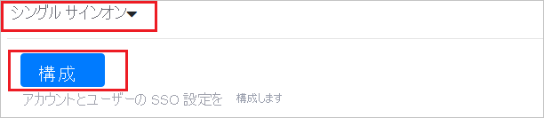
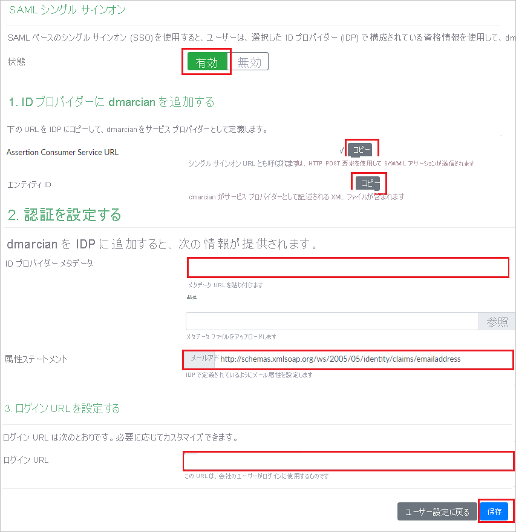
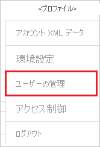
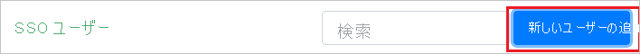
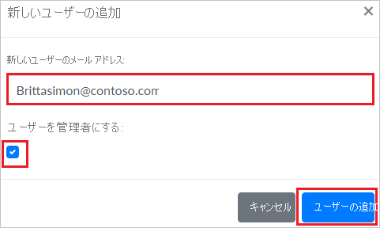

# チュートリアル: dmarcian と Azure Active Directory の統合

このチュートリアルでは、dmarcian と Azure Active Directory (Azure AD) を統合する方法について説明します。 dmarcian と Azure AD を統合すると、次のことができます。

* dmarcian にアクセスできる Azure AD ユーザーを制御できます。
* ユーザーが自分の Azure AD アカウントを使用して dmarcian に自動的にサインインするように設定できます。
* 1 つの中央サイト (Azure Portal) で自分のアカウントを管理します。

## 前提条件

開始するには、次が必要です。

* Azure AD サブスクリプション。 サブスクリプションがない場合は、[無料アカウント](https://azure.microsoft.com/free/)を取得できます。
* dmarcian のシングル サインオン (SSO) が有効なサブスクリプション。

## シナリオの説明

このチュートリアルでは、テスト環境で Azure AD の SSO を構成してテストします。

* dmarcian では、**SP と IDP** によって開始される SSO がサポートされます。

## ギャラリーからの dmarcian の追加

Azure AD への dmarcian の統合を構成するに、ギャラリーから管理対象 SaaS アプリの一覧に dmarcian を追加する必要があります。

1. 職場または学校アカウントか、個人の Microsoft アカウントを使用して、Azure portal にサインインします。
1. 左のナビゲーション ウィンドウで **[Azure Active Directory]** サービスを選択します。
1. **[エンタープライズ アプリケーション]** に移動し、 **[すべてのアプリケーション]** を選択します。
1. 新しいアプリケーションを追加するには、 **[新しいアプリケーション]** を選択します。
1. **[ギャラリーから追加する]** セクションで、検索ボックスに、「**dmarcian**」と入力します。
1. 結果ウィンドウで **[dmarcian]** を選択し、アプリを追加します。 お使いのテナントにアプリが追加されるのを数秒待機します。

## dmarcian の Azure AD SSO の構成とテスト

**B.Simon** というテスト ユーザーを使用して、dmarcian に対する Azure AD SSO を構成してテストします。 SSO が機能するためには、Azure AD ユーザーと dmarcian の関連ユーザーとの間にリンク関係を確立する必要があります。

dmarcian に対して Azure AD SSO を構成してテストするには、次の手順を実行します。

1. **[Azure AD SSO の構成](#configure-azure-ad-sso)** - ユーザーがこの機能を使用できるようにします。
    1. **[Azure AD のテスト ユーザーの作成](#create-an-azure-ad-test-user)** - B.Simon で Azure AD のシングル サインオンをテストします。
    1. **[Azure AD テスト ユーザーの割り当て](#assign-the-azure-ad-test-user)** - B.Simon が Azure AD シングル サインオンを使用できるようにします。
1. **[dmarcian SSO の構成](#configure-dmarcian-sso)** - アプリケーション側でシングル サインオン設定を構成します。
    1. **[dmarcian のテスト ユーザーの作成](#create-dmarcian-test-user)** - dmarcian で B.Simon に対応するユーザーを作成し、Azure AD の Britta Simon にリンクさせます。
1. **[SSO のテスト](#test-sso)** - 構成が機能するかどうかを確認します。

## Azure AD SSO の構成

これらの手順に従って、Azure portal で Azure AD SSO を有効にします。

1. Azure portal の **dmarcian** アプリケーション統合ページで、 **[管理]** セクションを見つけて、 **[シングル サインオン]** を選択します。

1. **[シングル サインオン方式の選択]** ページで、 **[SAML]** を選択します。

1. **[SAML によるシングル サインオンのセットアップ]** ページで、 **[基本的な SAML 構成]** の鉛筆アイコンをクリックして設定を編集します。

   

1. **[基本的な SAML 構成]** セクションで、アプリケーションを **IDP** 開始モードで構成する場合は、次の手順を実行します。

    1. **[識別子]** ボックスに、次の形式で URL を入力します。

       | **Identifier** |
       |-----|
       | `https://us.dmarcian.com/sso/saml/<ACCOUNT_ID>/sp.xml` |
       | `https://dmarcian-eu.com/sso/saml/<ACCOUNT_ID>/sp.xml` |
       | `https://dmarcian-ap.com/sso/saml/<ACCOUNT_ID>/sp.xml` |

    1. **[応答 URL]** ボックスに、次のパターンを使用して URL を入力します。

       | **応答 URL** |
       |----|
       | `https://us.dmarcian.com/login/<ACCOUNT_ID>/handle/` |
       | `https://dmarcian-eu.com/login/<ACCOUNT_ID>/handle/` |
       | `https://dmarcian-ap.com/login/<ACCOUNT_ID>/handle/` |

1. アプリケーションを **SP** 開始モードで構成する場合は、 **[追加の URL を設定します]** をクリックして次の手順を実行します。

    **[サインオン URL]** ボックスに、次のパターンを使用して URL を入力します。

    | **サインオン URL** |
    |-----|
    | `https://us.dmarcian.com/login/<ACCOUNT_ID>` |
    | `https://dmarcian-eu.com/login/<ACCOUNT_ID>` |
    | `https://dmarciam-ap.com/login/<ACCOUNT_ID>` |

    > [!NOTE] 
    > これらは実際の値ではありません。 これらの値は、実際の識別子、応答 URL、およびサインオン URL に更新します。実際の値については、このチュートリアルの後の方で説明します。

1. **Set up Single Sign-On with SAML\(SAML でのシングルサインオンの設定** ページの **SAML 署名証明書** セクションで、コピー ボタンをクリックして **App Federation Metadata Url\(アプリのフェデレーション メタデータ URL)** をコピーして、コンピューターに保存します。

    

### Azure AD のテスト ユーザーの作成

このセクションでは、Azure portal 内で B.Simon というテスト ユーザーを作成します。

1. Azure portal の左側のウィンドウから、 **[Azure Active Directory]** 、 **[ユーザー]** 、 **[すべてのユーザー]** の順に選択します。
1. 画面の上部にある **[新しいユーザー]** を選択します。
1. **[ユーザー]** プロパティで、以下の手順を実行します。
   1. **[名前]** フィールドに「`B.Simon`」と入力します。  
   1. **[ユーザー名]** フィールドに「username@companydomain.extension」と入力します。 たとえば、「 `B.Simon@contoso.com` 」のように入力します。
   1. **[パスワードを表示]** チェック ボックスをオンにし、 **[パスワード]** ボックスに表示された値を書き留めます。
   1. **Create** をクリックしてください。

### Azure AD テスト ユーザーの割り当て

このセクションでは、B.Simon に dmarcian へのアクセスを許可することで、このユーザーが Azure シングル サインオンを使用できるようにします。

1. Azure portal で **[エンタープライズ アプリケーション]** を選択し、 **[すべてのアプリケーション]** を選択します。
1. アプリケーションの一覧で **[dmarcian]** を選択します。
1. アプリの概要ページで、 **[管理]** セクションを見つけて、 **[ユーザーとグループ]** を選択します。
1. **[ユーザーの追加]** を選択し、 **[割り当ての追加]** ダイアログで **[ユーザーとグループ]** を選択します。
1. **[ユーザーとグループ]** ダイアログの [ユーザー] の一覧から **[B.Simon]** を選択し、画面の下部にある **[選択]** ボタンをクリックします。
1. SAML アサーション内に任意のロール値が必要な場合、 **[ロールの選択]** ダイアログでユーザーに適したロールを一覧から選択し、画面の下部にある **[選択]** をクリックします。
1. **[割り当ての追加]** ダイアログで、 **[割り当て]** をクリックします。

## dmarcian SSO の構成

1. dmarcian 内での構成を自動化するには、**[拡張機能のインストール]** をクリックして **My Apps Secure Sign-in ブラウザー拡張機能** をインストールする必要があります。

    

2. ブラウザーに拡張機能を追加した後、**[Setup dmarcian]\(dmarcian のセットアップ\)** をクリックすると、dmarcian アプリケーションに移動します。 そこから、管理者の資格情報を入力して dmarcian にサインインします。 ブラウザー拡張機能によりアプリケーションが自動的に構成され、手順 3 ～ 6 が自動化されます。

    

3. dmarcian を手動でセットアップする場合は、新しい Web ブラウザー ウィンドウを開き、管理者として dmarcian 企業サイトにサインインして、次の手順を実行します。

4. 右上隅にある **[プロファイル]** をクリックし、**[ユーザー設定]** に移動します。

    ![[ユーザー設定]](./media/dmarcian-tutorial/profile.png)

5. 下へスクロールして **[シングル サインオン]** セクションをクリックしてから、**[構成]** をクリックします。

    

6. **[SAML シングル サインオン]** ページで、**[状態]** を **[有効]** に設定し、次の手順を実行します。

    

    1. **[Add dmarcian to your Identity Provider]\(ID プロバイダーへの dmarcian の追加\)** セクションで、**[コピー]** をクリックしてインスタンスの **[Assertion Consumer Service URL]** をコピーし、それを Azure portal の **[基本的な SAML 構成] セクション** にある **[応答 URL]** テキスト ボックスに貼り付けます。

    1. **[Add dmarcian to your Identity Provider]\(ID プロバイダーへの dmarcian の追加\)** セクションで、**[コピー]** をクリックしてインスタンスの **[エンティティ ID]** をコピーし、それを Azure portal の **[基本的な SAML 構成] セクション** にある **[識別子]** テキスト ボックスに貼り付けます。

    1. **[Set up Authentication]\(認証の設定\)** セクションの **[Identity Provider Metadata]\(ID プロバイダーのメタデータ\)** テキスト ボックスに、Azure portal からコピーした **アプリのフェデレーション メタデータ URL** を貼り付けます。

    1. **[Set up Authentication]\(認証の設定\)** セクションの **[Attribute Statements]\(属性ステートメント\)** テキスト ボックスに、次の URL を貼り付けます。
    
       `http://schemas.xmlsoap.org/ws/2005/05/identity/claims/emailaddress`

    1. **[Set up Login URL]\(ログイン URL の設定\)** セクションで、インスタンスの **[ログイン URL]** をコピーし、それを Azure portal の **[基本的な SAML 構成] セクション** にある **[サインオン URL]** テキスト ボックスに貼り付けます。

       > [!NOTE]
       > **[ログイン URL]** は、組織に応じて変更できます。

    1. **[保存]** をクリックします。

### dmarcian のテスト ユーザーの作成

Azure AD ユーザーが dmarcian にサインインできるようにするには、ユーザーを dmarcian にプロビジョニングする必要があります。 dmarcian では、プロビジョニングは手動のタスクです。

**ユーザー アカウントをプロビジョニングするには、次の手順に従います。**

1. セキュリティ管理者として dmarcian にサインインします。

2. 右上隅にある **[プロファイル]** をクリックし、**[ユーザーの管理]** に移動します。

    

3. **[SSO Users] (SSO ユーザー)** セクションの右側で、**[新しいユーザーの追加]** をクリックします。

    

4. **[Add New User]\(新しいユーザーの追加\)** ポップアップで、次の手順を実行します。

    

    1. **[New User Email]\(新しいユーザーのメールアドレス\)** テキスト ボックスに、ユーザーのメールアドレス (`brittasimon@contoso.com` など) を入力します。

    1. そのユーザーに管理者権限を付与する場合は、**[Make User an Admin] (ユーザーを管理者にする)** を選択します。

    1. **[ユーザーの追加]** をクリックします。

## SSO のテスト 

このセクションでは、次のオプションを使用して Azure AD のシングル サインオン構成をテストします。 

#### SP Initiated:

* Azure portal で **[このアプリケーションをテストします]** をクリックします。 これにより、ログイン フローを開始できる dmarcian のサインオン URL にリダイレクトされます。  

* dmarcian のサインオン URL に直接移動し、そこからログイン フローを開始します。

#### IDP Initiated:

* Azure portal で **[このアプリケーションをテストします]** をクリックすると、SSO を設定した dmarcian に自動的にサインインされるはずです。 

また、Microsoft マイ アプリを使用して、任意のモードでアプリケーションをテストすることもできます。 マイ アプリで [dmarcian] タイルをクリックすると、SP モードで構成されている場合は、ログイン フローを開始するためのアプリケーション サインオン ページにリダイレクトされます。IDP モードで構成されている場合は、SSO を設定した dmarcian に自動的にサインインされます。 マイ アプリの詳細については、[マイ アプリの概要](https://support.microsoft.com/account-billing/sign-in-and-start-apps-from-the-my-apps-portal-2f3b1bae-0e5a-4a86-a33e-876fbd2a4510)に関するページを参照してください。

## 次のステップ

dmarcian を構成したら、組織の機密データを流出と侵入からリアルタイムで保護するセッション制御を適用できます。 セッション制御は、条件付きアクセスを拡張したものです。 [Microsoft Defender for Cloud Apps でセッション制御を適用する方法をご覧ください](/cloud-app-security/proxy-deployment-aad)。
