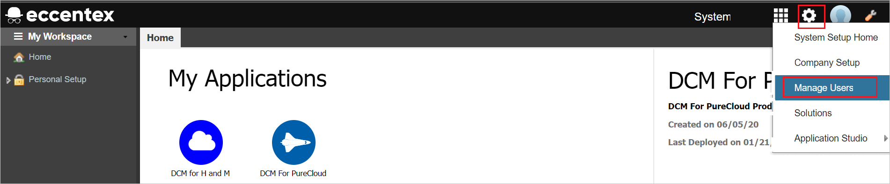

# チュートリアル: Azure Active Directory シングル サインオン (SSO) と Eccentex AppBase for Azure の統合

このチュートリアルでは、Eccentex AppBase for Azure と Azure Active Directory (Azure AD) を統合する方法について説明します。 Azure AD と Eccentex AppBase for Azure を統合すると、次のことができます。

* Eccentex AppBase for Azure にアクセスできるユーザーを Azure AD で制御します。
* ユーザーが自分の Azure AD アカウントを使用して Eccentex AppBase for Azure に自動的にサインインできるようにします。
* 1 つの中央サイト (Azure Portal) で自分のアカウントを管理します。

## 前提条件

開始するには、次が必要です。

* Azure AD サブスクリプション。 サブスクリプションがない場合は、[無料アカウント](https://azure.microsoft.com/free/)を取得できます。
* Eccentex AppBase for Azure でのシングル サインオン (SSO) が有効なサブスクリプション。

## シナリオの説明

このチュートリアルでは、テスト環境で Azure AD の SSO を構成してテストします。

* Eccentex AppBase for Azure では、**SP** Initiated SSO がサポートされます。

* Eccentex AppBase for Azure では、**Just In Time** ユーザー プロビジョニングがサポートされます。

## ギャラリーから Eccentex AppBase for Azure を追加する

Azure AD への Eccentex AppBase for Azure の統合を構成するには、ギャラリーからマネージド SaaS アプリの一覧に Eccentex AppBase for Azure を追加する必要があります。

1. 職場または学校アカウントか、個人の Microsoft アカウントを使用して、Azure portal にサインインします。
1. 左のナビゲーション ウィンドウで **[Azure Active Directory]** サービスを選択します。
1. **[エンタープライズ アプリケーション]** に移動し、 **[すべてのアプリケーション]** を選択します。
1. 新しいアプリケーションを追加するには、 **[新しいアプリケーション]** を選択します。
1. **[ギャラリーから追加する]** セクションで、検索ボックスに「**Eccentex AppBase for Azure**」と入力します。
1. 結果パネルから **[Eccentex AppBase for Azure]** を選択し、アプリを追加します。 お使いのテナントにアプリが追加されるのを数秒待機します。

## Eccentex AppBase for Azure の Azure AD SSO の構成とテスト

**B.Simon** というテスト ユーザーを使用して、Eccentex AppBase for Azure に対する Azure AD SSO を構成してテストします。 SSO を機能させるためには、Azure AD ユーザーと Eccentex AppBase for Azure の関連ユーザーとの間にリンク関係を確立する必要があります。

Eccentex AppBase for Azure に対して Azure AD SSO を構成してテストするには、次の手順を行います。

1. **[Azure AD SSO の構成](#configure-azure-ad-sso)** - ユーザーがこの機能を使用できるようにします。
    1. **[Azure AD のテスト ユーザーの作成](#create-an-azure-ad-test-user)** - B.Simon で Azure AD のシングル サインオンをテストします。
    1. **[Azure AD テスト ユーザーの割り当て](#assign-the-azure-ad-test-user)** - B.Simon が Azure AD シングル サインオンを使用できるようにします。
1. **[Eccentex AppBase for Azure の SSO の構成](#configure-eccentex-appbase-for-azure-sso)** - アプリケーション側でシングル サインオン設定を構成します。
    1. **[Eccentex AppBase for Azure のテスト ユーザーの作成](#create-eccentex-appbase-for-azure-test-user)** - Eccentex AppBase for Azure で B.Simon に対応するユーザーを作成し、Azure AD の B.Simon にリンクさせます。
1. **[SSO のテスト](#test-sso)** - 構成が機能するかどうかを確認します。

## Azure AD SSO の構成

これらの手順に従って、Azure portal で Azure AD SSO を有効にします。

1. Azure portal の **Eccentex AppBase for Azure** アプリケーション統合ページで、 **[管理]** セクションを探して、 **[シングル サインオン]** を選択します。
1. **[シングル サインオン方式の選択]** ページで、 **[SAML]** を選択します。
1. **[SAML によるシングル サインオンのセットアップ]** ページで、 **[基本的な SAML 構成]** の鉛筆アイコンをクリックして設定を編集します。

   

1. **[基本的な SAML 構成]** セクションで、次の手順を実行します。

    a. **[識別子 (エンティティ ID)]** ボックスに、次のいずれかのパターンを使用して URL を入力します。

    | **Identifier** |
    |--------|
    | `https://<CustomerName>.appbase.com/Ecx.Web` |
    | `https://<CustomerName>.eccentex.com:<PortNumber>/Ecx.Web` |

    b. **[サインオン URL]** テキスト ボックスに、次のいずれかのパターンを使用して URL を入力します。

    | **サインオン URL** |
    |---------|
    | `https://<CustomerName>.appbase.com/Ecx.Web/Account/sso?tenantCode=<TenantCode>&authCode=<AuthConfigurationCode>`|
    | `https://<CustomerName>.eccentex.com:<PortNumber>/Ecx.Web/Account/sso?tenantCode=<TenantCode>&authCode=<AuthConfigurationCode>` |

    > [!NOTE]
    > これらは実際の値ではありません。 これらの値を実際の識別子とサインオン URL で更新してください。 これの値の取得については、[Eccentex AppBase for Azure クライアント サポート チーム](mailto:eccentex.support@eccentex.com)にお問い合わせください。 Azure portal の **[基本的な SAML 構成]** セクションに示されているパターンを参照することもできます。

1. **[SAML でシングル サインオンをセットアップします]** ページの **[SAML 署名証明書]** セクションで、 **[証明書 (未加工)]** を探して **[ダウンロード]** を選択し、証明書をダウンロードして、お使いのコンピューターに保存します。

    

1. **[Eccentex AppBase for Azure のセットアップ]** セクションで、要件に基づいて適切な URL をコピーします。

    

### Azure AD のテスト ユーザーの作成

このセクションでは、Azure portal 内で B.Simon というテスト ユーザーを作成します。

1. Azure portal の左側のウィンドウから、 **[Azure Active Directory]** 、 **[ユーザー]** 、 **[すべてのユーザー]** の順に選択します。
1. 画面の上部にある **[新しいユーザー]** を選択します。
1. **[ユーザー]** プロパティで、以下の手順を実行します。
   1. **[名前]** フィールドに「`B.Simon`」と入力します。  
   1. **[ユーザー名]** フィールドに「username@companydomain.extension」と入力します。 たとえば、「 `B.Simon@contoso.com` 」のように入力します。
   1. **[パスワードを表示]** チェック ボックスをオンにし、 **[パスワード]** ボックスに表示された値を書き留めます。
   1. **Create** をクリックしてください。

### Azure AD テスト ユーザーの割り当て

このセクションでは、B.Simon に Eccentex AppBase for Azure へのアクセスを許可することで、このユーザーが Azure シングル サインオンを使用できるようにします。

1. Azure portal で **[エンタープライズ アプリケーション]** を選択し、 **[すべてのアプリケーション]** を選択します。
1. アプリケーションの一覧で **[Eccentex AppBase for Azure]** を選択します。
1. アプリの概要ページで、 **[管理]** セクションを見つけて、 **[ユーザーとグループ]** を選択します。
1. **[ユーザーの追加]** を選択し、 **[割り当ての追加]** ダイアログで **[ユーザーとグループ]** を選択します。
1. **[ユーザーとグループ]** ダイアログの [ユーザー] の一覧から **[B.Simon]** を選択し、画面の下部にある **[選択]** ボタンをクリックします。
1. ユーザーにロールが割り当てられることが想定される場合は、 **[ロールの選択]** ドロップダウンからそれを選択できます。 このアプリに対してロールが設定されていない場合は、[既定のアクセス] ロールが選択されていることを確認します。
1. **[割り当ての追加]** ダイアログで、 **[割り当て]** をクリックします。

## Eccentex AppBase for Azure の SSO の構成

1. Eccentex AppBase for Azure 企業サイトに管理者としてログインします。

1. **歯車** アイコンに移動し、 **[Manage Users]\(ユーザーの管理\)** をクリックします。

    

1. **[User Management]\(ユーザー管理\)**  >  **[Auth Configurations]\(認証構成\)** に移動し、 **[Add SAML]\(SAML の追加\)** ボタンをクリックします。

    

1. **[New SAML Configuration]\(新しい SAML 構成\)** ページで、次の手順を実行します。

    

    1. **[Name]\(名前\)** テキスト ボックスに、短い構成名を入力します。 

    1. **[Issuer Url]\(発行者 Url\)** テキスト ボックスに、Azure portal からコピーした Azure **アプリケーション ID** を貼り付けます。

    1. **[Application Url]\(アプリケーション Url\)** の値をコピーし、その値を Azure portal の **[基本的な SAML 構成]** セクションの **[識別子 (エンティティ ID)]** ボックスに貼り付けます。

    1. **[AppBase New Users Onboarding]\(AppBase 新規ユーザー オンボード\)** で、ドロップダウンから **[Invitation Only]\(招待のみ\)** を選択します。

    1. **[AppBase Authentication Failure Behavior]\(AppBase 認証エラーの動作\)** で、ドロップダウンから **[Display Error Page]\(エラー ページの表示\)** を選択します。

    1. 証明書の暗号化に応じて **[Signature Digest Method]\(署名ダイジェスト方法\)** および **[Signature Method]\(署名方法\)** を選択します。

    1. **[Use Certificate]\(証明書の使用\)** で、ドロップダウンから **[Manual Uploading]\(手動アップロード\)** を選択します。

    1. **[Authentication Context Class Name]\(認証コンテキスト クラス名\)** で、ドロップダウンから **[Password]\(パスワード\)** を選択します。

    1. **[Service Provider to Identity Provider Binding]\(サービス プロバイダーから ID プロバイダーへのバインド\)** で、ドロップダウンから **[HTTP-Redirect]\(HTTP リダイレクト\)** を選択します。

        > [!NOTE]
        > **[Sign Outbound Requests]\(送信要求の署名\)** がチェックされていないことを確認します。

    1. **[Assertion Consumer Service Url]** の値をコピーし、Azure portal の **[基本的な SAML 構成]** セクションの **[応答 URL]** テキスト ボックスに貼り付けます。

    1. **[Auth Request Destination Url]\(認証要求宛先 Url\)** テキスト ボックスに、Azure portal からコピーした **ログイン URL** の値を貼り付けます。

    1. **[Service Provider Resource URL]\(サービス プロバイダー リソース URL\)** テキスト ボックスに、Azure portal からコピーした **ログイン URL** の値を貼り付けます。

    1. **[Artifact Identification Url]\(成果物 ID の Url\)** ボックスに、Azure portal からコピーした **ログイン URL** の値を貼り付けます。

    1. **[Auth Request Protocol Binding]\(認証要求プロトコル バインド\)** で、ドロップダウンから **[HTTP-POST]** を選択します。

    1. **[Auth Request Name ID Policy]\(認証要求名 ID ポリシー\)** で、ドロップダウンから **[Persistent]\(永続\)** を選択します。

    1. **[Artifact Responder URL]\(成果物レスポンダーの URL\)** ボックスに、Azure portal からコピーした **ログイン URL** の値を貼り付けます。

    1. **[Enforce Response Signature Verification]\(応答署名の検証を強制する\)** チェックボックスを有効にします。

    1. Azure portal からダウンロードした **証明書 (未加工)** をメモ帳で開き、その内容を **[SAML Mutual Certificate Upload]\(SAML 相互証明書のアップロード\)** テキスト ボックスに貼り付けます。

    1. **[Logout Response Protocol Binding]\(ログアウト応答プロトコル バインド\)** で、ドロップダウンから **[HTTP-POST]** を選択します。

    1. **[AppBase Custom Logout URL]\(AppBase カスタム ログアウト URL\)** テキスト ボックスに、Azure portal からコピーした **ログアウト URL** の値を貼り付けます。
    
    1. **[保存]** をクリックします。

### Eccentex AppBase for Azure のテスト ユーザーの作成

このセクションでは、Britta Simon というユーザーを Eccentex AppBase for Azure に作成します。 Eccentex AppBase for Azure では、Just-In-Time ユーザー プロビジョニングがサポートされています。この設定は既定で有効になっています。 このセクションでは、ユーザー側で必要な操作はありません。 Eccentex AppBase for Azure にユーザーがまだ存在していない場合は、認証後に新規に作成されます。

## SSO のテスト 

このセクションでは、次のオプションを使用して Azure AD のシングル サインオン構成をテストします。 

* Azure portal で **[このアプリケーションをテストします]** をクリックします。 これにより、ログイン フローを開始できる Eccentex AppBase for Azure のサインオン URL にリダイレクトされます。 

* Eccentex AppBase for Azure のサインオン URL に直接移動し、そこからログイン フローを開始します。

* Microsoft マイ アプリを使用することができます。 マイ アプリで [Eccentex AppBase for Azure] タイルをクリックすると、Eccentex AppBase for Azure サインオン URL にリダイレクトされます。 マイ アプリの詳細については、[マイ アプリの概要](https://support.microsoft.com/account-billing/sign-in-and-start-apps-from-the-my-apps-portal-2f3b1bae-0e5a-4a86-a33e-876fbd2a4510)に関するページを参照してください。

## 次のステップ

Eccentex AppBase for Azure を構成したら、組織の機密データを流出と侵入からリアルタイムで保護するセッション制御を適用することができます。 セッション制御は、条件付きアクセスを拡張したものです。 [Microsoft Defender for Cloud Apps でセッション制御を強制する方法](/cloud-app-security/proxy-deployment-aad)をご覧ください。
