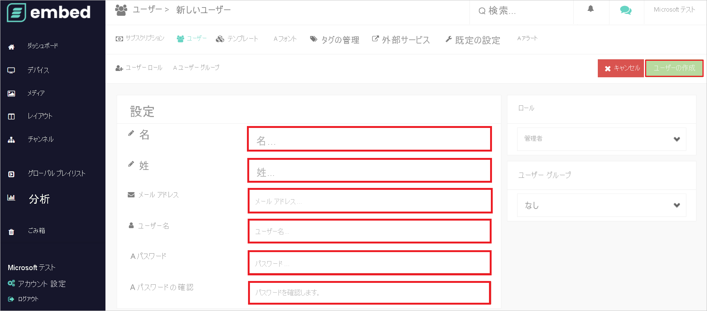

# チュートリアル: Azure AD SSO と embed signage の統合

このチュートリアルでは、embed signage と Azure Active Directory (Azure AD) を統合する方法について説明します。 embed signage を Azure AD と統合すると、次のことができます。

* embed signage にアクセスできるユーザーを Azure AD で制御する。
* ユーザーが自分の Azure AD アカウントを使用して embed signage に自動的にサインインするようにする。
* 1 つの中央サイト (Azure Portal) で自分のアカウントを管理します。

## 前提条件

開始するには、次が必要です。

* Azure AD サブスクリプション。 サブスクリプションがない場合は、[無料アカウント](https://azure.microsoft.com/free/)を取得できます。
* embed signage でのシングル サインオン (SSO) が有効なサブスクリプション。

## シナリオの説明

このチュートリアルでは、テスト環境で Azure AD の SSO を構成してテストします。

* embed signage では、**IDP** によって開始される SSO がサポートされます。

## ギャラリーからの embed signage の追加

Azure AD への embed signage の統合を構成するには、ギャラリーからマネージド SaaS アプリの一覧に embed signage を追加する必要があります。

1. 職場または学校アカウントか、個人の Microsoft アカウントを使用して、Azure portal にサインインします。
1. 左のナビゲーション ウィンドウで **[Azure Active Directory]** サービスを選択します。
1. **[エンタープライズ アプリケーション]** に移動し、 **[すべてのアプリケーション]** を選択します。
1. 新しいアプリケーションを追加するには、 **[新しいアプリケーション]** を選択します。
1. **[ギャラリーから追加する]** セクションで、検索ボックスに「**embed signage**」と入力します。
1. 結果パネルで **[embed signage]** を選択し、アプリを追加します。 お使いのテナントにアプリが追加されるのを数秒待機します。

## embed signage のための Azure AD SSO の構成とテスト

**B.Simon** というテスト ユーザーを使用して、embed signage 用に Azure AD SSO を構成してテストします。 SSO が機能するためには、Azure AD ユーザーと embed signage の関連ユーザーとの間にリンク関係を確立する必要があります。

embed signage 用に Azure AD SSO を構成してテストするには、次の手順を実行します。

1. **[Azure AD SSO の構成](#configure-azure-ad-sso)** - ユーザーがこの機能を使用できるようにします。
    1. **[Azure AD のテスト ユーザーの作成](#create-an-azure-ad-test-user)** - B.Simon で Azure AD のシングル サインオンをテストします。
    1. **[Azure AD テスト ユーザーの割り当て](#assign-the-azure-ad-test-user)** - B.Simon が Azure AD シングル サインオンを使用できるようにします。
1. **[embed signage の SSO の構成](#configure-embed-signage-sso)** - アプリケーション側でシングル サインオン設定を構成します。
    1. **[embed signage テスト ユーザーの作成](#create-embed-signage-test-user)** - embed signage で B.Simon に対応するユーザーを作成し、Azure AD のこのユーザーにリンクさせます。
1. **[SSO のテスト](#test-sso)** - 構成が機能するかどうかを確認します。

## Azure AD SSO の構成

これらの手順に従って、Azure portal で Azure AD SSO を有効にします。

1. Azure portal の **embed signage** アプリケーション統合ページで、 **[管理]** セクションを探して、 **[シングル サインオン]** を選択します。
1. **[シングル サインオン方式の選択]** ページで、 **[SAML]** を選択します。
1. **[SAML によるシングル サインオンのセットアップ]** ページで、 **[基本的な SAML 構成]** の鉛筆アイコンをクリックして設定を編集します。

   

1. **[基本的な SAML 構成]** ページで、次の手順を実行します。

    a. **[識別子]** ボックスに、`https://app.embedsignage.com/auth/saml/<ID>` の形式で URL を入力します。

    b. **[応答 URL]** ボックスに、`https://app.embedsignage.com/auth/saml/login/<ID>` のパターンを使用して URL を入力します

    > [!NOTE]
    > これらは実際の値ではありません。 実際の識別子と応答 URL でこれらの値を更新します。 これらの値を取得するには、[embed signage クライアント サポート チーム](mailto:support@embedsignage.com)に問い合わせてください。 Azure portal の **[基本的な SAML 構成]** セクションに示されているパターンを参照することもできます。

1. **[SAML でシングル サインオンをセットアップします]** ページの **[SAML 署名証明書]** セクションで、 **[フェデレーション メタデータ XML]** を探して **[ダウンロード]** を選択し、証明書をダウンロードして、お使いのコンピューターに保存します。

    

1. **[embed signage の設定]** セクションで、要件に基づいて適切な URL をコピーします。

    

### Azure AD のテスト ユーザーの作成

このセクションでは、Azure portal 内で B.Simon というテスト ユーザーを作成します。

1. Azure portal の左側のウィンドウから、 **[Azure Active Directory]** 、 **[ユーザー]** 、 **[すべてのユーザー]** の順に選択します。
1. 画面の上部にある **[新しいユーザー]** を選択します。
1. **[ユーザー]** プロパティで、以下の手順を実行します。
   1. **[名前]** フィールドに「`B.Simon`」と入力します。  
   1. **[ユーザー名]** フィールドに「username@companydomain.extension」と入力します。 たとえば、「 `B.Simon@contoso.com` 」のように入力します。
   1. **[パスワードを表示]** チェック ボックスをオンにし、 **[パスワード]** ボックスに表示された値を書き留めます。
   1. **Create** をクリックしてください。

### Azure AD テスト ユーザーの割り当て

このセクションでは、B.Simon に embed signage へのアクセスを許可することで、このユーザーが Azure シングル サインオンを使用できるようにします。

1. Azure portal で **[エンタープライズ アプリケーション]** を選択し、 **[すべてのアプリケーション]** を選択します。
1. アプリケーションの一覧で **[embed signage]** を選択します。
1. アプリの概要ページで、 **[管理]** セクションを見つけて、 **[ユーザーとグループ]** を選択します。
1. **[ユーザーの追加]** を選択し、 **[割り当ての追加]** ダイアログで **[ユーザーとグループ]** を選択します。
1. **[ユーザーとグループ]** ダイアログの [ユーザー] の一覧から **[B.Simon]** を選択し、画面の下部にある **[選択]** ボタンをクリックします。
1. ユーザーにロールが割り当てられることが想定される場合は、 **[ロールの選択]** ドロップダウンからそれを選択できます。 このアプリに対してロールが設定されていない場合は、[既定のアクセス] ロールが選択されていることを確認します。
1. **[割り当ての追加]** ダイアログで、 **[割り当て]** をクリックします。

## embed signage の SSO の構成

1. embed signage の企業サイトに管理者としてログインします。

1. **[Account settings]\(アカウントの設定\)** に移動し、 **[Security]\(セキュリティ\)**  >  **[Single Sign-On]\(シングル サインオン\)** をクリックします。

1. **[Single sign-on]\(シングル サインオン\)** セクションで、次の手順を実行します。

    

    1. **[Enable single sign on]\(シングル サインオンを有効にする\)** チェック ボックスをオンにします。

    1. Azure portal からダウンロードした **フェデレーション メタデータ XML** を開き、 **[Metadata XML file]\(メタデータ XML ファイル\)** にそのファイルをアップロードします。

    1. **[変更を保存]** をクリックします。

### embed signage テスト ユーザーの作成

1. 別の Web ブラウザー ウィンドウで、embed signage 企業サイトに管理者としてサインインします。

1. **[Account settings]\(アカウントの設定\)** に移動し、 **[Users]\(ユーザー\)**  >  **[New User]\(新規ユーザー\)** をクリックします。

1. 次のページの **[Settings]\(設定\)** セクションで、必須フィールドに手動で入力し、 **[Create User]\(ユーザーの作成\)** をクリックします。  

    

## SSO のテスト 

このセクションでは、次のオプションを使用して Azure AD のシングル サインオン構成をテストします。

* Azure portal で [このアプリケーションをテストします] をクリックすると、SSO を設定した embed signage に自動的にサインインします。

* Microsoft マイ アプリを使用することができます。 マイ アプリで [embed signage] タイルをクリックすると、SSO を設定した embed signage に自動的にサインインします。 マイ アプリの詳細については、[マイ アプリの概要](../user-help/my-apps-portal-end-user-access.md)に関するページを参照してください。

## 次のステップ

embed signage を構成したら、組織の機密データを流出と侵入からリアルタイムで保護するセッション制御を適用できます。 セッション制御は、条件付きアクセスを拡張したものです。 [Microsoft Defender for Cloud Apps でセッション制御を適用する方法をご覧ください](/cloud-app-security/proxy-deployment-aad)。
