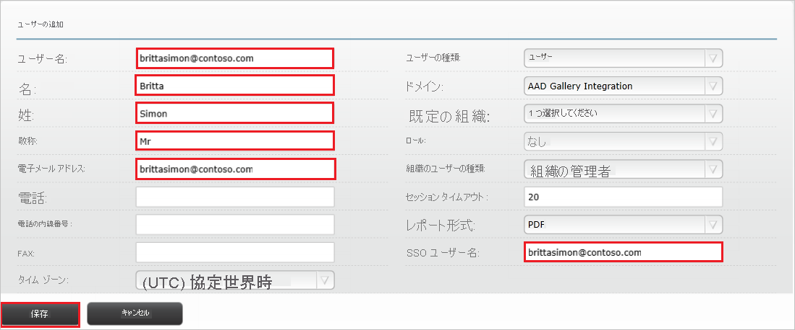

# チュートリアル: Azure Active Directory と Envi MMIS の統合

このチュートリアルでは、Envi MMIS と Azure Active Directory (Azure AD) を統合する方法について説明します。 Azure AD と Envi MMIS を統合すると、次のことができます。

* Envi MMIS にアクセスできる Azure AD ユーザーを制御する。
* ユーザーが自分の Azure AD アカウントを使用して Envi MMIS に自動的にサインインできるようにする。
* 1 つの中央サイト (Azure Portal) で自分のアカウントを管理します。

## 前提条件

開始するには、次が必要です。

* Azure AD サブスクリプション。 サブスクリプションがない場合は、[無料アカウント](https://azure.microsoft.com/free/)を取得できます。
* Envi MMIS でのシングル サインオン (SSO) が有効なサブスクリプション。

## シナリオの説明

このチュートリアルでは、テスト環境で Azure AD のシングル サインオンを構成してテストします。

* Envi MMIS では、**SP** Initiated SSO と **IDP** Initiated SSO がサポートされます。

## ギャラリーからの Envi MMIS の追加

Azure AD への Envi MMIS の統合を構成するには、ギャラリーから管理対象 SaaS アプリの一覧に Envi MMIS を追加する必要があります。

1. 職場または学校アカウントか、個人の Microsoft アカウントを使用して、Azure portal にサインインします。
1. 左のナビゲーション ウィンドウで **[Azure Active Directory]** サービスを選択します。
1. **[エンタープライズ アプリケーション]** に移動し、 **[すべてのアプリケーション]** を選択します。
1. 新しいアプリケーションを追加するには、 **[新しいアプリケーション]** を選択します。
1. **[ギャラリーから追加する]** セクションで、検索ボックスに「**Envi MMIS**」と入力します。
1. 結果のパネルから **[Envi MMIS]** を選択し、アプリを追加します。 お使いのテナントにアプリが追加されるのを数秒待機します。

## Envi MMIS のための Azure AD SSO の構成とテスト

**B.Simon** というテスト ユーザーを使用して、Envi MMIS 用に Azure AD SSO を構成してテストします。 SSO を機能させるために、Azure AD ユーザーと Envi MMIS の関連ユーザーとの間にリンク関係を確立する必要があります。

Envi MMIS 用に Azure AD SSO を構成してテストするには、次の手順を実行します。

1. **[Azure AD SSO の構成](#configure-azure-ad-sso)** - ユーザーがこの機能を使用できるようにします。
    1. **[Azure AD のテスト ユーザーの作成](#create-an-azure-ad-test-user)** - B.Simon で Azure AD のシングル サインオンをテストします。
    1. **[Azure AD テスト ユーザーの割り当て](#assign-the-azure-ad-test-user)** - B.Simon が Azure AD シングル サインオンを使用できるようにします。
1. **[Envi MMIS SSO の構成](#configure-envi-mmis-sso)** - アプリケーション側でシングル サインオン設定を構成します。
    1. **[Envi MMIS のテスト ユーザーの作成](#create-envi-mmis-test-user)** - Envi MMIS で B.Simon に対応するユーザーを作成し、Azure AD の B.Simon にリンクさせます。
1. **[SSO のテスト](#test-sso)** - 構成が機能するかどうかを確認します。

## Azure AD SSO の構成

これらの手順に従って、Azure portal で Azure AD SSO を有効にします。

1. Azure portal の **Envi MMIS** アプリケーション統合ページで、 **[管理]** セクションを見つけて、 **[シングル サインオン]** を選択します。
1. **[シングル サインオン方式の選択]** ページで、 **[SAML]** を選択します。
1. **[SAML によるシングル サインオンのセットアップ]** ページで、 **[基本的な SAML 構成]** の鉛筆アイコンをクリックして設定を編集します。

   

4. **[基本的な SAML 構成]** セクションで、アプリケーションを **IDP** 開始モードで構成する場合は、次の手順を実行します。

    1. **[識別子]** ボックスに、`https://www.<CUSTOMER DOMAIN>.com/Account` の形式で URL を入力します。

    1. **[応答 URL]** ボックスに、`https://www.<CUSTOMER DOMAIN>.com/Account/Acs` のパターンを使用して URL を入力します

5. アプリケーションを **SP** 開始モードで構成する場合は、 **[追加の URL を設定します]** をクリックして次の手順を実行します。

    **[サインオン URL]** ボックスに、`https://www.<CUSTOMER DOMAIN>.com/Account` という形式で URL を入力します。

    > [!NOTE]
    > これらは実際の値ではありません。 実際の識別子、応答 URL、サインオン URL でこれらの値を更新します。 これらの値を取得するには、[Envi MMIS クライアント サポート チーム](mailto:support@ioscorp.com)に連絡してください。 Azure portal の **[基本的な SAML 構成]** セクションに示されているパターンを参照することもできます。

6. **[SAML でシングル サインオンをセットアップします]** ページの **[SAML 署名証明書]** セクションで、 **[ダウンロード]** をクリックして、要件のとおりに指定したオプションから **フェデレーション メタデータ XML** をダウンロードして、お使いのコンピューターに保存します。

    

7. **[Envi MMIS のセットアップ]** セクションで、要件に従って適切な URL をコピーします。

    

### Azure AD のテスト ユーザーの作成 

このセクションでは、Azure portal 内で B.Simon というテスト ユーザーを作成します。

1. Azure portal の左側のウィンドウから、 **[Azure Active Directory]** 、 **[ユーザー]** 、 **[すべてのユーザー]** の順に選択します。
1. 画面の上部にある **[新しいユーザー]** を選択します。
1. **[ユーザー]** プロパティで、以下の手順を実行します。
   1. **[名前]** フィールドに「`B.Simon`」と入力します。  
   1. **[ユーザー名]** フィールドに「username@companydomain.extension」と入力します。 たとえば、「 `B.Simon@contoso.com` 」のように入力します。
   1. **[パスワードを表示]** チェック ボックスをオンにし、 **[パスワード]** ボックスに表示された値を書き留めます。
   1. **Create** をクリックしてください。

### Azure AD テスト ユーザーの割り当て

このセクションでは、B.Simon に Envi MMIS へのアクセスを許可することで、このユーザーが Azure シングル サインオンを使用できるようにします。

1. Azure portal で **[エンタープライズ アプリケーション]** を選択し、 **[すべてのアプリケーション]** を選択します。
1. アプリケーションの一覧で **[Envi MMIS]** を選択します。
1. アプリの概要ページで、 **[管理]** セクションを見つけて、 **[ユーザーとグループ]** を選択します。
1. **[ユーザーの追加]** を選択し、 **[割り当ての追加]** ダイアログで **[ユーザーとグループ]** を選択します。
1. **[ユーザーとグループ]** ダイアログの [ユーザー] の一覧から **[B.Simon]** を選択し、画面の下部にある **[選択]** ボタンをクリックします。
1. ユーザーにロールが割り当てられることが想定される場合は、 **[ロールの選択]** ドロップダウンからそれを選択できます。 このアプリに対してロールが設定されていない場合は、[既定のアクセス] ロールが選択されていることを確認します。
1. **[割り当ての追加]** ダイアログで、 **[割り当て]** をクリックします。

## Envi MMIS SSO の構成

1. 別の Web ブラウザー ウィンドウで、Envi MMIS サイトに管理者としてサインインします。

2. **[マイ ドメイン]** タブをクリックします。

    ![[My Domain]\(マイ ドメイン\) が選択されている [User]\(ユーザー\) メニューを示すスクリーンショット。](./media/envimmis-tutorial/domain.png)

3. **[編集]** をクリックします。

    ![選択された [Edit]\(編集\) ボタンを示すスクリーンショット。](./media/envimmis-tutorial/edit-icon.png)

4. **[Use remote authentication]\(リモート認証を使用する\)** チェック ボックスをオンにして、 **[Authentication Type]\(認証の種類\)** ドロップダウンから **[HTTP Redirect]\(HTTP リダイレクト\)** を選びます。

    ![[Use remote authentication]\(リモート認証を使用する\) がオンになり、[H T T P Redirect]\(H T T P リダイレクト\) が選択されている [Details]\(詳細\) タブを示すスクリーンショット。](./media/envimmis-tutorial/details.png)

5. **[Resources]\(リソース\)** タブを選び、 **[Upload Metadata]\(メタデータのアップロード\)** をクリックします。

    ![[Upload Metadata]\(メタデータのアップロード\) アクションが選択された [Resources]\(リソース\) タブを示すスクリーンショット。](./media/envimmis-tutorial/metadata.png)

6. **[Upload Metadata]\(メタデータのアップロード\)** ポップアップで、次の手順を実行します。

    ![[File]\(ファイル\) オプションが選択され、ファイルの選択アイコンと [OK] ボタンが強調表示されている [Upload Metadata]\(メタデータのアップロード\) ポップアップを示すスクリーンショット。](./media/envimmis-tutorial/file.png)

    1. **[Upload From]\(アップロード元\)** ドロップダウンから **[File]\(ファイル\)** オプションを選びます。

    1. **ファイル選択アイコン** を選ぶことにより、Azure portal からダウンロードしたメタデータ ファイルをアップロードします。

    1. **[OK]** をクリックします。

7. ダウンロードしたメタデータ ファイルをアップロードした後、フィールドは自動的に設定されます。 **[Update]** をクリックします。

    ![[シングル サインオンの構成] の [保存] ボタン](./media/envimmis-tutorial/fields.png)

### Envi MMIS のテスト ユーザーの作成

Azure AD ユーザーが Envi MMIS にサインインできるようにするには、そのユーザーを Envi MMIS にプロビジョニングする必要があります。 Envi MMIS の場合、プロビジョニングは手動で行います。

**ユーザー アカウントをプロビジョニングするには、次の手順に従います。**

1. Envi MMIS 企業サイトに管理者としてサインインします。

2. **[User List]\(ユーザー一覧\)** タブをクリックします。

    ![[User List]\(ユーザー一覧\) が選択されている [User]\(ユーザー\) メニューを示すスクリーンショット。](./media/envimmis-tutorial/list.png)

3. **[Add User]\(ユーザーの追加\)** ボタンをクリックします。

    ![[Add User]\(ユーザーの追加\) ボタンが選択されている [User]\(ユーザー\) セクションを示すスクリーンショット。](./media/envimmis-tutorial/user.png)

4. **[ユーザーの追加]** セクションで、次の手順を実行します。

    

    1. **[ユーザー名]** ボックスに、Britta Simon のアカウントのユーザー名を入力します (例: **brittasimon\@contoso.com**)。
    
    1. **[First Name]\(名\)** テキスト ボックスに、Britta Simon の名を入力します (**Britta**)。

    1. **[Last Name]\(姓\)** テキスト ボックスに、Britta Simon の名を入力します (**Simon**)。

    1. ユーザーの役職を **[Title]\(役職\)** テキスト ボックスに入力します。

    1. **[メール アドレス]** ボックスに、Britta Simon のアカウントのメール アドレスを入力します (例: **brittasimon\@contoso.com**)。

    1. **[SSO User Name]\(SSO ユーザー名\)** ボックスに、Britta Simon のアカウントのユーザー名を入力します (例: **brittasimon\@contoso.com**)。

    1. **[保存]** をクリックします。

## SSO のテスト

このセクションでは、次のオプションを使用して Azure AD のシングル サインオン構成をテストします。 

#### SP Initiated:

* Azure portal で **[このアプリケーションをテストします]** をクリックします。 これにより、Envi MMIS のサインオン URL にリダイレクトされ、そこからログイン フローを開始できます。  

* Envi MMIS のサインオン URL に直接移動し、そこからログイン フローを開始します。

#### IDP Initiated:

* Azure portal で **[このアプリケーションをテストします]** をクリックすると、SSO を設定した Envi MMIS に自動的にサインインされます。 

また、Microsoft マイ アプリを使用して、任意のモードでアプリケーションをテストすることもできます。 マイ アプリで [Envi MMIS] タイルをクリックすると、SP モードで構成されている場合は、ログイン フローを開始するためのアプリケーション サインオン ページにリダイレクトされます。IDP モードで構成されている場合は、SSO を設定した Envi MMIS に自動的にサインインされます。 マイ アプリの詳細については、[マイ アプリの概要](https://support.microsoft.com/account-billing/sign-in-and-start-apps-from-the-my-apps-portal-2f3b1bae-0e5a-4a86-a33e-876fbd2a4510)に関するページを参照してください。

## 次のステップ

Envi MMIS を構成したら、組織の機密データを流出と侵入からリアルタイムで保護するセッション制御を適用することができます。 セッション制御は、条件付きアクセスを拡張したものです。 [Microsoft Defender for Cloud Apps でセッション制御を適用する方法をご覧ください](/cloud-app-security/proxy-deployment-aad)。
