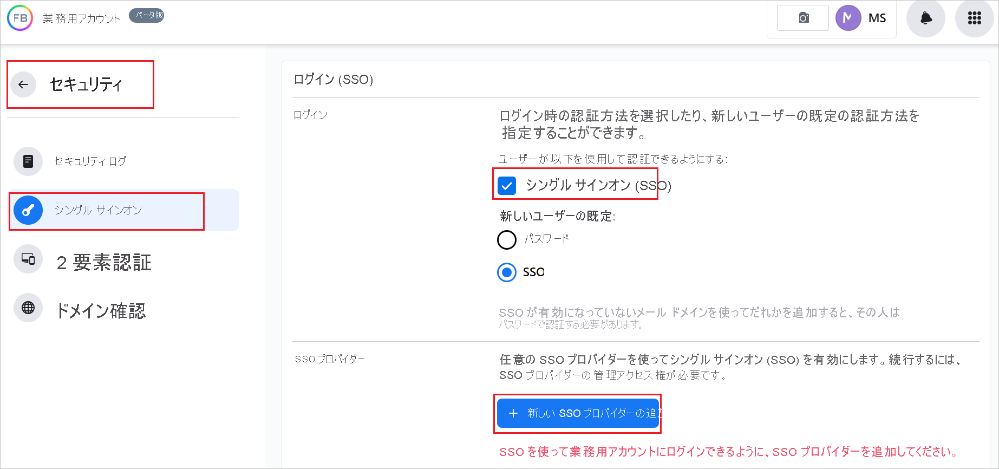
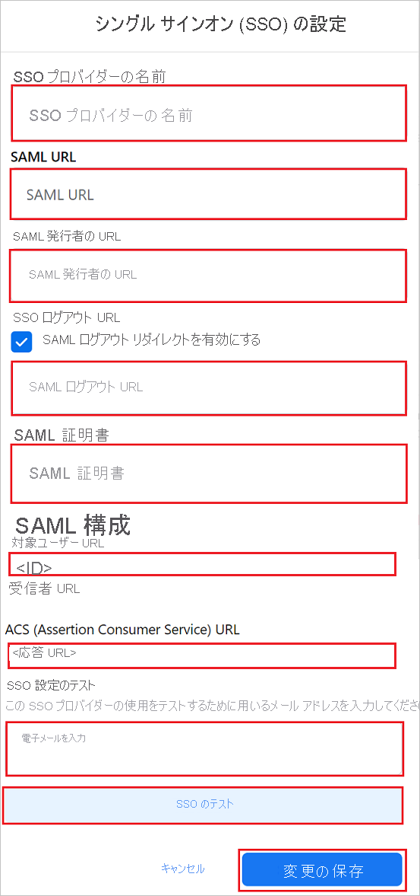

# チュートリアル: Azure Active Directory シングル サインオン (SSO) と Facebook Work Accounts の統合

このチュートリアルでは、Facebook Work Accounts と Azure Active Directory (Azure AD) を統合する方法について説明します。 Facebook Work Accounts を Azure AD と統合すると、次のことができます。

* Facebook Work Accounts にアクセスするユーザーを Azure AD で制御します。
* ユーザーが自分の Azure AD アカウントを使用して自動的に Facebook Work Accounts にサインインできるようにします。
* 1 つの中央サイト (Azure Portal) で自分のアカウントを管理します。

## 前提条件

開始するには、次が必要です。

* Azure AD サブスクリプション。 サブスクリプションがない場合は、[無料アカウント](https://azure.microsoft.com/free/)を取得できます。
* Facebook Work Accounts のシングル サインオン (SSO) が有効なサブスクリプション。

## シナリオの説明

このチュートリアルでは、テスト環境で Azure AD の SSO を構成してテストします。

* Facebook Work Accounts では、**SP と IDP** によって開始される SSO がサポートされています。

## ギャラリーから Facebook Work Accounts を追加する

Azure AD への Facebook Work Accounts の統合を構成するには、ギャラリーからマネージド SaaS アプリの一覧に Facebook Work Accounts を追加する必要があります。

1. 職場または学校アカウントか、個人の Microsoft アカウントを使用して、Azure portal にサインインします。
1. 左のナビゲーション ウィンドウで **[Azure Active Directory]** サービスを選択します。
1. **[エンタープライズ アプリケーション]** に移動し、 **[すべてのアプリケーション]** を選択します。
1. 新しいアプリケーションを追加するには、 **[新しいアプリケーション]** を選択します。
1. **[ギャラリーから追加する]** セクションで、検索ボックスに、「**Facebook Work Accounts**」と入力します。
1. 結果ウィンドウで **[Facebook Work Accounts]** を選択し、アプリを追加します。 お使いのテナントにアプリが追加されるのを数秒待機します。

## Facebook Work Accounts に Azure AD SSO を構成してテストする

**B.Simon** というテスト ユーザーを使用して、Facebook Work Accounts で Azure AD SSO を構成してテストします。 SSO を機能させるためには、Azure AD ユーザーと Facebook Work Accounts の関連ユーザーとの間にリンク関係を確立する必要があります。

Facebook Work Accounts で Azure AD SSO を構成してテストするには、次の手順を行います。

1. **[Azure AD SSO の構成](#configure-azure-ad-sso)** - ユーザーがこの機能を使用できるようにします。
    1. **[Azure AD のテスト ユーザーの作成](#create-an-azure-ad-test-user)** - B.Simon で Azure AD のシングル サインオンをテストします。
    1. **[Azure AD テスト ユーザーの割り当て](#assign-the-azure-ad-test-user)** - B.Simon が Azure AD シングル サインオンを使用できるようにします。
1. **[Facebook Work Accounts の SSO の構成](#configure-facebook-work-accounts-sso)** - アプリケーション側でシングル サインオン設定を構成します。
    1. **[Facebook Work Accounts のテスト ユーザーの作成](#create-facebook-work-accounts-test-user)** - Facebook Work Accounts で、Azure AD の B.Simon にリンクされる B.Simon に対応するユーザーを作成します。
1. **[SSO のテスト](#test-sso)** - 構成が機能するかどうかを確認します。

## Azure AD SSO の構成

これらの手順に従って、Azure portal で Azure AD SSO を有効にします。

1. Azure portal の **Facebook Work Accounts** アプリケーション統合ページで、 **[管理]** セクションを見つけて、 **[シングル サインオン]** を選択します。
1. **[シングル サインオン方式の選択]** ページで、 **[SAML]** を選択します。
1. **[SAML によるシングル サインオンのセットアップ]** ページで、 **[基本的な SAML 構成]** の鉛筆アイコンをクリックして設定を編集します。

   

1. **[基本的な SAML 構成]** セクションで、アプリケーションを **IDP** 開始モードで構成する場合は、次の手順を実行します。

    a. **[識別子]** ボックスに、`https://work.facebook.com/company/<ID>` の形式で URL を入力します。

    b. **[応答 URL]** ボックスに、` https://work.facebook.com/work/saml.php?__cid=<ID>` のパターンを使用して URL を入力します

1. アプリケーションを **SP** 開始モードで構成する場合は、 **[追加の URL を設定します]** をクリックして次の手順を実行します。

    **[サインオン URL]** テキスト ボックスに、URL として「`https://work.facebook.com`」と入力します。

    > [!NOTE]
    > これらは実際の値ではありません。 実際の識別子と応答 URL でこれらの値を更新します。 これらの値を取得するには、[Facebook Work Accounts クライアント サポート チーム](mailto:WorkplaceSupportPartnerships@fb.com)にお問い合わせください。 Azure portal の **[基本的な SAML 構成]** セクションに示されているパターンを参照することもできます。

1. **[SAML でシングル サインオンをセットアップします]** ページの **[SAML 署名証明書]** セクションで、 **[証明書 (Base64)]** を見つけて、 **[ダウンロード]** を選択し、証明書をダウンロードして、お使いのコンピューターに保存します。

    

1. **[Set up Facebook Work Accounts]\(Facebook Work Accounts のセットアップ\)** セクションで、実際の要件に基づいて適切な URL をコピーします。

    

### Azure AD のテスト ユーザーの作成

このセクションでは、Azure portal 内で B.Simon というテスト ユーザーを作成します。

1. Azure portal の左側のウィンドウから、 **[Azure Active Directory]** 、 **[ユーザー]** 、 **[すべてのユーザー]** の順に選択します。
1. 画面の上部にある **[新しいユーザー]** を選択します。
1. **[ユーザー]** プロパティで、以下の手順を実行します。
   1. **[名前]** フィールドに「`B.Simon`」と入力します。  
   1. **[ユーザー名]** フィールドに「username@companydomain.extension」と入力します。 たとえば、「 `B.Simon@contoso.com` 」のように入力します。
   1. **[パスワードを表示]** チェック ボックスをオンにし、 **[パスワード]** ボックスに表示された値を書き留めます。
   1. **Create** をクリックしてください。

### Azure AD テスト ユーザーの割り当て

このセクションでは、Facebook Work Accounts へのアクセスを許可することで、B.Simon が Azure シングル サインオンを使用できるようにします。

1. Azure portal で **[エンタープライズ アプリケーション]** を選択し、 **[すべてのアプリケーション]** を選択します。
1. アプリケーションの一覧で **[Facebook Work Accounts]** を選択します。
1. アプリの概要ページで、 **[管理]** セクションを見つけて、 **[ユーザーとグループ]** を選択します。
1. **[ユーザーの追加]** を選択し、 **[割り当ての追加]** ダイアログで **[ユーザーとグループ]** を選択します。
1. **[ユーザーとグループ]** ダイアログの [ユーザー] の一覧から **[B.Simon]** を選択し、画面の下部にある **[選択]** ボタンをクリックします。
1. ユーザーにロールが割り当てられることが想定される場合は、 **[ロールの選択]** ドロップダウンからそれを選択できます。 このアプリに対してロールが設定されていない場合は、[既定のアクセス] ロールが選択されていることを確認します。
1. **[割り当ての追加]** ダイアログで、 **[割り当て]** をクリックします。

## Facebook Work Accounts の SSO を構成する

1. ご自分の Facebook Work Accounts の企業サイトに管理者としてログインします。

1. **[セキュリティ]**  >  **[シングル サインオン]** に移動します。

1. **[シングル サインオン (SSO)]** チェックボックスをオンにして、 **[+Add new SSO Provider]\(+ 新しい SSO プロバイダーの追加\)** をクリックします。

    

1. **[シングル サインオン(SSO) の設定]** ページで、次の手順を行います。

    

    1. 有効な **SSO プロバイダーの名前** を入力します。

    1. **[SAML URL]** テキストボックスに、Azure portal からコピーした **ログイン URL** の値を貼り付けます。

    1. **[SAML Issuer URL]\(SAML 発行者 URL\)** テキストボックスに、Azure portal からコピーした **Azure AD ID** の値を貼り付けます。

    1. **[SAML Logout URL]\(SAML ログアウト URL\)** テキストボックスの **[Enable SAML logout redirection]\(SAML ログアウト リダイレクトを有効にする\)** チェックボックスをオンにして、Azure portal からコピーした **ログアウト URL** の値を貼り付けます。

    1. Azure portal からダウンロードした **証明書 (Base64)** をメモ帳で開き、その内容を **[SAML 証明書]** テキストボックスに貼り付けます。

    1. **[対象ユーザー URL]** の値をコピーし、その値を Azure portal の **[基本的な SAML 構成]** セクションの **[識別子]** テキストボックスに貼り付けます。

    1. **[ACS (Assertion Consumer Service) URL]** の値をコピーし、Azure portal の **[基本的な SAML 構成]** セクションの **[応答 URL]** テキスト ボックスに貼り付けます。

    1. **[Test SSO Setup]\(SSO 設定のテスト\)** セクションで、テキストボックスに有効な電子メールを入力し、 **[SSO のテスト]** をクリックします。

    1. **[変更を保存]** をクリックします。

### Facebook Work Accounts のテスト ユーザーを作成する

このセクションでは、Facebook Work Accounts で Britta Simon というユーザーを作成します。 [Facebook Work Accounts サポート チーム](mailto:WorkplaceSupportPartnerships@fb.com)と連携して、Facebook Work Accounts プラットフォームにユーザーを追加してください。 シングル サインオンを使用する前に、ユーザーを作成し、有効化する必要があります。

## SSO のテスト 

このセクションでは、次のオプションを使用して Azure AD のシングル サインオン構成をテストします。 

#### SP Initiated:

* Azure portal で **[このアプリケーションをテストします]** をクリックします。 これにより、Facebook Work Accounts のサインオン URL にリダイレクトされます。ここでログイン フローを開始できます。  

* Facebook Work Accounts のサインオン URL に直接移動し、そこからログイン フローを開始します。

#### IDP Initiated:

* Azure portal で **[このアプリケーションをテストします]** をクリックすると、SSO を設定した Facebook Work Accounts に自動的にサインインされます。 

また、Microsoft マイ アプリを使用して、任意のモードでアプリケーションをテストすることもできます。 マイ アプリで [Facebook Work Accounts] タイルをクリックすると、SP モードで構成されている場合は、ログイン フローを開始するためのアプリケーション サインオン ページにリダイレクトされます。IDP モードで構成されている場合は、SSO を設定した Facebook Work Accounts に自動的にサインインされます。 マイ アプリの詳細については、[マイ アプリの概要](../user-help/my-apps-portal-end-user-access.md)に関するページを参照してください。

## 次のステップ

Facebook Work Accounts を構成したら、組織の機密データを流出と侵入からリアルタイムで保護するセッション制御を適用することができます。 セッション制御は、条件付きアクセスを拡張したものです。 [Microsoft Defender for Cloud Apps でセッション制御を適用する方法をご覧ください](/cloud-app-security/proxy-deployment-aad)。
