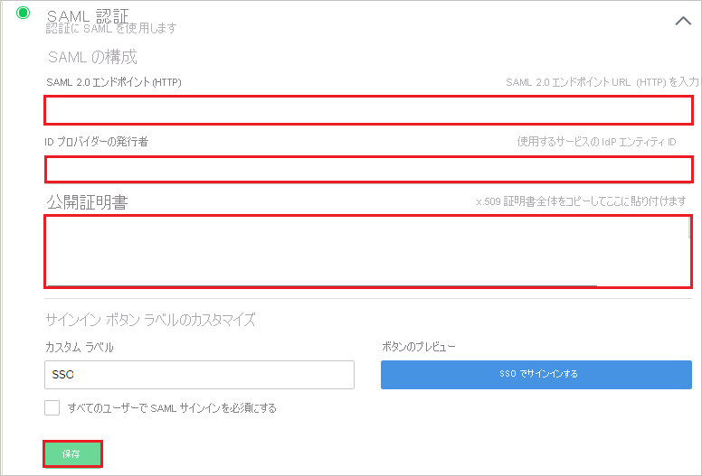
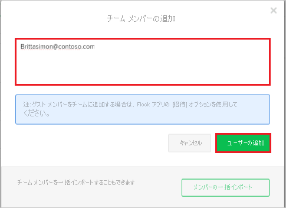

# チュートリアル: Azure Active Directory と Flock の統合

このチュートリアルでは、Flock と Azure Active Directory (Azure AD) を統合する方法について説明します。 Azure AD と Flock を統合すると、次のことが可能になります。

* Flock にアクセスできるユーザーを Azure AD で制御します。
* ユーザーが自分の Azure AD アカウントを使用して Flock に自動的にサインインするように設定できます。
* 1 つの中央サイト (Azure Portal) で自分のアカウントを管理します。

## 前提条件

開始するには、次が必要です。

* Azure AD サブスクリプション。 サブスクリプションがない場合は、<bpt id="p1">[</bpt>無料アカウント<ept id="p1">](https://azure.microsoft.com/free/)</ept>を取得できます。
* Flock でのシングル サインオン (SSO) が有効なサブスクリプション。

## シナリオの説明

このチュートリアルでは、テスト環境で Azure AD のシングル サインオンを構成してテストします。

* Flock では、**SP** Initiated SSO がサポートされます。
* Flock では、[自動化されたユーザー プロビジョニング](flock-provisioning-tutorial.md)がサポートされます

## ギャラリーからの Flock の追加

Azure AD への Flock の統合を構成するには、ギャラリーからマネージド SaaS アプリの一覧に Flock を追加する必要があります。

1. 職場または学校アカウントか、個人の Microsoft アカウントを使用して、Azure portal にサインインします。
1. 左のナビゲーション ウィンドウで <bpt id="p1">**</bpt>[Azure Active Directory]<ept id="p1">**</ept> サービスを選択します。
1. <bpt id="p1">**</bpt>[エンタープライズ アプリケーション]<ept id="p1">**</ept> に移動し、 <bpt id="p2">**</bpt>[すべてのアプリケーション]<ept id="p2">**</ept> を選択します。
1. 新しいアプリケーションを追加するには、 <bpt id="p1">**</bpt>[新しいアプリケーション]<ept id="p1">**</ept> を選択します。
1. **[ギャラリーから追加する]** セクションで、検索ボックスに「**Flock**」と入力します。
1. 結果パネルから **[Flock]** を選択し、アプリを追加します。 お使いのテナントにアプリが追加されるのを数秒待機します。

## Flock の Azure AD SSO の構成とテスト

**B.Simon** というテスト ユーザーを使用して、Flock に対する Azure AD SSO を構成してテストします。 SSO を機能させるためには、Azure AD ユーザーと Flock の関連ユーザーとの間にリンク関係を確立する必要があります。

Flock に対して Azure AD SSO を構成してテストするには、次の手順を実行します。

1. <bpt id="p1">**</bpt><bpt id="p2">[</bpt>Azure AD SSO の構成<ept id="p2">](#configure-azure-ad-sso)</ept><ept id="p1">**</ept> - ユーザーがこの機能を使用できるようにします。
    1. <bpt id="p1">**</bpt><bpt id="p2">[</bpt>Azure AD のテスト ユーザーの作成<ept id="p2">](#create-an-azure-ad-test-user)</ept><ept id="p1">**</ept> - Britta Simon で Azure AD のシングル サインオンをテストします。
    1. <bpt id="p1">**</bpt><bpt id="p2">[</bpt>Azure AD テスト ユーザーの割り当て<ept id="p2">](#assign-the-azure-ad-test-user)</ept><ept id="p1">**</ept> - Britta Simon が Azure AD シングル サインオンを使用できるようにします。
2. **[Flock SSO の構成](#configure-flock-sso)** - アプリケーション側でシングル サインオン設定を構成します。
    1. <bpt id="p1">**</bpt><bpt id="p2">[</bpt>Flock テスト ユーザーの作成<ept id="p2">](#create-flock-test-user)</ept><ept id="p1">**</ept> - Azure AD の Britta Simon にリンクさせるために、対応するユーザーを Flock で作成します。
1. <bpt id="p1">**</bpt><bpt id="p2">[</bpt>SSO のテスト<ept id="p2">](#test-sso)</ept><ept id="p1">**</ept> - 構成が機能するかどうかを確認します。

## Azure AD SSO の構成

これらの手順に従って、Azure portal で Azure AD SSO を有効にします。

1. Azure portal の **Flock** アプリケーション統合ページで **[管理]** セクションを探して、 **[シングル サインオン]** を選択します。
1. <bpt id="p1">**</bpt>[シングル サインオン方式の選択]<ept id="p1">**</ept> ページで、 <bpt id="p2">**</bpt>[SAML]<ept id="p2">**</ept> を選択します。
1. <bpt id="p1">**</bpt>[SAML によるシングル サインオンのセットアップ]<ept id="p1">**</ept> ページで、 <bpt id="p2">**</bpt>[基本的な SAML 構成]<ept id="p2">**</ept> の鉛筆アイコンをクリックして設定を編集します。

   

4. <bpt id="p1">**</bpt>[基本的な SAML 構成]<ept id="p1">**</ept> セクションで、次の手順を実行します。

    a. <bpt id="p1">**</bpt>[サインオン URL]<ept id="p1">**</ept> ボックスに、次のパターンを使用して URL を入力します。<ph id="ph1">`https://<subdomain>.flock.com/`</ph>

    b. <bpt id="p1">**</bpt>[識別子 (エンティティ ID)]<ept id="p1">**</ept> ボックスに、次のパターンを使用して URL を入力します。<ph id="ph1">`https://<subdomain>.flock.com/`</ph>

    > [!NOTE]
    > これらは実際の値ではありません。 実際のサインオン URL と識別子でこれらの値を更新します。 この値を取得するには、<bpt id="p1">[</bpt>Flock クライアント サポート チーム<ept id="p1">](mailto:support@flock.com)</ept>にお問い合わせください。 Azure portal の <bpt id="p1">**</bpt>[基本的な SAML 構成]<ept id="p1">**</ept> セクションに示されているパターンを参照することもできます。

4. <bpt id="p1">**</bpt>[SAML でシングル サインオンをセットアップします]<ept id="p1">**</ept> ページの <bpt id="p2">**</bpt>[SAML 署名証明書]<ept id="p2">**</ept> セクションで、 <bpt id="p3">**</bpt>[ダウンロード]<ept id="p3">**</ept> をクリックして要件のとおりに指定したオプションからの<bpt id="p4">**</bpt>証明書 (Base64)<ept id="p4">**</ept> をダウンロードして、お使いのコンピューターに保存します。

    

6. <bpt id="p1">**</bpt>[Flock のセットアップ]<ept id="p1">**</ept> セクションで、要件に従って適切な URL をコピーします。

    

### Azure AD のテスト ユーザーの作成

このセクションでは、Azure portal 内で B.Simon というテスト ユーザーを作成します。

1. Azure portal の左側のウィンドウから、 <bpt id="p1">**</bpt>[Azure Active Directory]<ept id="p1">**</ept> 、 <bpt id="p2">**</bpt>[ユーザー]<ept id="p2">**</ept> 、 <bpt id="p3">**</bpt>[すべてのユーザー]<ept id="p3">**</ept> の順に選択します。
1. 画面の上部にある <bpt id="p1">**</bpt>[新しいユーザー]<ept id="p1">**</ept> を選択します。
1. <bpt id="p1">**</bpt>[ユーザー]<ept id="p1">**</ept> プロパティで、以下の手順を実行します。
   1. <bpt id="p1">**</bpt>[名前]<ept id="p1">**</ept> フィールドに「<ph id="ph1">`B.Simon`</ph>」と入力します。  
   1. <bpt id="p1">**</bpt>[ユーザー名]<ept id="p1">**</ept> フィールドに「<ph id="ph1">username@companydomain.extension</ph>」と入力します。 たとえば、「 <ph id="ph1">`B.Simon@contoso.com`</ph> 」のように入力します。
   1. <bpt id="p1">**</bpt>[パスワードを表示]<ept id="p1">**</ept> チェック ボックスをオンにし、 <bpt id="p2">**</bpt>[パスワード]<ept id="p2">**</ept> ボックスに表示された値を書き留めます。
   1. <bpt id="p1">**</bpt>Create<ept id="p1">**</ept> をクリックしてください。

### Azure AD テスト ユーザーの割り当て

このセクションでは、B.Simon に Flock へのアクセスを許可することで、このユーザーが Azure シングル サインオンを使用できるようにします。

1. Azure portal で <bpt id="p1">**</bpt>[エンタープライズ アプリケーション]<ept id="p1">**</ept> を選択し、 <bpt id="p2">**</bpt>[すべてのアプリケーション]<ept id="p2">**</ept> を選択します。
1. アプリケーションの一覧で <bpt id="p1">**</bpt>[Flock]<ept id="p1">**</ept> を選択します。
1. アプリの概要ページで、 <bpt id="p1">**</bpt>[管理]<ept id="p1">**</ept> セクションを見つけて、 <bpt id="p2">**</bpt>[ユーザーとグループ]<ept id="p2">**</ept> を選択します。
1. <bpt id="p1">**</bpt>[ユーザーの追加]<ept id="p1">**</ept> を選択し、 <bpt id="p3">**</bpt>[割り当ての追加]<ept id="p3">**</ept> ダイアログで <bpt id="p2">**</bpt>[ユーザーとグループ]<ept id="p2">**</ept> を選択します。
1. <bpt id="p1">**</bpt>[ユーザーとグループ]<ept id="p1">**</ept> ダイアログの [ユーザー] の一覧から <bpt id="p2">**</bpt>[B.Simon]<ept id="p2">**</ept> を選択し、画面の下部にある <bpt id="p3">**</bpt>[選択]<ept id="p3">**</ept> ボタンをクリックします。
1. ユーザーにロールが割り当てられることが想定される場合は、 <bpt id="p1">**</bpt>[ロールの選択]<ept id="p1">**</ept> ドロップダウンからそれを選択できます。 このアプリに対してロールが設定されていない場合は、[既定のアクセス] ロールが選択されていることを確認します。
1. <bpt id="p1">**</bpt>[割り当ての追加]<ept id="p1">**</ept> ダイアログで、 <bpt id="p2">**</bpt>[割り当て]<ept id="p2">**</ept> をクリックします。

## Flock SSO の構成

1. 別の Web ブラウザー ウィンドウで、Flock 企業サイトに管理者としてログインします。

2. 左側のナビゲーション パネルで <bpt id="p1">**</bpt>[Authentication]\(認証\)<ept id="p1">**</ept> タブを選択し、 <bpt id="p2">**</bpt>[SAML Authentication]\(SAML 認証\)<ept id="p2">**</ept> を選択します。

    ![[S A M L Authentication]\(S A M L 認証\) が選択されている [Authentication]\(認証\) タブを示すスクリーンショット。](./media/flock-tutorial/authentication.png)

3. <bpt id="p1">**</bpt>[SAML Authentication]<ept id="p1">**</ept> セクションで、次の手順に従います。

    

    a. <bpt id="p1">**</bpt>[SAML 2.0 Endpoint(HTTP)]\(SAML 2.0 エンドポイント (HTTP)\)<ept id="p1">**</ept> ボックスに、Azure portal からコピーした<bpt id="p2">**</bpt>ログイン URL<ept id="p2">**</ept> の値を貼り付けます。

    b. <bpt id="p1">**</bpt>[ID プロバイダーの発行者]<ept id="p1">**</ept> ボックスに、Azure portal からコピーした <bpt id="p2">**</bpt>Azure AD 識別子<ept id="p2">**</ept>の値を貼り付けます。

    c. Azure portal からダウンロードした<bpt id="p2">**</bpt>証明書 (Base64)<ept id="p2">**</ept> をメモ帳で開き、その内容を <bpt id="p1">**</bpt>[Public Certificate]\(公開証明書\)<ept id="p1">**</ept> ボックスに貼り付けます。

    d. <bpt id="p1">**</bpt>[保存]<ept id="p1">**</ept> をクリックします。

### Flock テスト ユーザーの作成

Azure AD ユーザーが Flock にログインできるようにするには、ユーザーを Flock にプロビジョニングする必要があります。 Flock の場合、プロビジョニングは手動で行います。

<bpt id="p1">**</bpt>ユーザー アカウントをプロビジョニングするには、次の手順に従います。<ept id="p1">**</ept>

1. Flock 企業サイトに管理者としてログインします。

2. 左側のナビゲーション パネルで <bpt id="p1">**</bpt>[Manage Team]\(チームの管理\)<ept id="p1">**</ept> をクリックします。

    ![選択されている [Manage Team]\(チームの管理\) を示すスクリーンショット。](./media/flock-tutorial/user-1.png)

3. <bpt id="p1">**</bpt>[Add Member]\(メンバーの追加\)<ept id="p1">**</ept> タブをクリックし、 <bpt id="p2">**</bpt>[Team Members]\(チーム メンバー\)<ept id="p2">**</ept> を選択します。

    ![[Add Member]\(メンバーの追加\) タブと選択されている [Team Members]\(チーム メンバー\) を示すスクリーンショット。](./media/flock-tutorial/user-2.png)

4. <bpt id="p1">**</bpt>Brittasimon<ph id="ph1">\@</ph>contoso.com<ept id="p1">**</ept> のようなユーザーのメール アドレスを入力し、 <bpt id="p2">**</bpt>[Add Users]\(ユーザーの追加\)<ept id="p2">**</ept> を選択します。

    

> [!NOTE]
>また、Flock は自動ユーザー プロビジョニングをサポートしています。自動ユーザー プロビジョニングの構成方法の詳細については、[こちら](./flock-provisioning-tutorial.md)を参照してください。

## SSO のテスト 

このセクションでは、次のオプションを使用して Azure AD のシングル サインオン構成をテストします。 

* Azure portal で <bpt id="p1">**</bpt>[このアプリケーションをテストします]<ept id="p1">**</ept> をクリックします。 これにより、ログイン フローを開始できる Flock のサインオン URL にリダイレクトされます。 

* Flock のサインオン URL に直接移動し、そこからログイン フローを開始します。

* Microsoft マイ アプリを使用することができます。 マイ アプリの [Flock] タイルをクリックすると、Flock のサインオン URL にリダイレクトされます。 マイ アプリの詳細については、<bpt id="p1">[</bpt>マイ アプリの概要<ept id="p1">](../user-help/my-apps-portal-end-user-access.md)</ept>に関するページを参照してください。

## 次のステップ

Flock を構成すると、組織の機密データを流出と侵入からリアルタイムで保護するセッション制御を適用することができます。 セッション制御は、条件付きアクセスを拡張したものです。 <bpt id="p1">[</bpt>Microsoft Cloud App Security でセッション制御を強制する方法<ept id="p1">](/cloud-app-security/proxy-deployment-any-app)</ept>をご覧ください。