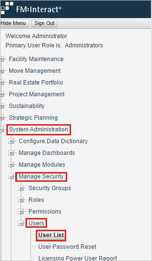
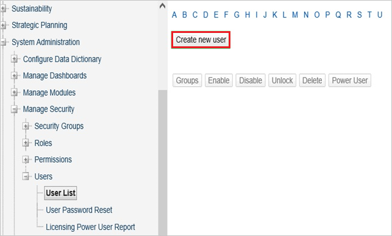
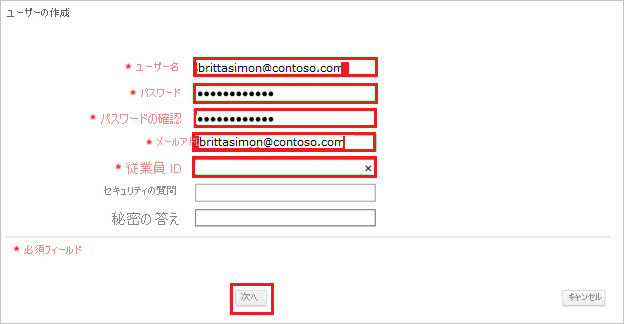

# チュートリアル: Azure AD SSO と FM:Systems の統合

このチュートリアルでは、FM:Systems と Azure Active Directory (Azure AD) を統合する方法について説明します。 Azure AD と FM:Systems を統合すると、次のことができます。

* FM:Systems にアクセスできるユーザーを Azure AD で制御します。
* ユーザーが自分の Azure AD アカウントを使用して FM:Systems に自動的にサインインできるように設定します。
* 1 つの中央サイト (Azure Portal) で自分のアカウントを管理します。

## 前提条件

FM:Systems と Azure AD の統合を構成するには、次のものが必要です。

* Azure AD サブスクリプション。 Azure AD の環境がない場合は、<bpt id="p1">[</bpt>無料アカウント<ept id="p1">](https://azure.microsoft.com/free/)</ept>を取得できます。
* FM:Systems でのシングル サインオンが有効なサブスクリプション。

## シナリオの説明

このチュートリアルでは、テスト環境で Azure AD のシングル サインオンを構成してテストします。

* FM:Systems では、**IDP** Initiated SSO がサポートされます。

> [!NOTE]
> このアプリケーションの識別子は固定文字列値であるため、1 つのテナントで構成できるインスタンスは 1 つだけです。

## ギャラリーから FM:Systems を追加する

Azure AD への FM:Systems の統合を構成するには、ギャラリーから管理対象 SaaS アプリの一覧に FM:Systems を追加する必要があります。

1. 職場または学校アカウントか、個人の Microsoft アカウントを使用して、Azure portal にサインインします。
1. 左のナビゲーション ウィンドウで <bpt id="p1">**</bpt>[Azure Active Directory]<ept id="p1">**</ept> サービスを選択します。
1. <bpt id="p1">**</bpt>[エンタープライズ アプリケーション]<ept id="p1">**</ept> に移動し、 <bpt id="p2">**</bpt>[すべてのアプリケーション]<ept id="p2">**</ept> を選択します。
1. 新しいアプリケーションを追加するには、 <bpt id="p1">**</bpt>[新しいアプリケーション]<ept id="p1">**</ept> を選択します。
1. **[ギャラリーから追加する]** セクションで、検索ボックスに、「**FM:Systems**」と入力します。
1. 結果のパネルから **[FM:Systems]** を選択し、アプリを追加します。 お使いのテナントにアプリが追加されるのを数秒待機します。

## FM:Systems の Azure AD SSO の構成とテスト

**B.Simon** というテスト ユーザーを使用して、FM:Systems に対する Azure AD SSO を構成してテストします。 SSO が機能するためには、Azure AD ユーザーと FM:Systems の関連ユーザーとの間にリンク関係を確立する必要があります。

FM:Systems に対して Azure AD SSO を構成してテストするには、次の手順を行います。

1. <bpt id="p1">**</bpt><bpt id="p2">[</bpt>Azure AD SSO の構成<ept id="p2">](#configure-azure-ad-sso)</ept><ept id="p1">**</ept> - ユーザーがこの機能を使用できるようにします。
    1. <bpt id="p1">**</bpt><bpt id="p2">[</bpt>Azure AD のテスト ユーザーの作成<ept id="p2">](#create-an-azure-ad-test-user)</ept><ept id="p1">**</ept> - B.Simon で Azure AD のシングル サインオンをテストします。
    1. <bpt id="p1">**</bpt><bpt id="p2">[</bpt>Azure AD テスト ユーザーの割り当て<ept id="p2">](#assign-the-azure-ad-test-user)</ept><ept id="p1">**</ept> - B.Simon が Azure AD シングル サインオンを使用できるようにします。
1. **[FM:Systems SSO の構成](#configure-fmsystems-sso)** - アプリケーション側でシングル サインオン設定を構成します。
    1. **[FM:Systems のテスト ユーザーの作成](#create-fmsystems-test-user)** - FM:Systems で B.Simon に対応するユーザーを作成し、Azure AD のこのユーザーにリンクさせます。
1. <bpt id="p1">**</bpt><bpt id="p2">[</bpt>SSO のテスト<ept id="p2">](#test-sso)</ept><ept id="p1">**</ept> - 構成が機能するかどうかを確認します。

## Azure AD SSO の構成

これらの手順に従って、Azure portal で Azure AD SSO を有効にします。

1. Azure portal の **FM:Systems** アプリケーション統合ページで、 **[管理]** セクションを見つけて、 **[シングル サインオン]** を選択します。
1. <bpt id="p1">**</bpt>[シングル サインオン方式の選択]<ept id="p1">**</ept> ページで、 <bpt id="p2">**</bpt>[SAML]<ept id="p2">**</ept> を選択します。
1. <bpt id="p1">**</bpt>[SAML によるシングル サインオンのセットアップ]<ept id="p1">**</ept> ページで、 <bpt id="p2">**</bpt>[基本的な SAML 構成]<ept id="p2">**</ept> の鉛筆アイコンをクリックして設定を編集します。

   

4. <bpt id="p1">**</bpt>[基本的な SAML 構成]<ept id="p1">**</ept> セクションで、次の手順を実行します。

    <bpt id="p1">**</bpt>[応答 URL]<ept id="p1">**</ept> ボックスに、<ph id="ph1">`https://<companyname>.fmshosted.com/fminteract/ConsumerService2.aspx`</ph> のパターンを使用して URL を入力します
    
    > [!NOTE]
    > これは実際の値ではありません。 実際の応答 URL でこの値を更新します。 この値を取得するには、<bpt id="p1">[</bpt>FM:Systems クライアント サポート チーム<ept id="p1">](https://fmsystems.com/support-services/)</ept>に問い合わせてください。 Azure portal の <bpt id="p1">**</bpt>[基本的な SAML 構成]<ept id="p1">**</ept> セクションに示されているパターンを参照することもできます。

5. <bpt id="p1">**</bpt>[SAML でシングル サインオンをセットアップします]<ept id="p1">**</ept> ページの <bpt id="p2">**</bpt>[SAML 署名証明書]<ept id="p2">**</ept> セクションで、 <bpt id="p3">**</bpt>[ダウンロード]<ept id="p3">**</ept> をクリックして、要件のとおりに指定したオプションから<bpt id="p4">**</bpt>フェデレーション メタデータ XML<ept id="p4">**</ept> をダウンロードして、お使いのコンピューターに保存します。

    

6. <bpt id="p1">**</bpt>[FM:Systems のセットアップ]<ept id="p1">**</ept> セクションで、要件に従って適切な URL をコピーします。

    

### Azure AD のテスト ユーザーの作成 

このセクションでは、Azure portal 内で B.Simon というテスト ユーザーを作成します。

1. Azure portal の左側のウィンドウから、 <bpt id="p1">**</bpt>[Azure Active Directory]<ept id="p1">**</ept> 、 <bpt id="p2">**</bpt>[ユーザー]<ept id="p2">**</ept> 、 <bpt id="p3">**</bpt>[すべてのユーザー]<ept id="p3">**</ept> の順に選択します。
1. 画面の上部にある <bpt id="p1">**</bpt>[新しいユーザー]<ept id="p1">**</ept> を選択します。
1. <bpt id="p1">**</bpt>[ユーザー]<ept id="p1">**</ept> プロパティで、以下の手順を実行します。
   1. <bpt id="p1">**</bpt>[名前]<ept id="p1">**</ept> フィールドに「<ph id="ph1">`B.Simon`</ph>」と入力します。  
   1. <bpt id="p1">**</bpt>[ユーザー名]<ept id="p1">**</ept> フィールドに「<ph id="ph1">username@companydomain.extension</ph>」と入力します。 たとえば、「 <ph id="ph1">`B.Simon@contoso.com`</ph> 」のように入力します。
   1. <bpt id="p1">**</bpt>[パスワードを表示]<ept id="p1">**</ept> チェック ボックスをオンにし、 <bpt id="p2">**</bpt>[パスワード]<ept id="p2">**</ept> ボックスに表示された値を書き留めます。
   1. <bpt id="p1">**</bpt>Create<ept id="p1">**</ept> をクリックしてください。

### Azure AD テスト ユーザーの割り当て

このセクションでは、B.Simon に FM:Systems へのアクセスを許可することで、このユーザーが Azure シングル サインオンを使用できるようにします。

1. Azure portal で <bpt id="p1">**</bpt>[エンタープライズ アプリケーション]<ept id="p1">**</ept> を選択し、 <bpt id="p2">**</bpt>[すべてのアプリケーション]<ept id="p2">**</ept> を選択します。
1. アプリケーションの一覧で <bpt id="p1">**</bpt>[FM:Systems]<ept id="p1">**</ept>を選択します。
1. アプリの概要ページで、 <bpt id="p1">**</bpt>[管理]<ept id="p1">**</ept> セクションを見つけて、 <bpt id="p2">**</bpt>[ユーザーとグループ]<ept id="p2">**</ept> を選択します。
1. <bpt id="p1">**</bpt>[ユーザーの追加]<ept id="p1">**</ept> を選択し、 <bpt id="p3">**</bpt>[割り当ての追加]<ept id="p3">**</ept> ダイアログで <bpt id="p2">**</bpt>[ユーザーとグループ]<ept id="p2">**</ept> を選択します。
1. <bpt id="p1">**</bpt>[ユーザーとグループ]<ept id="p1">**</ept> ダイアログの [ユーザー] の一覧から <bpt id="p2">**</bpt>[B.Simon]<ept id="p2">**</ept> を選択し、画面の下部にある <bpt id="p3">**</bpt>[選択]<ept id="p3">**</ept> ボタンをクリックします。
1. ユーザーにロールが割り当てられることが想定される場合は、 <bpt id="p1">**</bpt>[ロールの選択]<ept id="p1">**</ept> ドロップダウンからそれを選択できます。 このアプリに対してロールが設定されていない場合は、[既定のアクセス] ロールが選択されていることを確認します。
1. <bpt id="p1">**</bpt>[割り当ての追加]<ept id="p1">**</ept> ダイアログで、 <bpt id="p2">**</bpt>[割り当て]<ept id="p2">**</ept> をクリックします。

## FM:Systems SSO の構成

<bpt id="p1">**</bpt>FM:Systems<ept id="p1">**</ept> 側でシングル サインオンを構成するには、ダウンロードした<bpt id="p2">**</bpt>フェデレーション メタデータ XML<ept id="p2">**</ept> と Azure portal からコピーした適切な URL を <bpt id="p3">[</bpt>FM:Systems サポート チーム<ept id="p3">](https://fmsystems.com/support-services/)</ept>に送信する必要があります。 サポート チームはこれを設定して、SAML SSO 接続が両方の側で正しく設定されるようにします。

### FM:Systems のテスト ユーザーの作成

1. Web ブラウザー ウィンドウで、FM:Systems 企業サイトに管理者としてサインインします。

2. <bpt id="p1">**</bpt>[システム管理] <ph id="ph1">\></ph> [セキュリティの管理] <ph id="ph2">\></ph> [ユーザー] <ph id="ph3">\></ph> [ユーザー一覧]<ept id="p1">**</ept> の順にクリックします。
   
    <bpt id="p1"></ept>

3. [<bpt id="p1">**</bpt>新規ユーザーの作成<ept id="p1">**</ept>] をクリックします。
   
    <bpt id="p1"></ept>

4. <bpt id="p1">**</bpt>[Create User]<ept id="p1">**</ept> セクションで、次の手順に従います。
   
    <bpt id="p1"></ept>
   
    a. 関連するテキスト ボックスに、プロビジョニングする有効な Azure Active Directory アカウントの<bpt id="p1">**</bpt>ユーザー名<ept id="p1">**</ept>、<bpt id="p2">**</bpt>パスワード<ept id="p2">**</ept>、<bpt id="p3">**</bpt>確認パスワード<ept id="p3">**</ept>、<bpt id="p4">**</bpt>電子メール<ept id="p4">**</ept>、<bpt id="p5">**</bpt>従業員 ID<ept id="p5">**</ept> を入力します。
   
    b. <bpt id="p1">**</bpt>[次へ]<ept id="p1">**</ept> をクリックします。

## SSO のテスト

このセクションでは、次のオプションを使用して Azure AD のシングル サインオン構成をテストします。

* Azure portal で [このアプリケーションをテストします] をクリックすると、SSO を設定した FM:Systems に自動的にサインインします。

* Microsoft マイ アプリを使用することができます。 マイ アプリの [FM:Systems] タイルをクリックすると、SSO を設定した FM:Systems に自動的にサインインします。 マイ アプリの詳細については、<bpt id="p1">[</bpt>マイ アプリの概要<ept id="p1">](../user-help/my-apps-portal-end-user-access.md)</ept>に関するページを参照してください。

## 次のステップ

FM:Systems を構成したら、組織の機密データを流出と侵入からリアルタイムで保護するセッション制御を適用することができます。 セッション制御は、条件付きアクセスを拡張したものです。 <bpt id="p1">[</bpt>Microsoft Cloud App Security でセッション制御を強制する方法<ept id="p1">](/cloud-app-security/proxy-deployment-aad)</ept>をご覧ください。