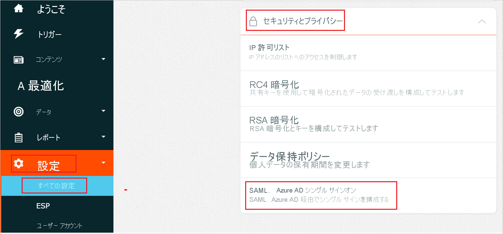
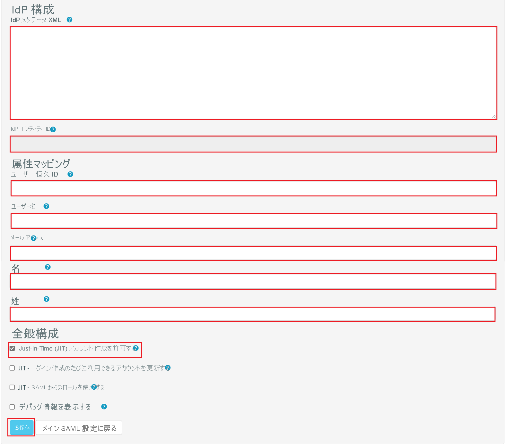

# チュートリアル: Azure Active Directory シングル サインオン (SSO) と Fresh Relevance の統合

このチュートリアルでは、Fresh Relevance と Azure Active Directory (Azure AD) を統合する方法について説明します。 Azure AD と Fresh Relevance を統合すると、次のことができます。

* Fresh Relevance にアクセスできるユーザーを Azure AD で制御します。
* ユーザーが自分の Azure AD アカウントを使用して Fresh Relevance に自動的にサインインできるようにします。
* 1 つの中央サイト (Azure Portal) で自分のアカウントを管理します。

## 前提条件

開始するには、次が必要です。

* Azure AD サブスクリプション。 サブスクリプションがない場合は、[無料アカウント](https://azure.microsoft.com/free/)を取得できます。
* Fresh Relevance でのシングル サインオン (SSO) が有効なサブスクリプション。

## シナリオの説明

このチュートリアルでは、テスト環境で Azure AD の SSO を構成してテストします。

* Fresh Relevance では、**IDP** Initiated SSO がサポートされます。

* Fresh Relevance では、**Just-In-Time** ユーザー プロビジョニングがサポートされます。

## ギャラリーからの Fresh Relevance の追加

Azure AD への Fresh Relevance の統合を構成するには、ギャラリーから管理対象 SaaS アプリの一覧に Fresh Relevance を追加する必要があります。

1. 職場または学校アカウントか、個人の Microsoft アカウントを使用して、Azure portal にサインインします。
1. 左のナビゲーション ウィンドウで **[Azure Active Directory]** サービスを選択します。
1. **[エンタープライズ アプリケーション]** に移動し、 **[すべてのアプリケーション]** を選択します。
1. 新しいアプリケーションを追加するには、 **[新しいアプリケーション]** を選択します。
1. **[ギャラリーから追加する]** セクションで、検索ボックスに「**Fresh Relevance**」と入力します。
1. 結果パネルから **[Fresh Relevance]** を選択し、アプリを追加します。 お使いのテナントにアプリが追加されるのを数秒待機します。

## Fresh Relevance の Azure AD SSO の構成とテスト

**B.Simon** というテスト ユーザーを使用して、Fresh Relevance に対する Azure AD SSO を構成してテストします。 SSO が機能するためには、Azure AD ユーザーと Fresh Relevance の関連ユーザーの間で、リンク関係を確立する必要があります。

Fresh Relevance で Azure AD SSO を構成してテストするには、次の手順に従います。

1. **[Azure AD SSO の構成](#configure-azure-ad-sso)** - ユーザーがこの機能を使用できるようにします。
    1. **[Azure AD のテスト ユーザーの作成](#create-an-azure-ad-test-user)** - B.Simon で Azure AD のシングル サインオンをテストします。
    1. **[Azure AD テスト ユーザーの割り当て](#assign-the-azure-ad-test-user)** - B.Simon が Azure AD シングル サインオンを使用できるようにします。
1. **[Fresh Relevance SSO の構成](#configure-fresh-relevance-sso)** - アプリケーション側でシングル サインオン設定を構成します。
    1. **[Fresh Relevance のテスト ユーザーの作成](#create-fresh-relevance-test-user)** - Fresh Relevance で B. Simon に対応するユーザーを作成し、Azure AD の B. Simon にリンクさせます。
1. **[SSO のテスト](#test-sso)** - 構成が機能するかどうかを確認します。

## Azure AD SSO の構成

これらの手順に従って、Azure portal で Azure AD SSO を有効にします。

1. Azure portal の **Fresh Relevance** アプリケーション統合ページで、 **[管理]** セクションを見つけて、 **[シングル サインオン]** を選択します。
1. **[シングル サインオン方式の選択]** ページで、 **[SAML]** を選択します。
1. **[SAML によるシングル サインオンのセットアップ]** ページで、 **[基本的な SAML 構成]** の鉛筆アイコンをクリックして設定を編集します。

   

1. **[基本的な SAML 構成]** セクションで、**サービス プロバイダー メタデータ ファイル** がある場合は、次の手順に従います。

    a. **[メタデータ ファイルをアップロードします]** をクリックします。

    

    b. **フォルダー ロゴ** をクリックしてメタデータ ファイルを選択し、 **[アップロード]** をクリックします。

    

    c. メタデータ ファイルが正常にアップロードされると、**識別子** と **応答 URL** の値が、[基本的な SAML 構成] セクションに自動的に設定されます。

    > [!Note]
    > **識別子** と **返信 URL** の値が自動的に設定されない場合は、要件に応じて手動で値を入力してください。

    d. **[リレー状態]** ボックスに、次の形式で値を入力します。`<ID>`

1. **[Set up single sign-on with SAML]\(SAML でシングル サインオンをセットアップします\)** ページの **[SAML 署名証明書]** セクションで、コピー ボタンをクリックして **[アプリのフェデレーション メタデータ URL]** をコピーして、お使いのコンピューターに保存します。

    

### Azure AD のテスト ユーザーの作成

このセクションでは、Azure portal 内で B.Simon というテスト ユーザーを作成します。

1. Azure portal の左側のウィンドウから、 **[Azure Active Directory]** 、 **[ユーザー]** 、 **[すべてのユーザー]** の順に選択します。
1. 画面の上部にある **[新しいユーザー]** を選択します。
1. **[ユーザー]** プロパティで、以下の手順を実行します。
   1. **[名前]** フィールドに「`B.Simon`」と入力します。  
   1. **[ユーザー名]** フィールドに「username@companydomain.extension」と入力します。 たとえば、「 `B.Simon@contoso.com` 」のように入力します。
   1. **[パスワードを表示]** チェック ボックスをオンにし、 **[パスワード]** ボックスに表示された値を書き留めます。
   1. **Create** をクリックしてください。

### Azure AD テスト ユーザーの割り当て

このセクションでは、B.Simon に Fresh Relevance へのアクセスを許可することで、Azure シングル サインオンを使用できるようにします。

1. Azure portal で **[エンタープライズ アプリケーション]** を選択し、 **[すべてのアプリケーション]** を選択します。
1. アプリケーションの一覧で **[Fresh Relevance]** を選択します。
1. アプリの概要ページで、 **[管理]** セクションを見つけて、 **[ユーザーとグループ]** を選択します。
1. **[ユーザーの追加]** を選択し、 **[割り当ての追加]** ダイアログで **[ユーザーとグループ]** を選択します。
1. **[ユーザーとグループ]** ダイアログの [ユーザー] の一覧から **[B.Simon]** を選択し、画面の下部にある **[選択]** ボタンをクリックします。
1. ユーザーにロールが割り当てられることが想定される場合は、 **[ロールの選択]** ドロップダウンからそれを選択できます。 このアプリに対してロールが設定されていない場合は、[既定のアクセス] ロールが選択されていることを確認します。
1. **[割り当ての追加]** ダイアログで、 **[割り当て]** をクリックします。

## Fresh Relevance SSO の構成

1. Fresh Relevance 企業サイトに管理者としてログインします。

1. **[Settings]\(設定\)**  >  **[All Settings]\(すべての設定\)**  >  **[Security and Privacy]\(セキュリティとプライバシー\)** に移動し、 **[SAML/Azure AD Single Sign-On]\(SAML/Azure AD シングル サインオン\)** をクリックします。

    

1. **[SAML/Single Sign-On Configuration]\(SAML/シングル サインオン構成\)**  ページで、 **[Enable SAML SSO for this account]\(このアカウントのSAML SSOを有効にする\)** チェック ボックスをオンにして、 **[Create new IdP Configuration]\(新しい IdP 構成の作成\)** ボタンをクリックします。 

    

1. **[SAML IdP Configuration]\(SAML IdP 構成\)** ページで、次の手順を実行します。

    ![[SAML IdP Configuration]\(SAML IdP 構成\) ページを示すスクリーンショット。](./media/fresh-relevance-tutorial/metadata.png "SAML の構成")

    

    a. **[Entity ID]\(エンティティ ID\)** の値をコピーし、その値を Azure portal の **[基本的な SAML 構成]** セクションの **[識別子 (エンティティ ID)]** テキスト ボックスに貼り付けます。

    b. **[Assertion Consumer Service(ACS) URL]** の値をコピーし、Azure portal の **[基本的な SAML 構成]** セクションの **[応答 URL]** テキスト ボックスに貼り付けます。

    c. **[RelayState Value]\(RelayState 値\)** の値をコピーし、Azure portal の **[基本的な SAML 構成]** セクションの **[リレー状態]** テキスト ボックスにこの値を貼り付けます。

    d. **[Download SP Metadata XML]\(SP メタデータ XML のダウンロード\)** をクリックして、Azure portal 内の **[基本的な SAML 構成]** セクションでメタデータ ファイルをアップロードします。

    e. Azure portal から **[アプリのフェデレーション メタデータ URL]** をメモ帳にコピーし、その内容を **[IdP Metadata XML]\(IdP メタデータ XML\)** ボックスに貼り付けて、 **[Save]\(保存\)** ボタンをクリックします。

    f. 成功すると、IdP の **エンティティ ID** などの情報が **[IdP Entity ID]\(IdP エンティティ ID\)** ボックスに表示 されます。

    g. **[Attribute Mapping]\(属性マッピング\)** セクションで、Azure portal かコピーした必須フィールドに手動で入力します。

    h. **General Configuration\(全般構成\)** セクションで、**Allow Just In Time (JIT) Account Creation\(Just In Time (JIT) アカウント作成を許可する\)** を有効にして、**Save｣\(保存\)** をクリックします。

    > [!NOTE]
    > これらのパラメーターが正しくマップされない場合、ログインまたはアカウントの作成は成功せず、エラーが表示されます。 サインオンに失敗したときに拡張属性デバッグ情報を一時的に表示するには、 **[Show Debugging Information]\(デバッグ情報の表示\)** チェックボックスをオンにします。

### Fresh Relevance テストユーザーの作成

このセクションでは、Britta Simon というユーザーを Fresh Relevance に作成します。 Fresh Relevance では、Just-In-Time ユーザー プロビジョニングがサポートされており、既定で有効になっています。 このセクションでは、ユーザー側で必要な操作はありません。 Fresh Relevance にユーザーがまだ存在していない場合は、認証後に新規に作成されます。

## SSO のテスト 

このセクションでは、次のオプションを使用して Azure AD のシングル サインオン構成をテストします。

* Azure portal で [このアプリケーションをテストします] をクリックすると、SSO を設定した Fresh Relevance に自動的にサインインされます。

* Microsoft マイ アプリを使用することができます。 マイ アプリで [Fresh Relevance] タイルをクリックすると、SSO を設定した Fresh Relevance に自動的にサインインします。 マイ アプリの詳細については、[マイ アプリの概要](https://support.microsoft.com/account-billing/sign-in-and-start-apps-from-the-my-apps-portal-2f3b1bae-0e5a-4a86-a33e-876fbd2a4510)に関するページを参照してください。

## 次のステップ

Fresh Relevance を構成したら、組織の機密データを流出と侵入からリアルタイムで保護するセッション制御を適用することができます。 セッション制御は、条件付きアクセスを拡張したものです。 [Microsoft Defender for Cloud Apps でセッション制御を強制する方法](/cloud-app-security/proxy-deployment-aad)をご覧ください。
