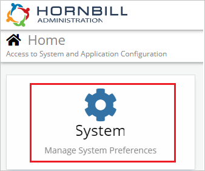
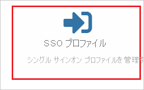
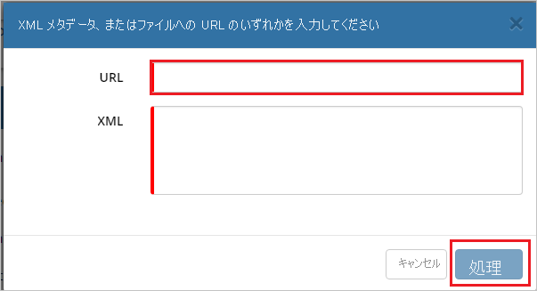
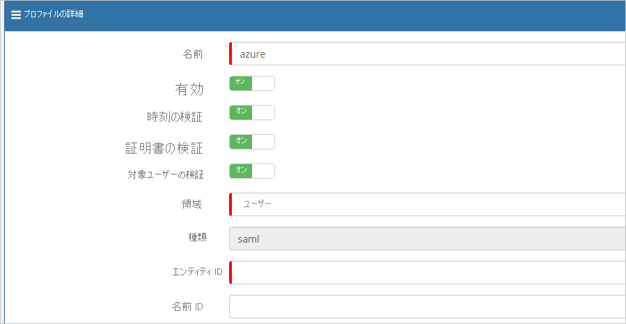
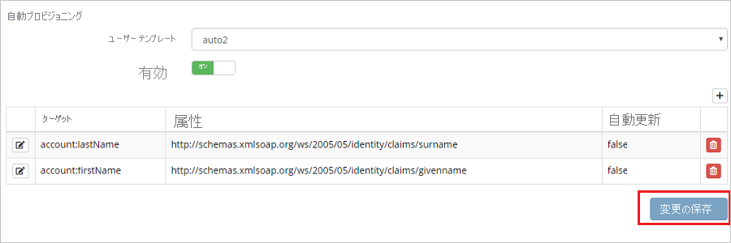
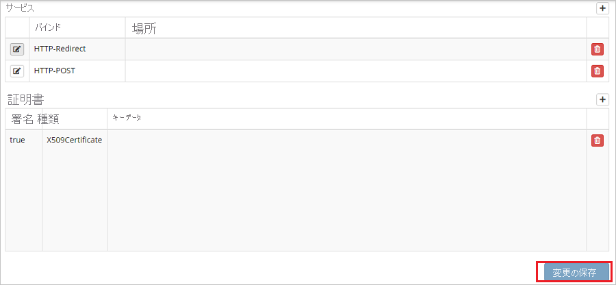

# チュートリアル: Azure Active Directory と Hornbill の統合

このチュートリアルでは、Hornbill と Azure Active Directory (Azure AD) を統合する方法について説明します。 Hornbill と Azure AD を統合すると、次のことができます。

* Hornbill にアクセスできる Azure AD ユーザーを制御します。
* ユーザーが自分の Azure AD アカウントを使用して Hornbill に自動的にサインインできるように設定できます。
* 1 つの中央サイト (Azure Portal) で自分のアカウントを管理します。

## 前提条件

開始するには、次が必要です。

* Azure AD サブスクリプション。 サブスクリプションがない場合は、[無料アカウント](https://azure.microsoft.com/free/)を取得できます。
* Hornbill シングル サインオン (SSO) が有効なサブスクリプション。

> [!NOTE]
> この統合は、Azure AD 米国政府クラウド環境から利用することもできます。 このアプリケーションは、Azure AD 米国政府クラウドのアプリケーション ギャラリーにあります。パブリック クラウドの場合と同じように構成してください。

## シナリオの説明

このチュートリアルでは、テスト環境で Azure AD のシングル サインオンを構成してテストします。

* Hornbill では、**SP** Initiated SSO がサポートされます。
* Hornbill では、**Just-In-Time** ユーザー プロビジョニングがサポートされます。

## ギャラリーからの Hornbill の追加

Azure AD への Hornbill の統合を構成するには、ギャラリーからマネージド SaaS アプリの一覧に Hornbill を追加する必要があります。

1. 職場または学校アカウントか、個人の Microsoft アカウントを使用して、Azure portal にサインインします。
1. 左のナビゲーション ウィンドウで **[Azure Active Directory]** サービスを選択します。
1. **[エンタープライズ アプリケーション]** に移動し、 **[すべてのアプリケーション]** を選択します。
1. 新しいアプリケーションを追加するには、 **[新しいアプリケーション]** を選択します。
1. **[ギャラリーから追加する]** セクションで、検索ボックスに「**Hornbill**」と入力します。
1. 結果ウィンドウで **[Hornbill]** を選択し、アプリを追加します。 お使いのテナントにアプリが追加されるのを数秒待機します。

## Hornbill の Azure AD SSO の構成とテスト

**B.Simon** というテスト ユーザーを使用して、Hornbill に対する Azure AD SSO を構成してテストします。 SSO を機能させるためには、Azure AD ユーザーと Hornbill の関連ユーザーとの間にリンク関係を確立する必要があります。

Hornbill に対して Azure AD SSO を構成してテストするには、次の手順を行います。

1. **[Azure AD SSO の構成](#configure-azure-ad-sso)** - ユーザーがこの機能を使用できるようにします。
    1. **[Azure AD のテスト ユーザーの作成](#create-an-azure-ad-test-user)** - B.Simon で Azure AD のシングル サインオンをテストします。
    1. **[Azure AD テスト ユーザーの割り当て](#assign-the-azure-ad-test-user)** - B.Simon が Azure AD シングル サインオンを使用できるようにします。
1. **[Hornbill SSO の構成](#configure-hornbill-sso)** - アプリケーション側でシングル サインオン設定を構成します。
    1. **[Hornbill のテスト ユーザーの作成](#create-hornbill-test-user)** - Hornbill で B.Simon に対応するユーザーを作成し、Azure AD の B.Simon にリンクさせます。
1. **[SSO のテスト](#test-sso)** - 構成が機能するかどうかを確認します。

## Azure AD SSO の構成

これらの手順に従って、Azure portal で Azure AD SSO を有効にします。

1. Azure portal の **Hornbill** アプリケーション統合ページで、 **[管理]** セクションを見つけて、 **[シングル サインオン]** を選択します。
1. **[シングル サインオン方式の選択]** ページで、 **[SAML]** を選択します。
1. **[SAML によるシングル サインオンのセットアップ]** ページで、 **[基本的な SAML 構成]** の鉛筆アイコンをクリックして設定を編集します。

   

4. **[基本的な SAML 構成]** セクションで、次の手順を実行します。

    a. **[識別子 (エンティティ ID)]** ボックスに、次のパターンを使用して URL を入力します。`https://<SUBDOMAIN>.hornbill.com/<INSTANCE_NAME>/lib/saml/auth/simplesaml/module.php/saml/sp/metadata.php/saml`

    b. **[サインオン URL]** ボックスに、次のパターンを使用して URL を入力します。`https://<SUBDOMAIN>.hornbill.com/<INSTANCE_NAME>/`

    > [!NOTE]
    > これらは実際の値ではありません。 これらの値を実際の識別子とサインオン URL で更新してください。 これらの値を取得するには、[Hornbill クライアント サポート チーム](https://www.hornbill.com/support/?request/)にお問い合わせください。 Azure portal の **[基本的な SAML 構成]** セクションに示されているパターンを参照することもできます。

5. **Set up Single Sign-On with SAML\(SAML でのシングルサインオンの設定** ページの **SAML 署名証明書** セクションで、コピー ボタンをクリックして **App Federation Metadata Url\(アプリのフェデレーション メタデータ URL)** をコピーして、コンピューターに保存します。

    

### Azure AD のテスト ユーザーの作成

このセクションでは、Azure portal 内で B.Simon というテスト ユーザーを作成します。

1. Azure portal の左側のウィンドウから、 **[Azure Active Directory]** 、 **[ユーザー]** 、 **[すべてのユーザー]** の順に選択します。
1. 画面の上部にある **[新しいユーザー]** を選択します。
1. **[ユーザー]** プロパティで、以下の手順を実行します。
   1. **[名前]** フィールドに「`B.Simon`」と入力します。  
   1. **[ユーザー名]** フィールドに「username@companydomain.extension」と入力します。 たとえば、「 `B.Simon@contoso.com` 」のように入力します。
   1. **[パスワードを表示]** チェック ボックスをオンにし、 **[パスワード]** ボックスに表示された値を書き留めます。
   1. **Create** をクリックしてください。

### Azure AD テスト ユーザーの割り当て

このセクションでは、B.Simon に Hornbill へのアクセスを許可することで、このユーザーが Azure シングル サインオンを使用できるようにします。

1. Azure portal で **[エンタープライズ アプリケーション]** を選択し、 **[すべてのアプリケーション]** を選択します。
1. アプリケーションの一覧で **[Hornbill]** を選択します。
1. アプリの概要ページで、 **[管理]** セクションを見つけて、 **[ユーザーとグループ]** を選択します。
1. **[ユーザーの追加]** を選択し、 **[割り当ての追加]** ダイアログで **[ユーザーとグループ]** を選択します。
1. **[ユーザーとグループ]** ダイアログの [ユーザー] の一覧から **[B.Simon]** を選択し、画面の下部にある **[選択]** ボタンをクリックします。
1. ユーザーにロールが割り当てられることが想定される場合は、 **[ロールの選択]** ドロップダウンからそれを選択できます。 このアプリに対してロールが設定されていない場合は、[既定のアクセス] ロールが選択されていることを確認します。
1. **[割り当ての追加]** ダイアログで、 **[割り当て]** をクリックします。

## Hornbill SSO の構成

1. 別の Web ブラウザー ウィンドウで、Hornbill にセキュリティ管理者としてログインします。

2. ホーム ページで **[System]\(システム\)** をクリックします。

    

3. **[セキュリティ]** に移動します。

    

4. **[SSO Profiles]\(SSO プロファイル\)** をクリックします。

    

5. ページの右上の **追加のロゴ** をクリックします。

    

6. **[Profile Details]\(プロファイルの詳細\)** バーで、**SAML メタデータのインポートのロゴ** をクリックします。

    

7. ポップアップ ページの **[URL]** テキスト ボックスに、Azure portal からコピーした **[アプリのフェデレーション メタデータ URL]** を貼り付け、 **[Process]\(処理\)** をクリックします。

    

8. [Process]\(処理\) をクリックすると、 **[Profile Details]\(プロファイルの詳細\)** セクションに値が自動的に入力されます。

    

    

    

9. **[変更を保存]** をクリックします。

### Hornbill のテスト ユーザーの作成

このセクションでは、Britta Simon というユーザーを Hornbill に作成します。 Hornbill では、Just-In-Time ユーザー プロビジョニングがサポートされています。この設定は既定で有効になっています。 このセクションでは、ユーザー側で必要な操作はありません。 Hornbill にユーザーがまだ存在していない場合は、認証後に新規に作成されます。

> [!Note]
> ユーザーを手動で作成する必要がある場合は、[Hornbill クライアント サポート チーム](https://www.hornbill.com/support/?request/)にお問い合わせください。

## SSO のテスト

このセクションでは、次のオプションを使用して Azure AD のシングル サインオン構成をテストします。 

* Azure portal で **[このアプリケーションをテストします]** をクリックします。 これにより、ログイン フローを開始できる Hornbill のサインオン URL にリダイレクトされます。 

* Hornbill のサインオン URL に直接移動し、そこからログイン フローを開始します。

* Microsoft マイ アプリを使用することができます。 マイ アプリで [Hornbill] タイルをクリックすると、Hornbill のサインオン URL にリダイレクトされます。 マイ アプリの詳細については、[マイ アプリの概要](https://support.microsoft.com/account-billing/sign-in-and-start-apps-from-the-my-apps-portal-2f3b1bae-0e5a-4a86-a33e-876fbd2a4510)に関するページを参照してください。

## 次のステップ

Hornbill を構成したら、組織の機密データを流出と侵入からリアルタイムで保護するセッション制御を適用できます。 セッション制御は、条件付きアクセスを拡張したものです。 [Microsoft Defender for Cloud Apps でセッション制御を適用する方法をご覧ください](/cloud-app-security/proxy-deployment-aad)。
