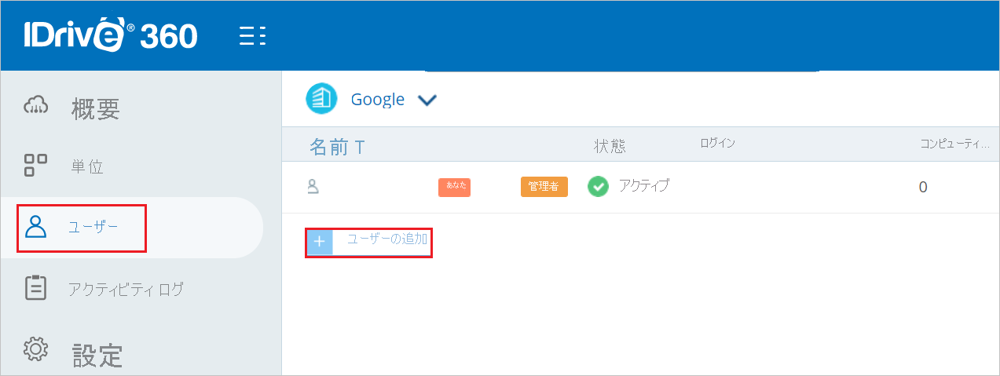
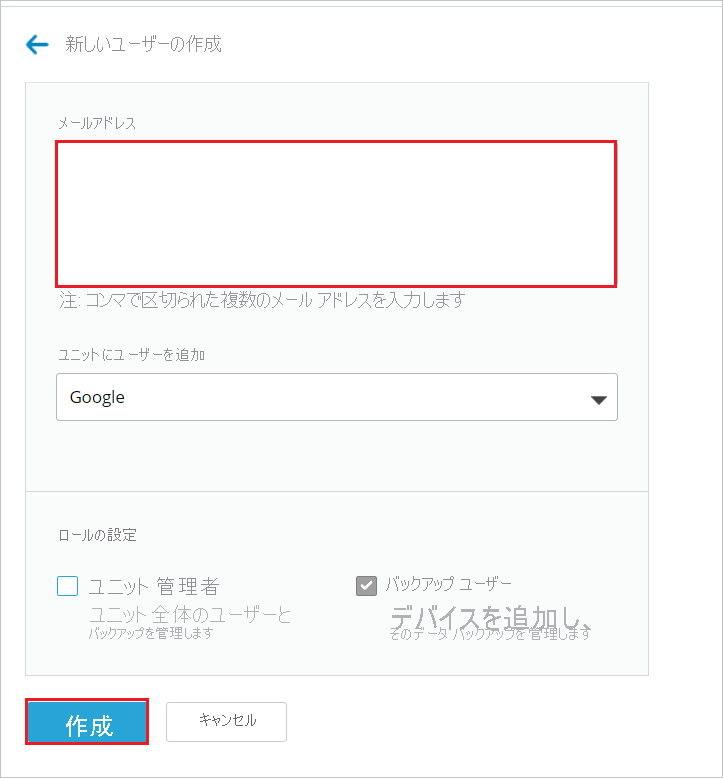

# チュートリアル:Azure Active Directory シングル サインオン (SSO) と IDrive360 の統合

このチュートリアルでは、IDrive360 と Microsoft Azure Active Directory (Azure AD) を統合する方法について説明します。 IDrive360 を Microsoft Azure Active Directory と統合すると、次のことが可能になります。

* IDrive360 にアクセスできるユーザーを Microsoft Azure Active Directory で制御します。
* ユーザーが自分の Microsoft Azure Active Directory アカウントを使用して IDrive360 に自動的にサインインできるようにします。
* 1 つの中央サイト (Azure Portal) で自分のアカウントを管理します。

## 前提条件

開始するには、次が必要です。

* Azure AD サブスクリプション。 サブスクリプションがない場合は、[無料アカウント](https://azure.microsoft.com/free/)を取得できます。
* IDrive360 でのシングル サインオン (SSO) が有効なサブスクリプション。

## シナリオの説明

このチュートリアルでは、テスト環境で Azure AD の SSO を構成してテストします。

* IDrive360 では、**SP と IDP** Initiated SSO がサポートされます。

> [!NOTE]
> このアプリケーションの識別子は固定文字列値であるため、1 つのテナントで構成できるインスタンスは 1 つだけです。

## ギャラリーからの IDrive360 の追加

Microsoft Azure Active Directory への IDrive360 の統合を構成するには、ギャラリーからマネージド SaaS アプリの一覧に IDrive360 を追加する必要があります。

1. 職場または学校アカウントか、個人の Microsoft アカウントを使用して、Azure portal にサインインします。
1. 左のナビゲーション ウィンドウで **[Azure Active Directory]** サービスを選択します。
1. **[エンタープライズ アプリケーション]** に移動し、 **[すべてのアプリケーション]** を選択します。
1. 新しいアプリケーションを追加するには、 **[新しいアプリケーション]** を選択します。
1. **[ギャラリーから追加する]** セクションで、検索ボックスに「**IDrive360**」と入力します。
1. 結果のパネルから **[IDrive360]** を選択し、アプリを追加します。 お使いのテナントにアプリが追加されるのを数秒待機します。

## IDrive360 用の Microsoft Azure Active Directory SSO の構成とテスト

**B.Simon** というテスト ユーザーを使用して、IDrive360 と一緒に Microsoft Azure Active Directory SSO を構成してテストします。 SSO が機能するためには、Azure AD ユーザーと IDrive360 の関連ユーザーとの間にリンク関係を確立する必要があります。

Microsoft Azure Active Directory SSO を IDrive360 と一緒に構成してテストするには、次の手順を実行します。

1. **[Azure AD SSO の構成](#configure-azure-ad-sso)** - ユーザーがこの機能を使用できるようにします。
    1. **[Azure AD のテスト ユーザーの作成](#create-an-azure-ad-test-user)** - B.Simon で Azure AD のシングル サインオンをテストします。
    1. **[Azure AD テスト ユーザーの割り当て](#assign-the-azure-ad-test-user)** - B.Simon が Azure AD シングル サインオンを使用できるようにします。
1. **[IDrive360 SSO の構成](#configure-idrive360-sso)** - アプリケーション側でシングル サインオン設定を構成します。
    1. **[IDrive360 のテスト ユーザーの作成](#create-idrive360-test-user)** - IDrive360 に、Microsoft Azure Active Directory の B.Simon を表すユーザーにリンクされた対応ユーザーを作成します。
1. **[SSO のテスト](#test-sso)** - 構成が機能するかどうかを確認します。

## Azure AD SSO の構成

これらの手順に従って、Azure portal で Azure AD SSO を有効にします。

1. Azure portal の **IDrive360** アプリケーション統合ページで、 **[管理]** セクションを見つけて、 **[シングル サインオン]** を選択します。
1. **[シングル サインオン方式の選択]** ページで、 **[SAML]** を選択します。
1. **[SAML によるシングル サインオンのセットアップ]** ページで、 **[基本的な SAML 構成]** の鉛筆アイコンをクリックして設定を編集します。

   

1. アプリは Azure と事前に統合済みであるため、 **[基本的な SAML 構成]** セクションで実行が必要な手順はありません。

1. アプリケーションを **SP** 開始モードで構成する場合は、 **[追加の URL を設定します]** をクリックして次の手順を実行します。

    **[サインオン URL]** テキスト ボックスに、URL として「`https://www.idrive360.com/enterprise/sso`」と入力します。

1. **[SAML でシングル サインオンをセットアップします]** ページの **[SAML 署名証明書]** セクションで、 **[証明書 (PEM)]** を探して **[ダウンロード]** を選択し、証明書をダウンロードして、お使いのコンピューターに保存します。

    

1. **[IDrive360 の設定]** セクションで、要件に基づいて適切な URL をコピーします。

    

### Azure AD のテスト ユーザーの作成

このセクションでは、Azure portal 内で B.Simon というテスト ユーザーを作成します。

1. Azure portal の左側のウィンドウから、 **[Azure Active Directory]** 、 **[ユーザー]** 、 **[すべてのユーザー]** の順に選択します。
1. 画面の上部にある **[新しいユーザー]** を選択します。
1. **[ユーザー]** プロパティで、以下の手順を実行します。
   1. **[名前]** フィールドに「`B.Simon`」と入力します。  
   1. **[ユーザー名]** フィールドに「username@companydomain.extension」と入力します。 たとえば、「 `B.Simon@contoso.com` 」のように入力します。
   1. **[パスワードを表示]** チェック ボックスをオンにし、 **[パスワード]** ボックスに表示された値を書き留めます。
   1. **Create** をクリックしてください。

### Azure AD テスト ユーザーの割り当て

このセクションでは、B.Simon に IDrive360 へのアクセスを許可して、このユーザーが Azure シングル サインオンを使用できるようにします。

1. Azure portal で **[エンタープライズ アプリケーション]** を選択し、 **[すべてのアプリケーション]** を選択します。
1. アプリケーションの一覧で **[IDrive360]** を選択します。
1. アプリの概要ページで、 **[管理]** セクションを見つけて、 **[ユーザーとグループ]** を選択します。
1. **[ユーザーの追加]** を選択し、 **[割り当ての追加]** ダイアログで **[ユーザーとグループ]** を選択します。
1. **[ユーザーとグループ]** ダイアログの [ユーザー] の一覧から **[B.Simon]** を選択し、画面の下部にある **[選択]** ボタンをクリックします。
1. ユーザーにロールが割り当てられることが想定される場合は、 **[ロールの選択]** ドロップダウンからそれを選択できます。 このアプリに対してロールが設定されていない場合は、[既定のアクセス] ロールが選択されていることを確認します。
1. **[割り当ての追加]** ダイアログで、 **[割り当て]** をクリックします。

## IDrive360 SSO の構成

1. IDrive360 企業サイトに管理者としてログインします。

2. **[設定]**  >  **[シングル サインオン (SSO)]** に移動し、次の手順を実行します。

    ![[シングル サインオン]](./media/idrive360-tutorial/settings.png "シングル サインオン")

    a。 **[SSO name]\(SSO 名\)** テキストボックスに、有効な名前を入力します。
    
    b. **[発行者の URL]** テキストボックスに、Azure portal からコピーした、**Azure AD ID** の値を貼り付けます。

    c. **[SSO Endpoint]\(SSO エンドポイント\)** ボックスに、Azure portal からコピーした **ログイン URL** の値を貼り付けます。

    d. **[証明書のアップロード]** をクリックして、Microsoft Azure portal からダウンロードした **証明書 (PEM)** をアップロードします。

    e. **[シングルサインオンの構成]** をクリックします。

### IDrive360 のテスト ユーザーの作成

1. 別の Web ブラウザー ウィンドウで、IDrive360 企業サイトに管理者としてサインインします。

2. **[ユーザー]** タブに移動し、 **[ユーザーを追加する]** をクリックします。

    

3. **[新しいユーザーの作成]** セクションで、次の手順を実行します。

    
     
    a。 有効な **メール アドレス** を **[メール アドレス]** テキストボックスに入力します。

    b. **Create** をクリックしてください。

## SSO のテスト 

このセクションでは、次のオプションを使用して Azure AD のシングル サインオン構成をテストします。 

#### SP Initiated:

* Azure portal で **[このアプリケーションをテストします]** をクリックします。 これにより、ログイン フローを開始できる IDrive360 のサインオン URL にリダイレクトされます。  

* IDrive360 のサインオン URL に直接移動し、そこからログイン フローを開始します。

#### IDP Initiated:

* Azure portal で **[このアプリケーションをテストします]** をクリックすると、SSO を設定した IDrive360 に自動的にサインインされます。 

また、Microsoft マイ アプリを使用して、任意のモードでアプリケーションをテストすることもできます。 マイ アプリで [IDrive360] タイルをクリックすると、SP モードで構成されている場合は、ログイン フローを開始するためのアプリケーション サインオン ページにリダイレクトされます。IDP モードで構成されている場合は、SSO を設定した IDrive360 に自動的にサインインされます。 マイ アプリの詳細については、[マイ アプリの概要](https://support.microsoft.com/account-billing/sign-in-and-start-apps-from-the-my-apps-portal-2f3b1bae-0e5a-4a86-a33e-876fbd2a4510)に関するページを参照してください。

## 次のステップ

IDrive360 を構成したら、組織の機密データを流出と侵入からリアルタイムで保護するセッション制御を適用できます。 セッション制御は、条件付きアクセスを拡張したものです。 [Microsoft Defender for Cloud Apps でセッション制御を強制する方法](/cloud-app-security/proxy-deployment-aad)をご覧ください。
