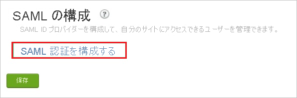
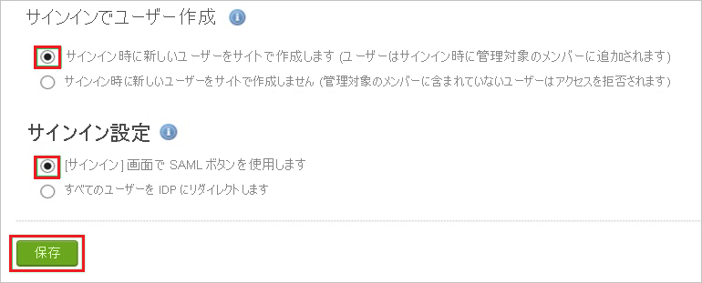

# チュートリアル: Azure AD SSO と Igloo Software の統合

このチュートリアルでは、Igloo Software と Azure Active Directory (Azure AD) を統合する方法について説明します。 Igloo Software を Azure AD と統合すると、次のことができます。

* Igloo Software にアクセスする Azure AD ユーザーを制御できます。
* ユーザーが自分の Azure AD アカウントを使用して Igloo Software に自動的にサインインできるように設定できます。
* 1 つの中央サイト (Azure Portal) で自分のアカウントを管理します。

## 前提条件

開始するには、次が必要です。

* Azure AD サブスクリプション。 サブスクリプションがない場合は、[無料アカウント](https://azure.microsoft.com/free/)を取得できます。
* シングル サインオン (SSO) 対応の Igloo Software サブスクリプション。

## シナリオの説明

このチュートリアルでは、テスト環境で Azure AD のシングル サインオンを構成してテストします。

* Igloo Software では、**SP** Initiated SSO がサポートされます。
* Igloo Software では、**Just In Time** ユーザー プロビジョニングがサポートされます。

## ギャラリーからの Igloo Software の追加

Azure AD への Igloo Software の統合を構成するには、ギャラリーから管理対象 SaaS アプリの一覧に Igloo Software を追加する必要があります。

1. 職場または学校アカウントか、個人の Microsoft アカウントを使用して、Azure portal にサインインします。
1. 左のナビゲーション ウィンドウで **[Azure Active Directory]** サービスを選択します。
1. **[エンタープライズ アプリケーション]** に移動し、 **[すべてのアプリケーション]** を選択します。
1. 新しいアプリケーションを追加するには、 **[新しいアプリケーション]** を選択します。
1. **[ギャラリーから追加する]** セクションで、検索ボックスに「**Igloo Software**」と入力します。
1. 結果のパネルから **Igloo Software** を選択し、アプリを追加します。 お使いのテナントにアプリが追加されるのを数秒待機します。

## Igloo Software のための Azure AD SSO の構成とテスト

**B.Simon** というテスト ユーザーを使用して、Igloo Software 用に Azure AD SSO を構成してテストします。 SSO が機能するためには、Azure AD ユーザーと Igloo Software の関連ユーザーとの間にリンク関係を確立する必要があります。

Igloo Software 用に Azure AD SSO を構成してテストするには、次の手順に従います。

1. **[Azure AD SSO の構成](#configure-azure-ad-sso)** - ユーザーがこの機能を使用できるようにします。
    1. **[Azure AD のテスト ユーザーの作成](#create-an-azure-ad-test-user)** - B.Simon で Azure AD のシングル サインオンをテストします。
    1. **[Azure AD テスト ユーザーの割り当て](#assign-the-azure-ad-test-user)** - B.Simon が Azure AD シングル サインオンを使用できるようにします。
1. **[Igloo Software SSO の構成](#configure-igloo-software-sso)** - アプリケーション側でシングル サインオン設定を構成します。
    1. **[Igloo Software テスト ユーザーの作成](#create-igloo-software-test-user)** - Igloo Software で B.Simon に対応するユーザーを作成し、Azure AD の B.Simon にリンクさせます。
1. **[SSO のテスト](#test-sso)** - 構成が機能するかどうかを確認します。

## Azure AD SSO の構成

これらの手順に従って、Azure portal で Azure AD SSO を有効にします。

1. Azure portal の **Igloo Software** アプリケーション統合ページで、 **[管理]** セクションを見つけて、 **[シングル サインオン]** を選択します。
1. **[シングル サインオン方式の選択]** ページで、 **[SAML]** を選択します。
1. **[SAML によるシングル サインオンのセットアップ]** ページで、 **[基本的な SAML 構成]** の鉛筆アイコンをクリックして設定を編集します。

   

4. **[基本的な SAML 構成]** セクションで、次の手順を実行します。

    a. **[識別子]** ボックスに、`https://<company name>.igloocommmunities.com/saml.digest` という形式で URL を入力します。

    b. **[応答 URL]** ボックスに、`https://<company name>.igloocommmunities.com/saml.digest` のパターンを使用して URL を入力します
    
    c. **[サインオン URL]** ボックスに、`https://<company name>.igloocommmunities.com` という形式で URL を入力します。

    > [!NOTE]
    > これらは実際の値ではありません。 これらの値は、実際の識別子、応答 URL、サインオン URL で更新してください。 これらの値を取得するには、[Igloo Software クライアント サポート チーム](https://www.igloosoftware.com/services/support)に問い合わせてください。 Azure portal の **[基本的な SAML 構成]** セクションに示されているパターンを参照することもできます。

5. **[SAML でシングル サインオンをセットアップします]** ページの **[SAML 署名証明書]** セクションで、 **[ダウンロード]** をクリックして要件のとおりに指定したオプションからの **証明書 (Base64)** をダウンロードして、お使いのコンピューターに保存します。

    

6. **[Igloo Software のセットアップ]** セクションで、要件に従って適切な URL をコピーします。

    

### Azure AD のテスト ユーザーの作成

このセクションでは、Azure portal 内で B.Simon というテスト ユーザーを作成します。

1. Azure portal の左側のウィンドウから、 **[Azure Active Directory]** 、 **[ユーザー]** 、 **[すべてのユーザー]** の順に選択します。
1. 画面の上部にある **[新しいユーザー]** を選択します。
1. **[ユーザー]** プロパティで、以下の手順を実行します。
   1. **[名前]** フィールドに「`B.Simon`」と入力します。  
   1. **[ユーザー名]** フィールドに「username@companydomain.extension」と入力します。 たとえば、「 `B.Simon@contoso.com` 」のように入力します。
   1. **[パスワードを表示]** チェック ボックスをオンにし、 **[パスワード]** ボックスに表示された値を書き留めます。
   1. **Create** をクリックしてください。

### Azure AD テスト ユーザーの割り当て

このセクションでは、B.Simon に Igloo Software へのアクセスを許可することで、このユーザーが Azure シングル サインオンを使用できるようにします。

1. Azure portal で **[エンタープライズ アプリケーション]** を選択し、 **[すべてのアプリケーション]** を選択します。
1. アプリケーションの一覧で **[Igloo Software]** を選択します。
1. アプリの概要ページで、 **[管理]** セクションを見つけて、 **[ユーザーとグループ]** を選択します。
1. **[ユーザーの追加]** を選択し、 **[割り当ての追加]** ダイアログで **[ユーザーとグループ]** を選択します。
1. **[ユーザーとグループ]** ダイアログの [ユーザー] の一覧から **[B.Simon]** を選択し、画面の下部にある **[選択]** ボタンをクリックします。
1. ユーザーにロールが割り当てられることが想定される場合は、 **[ロールの選択]** ドロップダウンからそれを選択できます。 このアプリに対してロールが設定されていない場合は、[既定のアクセス] ロールが選択されていることを確認します。
1. **[割り当ての追加]** ダイアログで、 **[割り当て]** をクリックします。

## Igloo Software SSO の構成

1. 別の Web ブラウザーのウィンドウで、管理者として Igloo Software 企業サイトにログインします。

2. [**コントロール パネル**] に移動します。

     

3. [**メンバーシップ**] タブで、[**サイン イン設定**] をクリックします。

    ![[サインインの設定]](./media/igloo-software-tutorial/resource.png "[サインインの設定]")

4. [SAML 構成] セクションで、[**SAML 認証を構成する**] をクリックします。

    

5. [**一般構成**] セクションで、次の手順を実行します。

    ![[全般構成]](./media/igloo-software-tutorial/certificate.png "[全般構成]")

    a. [**接続名**] テキスト ボックスに、構成の名前を入力します。

    b. **[IdP Login URL]\(IdP ログイン URL\)** ボックスに、Azure portal からコピーした **ログイン URL** の値を貼り付けます。

    c. **[IdP Logout URL]\(IdP ログアウト URL\)** ボックスに、Azure portal からコピーした **ログアウト URL** の値を貼り付けます。

    d. **[POST]\(POST\)** として、**[Logout Response and Request HTTP Type]\(ログアウト応答と要求 HTTP のタイプ\)** を選択します。

    e. Azure Portal からダウンロードした **base-64** でエンコードされた証明書をメモ帳で開き、その内容をクリップボードにコピーしてから、それを **[Public Certificate]\(パブリック証明書\)** ボックスに貼り付けます。

6. [**応答と認証の構成**] で、次の手順を実行します。

    ![[応答および認証の構成]](./media/igloo-software-tutorial/response.png "[応答および認証の構成]")
  
    a. [**Id プロバイダー**] として [**Microsoft ADFS**] を選択します。

    b. [**識別子の型**] として [**電子メール アドレス**] を選択します。 

    c. [**電子メール属性**] テキスト ボックスに「**emailaddress**」と入力します。

    d. [**名属性**] テキスト ボックスに「**givenname**」を入力します。

    e. [**姓属性**] テキスト ボックスに「**surname**」を入力します。

7. 次の手順を実行して、構成を完成させます。

     

    a. [**サインインでのユーザー作成**] で [**サインイン時に新規ユーザーを作成**] を選択します。

    b. [**サインイン設定**] で [**サインイン画面で SAML ボタンを使用**] を選択します。

    c. **[保存]** をクリックします。

### Igloo Software のテスト ユーザーの作成

Igloo Software へのユーザー プロビジョニングを構成するときに必要な操作はありません。  

割り当てられたユーザーがアクセス パネルを使用して Igloo Software にログインしようとすると、そのユーザーが存在するかどうかが Igloo Software によって確認されます。  使用可能なユーザー アカウントがない場合、ユーザー アカウントは Igloo Software によって自動的に作成されます。

## SSO のテスト

このセクションでは、次のオプションを使用して Azure AD のシングル サインオン構成をテストします。 

* Azure portal で **[このアプリケーションをテストします]** をクリックします。 これにより、ログイン フローを開始できる Igloo Software のサインオン URL にリダイレクトされます。 

* Igloo Software のサインオン URL に直接移動し、そこからログイン フローを開始します。

* Microsoft マイ アプリを使用することができます。 マイ アプリで [Igloo Software] タイルをクリックすると、Igloo Software のサインオン URL にリダイレクトされます。 マイ アプリの詳細については、[マイ アプリの概要](../user-help/my-apps-portal-end-user-access.md)に関するページを参照してください。

## 次のステップ

Igloo Software を構成したら、組織の機密データを流出と侵入からリアルタイムで保護するセッション制御を適用することができます。 セッション制御は、条件付きアクセスを拡張したものです。 [Microsoft Defender for Cloud Apps でセッション制御を適用する方法をご覧ください](/cloud-app-security/proxy-deployment-aad)。
