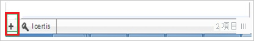

# チュートリアル: Azure AD SSO と ITRP の統合

このチュートリアルでは、ITRP と Azure Active Directory (Azure AD) を統合する方法について説明します。 Azure AD と ITRP を統合すると、次のことができます。

* ITRP にアクセスできる Azure AD ユーザーを制御する。
* ユーザーが自分の Azure AD アカウントを使用して ITRP に自動的にサインインできるようにする。
* 1 つの中央サイト (Azure Portal) で自分のアカウントを管理します。

## 前提条件

ITRP と Azure AD の統合を構成するには、以下が必要です。

* Azure AD サブスクリプション。 Azure AD の環境がない場合は、[無料アカウント](https://azure.microsoft.com/free/)を取得できます。
* シングル サインオンが有効な ITRP サブスクリプション。

## シナリオの説明

このチュートリアルでは、テスト環境で Azure AD のシングル サインオンを構成してテストします。

* ITRP では、SP Initiated SSO がサポートされます。

## ギャラリーからの ITRP の追加

Azure AD への ITRP の統合を構成するには、ギャラリーからマネージド SaaS アプリの一覧に ITRP を追加する必要があります。

1. 職場または学校アカウントか、個人の Microsoft アカウントを使用して、Azure portal にサインインします。
1. 左のナビゲーション ウィンドウで **[Azure Active Directory]** サービスを選択します。
1. **[エンタープライズ アプリケーション]** に移動し、 **[すべてのアプリケーション]** を選択します。
1. 新しいアプリケーションを追加するには、 **[新しいアプリケーション]** を選択します。
1. **[ギャラリーから追加する]** セクションで、検索ボックスに「**ITRP**」と入力します。
1. 結果パネルから **[ITRP]** を選択し、アプリを追加します。 お使いのテナントにアプリが追加されるのを数秒待機します。

## ITRP の Azure AD SSO の構成とテスト

**B.Simon** というテスト ユーザーを使用して、ITRP に対する Azure AD SSO を構成してテストします。 SSO を機能させるために、Azure AD ユーザーと ITRP の関連ユーザーとの間にリンク関係を確立する必要があります。

ITRP に対する Azure AD SSO を構成してテストするには、次の手順を行います。

1. **[Azure AD SSO の構成](#configure-azure-ad-sso)** - ユーザーがこの機能を使用できるようにします。
    1. **[Azure AD のテスト ユーザーの作成](#create-an-azure-ad-test-user)** - B.Simon で Azure AD のシングル サインオンをテストします。
    1. **[Azure AD テスト ユーザーの割り当て](#assign-the-azure-ad-test-user)** - B.Simon が Azure AD シングル サインオンを使用できるようにします。
1. **[ITRP SSO の構成](#configure-itrp-sso)** - アプリケーション側でシングル サインオン設定を構成します。
    1. **[ITRP のテスト ユーザーの作成](#create-an-itrp-test-user)** - ITRP で B.Simon に対応するユーザーを作成し、Azure AD の Britta Simon にリンクさせます。
1. **[SSO のテスト](#test-sso)** - 構成が機能するかどうかを確認します。

## Azure AD SSO の構成

これらの手順に従って、Azure portal で Azure AD SSO を有効にします。

1. Azure portal の **ITRP** アプリケーション統合ページで、 **[管理]** セクションを見つけ、 **[シングル サインオン]** を選択します。
1. **[シングル サインオン方式の選択]** ページで、 **[SAML]** を選択します。
1. **[SAML によるシングル サインオンのセットアップ]** ページで、 **[基本的な SAML 構成]** の鉛筆アイコンをクリックして設定を編集します。

   

4. **[基本的な SAML 構成]** ダイアログ ボックスで、次の手順を実行します。

    1. **[識別子 (エンティティ ID)]** ボックスに、次のパターンで URL を入力します。

       `https://<tenant-name>.itrp.com`

    1. **[サインオン URL]** ボックスに、次のパターンを使用して URL を入力します。
    
       `https://<tenant-name>.itrp.com`   

    > [!NOTE]
    > これらの値はプレースホルダーです。 実際の識別子とサインオン URL を使用する必要があります。 この値を取得するには、[ITRP サポート チーム](https://www.4me.com/support/)に問い合わせてください。 また、Azure portal の **[基本的な SAML 構成]** ダイアログ ボックスに示されているパターンを参照することもできます。

5. **[SAML 署名証明書]** セクションで **[編集]** アイコンを選択して、 **[SAML 署名証明書]** ダイアログ ボックスを開きます。

    ![[編集] アイコンが選択されている [SAML 署名証明書] ページを示すスクリーンショット。](common/edit-certificate.png)

6. **[SAML 署名証明書]** ダイアログ ボックスで、証明書の **[拇印]** の値をコピーして保存します。

    

7. **[Set up ITRP]\(ITRP の設定\)** セクションで、要件に基づいて適切な URL をコピーします。

    

### Azure AD のテスト ユーザーの作成

このセクションでは、Azure portal 内で B.Simon というテスト ユーザーを作成します。

1. Azure portal の左側のウィンドウから、 **[Azure Active Directory]** 、 **[ユーザー]** 、 **[すべてのユーザー]** の順に選択します。
1. 画面の上部にある **[新しいユーザー]** を選択します。
1. **[ユーザー]** プロパティで、以下の手順を実行します。
   1. **[名前]** フィールドに「`B.Simon`」と入力します。  
   1. **[ユーザー名]** フィールドに「username@companydomain.extension」と入力します。 たとえば、「 `B.Simon@contoso.com` 」のように入力します。
   1. **[パスワードを表示]** チェック ボックスをオンにし、 **[パスワード]** ボックスに表示された値を書き留めます。
   1. **Create** をクリックしてください。

### Azure AD テスト ユーザーの割り当て

このセクションでは、B.Simon に ITRP へのアクセスを許可することで、このユーザーが Azure シングル サインオンを使用できるようにします。

1. Azure portal で **[エンタープライズ アプリケーション]** を選択し、 **[すべてのアプリケーション]** を選択します。
1. アプリケーションの一覧で **[ITRP]\(ITRP\)** を選択します。
1. アプリの概要ページで、 **[管理]** セクションを見つけて、 **[ユーザーとグループ]** を選択します。
1. **[ユーザーの追加]** を選択し、 **[割り当ての追加]** ダイアログで **[ユーザーとグループ]** を選択します。
1. **[ユーザーとグループ]** ダイアログの [ユーザー] の一覧から **[B.Simon]** を選択し、画面の下部にある **[選択]** ボタンをクリックします。
1. ユーザーにロールが割り当てられることが想定される場合は、 **[ロールの選択]** ドロップダウンからそれを選択できます。 このアプリに対してロールが設定されていない場合は、[既定のアクセス] ロールが選択されていることを確認します。
1. **[割り当ての追加]** ダイアログで、 **[割り当て]** をクリックします。

## ITRP SSO の構成

1. 新しい Web ブラウザー ウィンドウで、ITRP 企業サイトに管理者としてサインインします。

1. ウィンドウの上部にある **[Settings]\(設定\)** アイコンを選択します。

    ![[設定] アイコン](./media/itrp-tutorial/profile.png "Settings icon")

1. 左側のウィンドウで、 **[Single Sign-On]\(シングル サインオン\)** を選択します。

    ![[Single Sign-On]\(シングル サインオン\) を選択します](./media/itrp-tutorial/setting.png "[シングル サインオン] の選択")

1. **[Single Sign-On]\(シングル サインオン\)** 構成セクションで、次の手順を実行します。

    ![[Enabled]\(有効\) が選択されている [Single Sign-On]\(シングル サインオン\) セクションを示すスクリーンショット。](./media/itrp-tutorial/configuration.png "[Single Sign-On]\(シングル サインオン\) セクション")

    ![この手順で説明されている情報を追加できる [Single Sign-On]\(シングル サインオン\) セクションを示すスクリーンショット。](./media/itrp-tutorial/certificate.png "[Single Sign-On]\(シングル サインオン\) セクション")

    1. **[Enabled]** を選択します。

    1. **[Remote logout URL]\(リモート ログアウト URL\)** ボックスに、Azure portal からコピーした **[ログアウト URL]** の値を貼り付けます。

    1. **[SAML SSO URL]** ボックスに、Azure portal からコピーした **[ログイン URL]** の値を貼り付けます。

    1. **[Certificate Fingerprint]\(証明書のフィンガープリント\)** ボックスに、Azure portal からコピーした証明書の **[拇印]** の値を貼り付けます。

    1. **[保存]** を選択します。

### ITRP のテスト ユーザーの作成

Azure AD ユーザーが ITRP にサインインできるようにするには、そのユーザーを ITRP に追加する必要があります。 手動で追加する必要があります。

ユーザー アカウントを作成するには、以下の手順に従います。

1. ITRP テナントにサインインします。

1. ウィンドウの上部にある **[Records]\(記録\)** アイコンを選択します。

    ![[Records]\(記録\) アイコン](./media/itrp-tutorial/account.png "[Records]\(記録\) アイコン")

1. メニューで **[People]\(ユーザー\)** を選択します。

    ![[People]\(ユーザー\) を選択します](./media/itrp-tutorial/user.png "[People]\(ユーザー\) を選択します")

1. プラス記号 ( **+** ) を選択して、新しいユーザーを追加します。

    

1. **[Add New Person]\(新しいユーザーの追加\)** ダイアログ ボックスで、次の手順を実行します。

    ![[Add New Person]\(新しいユーザーの追加\) ダイアログ ボックス](./media/itrp-tutorial/details.png "[Add New Person]\(新しいユーザーの追加\) ダイアログ ボックス")

    1. 追加する有効な Azure AD アカウントの名前とメール アドレスを入力します。

    1. **[保存]** を選択します。

> [!NOTE]
> ITRP から提供されているユーザー アカウント作成ツールまたは API を使用して、Azure AD ユーザー アカウントをプロビジョニングできます。

## SSO のテスト

このセクションでは、次のオプションを使用して Azure AD のシングル サインオン構成をテストします。 

* Azure portal で **[このアプリケーションをテストします]** をクリックします。 これにより、ログイン フローを開始できる ITRP のサインオン URL にリダイレクトされます。 

* ITRP のサインオン URL に直接移動し、そこからログイン フローを開始します。

* Microsoft マイ アプリを使用することができます。 マイ アプリで [ITRP] タイルをクリックすると、ITRP のサインオン URL にリダイレクトされます。 マイ アプリの詳細については、[マイ アプリの概要](../user-help/my-apps-portal-end-user-access.md)に関するページを参照してください。

## 次のステップ

ITRP を構成したら、組織の機密データを流出と侵入からリアルタイムで保護するセッション制御を適用できます。 セッション制御は、条件付きアクセスを拡張したものです。 [Microsoft Defender for Cloud Apps でセッション制御を強制する方法](/cloud-app-security/proxy-deployment-aad)をご覧ください。
