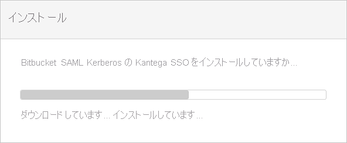
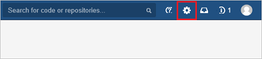

# チュートリアル: Azure AD SSO と Kantega SSO for Bitbucket の統合

このチュートリアルでは、Kantega SSO for Bitbucket と Azure Active Directory (Azure AD) を統合する方法について説明します。 Azure AD と Kantega SSO for Bitbucket を統合すると、次のことができます。

* Kantega SSO for Bitbucket にアクセスできるユーザーを Azure AD で制御する。
* ユーザーが自分の Azure AD アカウントを使用して Kantega SSO for Bitbucket に自動的にサインインできるように設定する。
* 1 つの中央サイト (Azure Portal) で自分のアカウントを管理します。

## 前提条件

Kantega SSO for Bitbucket と Azure AD の統合を構成するには、次のものが必要です。

* Azure AD サブスクリプション。 Azure AD の環境がない場合は、[無料アカウント](https://azure.microsoft.com/free/)を取得できます。
* Kantega SSO for Bitbucket でのシングル サインオンが有効なサブスクリプション

## シナリオの説明

このチュートリアルでは、テスト環境で Azure AD のシングル サインオンを構成してテストします。

* Kantega SSO for Bitbucket では、**SP および IDP** Initiated SSO がサポートされます

## ギャラリーからの Kantega SSO for Bitbucket の追加

Azure AD への Kantega SSO for Bitbucket の統合を構成するには、ギャラリーから管理対象 SaaS アプリの一覧に Kantega SSO for Bitbucket を追加する必要があります。

1. 職場または学校アカウントか、個人の Microsoft アカウントを使用して、Azure portal にサインインします。
1. 左のナビゲーション ウィンドウで **[Azure Active Directory]** サービスを選択します。
1. **[エンタープライズ アプリケーション]** に移動し、 **[すべてのアプリケーション]** を選択します。
1. 新しいアプリケーションを追加するには、 **[新しいアプリケーション]** を選択します。
1. [**ギャラリーから追加する]** セクションで、検索ボックスに「**Kantega SSO for Bitbucket**」と入力します。
1. 結果パネルから **[Kantega SSO for Bitbucket]** を選択し、アプリを追加します。 お使いのテナントにアプリが追加されるのを数秒待機します。

## Kantega SSO for Bitbucket に対する Azure AD SSO の構成とテスト

**B.Simon** というテスト ユーザーを使用して、Kantega SSO for Bitbucket に対する Azure AD SSO を構成してテストします。 SSO が機能するためには、Azure AD ユーザーと Kantega SSO for Bitbucket の関連ユーザーとの間にリンク関係を確立する必要があります。

Kantega SSO for Bitbucket に対して Azure AD SSO を構成してテストするには、次の手順に従います。

1. **[Azure AD SSO の構成](#configure-azure-ad-sso)** - ユーザーがこの機能を使用できるようにします。
    1. **[Azure AD のテスト ユーザーの作成](#create-an-azure-ad-test-user)** - B.Simon で Azure AD のシングル サインオンをテストします。
    1. **[Azure AD テスト ユーザーの割り当て](#assign-the-azure-ad-test-user)** - B.Simon が Azure AD シングル サインオンを使用できるようにします。
1. **[Kantega SSO for Bitbucket の SSO の構成](#configure-kantega-sso-for-bitbucket-sso)** - アプリケーション側でシングル サインオン設定を構成します。
    1. **[Kantega SSO for Bitbucket のテスト ユーザーの作成](#create-kantega-sso-for-bitbucket-test-user)** - Kantega SSO for Bitbucket で B.Simon に対応するユーザーを作成し、Azure AD のそのユーザーにリンクさせます。
1. **[SSO のテスト](#test-sso)** - 構成が機能するかどうかを確認します。

## Azure AD SSO の構成

これらの手順に従って、Azure portal で Azure AD SSO を有効にします。

1. Azure portal の **Kantega SSO for Bitbucket** アプリケーション統合ページで、 **[管理]** セクションを探して、 **[シングル サインオン]** を選択します。
1. **[シングル サインオン方式の選択]** ページで、 **[SAML]** を選択します。
1. **[SAML によるシングル サインオンのセットアップ]** ページで、 **[基本的な SAML 構成]** の鉛筆アイコンをクリックして設定を編集します。

   

4. **[基本的な SAML 構成]** セクションで、アプリケーションを **IDP** 開始モードで構成する場合は、次の手順を実行します。

    a. **[識別子]** ボックスに、`https://<server-base-url>/plugins/servlet/no.kantega.saml/sp/<uniqueid>/login` の形式で URL を入力します。

    b. **[応答 URL]** ボックスに、`https://<server-base-url>/plugins/servlet/no.kantega.saml/sp/<uniqueid>/login` のパターンを使用して URL を入力します

5. アプリケーションを **SP** 開始モードで構成する場合は、 **[追加の URL を設定します]** をクリックして次の手順を実行します。

    **[サインオン URL]** ボックスに、`https://<server-base-url>/plugins/servlet/no.kantega.saml/sp/<uniqueid>/login` という形式で URL を入力します。

    > [!NOTE]
    > これらは実際の値ではありません。 実際の識別子、応答 URL、サインオン URL でこれらの値を更新します。 これらの値は Bitbucket プラグインの構成中に受け取ります (これについてはこのチュートリアルの後半で説明します)。

6. **[SAML でシングル サインオンをセットアップします]** ページの **[SAML 署名証明書]** セクションで、 **[ダウンロード]** をクリックして、要件のとおりに指定したオプションから **フェデレーション メタデータ XML** をダウンロードして、お使いのコンピューターに保存します。

    

7. **[Kantega SSO for Bitbucket のセットアップ]** セクションで、要件に従って適切な URL をコピーします。

    

### Azure AD のテスト ユーザーの作成

このセクションでは、Azure portal 内で B.Simon というテスト ユーザーを作成します。

1. Azure portal の左側のウィンドウから、 **[Azure Active Directory]** 、 **[ユーザー]** 、 **[すべてのユーザー]** の順に選択します。
1. 画面の上部にある **[新しいユーザー]** を選択します。
1. **[ユーザー]** プロパティで、以下の手順を実行します。
   1. **[名前]** フィールドに「`B.Simon`」と入力します。  
   1. **[ユーザー名]** フィールドに「username@companydomain.extension」と入力します。 たとえば、「 `B.Simon@contoso.com` 」のように入力します。
   1. **[パスワードを表示]** チェック ボックスをオンにし、 **[パスワード]** ボックスに表示された値を書き留めます。
   1. **Create** をクリックしてください。

### Azure AD テスト ユーザーの割り当て

このセクションでは、B.Simon に Kantega SSO for Bitbucket へのアクセスを許可して、Azure シングル サインオンを使用できるようにします。

1. Azure portal で **[エンタープライズ アプリケーション]** を選択し、 **[すべてのアプリケーション]** を選択します。
1. アプリケーションの一覧で、 **[Kantega SSO for Bitbucket]** を選択します。
1. アプリの概要ページで、 **[管理]** セクションを見つけて、 **[ユーザーとグループ]** を選択します。
1. **[ユーザーの追加]** を選択し、 **[割り当ての追加]** ダイアログで **[ユーザーとグループ]** を選択します。
1. **[ユーザーとグループ]** ダイアログの [ユーザー] の一覧から **[B.Simon]** を選択し、画面の下部にある **[選択]** ボタンをクリックします。
1. ユーザーにロールが割り当てられることが想定される場合は、 **[ロールの選択]** ドロップダウンからそれを選択できます。 このアプリに対してロールが設定されていない場合は、[既定のアクセス] ロールが選択されていることを確認します。
1. **[割り当ての追加]** ダイアログで、 **[割り当て]** をクリックします。

## Kantega SSO for Bitbucket の SSO の構成

1. 別の Web ブラウザー ウィンドウで、Bitbucket 管理者ポータルに管理者としてサインインします。

1. 歯車アイコンをクリックして、 **[Find new add-ons]\(新しいアドオンの検出\)** をクリックします。

    ![[Find new add-ons]\(新しいアドオンの検出\) が選択された [BitBucket Administration]\(BitBucket の管理\) を示すスクリーンショット。](./media/kantegassoforbitbucket-tutorial/admin.png)

1. **Kantega SSO for Bitbucket SAML & Kerberos** を検索し、 **[Install]\(インストール\)** ボタンをクリックして、新しい SAML プラグインをインストールします。

    ![インストールするためのオプションがある [Kantega SSO for Bitbucket SAML & Kerberos] を示すスクリーンショット。](./media/kantegassoforbitbucket-tutorial/menu.png)

1. プラグインのインストールが開始されます。

    

1. インストールが完了したら、 **[閉じる]** をクリックします。

    ![[Close]\(閉じる\) ボタンを示すスクリーンショット。](./media/kantegassoforbitbucket-tutorial/license.png)

1. **Manage** をクリックします。

    ![[Manage]\(管理\) ボタンを示すスクリーンショット。](./media/kantegassoforbitbucket-tutorial/integration.png)

1. **[Configure]\(構成\)** をクリックして、新しいプラグインを構成します。

    ![[Configure]\(構成\) が選択された [User-installed add-ons]\(ユーザーがインストールしたアドオン\) を示すスクリーンショット。](./media/kantegassoforbitbucket-tutorial/profile.png)

1. **[SAML]** セクションに移動します。 **[Add identity provider]\(ID プロバイダーの追加\)** ボックスで **[Azure Active Directory (Azure AD)]** を選択します。

    ![ID プロバイダーとして Azure A D が選択された [Kantega Single Sign-On]\(Kantega シングル サインオン\) を示すスクリーンショット。](./media/kantegassoforbitbucket-tutorial/azure.png)

1. サブスクリプション レベルは **[Basic]** を選択します。

    ![[Basic] が選択されている [Prepare Azure A D]\(Azure A D の準備\) を示すスクリーンショット。](./media/kantegassoforbitbucket-tutorial/subscription.png)

1. **[App properties]\(アプリのプロパティ\)** セクションで、次の手順を実行します。

    ![この手順の情報を指定できる [App properties]\(アプリのプロパティ\) セクションを示すスクリーンショット。](./media/kantegassoforbitbucket-tutorial/properties.png)

    a. **[アプリケーション ID/URI]** の値をコピーして、Azure portal の **[基本的な SAML 構成]** セクションで **識別子、応答 URL、サインオン URL** として使用します。

    b. **[次へ]** をクリックします。

1. **[Metadata import]\(メタデータのインポート\)** セクションで、次の手順を実行します。

    ![メタデータ ファイルに移動できる [Metadata import]\(メタデータのインポート\) セクションを示すスクリーンショット。](./media/kantegassoforbitbucket-tutorial/metadata.png)

    a. **[Metadata file on my computer]\(コンピューターにあるメタデータ ファイル\)** を選び、Azure Portal からダウンロードしたメタデータ ファイルをアップロードします。

    b. **[次へ]** をクリックします。

1. **[Name and SSO location]\(名前と SSO の場所\)** セクションで、次の手順を実行します。

    ![Azure A D が ID プロバイダー名である [Name and S S O location]\(名前と S S O の場所\) を示すスクリーンショット。](./media/kantegassoforbitbucket-tutorial/location.png)

    a. **[Identity provider name]\(ID プロバイダー名\)** ボックスに、ID プロバイダーの名前 (例: Azure AD) を追加します。

    b. **[次へ]** をクリックします。

1. 署名証明書を確認し、 **[Next]\(次へ\)** をクリックします。

    

1. **[Bitbucket user accounts]\(Bitbucket ユーザー アカウント\)** セクションで、次の手順を実行します。

    ![ユーザーを作成するためのオプションがある [BitBucket user accounts]\(BitBucket ユーザー アカウント\) を示すスクリーンショット。](./media/kantegassoforbitbucket-tutorial/accounts.png)

    a. **[Create users in Bitbucket's internal Directory if needed]\(必要に応じて Bitbucket の内部ディレクトリにユーザーを作成する\)** を選択して、ユーザー グループの適切な名前を入力します (グループはコンマで区切られた複数の番号 になる場合があります)。

    b. **[次へ]** をクリックします。

1. **[完了]** をクリックします。

    ![[Summary]\(概要\) ページを示すスクリーンショット。](./media/kantegassoforbitbucket-tutorial/groups.png)

1. **[Known domains for Azure AD]\(既知の Azure AD ドメイン\)** セクションで、次の手順を実行します。

    ![以下の手順を実行できる [Known domains for Azure A D]\(既知の Azure A D ドメイン\) を示すスクリーンショット。](./media/kantegassoforbitbucket-tutorial/domain.png)

    a. ページの左側のパネルにある **[Known domains]\(既知のドメイン\)** を選択します。

    b. **[Known domains]\(既知のドメイン\)** ボックスにドメイン名を入力します。

    c. **[保存]** をクリックします。

### Kantega SSO for Bitbucket のテスト ユーザーの作成

Azure AD ユーザーが Bitbucket にサインインできるようにするには、ユーザーを Bitbucket にプロビジョニングする必要があります。 Kantega SSO for Bitbucket の場合、プロビジョニング作業は手動で行うことになります。

**ユーザー アカウントをプロビジョニングするには、次の手順に従います。**

1. Bitbucket 企業サイトに管理者としてサインインします。

1. 設定アイコンをクリックします。

     

1. **[Administration]\(管理\)** タブ セクションで、 **[Users]\(ユーザー\)** をクリックします。

    ![[Users]\(ユーザー\) が選択された [BitBucket Administration]\(BitBucket の管理\) を示すスクリーンショット。 ](./media/kantegassoforbitbucket-tutorial/add-user.png)

1. **[Create user]\(ユーザーの作成\)** をクリックします。

    ![[Create user]\(ユーザーの作成\) が選択された [BitBucket Administration]\(BitBucket の管理\) を示すスクリーンショット。](./media/kantegassoforbitbucket-tutorial/create-user.png)     

1. **[Create User]\(ユーザーの作成\)** ダイアログ ページで、以下の手順を実行します。

    ![以下の手順を実行できる [Create user]\(ユーザーの作成\) ダイアログ ボックスを示すスクリーンショット。](./media/kantegassoforbitbucket-tutorial/details.png) 

    a. **[Username]\(ユーザー名\)** ボックスに、ユーザーの電子メール (Brittasimon@contoso.com など) を入力します。

    b. **[Full Name]\(フル ネーム\)** ボックスに、ユーザーの氏名 (Britta Simon など) を入力します。

    c. **[Email address]\(メール アドレス\)** ボックスに、ユーザーのメール アドレス (Brittasimon@contoso.com など) を入力します。

    d. **[Password]\(パスワード\)** ボックスに、ユーザーのパスワードを入力します。

    e. **[Confirm Password]\(パスワードの確認\)** ボックスに、ユーザーのパスワードを再入力します。

    f. **[Create user]\(ユーザーの作成\)** をクリックします。

## SSO のテスト

このセクションでは、次のオプションを使用して Azure AD のシングル サインオン構成をテストします。 

#### SP Initiated:

* Azure portal で **[このアプリケーションをテストします]** をクリックします。 これにより、ログイン フローを開始できる Kantega SSO for Bitbucket のサインオン URL にリダイレクトされます。  

* Kantega SSO for Bitbucket のサインオン URL に直接移動し、そこからログイン フローを開始します。

#### IDP Initiated:

* Azure portal で **[このアプリケーションをテストします]** をクリックすると、SSO を設定した Kantega SSO for Bitbucket に自動的にサインインします。 

また、Microsoft マイ アプリを使用して、任意のモードでアプリケーションをテストすることもできます。 マイ アプリで [Kantega SSO for BitBucket] タイルをクリックすると、SP モードで構成されている場合は、ログイン フローを開始するためのアプリケーション サインオン ページにリダイレクトされます。IDP モードで構成されている場合は、SSO を設定した Kantega SSO for Bitbucket に自動的にサインインします。 マイ アプリの詳細については、[マイ アプリの概要](../user-help/my-apps-portal-end-user-access.md)に関するページを参照してください。

## 次のステップ

Kantega SSO for Bitbucket を構成すると、組織の機密データを流出と侵入からリアルタイムで保護するセッション制御を適用できます。 セッション制御は、条件付きアクセスを拡張したものです。 [Microsoft Defender for Cloud Apps でセッション制御を強制する方法](/cloud-app-security/proxy-deployment-aad)をご覧ください。
