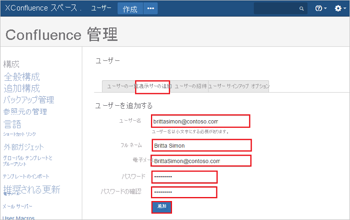

# チュートリアル: Azure AD SSO と Kantega SSO for Confluence の統合

このチュートリアルでは、Kantega SSO for Confluence と Azure Active Directory (Azure AD) を統合する方法について説明します。 Azure AD と Kantega SSO for Confluence を統合すると、次のことができます。

* Kantega SSO for Confluence にアクセスできるユーザーを Azure AD で制御できます。
* ユーザーが自分の Azure AD アカウントを使用して Kantega SSO for Confluence に自動的にサインインできるように設定できます。
* 1 つの中央サイト (Azure Portal) で自分のアカウントを管理します。

## 前提条件

Kantega SSO for Confluence と Azure AD の統合を構成するには、次のものが必要です。

* Azure AD サブスクリプション。 Azure AD の環境がない場合は、[無料アカウント](https://azure.microsoft.com/free/)を取得できます。
* Kantega SSO for Confluence でのシングル サインオンが有効なサブスクリプション。

## シナリオの説明

このチュートリアルでは、テスト環境で Azure AD のシングル サインオンを構成してテストします。

* Kantega SSO for Confluence では、**SP と IDP** Initiated SSO がサポートされます。

## ギャラリーから Kantega SSO for Confluence を追加する

Azure AD への Kantega SSO for Confluence の統合を構成するには、ギャラリーから管理対象 SaaS アプリの一覧に Kantega SSO for Confluence を追加する必要があります。

1. 職場または学校アカウントか、個人の Microsoft アカウントを使用して、Azure portal にサインインします。
1. 左のナビゲーション ウィンドウで **[Azure Active Directory]** サービスを選択します。
1. **[エンタープライズ アプリケーション]** に移動し、 **[すべてのアプリケーション]** を選択します。
1. 新しいアプリケーションを追加するには、 **[新しいアプリケーション]** を選択します。
1. **[ギャラリーから追加する]** セクションで、検索ボックスに「**Kantega SSO for Confluence**」と入力します。
1. 結果のパネルから **[Kantega SSO for Confluence]** を選択し、アプリを追加します。 お使いのテナントにアプリが追加されるのを数秒待機します。

## Kantega SSO for Confluence に対する Azure AD SSO の構成とテスト

**B.Simon** というテスト ユーザーを使用して、Kantega SSO for Confluence に対する Azure AD SSO を構成してテストします。 SSO が機能するためには、Azure AD ユーザーと Kantega SSO for Confluence の関連ユーザーとの間にリンク関係を確立する必要があります。

Kantega SSO for Confluence に対する Azure AD SSO を構成してテストするには、次の手順を実行します。

1. **[Azure AD SSO の構成](#configure-azure-ad-sso)** - ユーザーがこの機能を使用できるようにします。
    1. **[Azure AD のテスト ユーザーの作成](#create-an-azure-ad-test-user)** - B.Simon で Azure AD のシングル サインオンをテストします。
    1. **[Azure AD テスト ユーザーの割り当て](#assign-the-azure-ad-test-user)** - B.Simon が Azure AD シングル サインオンを使用できるようにします。
1. **[Kantega SSO for Confluence SSO の構成](#configure-kantega-sso-for-confluence-sso)** - アプリケーション側でシングル サインオン設定を構成します。
    1. **[Kantega SSO for Confluence のテスト ユーザーの作成](#create-kantega-sso-for-confluence-test-user)** - Kantega SSO for Confluence で B.Simon に対応するユーザーを作成し、Azure AD のそのユーザーにリンクさせます。
1. **[SSO のテスト](#test-sso)** - 構成が機能するかどうかを確認します。

## Azure AD SSO の構成

これらの手順に従って、Azure portal で Azure AD SSO を有効にします。

1. Azure portal の **Kantega SSO for Confluence** アプリケーション統合ページで、 **[管理]** セクションを見つけて、 **[シングル サインオン]** を選択します。
1. **[シングル サインオン方式の選択]** ページで、 **[SAML]** を選択します。
1. **[SAML によるシングル サインオンのセットアップ]** ページで、 **[基本的な SAML 構成]** の鉛筆アイコンをクリックして設定を編集します。

   

4. **[基本的な SAML 構成]** セクションで、アプリケーションを **IDP** 開始モードで構成する場合は、次の手順を実行します。

    a. **[識別子]** ボックスに、`https://<server-base-url>/plugins/servlet/no.kantega.saml/sp/<uniqueid>/login` の形式で URL を入力します。

    b. **[応答 URL]** ボックスに、`https://<server-base-url>/plugins/servlet/no.kantega.saml/sp/<uniqueid>/login` のパターンを使用して URL を入力します

5. アプリケーションを **SP** 開始モードで構成する場合は、 **[追加の URL を設定します]** をクリックして次の手順を実行します。

    **[サインオン URL]** ボックスに、`https://<server-base-url>/plugins/servlet/no.kantega.saml/sp/<uniqueid>/login` という形式で URL を入力します。

    > [!NOTE]
    > これらは実際の値ではありません。 実際の識別子、応答 URL、サインオン URL でこれらの値を更新します。 これらの値は Confluence プラグインの構成中に受け取ります (これについてはこのチュートリアルの後半で説明します)。

6. **[SAML でシングル サインオンをセットアップします]** ページの **[SAML 署名証明書]** セクションで、 **[ダウンロード]** をクリックして、要件のとおりに指定したオプションから **フェデレーション メタデータ XML** をダウンロードして、お使いのコンピューターに保存します。

    

7. **[Kantega SSO for Confluence のセットアップ]** セクションで、要件に従って適切な URL をコピーします。

    

### Azure AD のテスト ユーザーの作成

このセクションでは、Azure portal 内で B.Simon というテスト ユーザーを作成します。

1. Azure portal の左側のウィンドウから、 **[Azure Active Directory]** 、 **[ユーザー]** 、 **[すべてのユーザー]** の順に選択します。
1. 画面の上部にある **[新しいユーザー]** を選択します。
1. **[ユーザー]** プロパティで、以下の手順を実行します。
   1. **[名前]** フィールドに「`B.Simon`」と入力します。  
   1. **[ユーザー名]** フィールドに「username@companydomain.extension」と入力します。 たとえば、「 `B.Simon@contoso.com` 」のように入力します。
   1. **[パスワードを表示]** チェック ボックスをオンにし、 **[パスワード]** ボックスに表示された値を書き留めます。
   1. **Create** をクリックしてください。

### Azure AD テスト ユーザーの割り当て

このセクションでは、Kantega SSO for Confluence へのアクセスを許可して、B.Simon が Azure シングル サインオンを使用できるようにします。

1. Azure portal で **[エンタープライズ アプリケーション]** を選択し、 **[すべてのアプリケーション]** を選択します。
1. アプリケーションの一覧で、 **[Kantega SSO for Confluence]** を選択します。
1. アプリの概要ページで、 **[管理]** セクションを見つけて、 **[ユーザーとグループ]** を選択します。
1. **[ユーザーの追加]** を選択し、 **[割り当ての追加]** ダイアログで **[ユーザーとグループ]** を選択します。
1. **[ユーザーとグループ]** ダイアログの [ユーザー] の一覧から **[B.Simon]** を選択し、画面の下部にある **[選択]** ボタンをクリックします。
1. ユーザーにロールが割り当てられることが想定される場合は、 **[ロールの選択]** ドロップダウンからそれを選択できます。 このアプリに対してロールが設定されていない場合は、[既定のアクセス] ロールが選択されていることを確認します。
1. **[割り当ての追加]** ダイアログで、 **[割り当て]** をクリックします。

## Kantega SSO for Confluence SSO を構成する

1. 別の Web ブラウザー ウィンドウで、**Confluence 管理者ポータル** に管理者としてサインインします。

1. 歯車をポイントし、 **[Add-ons]\(アドオン\)** をクリックします。

    !["歯車" メニュー アイコンと [Add-ons]\(アドオン\) が選択されていることを示すスクリーンショット。](./media/kantegassoforconfluence-tutorial/settings.png)

1. **[ATLASSIAN MARKETPLACE]** タブで、 **[Find new add-ons]\(新しいアドオンの検索\)** をクリックします。

    ![[Find new add-ons]\(新しいアドオンの検索\) が選択されている [ATTLASSIAN MARKETPLACE] タブを示すスクリーンショット。](./media/kantegassoforconfluence-tutorial/admin.png)

1. **Kantega SSO for Confluence SAML Kerberos** を検索し、 **[Install]\(インストール\)** ボタンをクリックして、新しい SAML プラグインをインストールします。

    ![検索ボックスに [Kantega SSO for Confluence SAML Kerberos] があり、[インストール] ボタンが選択されている [Find new add-ons]\(新しいアドオンの検索\) ページを示すスクリーンショット。](./media/kantegassoforconfluence-tutorial/install-button.png)

1. プラグインのインストールが開始されます。

    ![プラグインの [Installing]\(インストール中\) 画面を示すスクリーンショット。](./media/kantegassoforconfluence-tutorial/plugin.png)

1. インストールが完了したら、 **[閉じる]** をクリックします。

    ![[閉じる] アクションが選択されている [Installed and ready to go]/(インストールされ、使用できるようになりました/) 画面を示すスクリーンショット。](./media/kantegassoforconfluence-tutorial/installation.png)

1. **Manage** をクリックします。

    ![[管理] ボタンが選択されている [Kantega Single Sign-on with Kerberos and SAML]\(Kerberos および SAML を使用した Kantega シングル サインオン\) プラグインを示すスクリーンショット。](./media/kantegassoforconfluence-tutorial/integration.png)

1. **[Configure]\(構成\)** をクリックして、新しいプラグインを構成します。

    ![[構成] ボタンが選択されている [Kantega Single Sign-on with Kerberos and SAML]\(Kerberos および SAML を使用した Kantega シングル サインオン\) ページを示すスクリーンショット。](./media/kantegassoforconfluence-tutorial/configuration.png)

1. この新しいプラグインは、 **[USERS & SECURITY]\(ユーザーとセキュリティ\)** タブにも表示されます。

    ![[Kantega Single Sign-on]\(Kantega シングル サインオン\) アクションが選択されている [USERS & SECURITY]\(ユーザーとセキュリティ\) タブを示すスクリーンショット。](./media/kantegassoforconfluence-tutorial/security.png)

1. **[SAML]** セクションに移動します。 **[Add identity provider]\(ID プロバイダーの追加\)** ボックスで **[Azure Active Directory (Azure AD)]** を選択します。

    ![[Add identity provider]\(ID プロバイダーの追加\) と [Azure Active Directory (Azure AD)] が選択されている [SAML] セクションを示すスクリーンショット。](./media/kantegassoforconfluence-tutorial/azure.png)

1. サブスクリプション レベルは **[Basic]** を選択します。

    ![[Basic] が選択されている [Preparing Azure AD]\(Azure AD の準備\) ページを示すスクリーンショット。](./media/kantegassoforconfluence-tutorial/subscription.png)

1. **[App properties]\(アプリのプロパティ\)** セクションで、次の手順を実行します。

    ![[アプリケーション ID/URI] フィールドと [コピー] ボタンが強調表示され、[次へ] ボタンが選択されている [App properties]\(アプリのプロパティ\) セクションを示すスクリーンショット。](./media/kantegassoforconfluence-tutorial/properties.png)

    a. **[アプリケーション ID/URI]** の値をコピーして、Azure portal の **[基本的な SAML 構成]** セクションで **識別子、応答 URL、サインオン URL** として使用します。

    b. **[次へ]** をクリックします。

1. **[Metadata import]\(メタデータのインポート\)** セクションで、次の手順を実行します。 

    ![[Metadata file on my computer]\(コンピューターにあるメタデータ ファイル\) が選択されている [Metadata import]\(メタデータのインポート\) セクションを示すスクリーンショット。](./media/kantegassoforconfluence-tutorial/metadata.png)

    a. **[Metadata file on my computer]\(コンピューターにあるメタデータ ファイル\)** を選び、Azure Portal からダウンロードしたメタデータ ファイルをアップロードします。

    b. **[次へ]** をクリックします。

1. **[Name and SSO location]\(名前と SSO の場所\)** セクションで、次の手順を実行します。

    ![[Identity provider name]\(ID プロバイダー名\) テキストボックスが強調表示され、[次へ] ボタンが選択されている [Name and SSO location]\(名前と SSO の場所\) を示すスクリーンショット。](./media/kantegassoforconfluence-tutorial/location.png)

    a. **[Identity provider name]\(ID プロバイダー名\)** ボックスに、ID プロバイダーの名前 (例: Azure AD) を追加します。

    b. **[次へ]** をクリックします。

1. 署名証明書を確認し、 **[Next]\(次へ\)** をクリックします。

    ![[次へ] ボタンが選択されている [Signature verification]\(署名の検証\) セクションを示すスクリーンショット。](./media/kantegassoforconfluence-tutorial/certificate.png)

1. **[Confluence user accounts]\(Confluence ユーザー アカウント\)** セクションで、次の手順を実行します。

    ![[Create users in Confluence's internal Directory if needed]\(必要に応じて Confluence の内部ディレクトリにユーザーを作成する\) オプションと [次へ] ボタンが選択されている [Confluence user accounts]\(Confluence ユーザー アカウント\) セクションを示すスクリーンショット。](./media/kantegassoforconfluence-tutorial/accounts.png)

    a. **[Create users in Confluence's internal Directory if needed]\(必要に応じて Confluence の内部ディレクトリにユーザーを作成する\)** を選択して、ユーザー グループの適切な名前を入力します (グループはコンマで区切られた複数の番号 になる場合があります)。

    b. **[次へ]** をクリックします。

1. **[完了]** をクリックします。

    ![[完了] ボタンが選択されている [概要] ページのスクリーンショット。](./media/kantegassoforconfluence-tutorial/summary.png)

1. **[Known domains for Azure AD]\(既知の Azure AD ドメイン\)** セクションで、次の手順を実行します。 

    ![[Known domains]\(既知のドメイン\) テキスト ボックスが強調表示され、[保存] ボタンが選択されている [Known domains for Azure AD]\(既知の Azure AD ドメイン\) ページを示すスクリーンショット。](./media/kantegassoforconfluence-tutorial/domain.png)

    a. ページの左側のパネルにある **[Known domains]\(既知のドメイン\)** を選択します。

    b. **[Known domains]\(既知のドメイン\)** ボックスにドメイン名を入力します。

    c. **[保存]** をクリックします。

### Kantega SSO for Confluence のテスト ユーザーの作成

Azure AD ユーザーが Confluence にサインインできるようにするには、そのユーザーを Confluence にプロビジョニングする必要があります。 Kantega SSO for Confluence の場合、プロビジョニングは手動で行います。

**ユーザー アカウントをプロビジョニングするには、次の手順に従います。**

1. Kantega SSO for Confluence 企業サイトに管理者としてサインインします。

1. 歯車をポイントし、 **[User management]\(ユーザー管理\)** をクリックします。

    !["歯車" アイコンと [User management]\(ユーザー管理\) が選択されていることを示すスクリーンショット。](./media/kantegassoforconfluence-tutorial/user-management.png)

1. [Users]\(ユーザー\) セクションで、 **[Add Users]\(ユーザーの追加\)** タブをクリックします。 **[Add a User]\(ユーザーの追加\)** ダイアログ ページで、次の手順に従います。

    

    a. **[Username]\(ユーザー名\)** ボックスに、ユーザーの電子メール (Brittasimon@contoso.com など) を入力します。

    b. **[Full Name]\(フル ネーム\)** ボックスに、ユーザーの氏名 (Britta Simon など) を入力します。

    c. **[Email]\(メール\)** ボックスに、ユーザーのメール アドレス (Brittasimon@contoso.com など) を入力します。

    d. **[Password]\(パスワード\)** ボックスに、ユーザーのパスワードを入力します。

    e. **[Confirm Password]\(パスワードの確認\)** をクリックし、パスワードを再入力します。

    f. **[追加]** ボタンをクリックします。

## SSO のテスト

このセクションでは、次のオプションを使用して Azure AD のシングル サインオン構成をテストします。 

#### SP Initiated:

* Azure portal で **[このアプリケーションをテストします]** をクリックします。 これにより、ログイン フローを開始できる Kantega SSO for Confluence のサインオン URL にリダイレクトされます。  

* Kantega SSO for Confluence のサインオン URL に直接移動し、そこからログイン フローを開始します。

#### IDP Initiated:

* Azure portal で **[このアプリケーションをテストします]** をクリックすると、SSO を設定した Kantega SSO for Confluence に自動的にサインインします。 

また、Microsoft マイ アプリを使用して、任意のモードでアプリケーションをテストすることもできます。 マイ アプリで [Kantega SSO for Confluence] タイルをクリックすると、SP モードで構成されている場合は、ログイン フローを開始するためのアプリケーション サインオン ページにリダイレクトされます。IDP モードで構成されている場合は、SSO を設定した Kantega SSO for Confluence に自動的にサインインします。 マイ アプリの詳細については、[マイ アプリの概要](../user-help/my-apps-portal-end-user-access.md)に関するページを参照してください。

## 次のステップ

Kantega SSO for Confluence を構成したら、組織の機密データを流出と侵入からリアルタイムで保護するセッション制御を適用できます。 セッション制御は、条件付きアクセスを拡張したものです。 [Microsoft Defender for Cloud Apps でセッション制御を強制する方法](/cloud-app-security/proxy-deployment-aad)をご覧ください。
