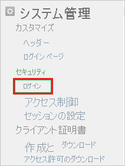
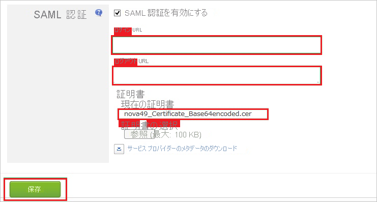

# チュートリアル: Azure AD SSO と Kintone の統合

このチュートリアルでは、Kintone と Azure Active Directory (Azure AD) を統合する方法について説明します。 Kintone と Azure AD を統合すると、次のことができます。

* Kintone にアクセスするユーザーを Azure AD で制御できます。
* ユーザーが自分の Azure AD アカウントを使用して Kintone に自動的にサインインできるように設定できます。
* 1 つの中央サイト (Azure Portal) で自分のアカウントを管理します。

## 前提条件

Kintone と Azure AD の統合を構成するには、次のものが必要です。

* Azure AD サブスクリプション。 Azure AD の環境がない場合は、[無料アカウント](https://azure.microsoft.com/free/)を取得できます。
* Kintone でのシングル サインオンが有効なサブスクリプション。

## シナリオの説明

このチュートリアルでは、テスト環境で Azure AD のシングル サインオンを構成してテストします。

* Kintone では、**SP** Initiated SSO がサポートされます。

## ギャラリーから Kintone を追加する

Azure AD への Kintone の統合を構成するには、ギャラリーから管理対象 SaaS アプリの一覧に Kintone を追加する必要があります。

1. 職場または学校アカウントか、個人の Microsoft アカウントを使用して、Azure portal にサインインします。
1. 左のナビゲーション ウィンドウで **[Azure Active Directory]** サービスを選択します。
1. **[エンタープライズ アプリケーション]** に移動し、 **[すべてのアプリケーション]** を選択します。
1. 新しいアプリケーションを追加するには、 **[新しいアプリケーション]** を選択します。
1. **[ギャラリーから追加する]** セクションで、検索ボックスに「**Kintone**」と入力します。
1. 結果のパネルから **[Kintone]** を選択し、アプリを追加します。 お使いのテナントにアプリが追加されるのを数秒待機します。

## Kintone のための Azure AD SSO の構成とテスト

**B.Simon** というテスト ユーザーを使用して、Kintone 用に Azure AD SSO を構成してテストします。 SSO が機能するためには、Azure AD ユーザーと Kintone の関連ユーザーとの間にリンク関係を確立する必要があります。

Kintone 用に Azure AD SSO を構成してテストするには、次の手順を実行します。

1. **[Azure AD SSO の構成](#configure-azure-ad-sso)** - ユーザーがこの機能を使用できるようにします。
    1. **[Azure AD のテスト ユーザーの作成](#create-an-azure-ad-test-user)** - B.Simon で Azure AD のシングル サインオンをテストします。
    1. **[Azure AD テスト ユーザーの割り当て](#assign-the-azure-ad-test-user)** - B.Simon が Azure AD シングル サインオンを使用できるようにします。
1. **[Kintone SSO の構成](#configure-kintone-sso)** - アプリケーション側でシングル サインオン設定を構成します。
    1. **[Kintone テスト ユーザーの作成](#create-kintone-test-user)** - Kintone で B.Simon に対応するユーザーを作成し、Azure AD の B.Simon にリンクさせます。
1. **[SSO のテスト](#test-sso)** - 構成が機能するかどうかを確認します。

## Azure AD SSO の構成

これらの手順に従って、Azure portal で Azure AD SSO を有効にします。

1. Azure portal の **Kintone** アプリケーション統合ページで、 **[管理]** セクションを探して、 **[シングル サインオン]** を選択します。
1. **[シングル サインオン方式の選択]** ページで、 **[SAML]** を選択します。
1. **[SAML によるシングル サインオンのセットアップ]** ページで、 **[基本的な SAML 構成]** の鉛筆アイコンをクリックして設定を編集します。

   

4. **[基本的な SAML 構成]** セクションで、次の手順を実行します。

    a. **[識別子 (エンティティ ID)]** ボックスに、次のいずれかのパターンを使用して URL を入力します。
    
   | **Identifier** |
   |---|
   | `https://<companyname>.cybozu.com` |
   | `https://<companyname>.kintone.com` |
    
    b. **[サインオン URL]** ボックスに、次のパターンを使用して URL を入力します。`https://<companyname>.kintone.com`

    > [!NOTE]
    > これらは実際の値ではありません。 これらの値を実際の識別子とサインオン URL で更新してください。 これらの値を取得するには、[Kintone クライアント サポート チーム](https://www.kintone.com/contact/)に問い合わせてください。 Azure portal の **[基本的な SAML 構成]** セクションに示されているパターンを参照することもできます。

5. **[SAML でシングル サインオンをセットアップします]** ページの **[SAML 署名証明書]** セクションで、 **[ダウンロード]** をクリックして要件のとおりに指定したオプションからの **証明書 (Base64)** をダウンロードして、お使いのコンピューターに保存します。

    

6. **[Kintone のセットアップ]** セクションで、要件のとおりに適切な URL をコピーします。

    

### Azure AD のテスト ユーザーの作成

このセクションでは、Azure portal 内で B.Simon というテスト ユーザーを作成します。

1. Azure portal の左側のウィンドウから、 **[Azure Active Directory]** 、 **[ユーザー]** 、 **[すべてのユーザー]** の順に選択します。
1. 画面の上部にある **[新しいユーザー]** を選択します。
1. **[ユーザー]** プロパティで、以下の手順を実行します。
   1. **[名前]** フィールドに「`B.Simon`」と入力します。  
   1. **[ユーザー名]** フィールドに「username@companydomain.extension」と入力します。 たとえば、「 `B.Simon@contoso.com` 」のように入力します。
   1. **[パスワードを表示]** チェック ボックスをオンにし、 **[パスワード]** ボックスに表示された値を書き留めます。
   1. **Create** をクリックしてください。

### Azure AD テスト ユーザーの割り当て

このセクションでは、B.Simon に Kintone へのアクセスを許可することで、Azure シングル サインオンを使用できるようにします。

1. Azure portal で **[エンタープライズ アプリケーション]** を選択し、 **[すべてのアプリケーション]** を選択します。
1. アプリケーションの一覧で **[Kintone]** を選択します。
1. アプリの概要ページで、 **[管理]** セクションを見つけて、 **[ユーザーとグループ]** を選択します。
1. **[ユーザーの追加]** を選択し、 **[割り当ての追加]** ダイアログで **[ユーザーとグループ]** を選択します。
1. **[ユーザーとグループ]** ダイアログの [ユーザー] の一覧から **[B.Simon]** を選択し、画面の下部にある **[選択]** ボタンをクリックします。
1. ユーザーにロールが割り当てられることが想定される場合は、 **[ロールの選択]** ドロップダウンからそれを選択できます。 このアプリに対してロールが設定されていない場合は、[既定のアクセス] ロールが選択されていることを確認します。
1. **[割り当ての追加]** ダイアログで、 **[割り当て]** をクリックします。

## Kintone SSO を構成する

1. 別の Web ブラウザーのウィンドウで、 **Kintone** の企業サイトに管理者としてサインインします。

1. **設定** アイコンをクリックします。

    ![[設定]](./media/kintone-tutorial/icon.png "設定")

1. **[ユーザーとシステム管理]** をクリックします。

    ![[ユーザーとシステム管理]](./media/kintone-tutorial/user.png "[ユーザーとシステム管理]")

1. **[システム管理] \> [セキュリティ]** で、 **[ログイン]** をクリックします。

    

1. **[SAML 認証を有効にする]** を選択します。

    ![[ユーザーとシステム管理] が選択されているスクリーンショット。](./media/kintone-tutorial/security.png "[SAML 認証]")

1. [SAML 承認] セクションで、次の手順に従います。

    

    a. **[ログイン URL]** テキスト ボックスに、Azure portal からコピーした **ログイン URL** の値を貼り付けます。

    b. **[ログアウト URL]** ボックスに、Azure portal からコピーした **ログアウト URL** の値を貼り付けます。

    c. Azure portal からダウンロードした証明書ファイルをアップロードするには、 **[参照]** をクリックします。

    d. **[保存]** をクリックします。

### Kintone テスト ユーザーの作成

Azure AD ユーザーが Kintone にサインインできるようにするには、そのユーザーを Kintone にプロビジョニングする必要があります。 Kintone の場合、プロビジョニングは手動で行います。

### ユーザー アカウントをプロビジョニングするには、次の手順を実行します。

1. **Kintone** の企業サイトに管理者としてサインインします。

1. **設定** アイコンをクリックします。

    ![[設定]](./media/kintone-tutorial/icon.png "設定")

1. **[ユーザーとシステム管理]** をクリックします。

    ![[ユーザーとシステム管理]](./media/kintone-tutorial/user.png "ユーザーとシステム管理")

1. **[ユーザー管理]** で、 **[Departments & Users (部門とユーザー)]** をクリックします。

    ![[Department & Users]\(部門とユーザー\)](./media/kintone-tutorial/services.png "部門とユーザー")

1. **[新しいユーザー]** をクリックします。

    ![[New User]\(新しいユーザー\) アクションが選択されている [Users]\(ユーザー\) セクションを示すスクリーンショット。](./media/kintone-tutorial/status.png "新しいユーザー")

1. **[新しいユーザー]** セクションで、次の手順に従います。

    ![[新しいユーザー]](./media/kintone-tutorial/details.png "新しいユーザー")

    a. プロビジョニングする有効な Azure AD アカウントの **表示名**、**ログイン名**、**新しいパスワード**、**パスワードの確認**、**メール アドレス**、その他の詳細を該当するボックスに入力します。

    b. **[保存]** をクリックします。

> [!NOTE]
> 他の Kintone ユーザー アカウント作成ツールや、Kintone から提供されている API を使用して、Azure AD ユーザー アカウントをプロビジョニングできます。

## SSO のテスト

このセクションでは、次のオプションを使用して Azure AD のシングル サインオン構成をテストします。 

* Azure portal で **[このアプリケーションをテストします]** をクリックします。 これにより、ログイン フローを開始できる Kintone のサインオン URL にリダイレクトされます。 

* Kintone のサインオン URL に直接移動し、そこからログイン フローを開始します。

* Microsoft マイ アプリを使用することができます。 マイ アプリで [Kintone] タイルをクリックすると、Kintone のサインオン URL にリダイレクトされます。 マイ アプリの詳細については、[マイ アプリの概要](../user-help/my-apps-portal-end-user-access.md)に関するページを参照してください。

## 次のステップ

Kintone を構成すると、組織の機密データを流出と侵入からリアルタイムで保護するセッション制御を適用できます。 セッション制御は、条件付きアクセスを拡張したものです。 [Microsoft Defender for Cloud Apps でセッション制御を強制する方法](/cloud-app-security/proxy-deployment-aad)をご覧ください。
