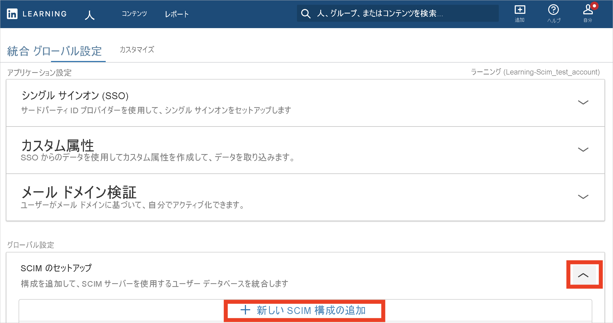
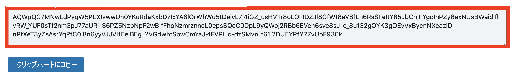

# チュートリアル: LinkedIn Learning を構成し、自動ユーザー プロビジョニングに対応させる

このチュートリアルでは、自動ユーザー プロビジョニングを構成するために LinkedIn Learning と Azure Active Directory (Azure AD) の両方で行う必要がある手順について説明します。 構成すると、Azure AD では、Azure AD プロビジョニング サービスを使用して、[LinkedIn Learning](https://learning.linkedin.com/) に対するユーザーとグループのプロビジョニングおよびプロビジョニング解除が自動的に行われます。 このサービスが実行する内容、しくみ、よく寄せられる質問の重要な詳細については、「[Azure Active Directory による SaaS アプリへのユーザー プロビジョニングとプロビジョニング解除の自動化](../app-provisioning/user-provisioning.md)」を参照してください。 

## サポートされる機能
> [!div class="checklist"]
> * LinkedIn Learning でユーザーを作成する
> * アクセスが不要になった場合に LinkedIn Learning のユーザーを削除する
> * Azure AD と LinkedIn Learning の間でユーザー属性の同期を維持する
> * LinkedIn Learning でグループとグループ メンバーシップをプロビジョニングする
> * LinkedIn Learning に[シングルサインオン](linkedinlearning-tutorial.md)する (推奨)

## 前提条件

このチュートリアルで説明するシナリオでは、次の前提条件目があることを前提としています。

* [Azure AD テナント](../develop/quickstart-create-new-tenant.md) 
* プロビジョニングを構成するための[アクセス許可](../roles/permissions-reference.md)を持つ Azure AD のユーザー アカウント (アプリケーション管理者、クラウド アプリケーション管理者、アプリケーション所有者、グローバル管理者など)。 
* LinkedIn Learning で有効な承認と SCIM (電子メールで連絡)。

## 手順 1. プロビジョニングのデプロイを計画する
1. [プロビジョニング サービスのしくみ](../app-provisioning/user-provisioning.md)を確認します。
2. [プロビジョニングの対象](../app-provisioning/define-conditional-rules-for-provisioning-user-accounts.md)となるユーザーを決定します。
3. [Azure AD と LinkedIn Learning の間でマップする](../app-provisioning/customize-application-attributes.md)データを決定します。 

## 手順 2. Azure AD でプロビジョニングがサポートされるように LinkedIn Learning を構成する
1. [[LinkedIn Learning 設定]](https://www.linkedin.com/learning-admin/settings/global) にサインインします。 **[SCIM セットアップ]** 、 **[新しい SCIM 構成の追加]** の順に選択します。

   

2. 構成の名前を入力し、 **[ライセンスの自動割り当て]** を [オン] に設定します。 次に、 **[トークンの生成]** をクリックします。

   

3. 構成が作成されたら、**アクセス トークン** を生成する必要があります。 後で使用するためにコピーしておいてください。

   

4. 既存の構成を再発行することも (新しいトークンが生成されます)、削除することもできます。

## 手順 3. Azure AD アプリケーション ギャラリーから LinkedIn Learning を追加する

Azure AD アプリケーション ギャラリーから LinkedIn Learning を追加して、LinkedIn Learning へのプロビジョニングの管理を開始します。 SSO のために LinkedIn Learning を以前に設定している場合は、その同じアプリケーションを使用することができます。 ただし、統合を初めてテストするときは、別のアプリを作成することをお勧めします。 ギャラリーからアプリケーションを追加する方法の詳細については、[こちら](../manage-apps/add-application-portal.md)を参照してください。 

## 手順 4. プロビジョニングの対象となるユーザーを定義する 

Azure AD プロビジョニング サービスを使用すると、アプリケーションへの割り当て、ユーザーまたはグループの属性に基づいてプロビジョニングされるユーザーのスコープを設定できます。 割り当てに基づいてアプリにプロビジョニングされるユーザーのスコープを設定する場合、以下の[手順](../manage-apps/assign-user-or-group-access-portal.md)を使用して、ユーザーとグループをアプリケーションに割り当てることができます。 ユーザーまたはグループの属性のみに基づいてプロビジョニングされるユーザーのスコープを設定する場合、[こちら](../app-provisioning/define-conditional-rules-for-provisioning-user-accounts.md)で説明されているスコープ フィルターを使用できます。 

* LinkedIn Learning にユーザーとグループを割り当てるときは、**既定のアクセス** 以外のロールを選択する必要があります。 既定のアクセス ロールを持つユーザーは、プロビジョニングから除外され、プロビジョニング ログで実質的に資格がないとマークされます。 アプリケーションで使用できる唯一のロールが既定のアクセス ロールである場合は、[アプリケーション マニフェストを更新](../develop/howto-add-app-roles-in-azure-ad-apps.md)してロールを追加することができます。 

* 小さいところから始めましょう。 全員にロールアウトする前に、少数のユーザーとグループでテストします。 プロビジョニングのスコープが割り当て済みユーザーとグループに設定される場合、これを制御するには、1 つまたは 2 つのユーザーまたはグループをアプリに割り当てます。 スコープがすべてのユーザーとグループに設定されている場合は、[属性ベースのスコープ フィルター](../app-provisioning/define-conditional-rules-for-provisioning-user-accounts.md)を指定できます。 

## 手順 5. LinkedIn Learning への自動ユーザー プロビジョニングを構成する 

このセクションでは、Azure AD でのユーザー、グループ、またはその両方の割り当てに基づいて、TestApp でユーザー、グループ、またはその両方が作成、更新、および無効化されるように Azure AD プロビジョニング サービスを構成する手順について説明します。

### Azure AD で LinkedIn Learning の自動ユーザー プロビジョニングを構成する方法:

1. [Azure portal](https://portal.azure.com) にサインインします。 **[エンタープライズ アプリケーション]** を選択し、 **[すべてのアプリケーション]** を選択します。

    ![[エンタープライズ アプリケーション] ブレード](common/enterprise-applications.png)

2. アプリケーションの一覧で **[LinkedIn Learning]** を選択します。

    

3. **[プロビジョニング]** タブを選択します。

    ![[プロビジョニング] オプションが強調表示された [管理] オプションのスクリーンショット。](common/provisioning.png)

4. **[プロビジョニング モード]** を **[自動]** に設定します。

    ![[自動] オプションが強調表示された [プロビジョニング モード] ドロップダウン リストのスクリーンショット。](common/provisioning-automatic.png)

5. **[管理者資格情報]** セクションの **[テナントの URL]** に「`https://api.linkedin.com/scim`」と入力します。 以前に取得したシークレット トークンの値を **[シークレット トークン]** に入力します。 **[接続テスト]** をクリックして、Azure AD から LinkedIn Learning に接続できることを確認します。 接続できない場合は、使用中の LinkedIn Learning アカウントに管理者アクセス許可があることを確認してから、もう一度試します。

    ![テナント URL とシークレット トークンを入力できる場所である [管理者資格情報] ダイアログ ボックスを示すスクリーンショット。](./media/linkedin-learning-provisioning-tutorial/provisioning.png)

6. **[通知用メール]** フィールドに、プロビジョニングのエラー通知を受け取るユーザーまたはグループの電子メール アドレスを入力して、 **[エラーが発生したときにメール通知を送信します]** チェック ボックスをオンにします。

    

7. **[保存]** を選択します。

8. **[マッピング]** セクションの **[Provision Azure Active Directory Users]\(Azure Active Directory ユーザーをプロビジョニングする\)** を選択します。

9. **[属性マッピング]** セクションで、Azure AD から LinkedIn Learning に同期されるユーザー属性を確認します。 **[Matching]\(照合\)** プロパティとして選択されている属性は、更新処理で LinkedIn Learning のユーザー アカウントとの照合に使用されます。 [一致する対象の属性](../app-provisioning/customize-application-attributes.md)を変更する場合は、その属性に基づいたユーザーのフィルター処理が確実に LinkedIn Learning API でサポートされているようにする必要があります。 **[保存]** ボタンをクリックして変更をコミットします。

   |属性|Type|フィルター処理のサポート|
   |---|---|---|
   |externalId|String|&check;|
   |userName|String|
   |name.givenName|String|
   |name.familyName|String|
   |displayName|String|
   |addresses[type eq "work"].locality|String|
   |title|String|
   |emails[type eq "work"].value|String|
   |urn:ietf:params:scim:schemas:extension:enterprise:2.0:User:manager|リファレンス|
   |urn:ietf:params:scim:schemas:extension:enterprise:2.0:User:department|String|

10. **[マッピング]** セクションの **[Provision Azure Active Directory Groups]\(Azure Active Directory グループをプロビジョニングする\)** を選択します。

11. **[属性マッピング]** セクションで、Azure AD から LinkedIn Learning に同期されるグループ属性を確認します。 **[Matching]\(照合\)** プロパティとして選択されている属性は、更新処理で LinkedIn Learning のグループとの照合に使用されます。 **[保存]** ボタンをクリックして変更をコミットします。

    |属性|Type|フィルター処理のサポート|
    |---|---|---|
    |displayName|String|&check;|
    |members|リファレンス|
    |externalId|String|

12. スコープ フィルターを構成するには、[スコープ フィルターのチュートリアル](../app-provisioning/define-conditional-rules-for-provisioning-user-accounts.md)の次の手順を参照してください。

13. LinkedIn Learning で Azure AD プロビジョニング サービスを有効にするには、 **[設定]** セクションで **[プロビジョニング状態]** を **[オン]** に変更します。

    ![プロビジョニングの状態を [オン] に切り替える](common/provisioning-toggle-on.png)

14. **[設定]** セクションの **[スコープ]** で目的の値を選択して、LinkedIn Learning にプロビジョニングするユーザーやグループを定義します。

    

15. プロビジョニングの準備ができたら、 **[保存]** をクリックします。

    

この操作により、 **[設定]** セクションの **[スコープ]** で定義したすべてのユーザーとグループの初期同期サイクルが開始されます。 初期サイクルは後続の同期よりも実行に時間がかかります。後続のサイクルは、Azure AD のプロビジョニング サービスが実行されている限り約 40 分ごとに実行されます。 

## 手順 6. デプロイを監視する
プロビジョニングを構成したら、次のリソースを使用してデプロイを監視します。

1. [プロビジョニング ログ](../reports-monitoring/concept-provisioning-logs.md)を使用して、正常にプロビジョニングされたユーザーと失敗したユーザーを特定します。
2. [進行状況バー](../app-provisioning/application-provisioning-when-will-provisioning-finish-specific-user.md)を確認して、プロビジョニング サイクルの状態と完了までの時間を確認します。
3. プロビジョニング構成が異常な状態になったと考えられる場合、アプリケーションは検疫されます。 検疫状態の詳細については、[こちら](../app-provisioning/application-provisioning-quarantine-status.md)を参照してください。  

## その他のリソース

* [エンタープライズ アプリのユーザー アカウント プロビジョニングの管理](../app-provisioning/configure-automatic-user-provisioning-portal.md)
* [Azure Active Directory のアプリケーション アクセスとシングル サインオンとは](../manage-apps/what-is-single-sign-on.md)

## 次のステップ

* [プロビジョニング アクティビティのログの確認方法およびレポートの取得方法](../app-provisioning/check-status-user-account-provisioning.md)