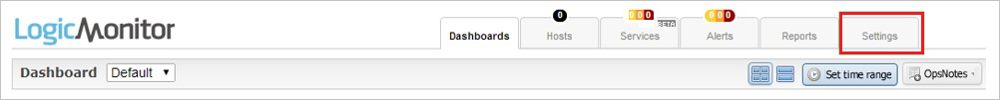
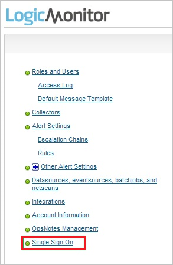
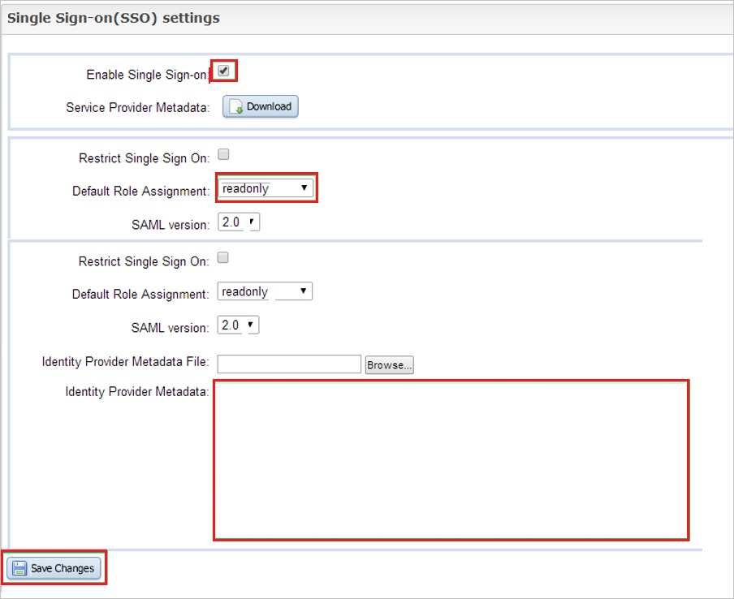

# チュートリアル: Azure AD SSO と LogicMonitor の統合

このチュートリアルでは、LogicMonitor と Azure Active Directory (Azure AD) を統合する方法について説明します。 LogicMonitor を Azure AD に統合すると、次のことができます。

* LogicMonitor にアクセスするユーザーを Azure AD で制御する。
* ユーザーが自分の Azure AD アカウントを使用して LogicMonitor に自動的にサインインできるように設定する。
* 1 つの中央サイト (Azure Portal) で自分のアカウントを管理します。

## 前提条件

開始するには、次が必要です。

* Azure AD サブスクリプション。 サブスクリプションがない場合は、[無料アカウント](https://azure.microsoft.com/free/)を取得できます。
* LogicMonitor でのシングル サインオン (SSO) が有効なサブスクリプション。

## シナリオの説明

このチュートリアルでは、テスト環境で Azure AD のシングル サインオンを構成してテストします。

* LogicMonitor では、**SP** によって開始される SSO がサポートされます。

## ギャラリーからの LogicMonitor の追加

Azure AD への LogicMonitor の統合を構成するには、ギャラリーから管理対象 SaaS アプリの一覧に LogicMonitor を追加する必要があります。

1. 職場または学校アカウントか、個人の Microsoft アカウントを使用して、Azure portal にサインインします。
1. 左のナビゲーション ウィンドウで **[Azure Active Directory]** サービスを選択します。
1. **[エンタープライズ アプリケーション]** に移動し、 **[すべてのアプリケーション]** を選択します。
1. 新しいアプリケーションを追加するには、 **[新しいアプリケーション]** を選択します。
1. **[ギャラリーから追加する]** セクションで、検索ボックスに「**LogicMonitor**」と入力します。
1. 結果のパネルから **LogicMonitor** を選択し、アプリを追加します。 お使いのテナントにアプリが追加されるのを数秒待機します。

## LogicMonitor の Azure AD SSO の構成とテスト

**B.Simon** というテスト ユーザーを使用して、LogicMonitor に対する Azure AD SSO を構成してテストします。 SSO が機能するためには、Azure AD ユーザーと LogicMonitor の関連ユーザーとの間にリンク関係を確立する必要があります。

LogicMonitor に対して Azure AD SSO を構成してテストするには、次の手順を行います。

1. **[Azure AD SSO の構成](#configure-azure-ad-sso)** - ユーザーがこの機能を使用できるようにします。
    1. **[Azure AD のテスト ユーザーの作成](#create-an-azure-ad-test-user)** - B.Simon で Azure AD のシングル サインオンをテストします。
    1. **[Azure AD テスト ユーザーの割り当て](#assign-the-azure-ad-test-user)** - B.Simon が Azure AD シングル サインオンを使用できるようにします。
1. **[LogicMonitor の SSO の構成](#configure-logicmonitor-sso)** - アプリケーション側でシングル サインオン設定を構成します。
    1. **[LogicMonitor のテスト ユーザーの作成](#create-logicmonitor-test-user)** - LogicMonitor で B.Simon に対応するユーザーを作成し、Azure AD の B.Simon にリンクさせます。
1. **[SSO のテスト](#test-sso)** - 構成が機能するかどうかを確認します。

## Azure AD SSO の構成

これらの手順に従って、Azure portal で Azure AD SSO を有効にします。

1. Azure portal の **LogicMonitor** アプリケーション統合ページで、 **[管理]** セクションを探して、 **[シングル サインオン]** を選択します。
1. **[シングル サインオン方式の選択]** ページで、 **[SAML]** を選択します。
1. **[SAML によるシングル サインオンのセットアップ]** ページで、 **[基本的な SAML 構成]** の鉛筆アイコンをクリックして設定を編集します。

   

4. **[基本的な SAML 構成]** セクションで、次の手順を実行します。

    a. **[識別子 (エンティティ ID)]** ボックスに、次のパターンを使用して URL を入力します。`https://<companyname>.logicmonitor.com`
    
    b. **[応答 URL (Assertion Consumer Service URL)]** ボックスに、URL として「`https://companyname.logicmonitor.com/santaba/saml/SSO/`」を入力します 
  
    c. **[サインオン URL]** ボックスに、次のパターンを使用して URL を入力します。`https://<companyname>.logicmonitor.com`

    > [!NOTE]
    > これらは実際の値ではありません。 これらの値を実際の識別子とサインオン URL で更新してください。 これらの値を取得するには、[LogicMonitor クライアント サポート チーム](https://www.logicmonitor.com/contact/)に問い合わせてください。 Azure portal の **[基本的な SAML 構成]** セクションに示されているパターンを参照することもできます。

5. **[SAML でシングル サインオンをセットアップします]** ページの **[SAML 署名証明書]** セクションで、 **[ダウンロード]** をクリックして、要件のとおりに指定したオプションから **フェデレーション メタデータ XML** をダウンロードして、お使いのコンピューターに保存します。

    

6. **[LogicMonitor のセットアップ]** セクションで、要件に従って適切な URL をコピーします。

    

### Azure AD のテスト ユーザーの作成

このセクションでは、Azure portal 内で B.Simon というテスト ユーザーを作成します。

1. Azure portal の左側のウィンドウから、 **[Azure Active Directory]** 、 **[ユーザー]** 、 **[すべてのユーザー]** の順に選択します。
1. 画面の上部にある **[新しいユーザー]** を選択します。
1. **[ユーザー]** プロパティで、以下の手順を実行します。
   1. **[名前]** フィールドに「`B.Simon`」と入力します。  
   1. **[ユーザー名]** フィールドに「username@companydomain.extension」と入力します。 たとえば、「 `B.Simon@contoso.com` 」のように入力します。
   1. **[パスワードを表示]** チェック ボックスをオンにし、 **[パスワード]** ボックスに表示された値を書き留めます。
   1. **Create** をクリックしてください。

### Azure AD テスト ユーザーの割り当て

このセクションでは、B.Simon に LogicMonitor へのアクセスを許可することで、このユーザーが Azure シングル サインオンを使用できるようにします。

1. Azure portal で **[エンタープライズ アプリケーション]** を選択し、 **[すべてのアプリケーション]** を選択します。
1. アプリケーションの一覧で **[LogicMonitor]** を選択します。
1. アプリの概要ページで、 **[管理]** セクションを見つけて、 **[ユーザーとグループ]** を選択します。
1. **[ユーザーの追加]** を選択し、 **[割り当ての追加]** ダイアログで **[ユーザーとグループ]** を選択します。
1. **[ユーザーとグループ]** ダイアログの [ユーザー] の一覧から **[B.Simon]** を選択し、画面の下部にある **[選択]** ボタンをクリックします。
1. ユーザーにロールが割り当てられることが想定される場合は、 **[ロールの選択]** ドロップダウンからそれを選択できます。 このアプリに対してロールが設定されていない場合は、[既定のアクセス] ロールが選択されていることを確認します。
1. **[割り当ての追加]** ダイアログで、 **[割り当て]** をクリックします。

## LogicMonitor の SSO の構成

1. **LogicMonitor** 会社サイトに管理者としてログインします。

2. 上部のメニューで **[Settings]** をクリックします。

    

3. 左側にあるナビゲーション バーで、 **[シングル サインオン]** をクリックします。

    

4. [**シングル サインオン (SSO) の設定**] セクションで、以下の手順を実行します。

    

    a. **[Enable Single Sign-on]** を選択します。

    b. [**既定の役割の割り当て**] には [**読み取り専用**] を選択します。

    c. ダウンロードしたメタデータ ファイルをメモ帳で開き、ファイルの内容を [**ID プロバイダー メタデータ**] テキストボックスに貼り付けます。

    d. **[変更を保存]** をクリックします。

### LogicMonitor のテスト ユーザーの作成

Azure AD ユーザーがサインインできるように、Azure Active Directory ユーザー名を使用して、LogicMonitor アプリケーションにユーザーをプロビジョニングする必要があります。

**ユーザー プロビジョニングを構成するには、次の手順に従います。**

1. LogicMonitor の企業サイトに管理者としてログインします。

2. 上部のメニューにある [**設定**] をクリックし、[**ロールとユーザー**] をクリックします。

    ![[Roles and Users (ロールとユーザー)]](./media/logicmonitor-tutorial/user.png "[Roles and Users (ロールとユーザー)]")

3. **[追加]** をクリックします。

4. [**アカウントを追加**] セクションで、以下の手順を実行します。

    ![[アカウントの追加]](./media/logicmonitor-tutorial/details.png "[アカウントの追加]")

    a. 関連するテキスト ボックスにプロビジョニングする Azure Active Directory ユーザーの **ユーザー名**、**メール**、**パスワード**、**パスワードの再入力** の値を入力します。

    b. **[ロール]** 、 **[アクセス許可の表示]** 、 **[状態]** の順に選択します。

    c. **[送信]** をクリックします。

> [!NOTE]
> LogicMonitor から提供されている他の LogicMonitor ユーザー アカウント作成ツールや API を使用して、Azure Active Directory ユーザー アカウントをプロビジョニングできます。

## SSO のテスト

このセクションでは、次のオプションを使用して Azure AD のシングル サインオン構成をテストします。 

* Azure portal で **[このアプリケーションをテストします]** をクリックします。 これにより、ログイン フローを開始できる LogicMonitor のサインオン URL にリダイレクトされます。 

* LogicMonitor のサインオン URL に直接移動し、そこからログイン フローを開始します。

* Microsoft マイ アプリを使用することができます。 マイ アプリで [LogicMonitor] タイルをクリックすると、SSO を設定した LogicMonitor に自動的にサインインします。 マイ アプリの詳細については、[マイ アプリの概要](https://support.microsoft.com/account-billing/sign-in-and-start-apps-from-the-my-apps-portal-2f3b1bae-0e5a-4a86-a33e-876fbd2a4510)に関するページを参照してください。

## 次のステップ

LogicMonitor を構成したら、組織の機密データを流出と侵入からリアルタイムで保護するセッション制御を適用することができます。 セッション制御は、条件付きアクセスを拡張したものです。 [Microsoft Defender for Cloud Apps でセッション制御を適用する方法をご覧ください](/cloud-app-security/proxy-deployment-any-app)。
