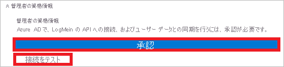
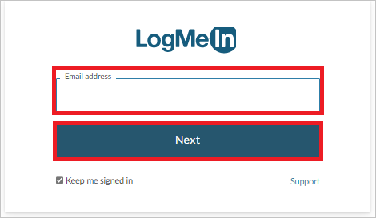
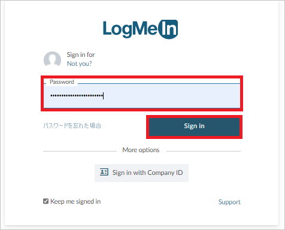

# チュートリアル: LogMeIn を構成し、自動ユーザー プロビジョニングに対応させる

このチュートリアルでは、自動ユーザー プロビジョニングを構成するために LogMeIn と Azure Active Directory (Azure AD) の両方で実行する必要がある手順について説明します。 構成すると、Azure AD による Azure AD プロビジョニング サービスを使用した [LogMeIn](https://www.logmein.com/) へのユーザーとグループのプロビジョニングとプロビジョニング解除が自動的に行われます。 このサービスが実行する内容、しくみ、よく寄せられる質問の重要な詳細については、「[Azure Active Directory による SaaS アプリへのユーザー プロビジョニングとプロビジョニング解除の自動化](../app-provisioning/user-provisioning.md)」を参照してください。 

## サポートされる機能
> [!div class="checklist"]
> * LogMeIn でユーザーを作成する
> * アクセスが不要になった LogMeIn のユーザーを削除する
> * Azure AD と LogMeIn の間でユーザー属性の同期を維持する
> * LogMeIn でグループとグループ メンバーシップをプロビジョニングする
> * LogMeIn に[シングル サインオン](./logmein-tutorial.md)する (推奨)

## 前提条件

このチュートリアルで説明するシナリオでは、次の前提条件目があることを前提としています。

* [Azure AD テナント](../develop/quickstart-create-new-tenant.md) 
* プロビジョニングを構成するための[アクセス許可](../roles/permissions-reference.md)を持つ Azure AD のユーザー アカウント (アプリケーション管理者、クラウド アプリケーション管理者、アプリケーション所有者、グローバル管理者など)。 
* 少なくとも 1 つの検証済みドメインを持つ LogMeIn 組織センターで作成された組織 
* 手順 2 に示すような、プロビジョニングを構成する[アクセス許可](https://support.goto.com/meeting/help/manage-organization-users-g2m710102)を持つ LogMeIn 組織センターのユーザーアカウント (たとえば、読み取りと書き込みアクセス許可を持つ組織の管理者ロール)。

## 手順 1. プロビジョニングのデプロイを計画する
1. [プロビジョニング サービスのしくみ](../app-provisioning/user-provisioning.md)を確認します。
2. [プロビジョニングの対象](../app-provisioning/define-conditional-rules-for-provisioning-user-accounts.md)となるユーザーを決定します。
3. [Azure AD と LogMeIn の間でマップする](../app-provisioning/customize-application-attributes.md)データを決定します。 

## 手順 2. Azure AD によるプロビジョニングをサポートするように LogMeIn を構成する

1. [組織センター](https://organization.logmeininc.com)にログインします。

2. アカウントのメール アドレスで使用されるドメインは、10 日以内に確認を求められるドメインです。  

3. 次のいずれかの方法を使用して、ドメインの所有権を確認できます。

   **方法 1:  ドメイン ゾーン ファイルに DNS レコードを追加します。**  
   DNS の方法を使用するには、DNS ゾーン内のメール ドメインのレベルに DNS レコードを配置します。  ドメインとして "main.com" を使用する例は `@ IN TXT "logmein-verification-code=668e156b-f5d3-430e-9944-f1d4385d043e"` または `main.com. IN TXT “logmein-verification-code=668e156b-f5d3-430e-9944-f1d4385d043e”` のようになります。

   以下に詳細な手順を示します。
     1. ドメイン ホストでドメインのアカウントにサインインします。
     2. ドメインの DNS レコードを更新するためのページに移動します。
     3. ドメインの TXT レコードを探し、ドメインとサブドメインごとに TXT レコードを追加します。
     4. すべての変更を保存します。
     5. 変更が行われたことを確認するには、コマンド ラインを開き、下のいずれかのコマンドを入力します (オペレーティング システムに基づき、ドメインの例として "main.com" を使用します)。
         * Unix および Linux システムの場合: `$ dig TXT main.com`
         * Windows システムの場合: `c:\ > nslookup -type=TXT main.com`
     6. 応答は、独自の行に表示されます。

   **方法 2: 特定の Web サイトに、Web サーバー ファイルをアップロードする。**
   文字列以外に空白や特殊文字を含まない、検証文字列を含むプレーンテキスト ファイルを Web サーバー ルートにアップロードします。
   
      * 場所: `http://<yourdomain>/logmein-verification-code.txt`
      * 内容: `logmein-verification-code=668e156b-f5d3-430e-9944-f1d4385d043e`

4. DNS レコードまたは TXT ファイルを追加したら、[組織センター](https://organization.logmeininc.com)に戻り、 **[Verify]\(確認\)** をクリックします。

5. これで、ドメインを確認し、組織センターで組織を作成しました。この確認プロセスで使用されたアカウントが組織管理者になります。

## 手順 3. Azure AD アプリケーション ギャラリーから LogMeIn を追加する

Azure AD アプリケーション ギャラリーから LogMeIn を追加して、LogMeIn へのプロビジョニングの管理を開始します。 SSO のために LogMeIn を以前に設定している場合は、同じアプリケーションを使用できます。 ただし、統合を初めてテストするときは、別のアプリを作成することをお勧めします。 ギャラリーからアプリケーションを追加する方法の詳細については、[こちら](../manage-apps/add-application-portal.md)を参照してください。 

## 手順 4. プロビジョニングの対象となるユーザーを定義する 

Azure AD プロビジョニング サービスを使用すると、アプリケーションへの割り当て、ユーザーまたはグループの属性に基づいてプロビジョニングされるユーザーのスコープを設定できます。 割り当てに基づいてアプリにプロビジョニングされるユーザーのスコープを設定する場合、以下の[手順](../manage-apps/assign-user-or-group-access-portal.md)を使用して、ユーザーとグループをアプリケーションに割り当てることができます。 ユーザーまたはグループの属性のみに基づいてプロビジョニングされるユーザーのスコープを設定する場合、[こちら](../app-provisioning/define-conditional-rules-for-provisioning-user-accounts.md)で説明されているスコープ フィルターを使用できます。 

* LogMeIn にユーザーとグループを割り当てる場合は、**既定のアクセス** 以外のロールを選択する必要があります。 既定のアクセス ロールを持つユーザーは、プロビジョニングから除外され、プロビジョニング ログで実質的に資格がないとマークされます。 アプリケーションで使用できる唯一のロールが既定のアクセス ロールである場合は、[アプリケーション マニフェストを更新](../develop/howto-add-app-roles-in-azure-ad-apps.md)してロールを追加することができます。 

* 小さいところから始めましょう。 全員にロールアウトする前に、少数のユーザーとグループでテストします。 プロビジョニングのスコープが割り当て済みユーザーとグループに設定される場合、これを制御するには、1 つまたは 2 つのユーザーまたはグループをアプリに割り当てます。 スコープがすべてのユーザーとグループに設定されている場合は、[属性ベースのスコープ フィルター](../app-provisioning/define-conditional-rules-for-provisioning-user-accounts.md)を指定できます。 

## 手順 5. LogMeIn への自動ユーザー プロビジョニングを構成する 

このセクションでは、Azure AD でのユーザー、グループ、またはその両方の割り当てに基づいて、TestApp でユーザー、グループ、またはその両方が作成、更新、および無効化されるように Azure AD プロビジョニング サービスを構成する手順について説明します。

### Azure AD で LogMeIn の自動ユーザー プロビジョニングを構成するには、次の操作を行います。

1. [Azure portal](https://portal.azure.com) にサインインします。 **[エンタープライズ アプリケーション]** を選択し、 **[すべてのアプリケーション]** を選択します。

    ![[エンタープライズ アプリケーション] ブレード](common/enterprise-applications.png)

2. アプリケーションの一覧で **[LogMeIn]** を選択します。

    

3. **[プロビジョニング]** タブを選択します。

    ![[プロビジョニング] タブ](common/provisioning.png)

4. **[プロビジョニング モード]** を **[自動]** に設定します。

    ![[プロビジョニング] タブの [自動]](common/provisioning-automatic.png)

5. **[管理者資格情報]** セクション下にある **[承認する]** をクリックします。 **LogMeIn** の [承認] ページにリダイレクトされます。 LogMeIn ユーザー名を入力し、 **[次へ]** ボタンをクリックします。 自分の LogMeIn パスワードを入力し、 **[サインイン]** ボタンをクリックします。 **[テスト接続]** をクリックして、Azure AD から LogMeIn に接続できることを確認します。 接続できない場合は、使用中の LogMeIn アカウントに管理者アクセス許可があることを確認してから、もう一度試します。

    

      

      

6. **[通知用メール]** フィールドに、プロビジョニングのエラー通知を受け取るユーザーまたはグループの電子メール アドレスを入力して、 **[エラーが発生したときにメール通知を送信します]** チェック ボックスをオンにします。

    

7. **[保存]** を選択します。

8. **[マッピング]** セクションで **[Synchronize Azure Active Directory Users to LogMeIn]\(Azure Active Directory ユーザーを LogMeIn に同期する\)** を選択します。

9. **[属性マッピング]** セクションで、Azure AD から LogMeIn に同期されるユーザー属性を確認します。 **[Matching]\(照合\)** プロパティとして選択されている属性は、更新処理で LogMeIn のユーザー アカウントとの照合に使用されます。 [照合する対象の属性](../app-provisioning/customize-application-attributes.md)を変更する場合は、その属性に基づいたユーザーのフィルター処理が LogMeIn API で確実にサポートされている必要があります。 **[保存]** ボタンをクリックして変更をコミットします。

   |属性|Type|
   |---|---|
   |userName|String|
   |externalId|String|
   |active|Boolean|
   |name.givenName|String|
   |name.familyName|String|
   |urn:ietf:params:scim:schemas:extension:enterprise:2.0:User:department|String|
   |urn:ietf:params:scim:schemas:extension:enterprise:2.0:User:employeeNumber|String|
   |urn:ietf:params:scim:schemas:extension:enterprise:2.0:User:costCenter|String|
   |urn:ietf:params:scim:schemas:extension:enterprise:2.0:User:division|String|

10. **[マッピング]** セクションの **[Synchronize Azure Active Directory Groups to LogMeIn]\(Azure Active Directory グループを LogMeIn に同期する\)** を選択します。

11. **[属性マッピング]** セクションで、Azure AD から LogMeIn に同期されるグループ属性を確認します。 **[Matching]\(照合\)** プロパティとして選択されている属性は、更新処理で LogMeIn のグループとの照合に使用されます。 **[保存]** ボタンをクリックして変更をコミットします。

      |属性|Type|
      |---|---|
      |displayName|String|
      |externalId|String|
      |members|リファレンス|

12. スコープ フィルターを構成するには、[スコープ フィルターのチュートリアル](../app-provisioning/define-conditional-rules-for-provisioning-user-accounts.md)の次の手順を参照してください。

13. LogMeIn に対して Azure AD プロビジョニング サービスを有効にするには、 **[設定]** セクションで **[プロビジョニング状態]** を **[オン]** に変更します。

    ![プロビジョニングの状態を [オン] に切り替える](common/provisioning-toggle-on.png)

14. **[設定]** セクションの **[スコープ]** で目的の値を選択して、LogMeIn にプロビジョニングするユーザー、グループ、またはこれらの両方を定義します。

    

15. プロビジョニングの準備ができたら、 **[保存]** をクリックします。

    

この操作により、 **[設定]** セクションの **[スコープ]** で定義したすべてのユーザーとグループの初期同期サイクルが開始されます。 初期サイクルは後続の同期よりも実行に時間がかかります。後続のサイクルは、Azure AD のプロビジョニング サービスが実行されている限り約 40 分ごとに実行されます。 

## 手順 6. デプロイを監視する
プロビジョニングを構成したら、次のリソースを使用してデプロイを監視します。

1. [プロビジョニング ログ](../reports-monitoring/concept-provisioning-logs.md)を使用して、正常にプロビジョニングされたユーザーと失敗したユーザーを特定します。
2. [進行状況バー](../app-provisioning/application-provisioning-when-will-provisioning-finish-specific-user.md)を確認して、プロビジョニング サイクルの状態と完了までの時間を確認します。
3. プロビジョニング構成が異常な状態になったと考えられる場合、アプリケーションは検疫されます。 検疫状態の詳細については、[こちら](../app-provisioning/application-provisioning-quarantine-status.md)を参照してください。  

## その他のリソース

* [エンタープライズ アプリのユーザー アカウント プロビジョニングの管理](../app-provisioning/configure-automatic-user-provisioning-portal.md)
* [Azure Active Directory のアプリケーション アクセスとシングル サインオンとは](../manage-apps/what-is-single-sign-on.md)

## 次のステップ

* [プロビジョニング アクティビティのログの確認方法およびレポートの取得方法](../app-provisioning/check-status-user-account-provisioning.md)