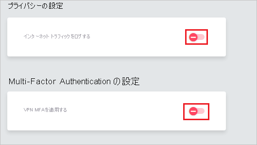

# チュートリアル: Azure Active Directory と Meta Networks Connector の統合

このチュートリアルでは、Meta Networks Connector と Azure Active Directory (Azure AD) を統合する方法について説明します。 Meta Networks Connector と Azure AD を統合すると、次のことが可能になります。

* Meta Networks Connector にアクセスできるユーザーを Azure AD で制御します。
* ユーザーが自分の Azure AD アカウントを使用して Meta Networks Connector に自動的にサインインできるようにします。
* 1 つの中央サイト (Azure Portal) で自分のアカウントを管理します。

## 前提条件

開始するには、次が必要です。

* Azure AD サブスクリプション。 サブスクリプションがない場合は、[無料アカウント](https://azure.microsoft.com/free/)を取得できます。
* Meta Networks Connector でのシングル サインオン (SSO) が有効なサブスクリプション。

## シナリオの説明

このチュートリアルでは、テスト環境で Azure AD のシングル サインオンを構成してテストします。

* Meta Networks Connector では、**SP Initiated SSO** と **IDP Initiated SSO** がサポートされます。
 
* Meta Networks Connector では、**Just-In-Time** ユーザー プロビジョニングがサポートされます。

* Meta Networks Connector では、[自動化されたユーザー プロビジョニング](meta-networks-connector-provisioning-tutorial.md)がサポートされます。

## ギャラリーからの Meta Networks Connector の追加

Azure AD への Meta Networks Connector の統合を構成するには、ギャラリーからマネージド SaaS アプリの一覧に Meta Networks Connector を追加する必要があります。

1. 職場または学校アカウントか、個人の Microsoft アカウントを使用して、Azure portal にサインインします。
1. 左のナビゲーション ウィンドウで **[Azure Active Directory]** サービスを選択します。
1. **[エンタープライズ アプリケーション]** に移動し、 **[すべてのアプリケーション]** を選択します。
1. 新しいアプリケーションを追加するには、 **[新しいアプリケーション]** を選択します。
1. **[ギャラリーから追加する]** セクションで、検索ボックスに、「**Meta Networks Connector**」と入力します。
1. 結果のパネルから **[Meta Networks Connector]** を選択し、アプリを追加します。 お使いのテナントにアプリが追加されるのを数秒待機します。

## Meta Networks Connector の Azure AD SSO の構成とテスト

**B.Simon** というテスト ユーザーを使用して、Meta Networks Connector に対する Azure AD SSO を構成してテストします。 SSO を機能させるためには、Azure AD ユーザーと Meta Networks Connector の関連ユーザーとの間にリンク関係を確立する必要があります。

Meta Networks Connector に対して Azure AD SSO を構成してテストするには、次の手順を実行します。

1. **[Azure AD SSO の構成](#configure-azure-ad-sso)** - ユーザーがこの機能を使用できるようにします。
    1. **[Azure AD のテスト ユーザーの作成](#create-an-azure-ad-test-user)** - B.Simon で Azure AD のシングル サインオンをテストします。
    1. **[Azure AD テスト ユーザーの割り当て](#assign-the-azure-ad-test-user)** - B.Simon が Azure AD シングル サインオンを使用できるようにします。
1. **[Meta Networks Connector SSO の構成](#configure-meta-networks-connector-sso)** - アプリケーション側でシングル サインオン設定を構成します。
    1. **[Meta Networks Connector のテスト ユーザーの作成](#create-meta-networks-connector-test-user)** - Meta Networks Connector で B.Simon に対応するユーザーを作成し、Azure AD の B.Simon にリンクさせます。
1. **[SSO のテスト](#test-sso)** - 構成が機能するかどうかを確認します。

## Azure AD SSO の構成

これらの手順に従って、Azure portal で Azure AD SSO を有効にします。

1. Azure portal の **Meta Networks Connector** アプリケーション統合ページで、 **[管理]** セクションを探して、 **[シングル サインオン]** を選択します。
1. **[シングル サインオン方式の選択]** ページで、 **[SAML]** を選択します。
1. **[SAML によるシングル サインオンのセットアップ]** ページで、 **[基本的な SAML 構成]** の鉛筆アイコンをクリックして設定を編集します。

   

4. **[基本的な SAML 構成]** セクションで、アプリケーションを **IDP** 開始モードで構成する場合は、次の手順を実行します。

    a. **[識別子]** ボックスに、`https://login.nsof.io/v1/<ORGANIZATION-SHORT-NAME>/saml/metadata` の形式で URL を入力します。

    b. **[応答 URL]** ボックスに、`https://login.nsof.io/v1/<ORGANIZATION-SHORT-NAME>/sso/saml` のパターンを使用して URL を入力します

5. アプリケーションを **SP** 開始モードで構成する場合は、 **[追加の URL を設定します]** をクリックして次の手順を実行します。

    a. **[サインオン URL]** ボックスに、`https://<ORGANIZATION-SHORT-NAME>.metanetworks.com/login` という形式で URL を入力します。

    b. **[リレー状態]** ボックスに、`https://<ORGANIZATION-SHORT-NAME>.metanetworks.com/#/` のパターンで URL を入力します。

    > [!NOTE]
    > これらは実際の値ではありません。 実際の識別子、応答 URL、サインオン URL に値を置き換えます。実際の値については後で説明します。

6. Meta Networks Connector アプリケーションでは、特定の形式の SAML アサーションが求められます。そのため、カスタム属性マッピングを SAML トークン属性構成に追加する必要があります。 次のスクリーンショットには、既定の属性一覧が示されています。 **[編集]** アイコンをクリックして、 **[ユーザー属性]** ダイアログを開きます。

    ![このスクリーンショットは、[編集] アイコンが選択された状態の [User Attributes]\(ユーザー属性\) を示しています。](common/edit-attribute.png)
    
7. その他に、Meta Networks Connector アプリケーションでは、いくつかの属性が SAML 応答で返されることが想定されています。 **[ユーザー属性]** ダイアログの **[ユーザー要求]** セクションで、以下の手順を実行して、以下の表のように SAML トークン属性を追加します。
    
    | 名前 | ソース属性 | 名前空間|
    | ---------------| --------------- | -------- |
    | firstname | User.givenname | |
    | lastname | User.surname | |
    | emailaddress| User.mail| `http://schemas.xmlsoap.org/ws/2005/05/identity/claims` |
    | name | user.userprincipalname| `http://schemas.xmlsoap.org/ws/2005/05/identity/claims` |
    | phone | user.telephonenumber | |

    a. **[新しい要求の追加]** をクリックして **[ユーザー要求の管理]** ダイアログを開きます。

    ![[新しい要求の追加] オプションが備わっている [ユーザー要求] のスクリーンショット。](common/new-save-attribute.png)

    ![スクリーンショットは、説明されている値を入力できる [ユーザー要求の管理] ダイアログ ボックスを示しています。](common/new-attribute-details.png)

    b. **[名前]** ボックスに、その行に対して表示される属性名を入力します。

    c. **[名前空間]** は空白のままにします。

    d. [ソース] として **[属性]** を選択します。

    e. **[ソース属性]** の一覧から、その行に表示される属性値を入力します。

    f. **[OK]** をクリックします。

    g. **[保存]** をクリックします。

8. **[SAML でシングル サインオンをセットアップします]** ページの **[SAML 署名証明書]** セクションで、 **[ダウンロード]** をクリックして要件のとおりに指定したオプションからの **証明書 (Base64)** をダウンロードして、お使いのコンピューターに保存します。

    

9. **[Meta Networks Connector のセットアップ]** セクションで、要件に従って適切な URL をコピーします。

    

### Azure AD のテスト ユーザーの作成 

このセクションでは、Azure portal 内で B.Simon というテスト ユーザーを作成します。

1. Azure portal の左側のウィンドウから、 **[Azure Active Directory]** 、 **[ユーザー]** 、 **[すべてのユーザー]** の順に選択します。
1. 画面の上部にある **[新しいユーザー]** を選択します。
1. **[ユーザー]** プロパティで、以下の手順を実行します。
   1. **[名前]** フィールドに「`B.Simon`」と入力します。  
   1. **[ユーザー名]** フィールドに「username@companydomain.extension」と入力します。 たとえば、「 `B.Simon@contoso.com` 」のように入力します。
   1. **[パスワードを表示]** チェック ボックスをオンにし、 **[パスワード]** ボックスに表示された値を書き留めます。
   1. **Create** をクリックしてください。

### Azure AD テスト ユーザーの割り当て

このセクションでは、B.Simon に Meta Networks Connector へのアクセスを許可することで、このユーザーが Azure シングル サインオンを使用できるようにします。

1. Azure portal で **[エンタープライズ アプリケーション]** を選択し、 **[すべてのアプリケーション]** を選択します。
1. アプリケーションの一覧で **[Meta Networks Connector]** を選択します。
1. アプリの概要ページで、 **[管理]** セクションを見つけて、 **[ユーザーとグループ]** を選択します。
1. **[ユーザーの追加]** を選択し、 **[割り当ての追加]** ダイアログで **[ユーザーとグループ]** を選択します。
1. **[ユーザーとグループ]** ダイアログの [ユーザー] の一覧から **[B.Simon]** を選択し、画面の下部にある **[選択]** ボタンをクリックします。
1. ユーザーにロールが割り当てられることが想定される場合は、 **[ロールの選択]** ドロップダウンからそれを選択できます。 このアプリに対してロールが設定されていない場合は、[既定のアクセス] ロールが選択されていることを確認します。
1. **[割り当ての追加]** ダイアログで、 **[割り当て]** をクリックします。

## Meta Networks Connector SSO の構成

1. ブラウザーで新しいタブを開き、Meta Networks Connector の管理者アカウントにログインします。
    
    > [!NOTE]
    > Meta Networks Connector は、セキュリティで保護されたシステムです。 したがって、ポータルにアクセスする前に、接続先側でパブリック IP アドレスを許可リストに登録する必要があります。 パブリック IP アドレスを取得するには、[ここ](https://whatismyipaddress.com/)で指定されているリンクに従います。 IP アドレスを [Meta Networks Connector クライアント サポート チーム](mailto:support@metanetworks.com)に送信して、IP アドレスを許可リストに登録してもらいます。
    
2. **[管理者]** に移動して **[設定]** を選択します。
    
    ![[Administration]\(管理\) メニューの [Settings]\(設定\) が選択されているスクリーンショット。](./media/metanetworksconnector-tutorial/menu.png)
    
3. **[Log Internet Traffic]\(インターネット トラフィックのログ記録\)** と **[Force VPN MFA]\(VPN MFA の強制\)** がオフに設定されていることを確認します。
    
    
    
4. **[管理者]** に移動して **[SAML]** を選択します。
    
    ![[Administration]\(管理\) メニューの [SAML] が選択されているスクリーンショット。](./media/metanetworksconnector-tutorial/admin.png)
    
5. **[DETAILS]\(詳細\)** タブで次の手順を実行します。
    
    ![説明されている値を入力できる [DETAILS]\(詳細\) ページを示すスクリーンショット。](./media/metanetworksconnector-tutorial/details.png)
    
    a. **[SSO URL]** の値をコピーし、 **[Meta Networks Connector ドメインと URL]** セクションの **[サインイン URL]** テキスト ボックスに貼り付けます。
    
    b. **[Recipient URL]\(受信者 URL\)** の値をコピーし、 **[Meta Networks Connector ドメインと URL]** セクションの **[応答 URL]** テキスト ボックスに貼り付けます。
    
    c. **[Audience URI (SP Entity ID)]\(オーディエンス URI (SP エンティティ ID)\)** の値をコピーし、 **[Meta Networks Connector ドメインと URL]** セクションの **[識別子 (エンティティ ID)]** テキスト ボックスに貼り付けます。
    
    d. SAML を有効にします。
    
6. **[GENERAL]\(全般\)** タブで、次の手順を実行します。

    ![説明されている値を入力できる [GENERAL]\(全般\) ページを示すスクリーンショット。](./media/metanetworksconnector-tutorial/configuration.png)

    a. **[Identity Provider Single Sign-On URL]\(ID プロバイダーのシングル サインオン URL\)** に、Azure portal からコピーした **[ログイン URL]** の値を貼り付けます。

    b. **[Identity Provider Issuer]\(ID プロバイダーの発行者\)** に、Azure portal からコピーした **[Azure AD 識別子]** の値を貼り付けます。

    c. Azure Portal からダウンロードした証明書をメモ帳で開き、 **[X.509 Certificate]\(X.509 証明書\)** ボックスに貼り付けます。

    d. **[Just-in-Time Provisioning]\(ジャストイン タイム プロビジョニング\)** を有効にします。

### Meta Networks Connector のテスト ユーザーの作成

このセクションでは、Britta Simon というユーザーを Meta Networks Connector に作成します。 Meta Networks Connector では、Just-In-Time プロビジョニングがサポートされています。この設定は、既定で有効になっています。 このセクションでは、ユーザー側で必要な操作はありません。 ユーザーがまだ Meta Networks Connector に存在しない場合は、Meta Networks Connector にアクセスしようとしたときに新しいユーザーが作成されます。

>[!Note]
>ユーザーを手動で作成する必要がある場合は、[Meta Networks Connector クライアント サポート チーム](mailto:support@metanetworks.com)にお問い合わせください。

Meta Networks は、自動ユーザー プロビジョニングもサポートしています。自動ユーザー プロビジョニングの構成方法について詳しくは、[こちら](./meta-networks-connector-provisioning-tutorial.md)をご覧ください。

## SSO のテスト 

このセクションでは、次のオプションを使用して Azure AD のシングル サインオン構成をテストします。 

#### SP Initiated:

* Azure portal で **[このアプリケーションをテストします]** をクリックします。 これにより、ログイン フローを開始できる Meta Networks Connector のサインオン URL にリダイレクトされます。  

* Meta Networks Connector のサインオン URL に直接移動し、そこからログイン フローを開始します。

#### IDP Initiated:

* Azure portal で **[このアプリケーションをテストします]** をクリックすると、SSO を設定した Meta Networks Connector に自動的にサインインされます。 

また、Microsoft マイ アプリを使用して、任意のモードでアプリケーションをテストすることもできます。 マイ アプリで [Meta Networks Connector] タイルをクリックすると、SP モードで構成されている場合は、ログイン フローを開始するためのアプリケーション サインオン ページにリダイレクトされます。IDP モードで構成されている場合は、SSO を設定した Meta Networks Connector に自動的にサインインされます。 マイ アプリの詳細については、[マイ アプリの概要](https://support.microsoft.com/account-billing/sign-in-and-start-apps-from-the-my-apps-portal-2f3b1bae-0e5a-4a86-a33e-876fbd2a4510)に関するページを参照してください。

## 次のステップ

Meta Networks Connector を構成したら、組織の機密データを流出と侵入からリアルタイムで保護するセッション制御を適用することができます。 セッション制御は、条件付きアクセスを拡張したものです。 [Microsoft Defender for Cloud Apps でセッション制御を適用する方法をご覧ください](/cloud-app-security/proxy-deployment-aad)。
