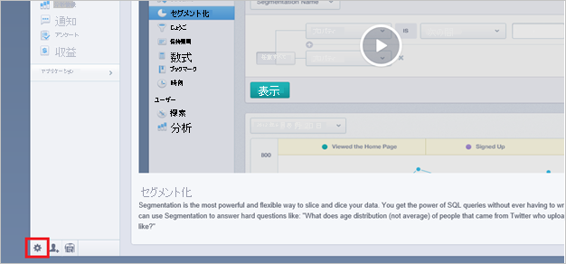

# チュートリアル: Azure Active Directory と Mixpanel の統合

このチュートリアルでは、Mixpanel と Azure Active Directory (Azure AD) を統合する方法について説明します。 Mixpanel を Microsoft Azure Active Directory と統合すると、次のことが可能になります。

* Mixpanel にアクセスできるユーザーを Microsoft Azure Active Directory で制御します。
* ユーザーが自分の Microsoft Azure Active Directory アカウントを使用して Mixpanel に自動的にサインインできるようにします。
* 1 つの中央サイト (Azure Portal) で自分のアカウントを管理します。

## 前提条件

開始するには、次が必要です。

* Azure AD サブスクリプション。 サブスクリプションがない場合は、[無料アカウント](https://azure.microsoft.com/free/)を取得できます。
* Mixpanel でのシングル サインオン (SSO) が有効なサブスクリプション。

## シナリオの説明

このチュートリアルでは、テスト環境で Azure AD のシングル サインオンを構成してテストします。

* Mixpanel では、**SP** によって開始される SSO がサポートされます。

* Mixpanel では、[自動化されたユーザー プロビジョニング](mixpanel-provisioning-tutorial.md)がサポートされます。

> [!NOTE]
> このアプリケーションの識別子は固定文字列値であるため、1 つのテナントで構成できるインスタンスは 1 つだけです。

## ギャラリーからの Mixpanel の追加

Azure AD への Mixpanel の統合を構成するには、ギャラリーから管理対象 SaaS アプリの一覧に Mixpanel を追加する必要があります。

1. 職場または学校アカウントか、個人の Microsoft アカウントを使用して、Azure portal にサインインします。
1. 左のナビゲーション ウィンドウで **[Azure Active Directory]** サービスを選択します。
1. **[エンタープライズ アプリケーション]** に移動し、 **[すべてのアプリケーション]** を選択します。
1. 新しいアプリケーションを追加するには、 **[新しいアプリケーション]** を選択します。
1. **[ギャラリーから追加する]** セクションで、検索ボックスに「**Mixpanel**」と入力します。
1. 結果のパネルから **[Mixpanel]** を選択し、アプリを追加します。 お使いのテナントにアプリが追加されるのを数秒待機します。

## Mixpanel 用の Microsoft Azure Active Directory SSO の構成とテスト

**B.Simon** というテスト ユーザーを使用して、Mixpanel と一緒に Microsoft Azure Active Directory SSO を構成してテストします。 SSO を機能させるためには、Azure AD ユーザーと Mixpanel の関連ユーザーとの間にリンク関係を確立する必要があります。

Microsoft Azure Active Directory SSO を Mixpanel と一緒に構成してテストするには、次の手順を実行します。

1. **[Azure AD SSO の構成](#configure-azure-ad-sso)** - ユーザーがこの機能を使用できるようにします。
    1. **[Azure AD のテスト ユーザーの作成](#create-an-azure-ad-test-user)** - B.Simon で Azure AD のシングル サインオンをテストします。
    1. **[Azure AD テスト ユーザーの割り当て](#assign-the-azure-ad-test-user)** - B.Simon が Azure AD シングル サインオンを使用できるようにします。
1. **[Mixpanel SSO の構成](#configure-mixpanel-sso)** - アプリケーション側でシングル サインオン設定を構成します。
    1. **[Mixpanel のテスト ユーザーの作成](#create-mixpanel-test-user)** - Mixpanel で B.Simon に対応するユーザーを作成し、Azure AD の Britta Simon にリンクさせます。
1. **[SSO のテスト](#test-sso)** - 構成が機能するかどうかを確認します。

## Azure AD SSO の構成

これらの手順に従って、Azure portal で Azure AD SSO を有効にします。

1. Azure portal の **Mixpanel** アプリケーション統合ページで、 **[管理]** セクションを探して、 **[シングル サインオン]** を選択します。
1. **[シングル サインオン方式の選択]** ページで、 **[SAML]** を選択します。
1. **[SAML によるシングル サインオンのセットアップ]** ページで、 **[基本的な SAML 構成]** の鉛筆アイコンをクリックして設定を編集します。

   

4. **[基本的な SAML 構成]** セクションで、次の手順を実行します。

    **[サインオン URL]** テキスト ボックスに、URL として「`https://mixpanel.com/login/`」と入力します。

    > [!NOTE]
    > [https://mixpanel.com/register/](https://mixpanel.com/register/) で登録してログイン資格情報を設定し、[Mixpanel サポート チーム](mailto:support@mixpanel.com)に連絡してテナントの SSO 設定を有効にしてください。 必要であれば、Mixpanel サポート チームはサインオン URL 値も提供します。 

5. **[SAML でシングル サインオンをセットアップします]** ページの **[SAML 署名証明書]** セクションで、 **[ダウンロード]** をクリックして要件のとおりに指定したオプションからの **証明書 (Base64)** をダウンロードして、お使いのコンピューターに保存します。

    

6. **[Mixpanel のセットアップ]** セクションで、要件に従って適切な URL をコピーします。

    

### Azure AD のテスト ユーザーの作成 

このセクションでは、Azure portal 内で B.Simon というテスト ユーザーを作成します。

1. Azure portal の左側のウィンドウから、 **[Azure Active Directory]** 、 **[ユーザー]** 、 **[すべてのユーザー]** の順に選択します。
1. 画面の上部にある **[新しいユーザー]** を選択します。
1. **[ユーザー]** プロパティで、以下の手順を実行します。
   1. **[名前]** フィールドに「`B.Simon`」と入力します。  
   1. **[ユーザー名]** フィールドに「username@companydomain.extension」と入力します。 たとえば、「 `B.Simon@contoso.com` 」のように入力します。
   1. **[パスワードを表示]** チェック ボックスをオンにし、 **[パスワード]** ボックスに表示された値を書き留めます。
   1. **Create** をクリックしてください。

### Azure AD テスト ユーザーの割り当て

このセクションでは、B.Simon に Mixpanel へのアクセスを許可することで、このユーザーが Azure シングル サインオンを使用できるようにします。

1. Azure portal で **[エンタープライズ アプリケーション]** を選択し、 **[すべてのアプリケーション]** を選択します。
1. アプリケーションの一覧で **[Mixpanel]** を選択します。
1. アプリの概要ページで、 **[管理]** セクションを見つけて、 **[ユーザーとグループ]** を選択します。
1. **[ユーザーの追加]** を選択し、 **[割り当ての追加]** ダイアログで **[ユーザーとグループ]** を選択します。
1. **[ユーザーとグループ]** ダイアログの [ユーザー] の一覧から **[B.Simon]** を選択し、画面の下部にある **[選択]** ボタンをクリックします。
1. ユーザーにロールが割り当てられることが想定される場合は、 **[ロールの選択]** ドロップダウンからそれを選択できます。 このアプリに対してロールが設定されていない場合は、[既定のアクセス] ロールが選択されていることを確認します。
1. **[割り当ての追加]** ダイアログで、 **[割り当て]** をクリックします。

## Mixpanel SSO の構成

1. 別のブラウザー ウィンドウで、管理者として Mixpanel アプリケーションにサインオンします。

2. ページの下部の左隅にある小さな **歯車** アイコンをクリックします。 
   
     

3. **[Access security]** タブをクリックし、 **[Change settings]** をクリックします。
   
    ![[アクセス セキュリティ] タブを示すスクリーンショット。ここでは、設定を変更できます。](./media/mixpanel-tutorial/settings.png) 

4. **[Change your certificate]\(証明書の変更\)** ダイアログ ページで、 **[ファイルの選択]** をクリックしてダウンロードした証明書をアップロードし、 **[次へ]** をクリックします。
   
    ![[Change your certificate]\(証明書の変更\) ダイアログ ボックスを示すスクリーンショット。ここでは、証明書ファイルを選択できます。](./media/mixpanel-tutorial/certificate.png) 

5.  **[Change your authentication URL]\(認証 URL の変更\)** ダイアログ ページの [authentication URL]\(認証 URL\) ボックスで、Azure portal からコピーした **[ログイン URL]** の値を貼り付けて **[次へ]** をクリックします。
   
    ![[Change your authentication URL]\(認証 URL の変更\) ウィンドウを示すスクリーンショット。ここでは、ログイン URL をコピーできます。](./media/mixpanel-tutorial/authentication.png) 

6. **[Done]** をクリックします。

### Mixpanel のテスト ユーザーの作成

このセクションの目的は、Mixpanel で Britta Simon というユーザーを作成することです。 

1. Mixpanel 企業サイトに管理者としてサインオンします。

2. ページの下部の左隅にある小さな歯車ボタンをクリックし、 **[設定]** ウィンドウを開きます。

3. **[チーム]** タブをクリックします。

4. **[Invite a team member by email]** ボックスに、Azure での Britta の 電子メール アドレスを入力します。
   
    ![[チーム] タブを示すスクリーンショット。ここでは、招待するアドレスを追加します。](./media/mixpanel-tutorial/member.png) 

5. **[招待]** をクリックします。 

> [!Note]
> プロファイルを設定するための電子メールがユーザーに届きます。

> [!NOTE]
> Mixpanel は、自動ユーザー プロビジョニングもサポートしています。自動ユーザー プロビジョニングの構成方法について詳しくは、[こちら](./mixpanel-provisioning-tutorial.md)をご覧ください。

## SSO のテスト

このセクションでは、次のオプションを使用して Azure AD のシングル サインオン構成をテストします。 

* Azure portal で **[このアプリケーションをテストします]** をクリックします。 これにより、ログイン フローを開始できる Mixpanel のサインオン URL にリダイレクトされます。 

* Mixpanel のサインオン URL に直接移動し、そこからログイン フローを開始します。

* Microsoft マイ アプリを使用することができます。 マイ アプリで [Mixpanel] タイルをクリックすると、Mixpanel のサインオン URL にリダイレクトされます。 マイ アプリの詳細については、[マイ アプリの概要](https://support.microsoft.com/account-billing/sign-in-and-start-apps-from-the-my-apps-portal-2f3b1bae-0e5a-4a86-a33e-876fbd2a4510)に関するページを参照してください。

## 次のステップ

Mixpanel を構成したら、組織の機密データを流出と侵入からリアルタイムで保護するセッション制御を適用できます。 セッション制御は、条件付きアクセスを拡張したものです。 [Microsoft Defender for Cloud Apps でセッション制御を適用する方法をご覧ください](/cloud-app-security/proxy-deployment-aad)。
