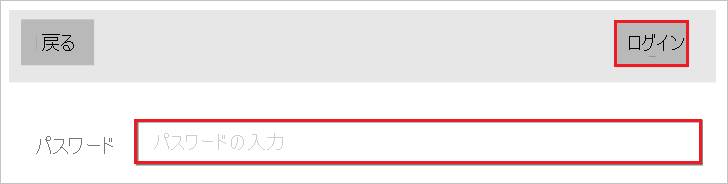

# チュートリアル: Azure AD SSO と moconavi の統合

このチュートリアルでは、moconavi と Azure Active Directory (Azure AD) を統合する方法について説明します。 Azure AD と moconavi を統合すると、次のことができます。

* moconavi にアクセスできるユーザーを Azure AD 上でコントロールする。
* ユーザーが自分の Azure AD アカウントを使用して moconavi に自動的にサインインできるようにする。
* 1 つの中央サイト (Azure Portal) で自分のアカウントを管理します。

## 前提条件

開始するには、次が必要です。

* Azure AD サブスクリプション。 サブスクリプションがない場合は、[無料アカウント](https://azure.microsoft.com/free/)を取得できます。
* moconavi のシングル サインオン (SSO) が有効なサブスクリプション。

## シナリオの説明

このチュートリアルでは、テスト環境で Azure AD のシングル サインオンを構成してテストします。

* moconavi では、**SP** Initiated SSO がサポートされます

## ギャラリーからの moconavi の追加

Azure AD への moconavi の統合を構成するには、ギャラリーから管理対象 SaaS アプリの一覧に moconavi を追加する必要があります。

1. 職場または学校アカウントか、個人の Microsoft アカウントを使用して、Azure portal にサインインします。
1. 左のナビゲーション ウィンドウで **[Azure Active Directory]** サービスを選択します。
1. **[エンタープライズ アプリケーション]** に移動し、 **[すべてのアプリケーション]** を選択します。
1. 新しいアプリケーションを追加するには、 **[新しいアプリケーション]** を選択します。
1. **[ギャラリーから追加する]** セクションで、検索ボックスに「**moconavi**」と入力します。
1. 結果パネルから **[moconavi]** を選択し、アプリを追加します。 お使いのテナントにアプリが追加されるのを数秒待機します。

## moconavi の Azure AD SSO の構成とテスト

**B.Simon** というテスト ユーザーを使用して、moconavi に対する Azure AD SSO を構成してテストします。 SSO が機能するためには、Azure AD ユーザーと moconavi の関連ユーザーとの間にリンク関係を確立する必要があります。

moconavi に対して Azure AD SSO を構成してテストするには、次の手順を行います。

1. **[Azure AD SSO の構成](#configure-azure-ad-sso)** - ユーザーがこの機能を使用できるようにします。
    1. **[Azure AD のテスト ユーザーの作成](#create-an-azure-ad-test-user)** - B.Simon で Azure AD のシングル サインオンをテストします。
    1. **[Azure AD テスト ユーザーの割り当て](#assign-the-azure-ad-test-user)** - B.Simon が Azure AD シングル サインオンを使用できるようにします。
1. **[moconavi の SSO の構成](#configure-moconavi-sso)** - アプリケーション側でシングル サインオン設定を構成します。
    1. **[moconavi のテスト ユーザーの作成](#create-moconavi-test-user)** - moconavi で B.Simon に対応するユーザーを作成し、Azure AD の B.Simon にリンクさせます。
1. **[SSO のテスト](#test-sso)** - 構成が機能するかどうかを確認します。

## Azure AD SSO の構成

これらの手順に従って、Azure portal で Azure AD SSO を有効にします。

1. Azure portal の **moconavi** アプリケーション統合ページで、 **[管理]** セクションを探して、 **[シングル サインオン]** を選択します。
1. **[シングル サインオン方式の選択]** ページで、 **[SAML]** を選択します。
1. **[SAML によるシングル サインオンのセットアップ]** ページで、 **[基本的な SAML 構成]** の鉛筆アイコンをクリックして設定を編集します。

   

4. **[基本的な SAML 構成]** セクションで、次の手順を実行します。

    a. **[識別子]** ボックスに、`https://<yourserverurl>/moconavi-saml2` という形式で URL を入力します。

    b. **[応答 URL]** ボックスに、`https://<yourserverurl>/moconavi-saml2/saml/SSO` のパターンを使用して URL を入力します

    c. **[サインオン URL]** ボックスに、`https://<yourserverurl>/moconavi-saml2/saml/login` という形式で URL を入力します。

    > [!NOTE]
    > これらは実際の値ではありません。 これらの値は、実際の識別子、応答 URL、サインオン URL で更新してください。 これらの値を取得するには、[moconavi クライアント サポート チーム](mailto:support@recomot.co.jp)に連絡してください。 Azure portal の **[基本的な SAML 構成]** セクションに示されているパターンを参照することもできます。

5. **[SAML でシングル サインオンをセットアップします]** ページの **[SAML 署名証明書]** セクションで、 **[ダウンロード]** をクリックして、要件のとおりに指定したオプションから **フェデレーション メタデータ XML** をダウンロードして、お使いのコンピューターに保存します。

    

6. **[moconavi の設定]** セクションで、要件どおりの適切な URL をコピーします。

    

### Azure AD のテスト ユーザーの作成 

このセクションでは、Azure portal 内で B.Simon というテスト ユーザーを作成します。

1. Azure portal の左側のウィンドウから、 **[Azure Active Directory]** 、 **[ユーザー]** 、 **[すべてのユーザー]** の順に選択します。
1. 画面の上部にある **[新しいユーザー]** を選択します。
1. **[ユーザー]** プロパティで、以下の手順を実行します。
   1. **[名前]** フィールドに「`B.Simon`」と入力します。  
   1. **[ユーザー名]** フィールドに「username@companydomain.extension」と入力します。 たとえば、「 `B.Simon@contoso.com` 」のように入力します。
   1. **[パスワードを表示]** チェック ボックスをオンにし、 **[パスワード]** ボックスに表示された値を書き留めます。
   1. **Create** をクリックしてください。

### Azure AD テスト ユーザーの割り当て

このセクションでは、B.Simon に moconavi へのアクセスを許可して、このユーザーが Azure シングル サインオンを使用できるようにします。

1. Azure portal で **[エンタープライズ アプリケーション]** を選択し、 **[すべてのアプリケーション]** を選択します。
1. アプリケーションの一覧で **[moconavi]** を選択します。
1. アプリの概要ページで、 **[管理]** セクションを見つけて、 **[ユーザーとグループ]** を選択します。
1. **[ユーザーの追加]** を選択し、 **[割り当ての追加]** ダイアログで **[ユーザーとグループ]** を選択します。
1. **[ユーザーとグループ]** ダイアログの [ユーザー] の一覧から **[B.Simon]** を選択し、画面の下部にある **[選択]** ボタンをクリックします。
1. ユーザーにロールが割り当てられることが想定される場合は、 **[ロールの選択]** ドロップダウンからそれを選択できます。 このアプリに対してロールが設定されていない場合は、[既定のアクセス] ロールが選択されていることを確認します。
1. **[割り当ての追加]** ダイアログで、 **[割り当て]** をクリックします。

## moconavi の SSO の構成

**moconavi** 側でシングル サインオンを構成するには、ダウンロードした **フェデレーション メタデータ XML** と Azure portal からコピーした適切な URL を [moconavi サポート チーム](mailto:support@recomot.co.jp)に送信する必要があります。 サポート チームはこれを設定して、SAML SSO 接続が両方の側で正しく設定されるようにします。

### moconavi テスト ユーザーの作成

このセクションでは、moconavi で Britta Simon というユーザーを作成します。 [moconavi サポート チーム](mailto:support@recomot.co.jp)と連携して、moconavi プラットフォームにユーザーを追加してください。 シングル サインオンを使用する前に、ユーザーを作成し、有効化する必要があります。

## SSO のテスト

1. Microsoft Store から moconavi をインストールします。

2. moconavi を起動します。

3. **[Connect setting]\(接続設定\)** をクリックします。

    ![moconavi を示すスクリーンショット。[接続設定] ボタンが表示されています。](./media/moconavi-tutorial/settings.png)

4. **[Connect to URL]\(URL への接続\)** ボックスに「`https://mcs-admin.moconavi.biz/gateway`」と入力し、**[Done]\(完了\)** をクリックします。

    ![スクリーンショットは、[URL への接続] ボックスと [完了] ボタンを示すスクリーンショット。](./media/moconavi-tutorial/testing.png)

5. 次のスクリーンショットで、次の手順を実行します。

    

    a. **[Input Authentication Key]\(認証キーを入力\)**: **[Input Authentication Key]\(認証キーを入力\)** ボックスに「`azureAD`」と入力します。

    b. **[Input User ID]\(ユーザー ID を入力\)**: **[Input User ID]\(ユーザー ID を入力\)** ボックスに `your ad account` を入力します。

    c. **[LOGIN]\(ログイン\)** をクリックします。

6. **[Password]\(パスワード\)** ボックスに Azure AD のパスワードを入力し、 **[Login]\(ログイン\)** をクリックします。

    

7. メニューが表示されたら、Azure AD 認証は成功です。

    ![moconavi の [電話] アイコンを示すスクリーンショット。](./media/moconavi-tutorial/authentication.png)

## 次のステップ

moconavi を構成すると、組織の機密データを流出と侵入からリアルタイムで保護するセッション制御を適用することができます。 セッション制御は、条件付きアクセスを拡張したものです。 [Microsoft Defender for Cloud Apps でセッション制御を強制する方法](/cloud-app-security/proxy-deployment-aad)をご覧ください。
