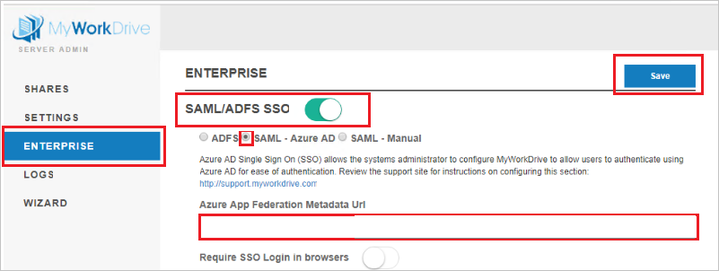

# チュートリアル:MyWorkDrive と Azure Active Directory の統合

このチュートリアルでは、MyWorkDrive と Azure Active Directory (Azure AD) を統合する方法について説明します。 Azure AD と MyWorkDrive を統合すると、次のことができます。

* MyWorkDrive にアクセスする Azure AD ユーザーを制御します。
* ユーザーが自分の Azure AD アカウントを使用して MyWorkDrive に自動的にサインインできるようにします。
* 1 つの中央サイト (Azure Portal) で自分のアカウントを管理します。

## 前提条件

開始するには、次が必要です。

* Azure AD サブスクリプション。 サブスクリプションがない場合は、[無料アカウント](https://azure.microsoft.com/free/)を取得できます。
* MyWorkDrive でのシングル サインオン (SSO) が有効なサブスクリプション。

## シナリオの説明

このチュートリアルでは、テスト環境で Azure AD の SSO を構成してテストします。 
* MyWorkDrive では、**SP** と **IDP** Initiated SSO がサポートされます。

> [!NOTE]
> このアプリケーションの識別子は固定文字列値であるため、1 つのテナントで構成できるインスタンスは 1 つだけです。

## ギャラリーからの MyWorkDrive の追加

Azure AD への MyWorkDrive の統合を構成するには、ギャラリーから管理対象 SaaS アプリの一覧に MyWorkDrive を追加する必要があります。

1. 職場または学校アカウントか、個人の Microsoft アカウントを使用して、Azure portal にサインインします。
1. 左のナビゲーション ウィンドウで **[Azure Active Directory]** サービスを選択します。
1. **[エンタープライズ アプリケーション]** に移動し、 **[すべてのアプリケーション]** を選択します。
1. 新しいアプリケーションを追加するには、 **[新しいアプリケーション]** を選択します。
1. **[ギャラリーから追加する]** セクションで、検索ボックスに「**MyWorkDrive**」と入力します。
1. 結果ウィンドウで **[MyWorkDrive]** を選択し、アプリケーションを追加します。 お使いのテナントにアプリが追加されるのを数秒待機します。

## MyWorkDrive の Azure AD SSO の構成とテスト

**B.Simon** というテスト ユーザーを使用して、MyWorkDrive で Azure AD SSO を構成してテストします。 SSO が機能するには、Azure AD ユーザーと MyWorkDrive の関連ユーザーの間で、リンク関係を確立する必要があります。

MyWorkDrive で Azure AD SSO を構成してテストするには、次の手順に従います。

1. **[Azure AD SSO の構成](#configure-azure-ad-sso)** - ユーザーがこの機能を使用できるようにします。
    1. **[Azure AD のテスト ユーザーの作成](#create-an-azure-ad-test-user)** - B.Simon で Azure AD のシングル サインオンをテストします。
    1. **[Azure AD テスト ユーザーの割り当て](#assign-the-azure-ad-test-user)** - B.Simon が Azure AD シングル サインオンを使用できるようにします。
1. **[MyWorkDrive SSO の構成](#configure-myworkdrive-sso)** - アプリケーション側でシングル サインオン設定を構成します。
    1. **[MyWorkDrive のテスト ユーザーの作成](#create-myworkdrive-test-user)** - MyWorkDrive で B. Simon に対応するユーザーを作成し、Azure AD のこのユーザーにリンクさせます。
1. **[SSO のテスト](#test-sso)** - 構成が機能するかどうかを確認します。

## Azure AD SSO の構成

これらの手順に従って、Azure portal で Azure AD SSO を有効にします。

1. Azure portal の **MyWorkDrive** アプリケーション統合ページで、 **[管理]** セクションを見つけて、 **[シングル サインオン]** を選択します。
1. **[シングル サインオン方式の選択]** ページで、 **[SAML]** を選択します。
1. **[SAML によるシングル サインオンのセットアップ]** ページで、 **[基本的な SAML 構成]** の鉛筆アイコンをクリックして設定を編集します。

   

1. **[基本的な SAML 構成]** ページで、アプリケーションを **IDP** Initiated モードで構成する場合は、次の手順を行います。

    **[応答 URL]** ボックスに、`https://<SERVER.DOMAIN.COM>/SAML/AssertionConsumerService.aspx` のパターンを使用して URL を入力します

1. アプリケーションを **SP** 開始モードで構成する場合は、 **[追加の URL を設定します]** をクリックして次の手順を実行します。

    **[サインオン URL]** ボックスに、`https://<SERVER.DOMAIN.COM>/Account/Login-saml` という形式で URL を入力します。

    > [!NOTE]
    > これらは実際の値ではありません。 実際の応答 URLとサインオン URL でこれらの値を更新します。 自社の MyWorkDrive サーバーのホスト名を入力します。たとえば、次のようになります。
    > 
    > 応答 URL: `https://yourserver.yourdomain.com/SAML/AssertionConsumerService.aspx`
    > 
    > サインオン URL: `https://yourserver.yourdomain.com/Account/Login-saml`
    > 
    > これらの値に対して独自のホスト名と TLS/SSL 証明書を設定する方法がわからない場合は、[MyWorkDrive サポート チーム](mailto:support@myworkdrive.com)にお問い合わせください。

1. **[SAML でシングル サインオンをセットアップします]** ページの **[SAML 署名証明書]** セクションで、コピー ボタンをクリックして **[アプリのフェデレーション メタデータ URL]** をクリップボードにコピーします。

    

### Azure AD のテスト ユーザーの作成

このセクションでは、Azure portal で Britta Simon というテスト ユーザーを作成します。

1. Azure portal の左側のウィンドウから、 **[Azure Active Directory]** 、 **[ユーザー]** 、 **[すべてのユーザー]** の順に選択します。
1. 画面の上部にある **[新しいユーザー]** を選択します。
1. **[ユーザー]** プロパティで、以下の手順を実行します。
   1. **[名前]** フィールドに「`Britta Simon`」と入力します。  
   1. **[ユーザー名]** フィールドに「username@companydomain.extension」と入力します。 たとえば、「 `BrittaSimon@contoso.com` 」のように入力します。
   1. **[パスワードを表示]** チェック ボックスをオンにし、 **[パスワード]** ボックスに表示された値を書き留めます。
   1. **Create** をクリックしてください。

### Azure AD テスト ユーザーの割り当て

このセクションでは、Britta Simon に MyWorkDrive へのアクセスを許可することで、このユーザーが Azure シングル サインオンを使用できるようにします。

1. Azure portal で **[エンタープライズ アプリケーション]** を選択し、 **[すべてのアプリケーション]** を選択します。
1. アプリケーションの一覧で **[MyWorkDrive]** を選択します。
1. アプリの概要ページで、 **[管理]** セクションを見つけて、 **[ユーザーとグループ]** を選択します。
1. **[ユーザーの追加]** を選択し、 **[割り当ての追加]** ダイアログで **[ユーザーとグループ]** を選択します。
1. **[ユーザーとグループ]** ダイアログの [ユーザー] の一覧から **Britta Simon** を選択し、画面の下部にある **[選択]** ボタンをクリックします。
1. SAML アサーション内に任意のロール値が必要な場合、 **[ロールの選択]** ダイアログでユーザーに適したロールを一覧から選択し、画面の下部にある **[選択]** をクリックします。
1. **[割り当ての追加]** ダイアログで、 **[割り当て]** をクリックします。

## MyWorkDrive の SSO を構成する

1. MyWorkDrive 内での構成を自動化するには、 **[拡張機能のインストール]** をクリックして **My Apps Secure Sign-in ブラウザー拡張機能** をインストールする必要があります。

    

1. ブラウザーに拡張機能を追加した後、 **[Setup MyWorkDrive]\(MyWorkDrive のセットアップ\)** をクリックすると、MyWorkDrive アプリケーションに移動します。 そこから、管理者の資格情報を入力して MyWorkDrive にサインインします。 ブラウザー拡張機能によりアプリケーションが自動的に構成され、手順 3 から 4 が自動化されます。

    

1. MyWorkDrive を手動で設定する場合、別の Web ブラウザー ウィンドウで、セキュリティ管理者として MyWorkDrive にサインインします。

1. MyWorkDrive サーバー上の管理パネルで、 **[ENTERPRISE]\(エンタープライズ\)** をクリックし、次の手順を実行します。

    

    a. **[SAML/ADFS SSO]\(SAML/ADFS SSO\)** を有効にします。

    b. **[SAML - Azure AD]** を選択します。

    c. **[Azure App Federation Metadata Url]\(Azure アプリのフェデレーション メタデータ URL\)** テキスト ボックスに、Azure portal からコピーした **[アプリのフェデレーション メタデータ URL]** の値を貼り付けます。

    d. **[保存]** をクリックします。

    > [!NOTE]
    > 追加情報については、[MyWorkDrive の Azure AD サポートに関する記事](https://www.myworkdrive.com/support/saml-single-sign-on-azure-ad/)をご覧ください。

### MyWorkDrive テスト ユーザーの作成

このセクションでは、MyWorkDrive で Britta Simon というユーザーを作成します。 [MyWorkDrive サポート チーム](mailto:support@myworkdrive.com)と連携し、MyWorkDrive プラットフォームにユーザーを追加します。 シングル サインオンを使用する前に、ユーザーを作成し、有効化する必要があります。

## SSO のテスト

このセクションでは、次のオプションを使用して Azure AD のシングル サインオン構成をテストします。 

#### SP Initiated:

* Azure portal で **[このアプリケーションをテストします]** をクリックします。 これにより、ログイン フローを開始できる MyWorkDrive のサインオン URL にリダイレクトされます。  

* MyWorkDrive のサインオン URL に直接移動し、そこからログイン フローを開始します。

#### IDP Initiated:

* Azure portal で **[このアプリケーションをテストします]** をクリックすると、SSO を設定した MyWorkDrive に自動的にサインインされます。 

また、Microsoft マイ アプリを使用して、任意のモードでアプリケーションをテストすることもできます。 マイ アプリで [MyWorkDrive] タイルをクリックすると、SP モードで構成されている場合は、ログイン フローを開始するためのアプリケーション サインオン ページにリダイレクトされます。IDP モードで構成されている場合は、SSO を設定した MyWorkDrive に自動的にサインインされます。 マイ アプリの詳細については、[マイ アプリの概要](https://support.microsoft.com/account-billing/sign-in-and-start-apps-from-the-my-apps-portal-2f3b1bae-0e5a-4a86-a33e-876fbd2a4510)に関するページを参照してください。

## 次のステップ

MyWorkDrive を構成したら、組織の機密データを流出と侵入からリアルタイムで保護するセッション制御を適用することができます。 セッション制御は、条件付きアクセスを拡張したものです。 [Microsoft Defender for Cloud Apps でセッション制御を適用する方法をご覧ください](/cloud-app-security/proxy-deployment-aad)。
