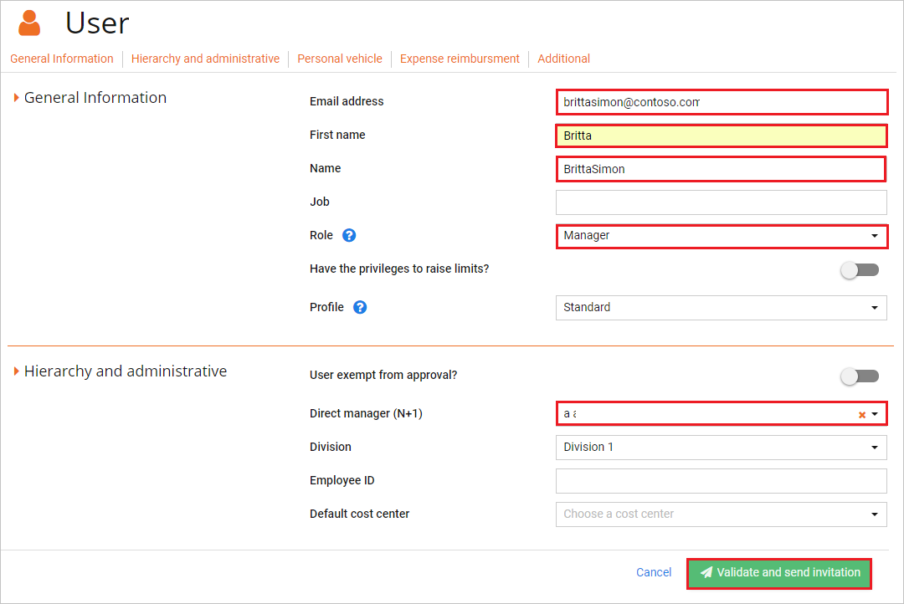

# チュートリアル: Azure AD SSO と N2F - Expense reports の統合

このチュートリアルでは、N2F - Expense reports と Azure Active Directory (Azure AD) を統合する方法について説明します。 N2F - Expense reports と Azure AD を統合すると、次のことができます。

* N2F - Expense reports にアクセスできるユーザーを Azure AD で制御する。
* ユーザーが自分の Azure AD アカウントを使用して N2F - Expense reports に自動的にサインインできるようにする。
* 1 つの中央サイト (Azure Portal) で自分のアカウントを管理します。

## 前提条件

開始するには、次が必要です。

* Azure AD サブスクリプション。 サブスクリプションがない場合は、[無料アカウント](https://azure.microsoft.com/free/)を取得できます。
* N2F - Expense reports でのシングル サインオン (SSO) が有効なサブスクリプション。

## シナリオの説明

このチュートリアルでは、テスト環境で Azure AD のシングル サインオンを構成してテストします。

* N2F - Expense reports では、**SP** および **IDP** Initiated SSO がサポートされます

## ギャラリーから N2F - Expense reports を追加する

Azure AD への N2F - Expense reports の統合を構成するには、マネージド SaaS アプリの一覧にギャラリーから N2F - Expense reports を追加する必要があります。

1. 職場または学校アカウントか、個人の Microsoft アカウントを使用して、Azure portal にサインインします。
1. 左のナビゲーション ウィンドウで **[Azure Active Directory]** サービスを選択します。
1. **[エンタープライズ アプリケーション]** に移動し、 **[すべてのアプリケーション]** を選択します。
1. 新しいアプリケーションを追加するには、 **[新しいアプリケーション]** を選択します。
1. **[ギャラリーから追加する]** セクションで、検索ボックスに「**N2F - Expense reports**」と入力します。
1. 結果のパネルから **[N2F - Expense reports]** を選択し、アプリを追加します。 お使いのテナントにアプリが追加されるのを数秒待機します。

## N2F - Expense reports のための Azure AD SSO の構成とテスト

**B.Simon** というテスト ユーザーを使用して、N2F - Expense reports 用に Azure AD SSO を構成してテストします。 SSO を機能させるために、Azure AD ユーザーと N2F - Expense reports の関連ユーザーとの間にリンク関係を確立する必要があります。

N2F - Expense reports 用に Azure AD SSO を構成してテストするには、次の手順を実行します。

1. **[Azure AD SSO の構成](#configure-azure-ad-sso)** - ユーザーがこの機能を使用できるようにします。
    1. **[Azure AD のテスト ユーザーの作成](#create-an-azure-ad-test-user)** - B.Simon で Azure AD のシングル サインオンをテストします。
    1. **[Azure AD テスト ユーザーの割り当て](#assign-the-azure-ad-test-user)** - B.Simon が Azure AD シングル サインオンを使用できるようにします。
1. **[N2F - Expense reports の SSO の構成](#configure-n2f---expense-reports-sso)** - アプリケーション側でシングル サインオン設定を構成します。
    1. **[N2F - Expense reports のテスト ユーザーの作成](#create-n2f---expense-reports-test-user)** - Azure AD の B.Simon にリンクさせるために、対応するユーザーを N2F - Expense reports で作成します。
1. **[SSO のテスト](#test-sso)** - 構成が機能するかどうかを確認します。

## Azure AD SSO の構成

これらの手順に従って、Azure portal で Azure AD SSO を有効にします。

1. Azure portal の **[N2F - Expense reports]** アプリケーション統合ページで、 **[管理]** セクションを見つけて、 **[シングル サインオン]** を選択します。
1. **[シングル サインオン方式の選択]** ページで、 **[SAML]** を選択します。
1. **[SAML によるシングル サインオンのセットアップ]** ページで、 **[基本的な SAML 構成]** の鉛筆アイコンをクリックして設定を編集します。

   

4. **IDP** 開始モードでアプリケーションを構成する場合は、アプリケーションが Azure と既に統合されているため、 **[基本的な SAML 構成]** セクションで実行する必要がある手順はありません。

5. アプリケーションを **SP** 開始モードで構成する場合は、 **[追加の URL を設定します]** をクリックして次の手順を実行します。

    **[サインオン URL]** テキスト ボックスに、URL として「`https://www.n2f.com/app/`」と入力します。

6. **Set up Single Sign-On with SAML\(SAML でのシングルサインオンの設定** ページの **SAML 署名証明書** セクションで、コピー ボタンをクリックして **App Federation Metadata Url\(アプリのフェデレーション メタデータ URL)** をコピーして、コンピューターに保存します。

    

7. **[myPolicies のセットアップ]** セクションで、要件に従って適切な URL をコピーします。

    

### Azure AD のテスト ユーザーの作成 

このセクションでは、Azure portal 内で B.Simon というテスト ユーザーを作成します。

1. Azure portal の左側のウィンドウから、 **[Azure Active Directory]** 、 **[ユーザー]** 、 **[すべてのユーザー]** の順に選択します。
1. 画面の上部にある **[新しいユーザー]** を選択します。
1. **[ユーザー]** プロパティで、以下の手順を実行します。
   1. **[名前]** フィールドに「`B.Simon`」と入力します。  
   1. **[ユーザー名]** フィールドに「username@companydomain.extension」と入力します。 たとえば、「 `B.Simon@contoso.com` 」のように入力します。
   1. **[パスワードを表示]** チェック ボックスをオンにし、 **[パスワード]** ボックスに表示された値を書き留めます。
   1. **Create** をクリックしてください。

### Azure AD テスト ユーザーの割り当て

このセクションでは、B.Simon に N2F - Expense reports へのアクセスを許可することで、Azure シングル サインオンを使用できるようにします。

1. Azure portal で **[エンタープライズ アプリケーション]** を選択し、 **[すべてのアプリケーション]** を選択します。
1. アプリケーションの一覧で **[N2F - Expense reports]** を選択します。
1. アプリの概要ページで、 **[管理]** セクションを見つけて、 **[ユーザーとグループ]** を選択します。
1. **[ユーザーの追加]** を選択し、 **[割り当ての追加]** ダイアログで **[ユーザーとグループ]** を選択します。
1. **[ユーザーとグループ]** ダイアログの [ユーザー] の一覧から **[B.Simon]** を選択し、画面の下部にある **[選択]** ボタンをクリックします。
1. ユーザーにロールが割り当てられることが想定される場合は、 **[ロールの選択]** ドロップダウンからそれを選択できます。 このアプリに対してロールが設定されていない場合は、[既定のアクセス] ロールが選択されていることを確認します。
1. **[割り当ての追加]** ダイアログで、 **[割り当て]** をクリックします。

## N2F - Expense reports の SSO の構成

1. 別の Web ブラウザー ウィンドウで、N2F - Expense reports 企業サイトに管理者としてサインインします。

2. **[Settings]\(設定\)** をクリックし、ドロップダウンから **[Advance Settings]\(詳細設定\)** を選択します。

    ![スクリーンショットでは、[Advance Settings]\(詳細設定\) が選択されています。](./media/n2f-expensereports-tutorial/profile.png)

3. **[Account & Settings]\(アカウントと設定\)** を選択します。

    ![スクリーンショットでは、[Account settings]\(アカウント設定\) が選択されています。](./media/n2f-expensereports-tutorial/account.png)

4. **[Authentication]\(認証\)** を選択し、 **[+ Add an authentication method]\(認証方法の追加\)** タブを選択します。

    ![スクリーンショットは、認証方法を追加できる [Account settings]\(アカウント設定\) の [Authentication]\(認証\) を示しています。](./media/n2f-expensereports-tutorial/general.png)

5. 認証方法として **[SAML Microsoft Office 365]** を選択します。

    ![スクリーンショットは、[SAML Microsoft Office 365] が選択されている [Authentication method]\(認証方法\) を示しています。](./media/n2f-expensereports-tutorial/method.png)

6. **[Authentication method]\(認証方法\)** セクションで、次の手順に従います。

    ![スクリーンショットは、説明した値を入力できる [Authentication method]\(認証方法\) を示しています。](./media/n2f-expensereports-tutorial/metadata.png)

    a. **[エンティティ ID]** ボックスに、Azure portal からコピーした **Azure AD ID** の値を貼り付けます。

    b. **[Metadata URL]\(メタデータ URL\)** ボックスに、Azure Portal からコピーした **[アプリのフェデレーション メタデータ URL]** の値を貼り付けます。

    c. **[保存]** をクリックします。

### N2F - Expense reports テストユーザーの作成

Azure AD ユーザーが N2F - Expense reports にログインできるようにするには、そのユーザーを N2F - Expense reports にプロビジョニングする必要があります。 N2F - Expense reports の場合、プロビジョニングは手動で行います。

**ユーザー アカウントをプロビジョニングするには、次の手順に従います。**

1. N2F - Expense reports 企業サイトに管理者としてログインします。

2. **[Settings]\(設定\)** をクリックし、ドロップダウンから **[Advance Settings]\(詳細設定\)** を選択します。

    ![スクリーンショットでは、[Advance Settings]\(詳細設定\) が選択されています。](./media/n2f-expensereports-tutorial/profile.png)

3. ナビゲーション パネルで **[Users]\(ユーザー\)** タブをクリックします。

    ![スクリーンショットは、[Users]\(ユーザー\) を示しています。](./media/n2f-expensereports-tutorial/user.png)

4. **[+ New user]\(+ 新規ユーザー\)** タブを選択します。

    ![スクリーンショットは、[New user]\(新規ユーザー\) オプションを示しています。](./media/n2f-expensereports-tutorial/create-user.png)

5. **[User]\(ユーザー\)** セクションで、次の手順を実行します。

    

    a. **[Email address]\(メール アドレス\)** ボックスに、ユーザーのメール アドレス (**brittasimon\@contoso.com** など) を入力します。

    b. **[First name]\(名\)** ボックスに、ユーザーの名前を入力します (この例では **Britta**)。

    c. **[Name]\(名前\)** ボックスに、ユーザーの名前 (**BrittaSimon** など) を入力します。

    d. 組織の要件に応じて、 **[Role]\(ロール\)、[Direct manager (N+1)]\(直属の上司\)** および **[Division]\(部門\)** を選択します。

    e. **[Validate and send invitation]\(検証して招待を送信\)** をクリックします。

    > [!NOTE]
    > ユーザーを追加するときに問題が発生した場合は、[N2F - Expense reports のサポート チーム](mailto:support@n2f.com)にお問い合わせください。

## SSO のテスト

このセクションでは、次のオプションを使用して Azure AD のシングル サインオン構成をテストします。 

#### SP Initiated:

* Azure portal で **[このアプリケーションをテストします]** をクリックします。 これにより、ログイン フローを開始できる N2F - Expense reports のサインオン URL にリダイレクトされます。  

* N2F - Expense reports のサインオン URL に直接移動し、そこからログイン フローを開始します。

#### IDP Initiated:

* Azure portal で **[このアプリケーションをテストします]** をクリックすると、SSO を設定した N2F - Expense reports に自動的にサインインされます。 

また、Microsoft マイ アプリを使用して、任意のモードでアプリケーションをテストすることもできます。 マイ アプリで [N2F - Expense reports] タイルをクリックすると、SP モードで構成されている場合は、ログイン フローを開始するためのアプリケーション サインオン ページにリダイレクトされます。IDP モードで構成されている場合は、SSO を設定した N2F - Expense reports に自動的にサインインされます。 マイ アプリの詳細については、[マイ アプリの概要](../user-help/my-apps-portal-end-user-access.md)に関するページを参照してください。

## 次のステップ

N2F - Expense reports を構成したら、ご自分の組織の機密データの流出と侵入をリアルタイムで保護するセッション制御を適用することができます。 セッション制御は、条件付きアクセスを拡張したものです。 [Microsoft Defender for Cloud Apps でセッション制御を適用する方法をご覧ください](/cloud-app-security/proxy-deployment-aad)。
