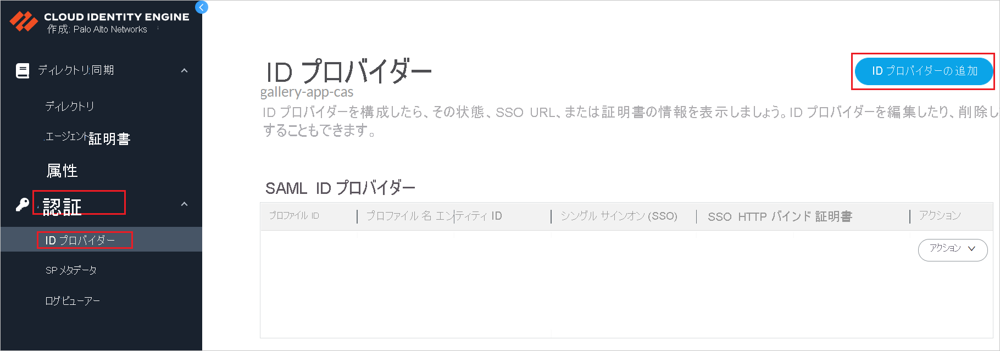
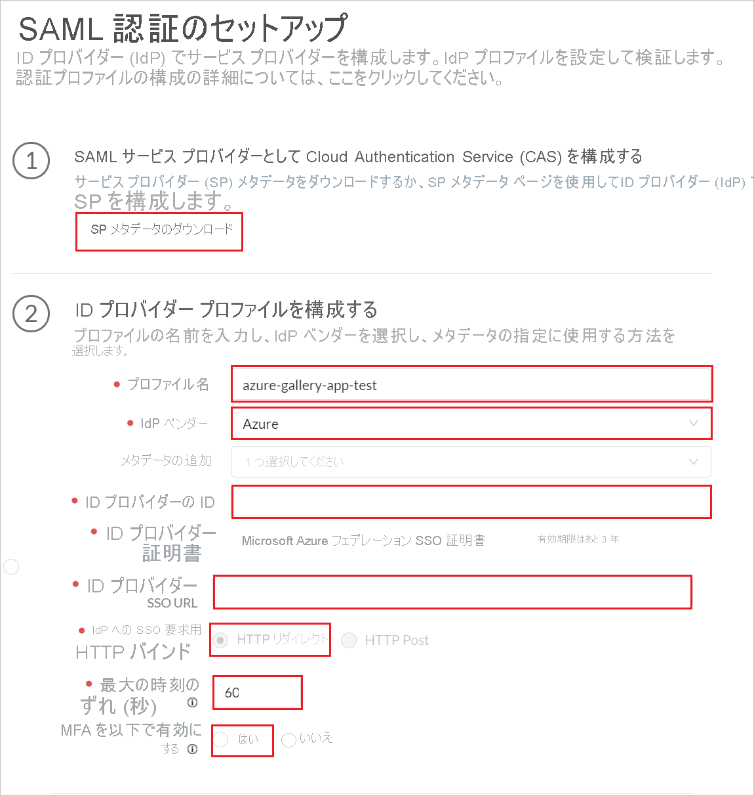
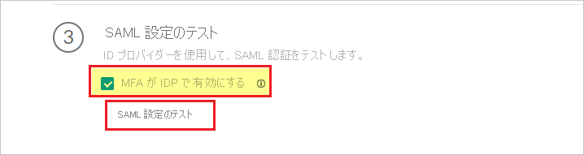
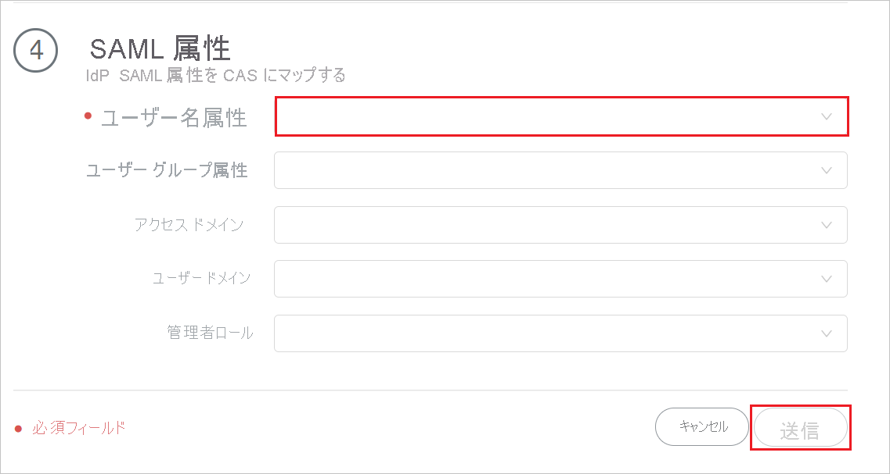

# チュートリアル: Palo Alto Networks Cloud Identity Engine - Cloud Authentication Service での Azure Active Directory シングル サインオン (SSO) 統合

このチュートリアルでは、Palo Alto Networks Cloud Identity Engine - Cloud Authentication Service を Azure Active Directory (Azure AD) と統合する方法について説明します。 Palo Alto Networks Cloud Identity Engine - Cloud Authentication Service を Azure AD と統合すると、次のことができるようになります。

* だれが Palo Alto Networks Cloud Identity Engine - Cloud Authentication Service にアクセスできるかを Azure AD で制御する。
* ユーザーが自分の Azure AD アカウントを使用して Palo Alto Networks Cloud Identity Engine - Cloud Authentication Service に自動的にサインインできるようにする。
* 1 つの中央サイト (Azure Portal) で自分のアカウントを管理します。

## 前提条件

開始するには、次が必要です。

* Azure AD サブスクリプション。 サブスクリプションがない場合は、[無料アカウント](https://azure.microsoft.com/free/)を取得できます。
* Palo Alto Networks Cloud Identity Engine - Cloud Authentication Service のシングルサインオン (SSO) に対応しているサブスクリプション。

## シナリオの説明

このチュートリアルでは、テスト環境で Azure AD の SSO を構成してテストします。

* Palo Alto Networks Cloud Identity Engine - Cloud Authentication Service では、**SP** によって開始される SSO がサポートされています。

* Palo Alto Networks Cloud Identity Engine - Cloud Authentication Service では、**Just In Time** ユーザー プロビジョニングがサポートされています。

## Palo Alto Networks Cloud Identity Engine - Cloud Authentication Service をギャラリーから追加する

Palo Alto Networks Cloud Identity Engine - Cloud Authentication Service の Azure AD 統合を構成するには、ギャラリーからマネージド SaaS アプリの一覧に Palo Alto Networks Cloud Identity Engine - Cloud Authentication Service を追加する必要があります。

1. 職場または学校アカウントか、個人の Microsoft アカウントを使用して、Azure portal にサインインします。
1. 左のナビゲーション ウィンドウで **[Azure Active Directory]** サービスを選択します。
1. **[エンタープライズ アプリケーション]** に移動し、 **[すべてのアプリケーション]** を選択します。
1. 新しいアプリケーションを追加するには、 **[新しいアプリケーション]** を選択します。
1. **[ギャラリーから追加する]** セクションで、検索ボックスに「**Palo Alto Networks cloud Identity Engine - cloud Authentication Service**」と入力します。
1. 結果パネルで **Palo Alto Networks Cloud Identity Engine - Cloud Authentication Service** を選択し、このアプリを追加します。 お使いのテナントにアプリが追加されるのを数秒待機します。

## Palo Alto Networks Cloud Identity Engine - Cloud Authentication Service 用に Azure AD SSO を構成してテストする

**B.Simon** というテスト ユーザーを使用して、Palo Alto Networks Cloud Identity Engine - Cloud Authentication Service で Azure AD SSO を構成し、テストします。 SSO を機能させるために、Azure AD ユーザーと Palo Alto Networks Cloud Identity Engine - Cloud Authentication Service の関連ユーザーの間にリンク関係を確立する必要があります。

Palo Alto Networks Cloud Identity Engine - Cloud Authentication Service で Azure AD SSO を構成し、テストするには、次の手順を行います。

1. **[Azure AD SSO の構成](#configure-azure-ad-sso)** - ユーザーがこの機能を使用できるようにします。
    1. **[Azure AD のテスト ユーザーの作成](#create-an-azure-ad-test-user)** - B.Simon で Azure AD のシングル サインオンをテストします。
    1. **[Azure AD テスト ユーザーの割り当て](#assign-the-azure-ad-test-user)** - B.Simon が Azure AD シングル サインオンを使用できるようにします。
1. **[Palo Alto Networks Cloud Identity Engine - Cloud Authentication Service の SSO を構成する](#configure-palo-alto-networks-cloud-identity-engine---cloud-authentication-service-sso)** - アプリケーション側のシングル サインオン設定を構成します。
    1. **[Palo Alto Networks Cloud Identity Engine - Cloud Authentication Service テスト ユーザーを作成する](#create-palo-alto-networks-cloud-identity-engine---cloud-authentication-service-test-user)** - Palo Alto Networks Cloud Identity Engine - Cloud Authentication Service で、Azure AD のユーザー表現にリンクされる、B.Simon に対応するユーザーを作成します。
1. **[SSO のテスト](#test-sso)** - 構成が機能するかどうかを確認します。

## Azure AD SSO の構成

これらの手順に従って、Azure portal で Azure AD SSO を有効にします。

1. Azure portal の **Palo Alto Networks Cloud Identity Engine - Cloud Authentication Service** アプリケーション統合ページで、 **[管理]** セクションを探し、 **[シングル サインオン]** を選択します。
1. **[シングル サインオン方式の選択]** ページで、 **[SAML]** を選択します。
1. **[SAML によるシングル サインオンのセットアップ]** ページで、 **[基本的な SAML 構成]** の鉛筆アイコンをクリックして設定を編集します。

   

1. **[基本的な SAML 構成]** セクションで、**サービス プロバイダー メタデータ ファイル** がある場合は、次の手順に従います。

    a. **[メタデータ ファイルをアップロードします]** をクリックします。

    

    b. **フォルダー ロゴ** をクリックしてメタデータ ファイルを選択し、 **[アップロード]** をクリックします。

    

    c. メタデータ ファイルが正常にアップロードされると、**識別子** の値が、[基本的な SAML 構成] セクションに自動的に設定されます。

    d. **[サインオン URL]** ボックスに、`https://<RegionUrl>.paloaltonetworks.com/sp/acs` という形式で URL を入力します。

    > [!Note]
    > **識別子** の値が自動的に設定されない場合は、要件に応じて手動で値を入力してください。 サインオン URL は実際の値ではありません。 この値を実際のサインオン URL で更新してください。 この値を取得するには、[Palo Alto Networks Cloud Identity Engine - Cloud Authentication Service クライアント サポート チーム](mailto:support@paloaltonetworks.com)にお問い合わせください。 Azure portal の **[基本的な SAML 構成]** セクションに示されているパターンを参照することもできます。

1. Palo Alto Networks Cloud Identity Engine - Cloud Authentication Service アプリケーションでは、特定の形式の SAML アサーションを受け取ることが想定されるため、SAML トークン属性の構成にカスタム属性マッピングを追加する必要があります。 次のスクリーンショットには、既定の属性一覧が示されています。

    

1. 上記に加えて、Palo Alto Networks Cloud Identity Engine - Cloud Authentication Service アプリケーションでは、以下に示すように、SAML 応答で返される属性がさらにいくつかあることが想定されます。 これらの属性も値が事前に設定されますが、要件に従ってそれらの値を確認することができます。
    
    | 名前 | ソース属性|
    | ---------------| --------- |
    | グループ |  user.groups |
    | username | user.userprincipalname |

1. **[Set up single sign-on with SAML]\(SAML でシングル サインオンをセットアップします\)** ページの **[SAML 署名証明書]** セクションで、コピー ボタンをクリックして **[アプリのフェデレーション メタデータ URL]** をコピーして、お使いのコンピューターに保存します。

    

### Azure AD のテスト ユーザーの作成

このセクションでは、Azure portal 内で B.Simon というテスト ユーザーを作成します。

1. Azure portal の左側のウィンドウから、 **[Azure Active Directory]** 、 **[ユーザー]** 、 **[すべてのユーザー]** の順に選択します。
1. 画面の上部にある **[新しいユーザー]** を選択します。
1. **[ユーザー]** プロパティで、以下の手順を実行します。
   1. **[名前]** フィールドに「`B.Simon`」と入力します。  
   1. **[ユーザー名]** フィールドに「username@companydomain.extension」と入力します。 たとえば、「 `B.Simon@contoso.com` 」のように入力します。
   1. **[パスワードを表示]** チェック ボックスをオンにし、 **[パスワード]** ボックスに表示された値を書き留めます。
   1. **Create** をクリックしてください。

### Azure AD テスト ユーザーの割り当て

このセクションでは、B.Simon に Palo Alto Networks Cloud Identity Engine - Cloud Authentication Service へのアクセスを許可して、このユーザーが Azure シングル サインオンを使用できるようにします。

1. Azure portal で **[エンタープライズ アプリケーション]** を選択し、 **[すべてのアプリケーション]** を選択します。
1. アプリケーションの一覧で、**Palo Alto Networks Cloud Identity Engine - Cloud Authentication Service** を選択します。
1. アプリの概要ページで、 **[管理]** セクションを見つけて、 **[ユーザーとグループ]** を選択します。
1. **[ユーザーの追加]** を選択し、 **[割り当ての追加]** ダイアログで **[ユーザーとグループ]** を選択します。
1. **[ユーザーとグループ]** ダイアログの [ユーザー] の一覧から **[B.Simon]** を選択し、画面の下部にある **[選択]** ボタンをクリックします。
1. ユーザーにロールが割り当てられることが想定される場合は、 **[ロールの選択]** ドロップダウンからそれを選択できます。 このアプリに対してロールが設定されていない場合は、[既定のアクセス] ロールが選択されていることを確認します。
1. **[割り当ての追加]** ダイアログで、 **[割り当て]** をクリックします。

## Palo Alto Networks Cloud Identity Engine - Cloud Authentication Service SSO を構成する

1. ご自分の Palo Alto Networks Cloud Identity Engine - Cloud Authentication Service 企業サイトに管理者としてログインします。

1. **[認証]**  >  **[ID プロバイダー]** に移動し、 **[ID プロバイダーの追加]** をクリックします。

     

1. **[Set Up SAML Authentication]\(SAML 認証の設定\)** ページで、次の手順を行います。

     

    a. ステップ 1 で、 **[Download SP Metadata]\(SP メタデータのダウンロード\)** をクリックするとメタデータ ファイルがダウンロードされ、ご自分のコンピューターに保存されます。

    b. ステップ 2 で、必須フィールドに入力して、Azure portal からコピーしておいた **ID プロバイダー プロファイルを構成** します。 

    c. ステップ 3 で、 **[Test SAML Setup]\(SAML セットアップのテスト\)** をクリックしてプロファイルの構成を確認し、 **[MFA is enabled on the IDP]\(MFA が IDP で有効\)** を選択します。

    

    > [!NOTE]
    > **Palo Alto Networks Cloud Identity Engine - Cloud Authentication Service** の SSO をテストするには、**Palo Alto Networks Cloud Identity Engine - Cloud Authentication Service** コンソールを開き、 **[テスト接続]** ボタンをクリックし、 **[Create an Azure AD test user]\(Azure AD テスト ユーザーの作成\)** セクションで作成したテスト アカウントを使用して認証します。 

    d. ステップ 4 で、 **[USERNAME ATTRIBUTE]\(ユーザー名属性\)** を入力し、 **[送信]** をクリックします。 

    

### Palo Alto Networks Cloud Identity Engine - Cloud Authentication Service テスト ユーザーを作成する

このセクションでは、**Palo Alto Networks Cloud Identity Engine - Cloud Authentication Service** で Britta Simon というユーザーが作成されます。 **Palo Alto Networks Cloud Identity Engine - Cloud Authentication Service** では、Just-In-Time ユーザープロビジョニングがサポートされています。この設定は、既定で有効になっています。 このセクションでは、ユーザー側で必要な操作はありません。 ユーザーが **Palo Alto Networks Cloud Identity Engine - Cloud Authentication Service** にまだ存在しない場合は、認証後に新しいユーザーが作成されます。

## SSO のテスト 

**Palo Alto Networks Cloud Identity Engine - Cloud Authentication Service** の SSO をテストするには、**Palo Alto Networks Cloud Identity Engine - Cloud Authentication Service** コンソールを開き、 **[テスト接続]** ボタンをクリックし、 **[Create an Azure AD test user]\(Azure AD テスト ユーザーの作成\)** セクションで作成したテスト アカウントを使用して認証します。

## 次の手順

**Palo Alto Networks Cloud Identity Engine - Cloud Authentication Service** を構成すると、セッション制御を適用でき、組織の機密データの流出と侵入からリアルタイムで保護します。 セッション制御は、条件付きアクセスを拡張したものです。 [Microsoft Defender for Cloud Apps でセッション制御を強制する方法](/cloud-app-security/proxy-deployment-aad)をご覧ください。
