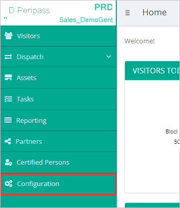
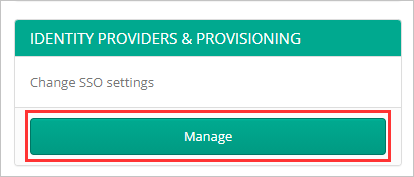
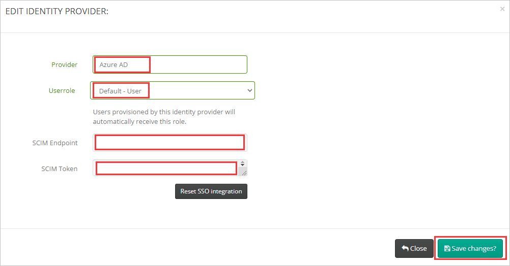
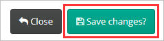

# チュートリアル: Peripass を構成し、自動ユーザー プロビジョニングに対応させる

このチュートリアルでは、自動ユーザー プロビジョニングを構成するために Peripass と Azure Active Directory (Azure AD) の両方で行う必要がある手順について説明します。 構成すると、Azure AD による Azure AD プロビジョニング サービスを使用した [Peripass](https://www.peripass.com/) へのユーザーとグループのプロビジョニングとプロビジョニング解除が自動的に行われます。 このサービスが実行する内容、しくみ、よく寄せられる質問の重要な詳細については、「[Azure Active Directory による SaaS アプリへのユーザー プロビジョニングとプロビジョニング解除の自動化](../app-provisioning/user-provisioning.md)」を参照してください。

## サポートされる機能
> [!div class="checklist"]
> * Peripass のユーザーを作成する
> * アクセスが不要になった場合に Peripass のユーザーを削除する
> * Azure AD と Peripass の間でユーザー属性の同期を維持する
> * Peripass に[シングル サインオンする](../manage-apps/add-application-portal-setup-oidc-sso.md) (推奨)

## 前提条件

このチュートリアルで説明するシナリオでは、次の前提条件目があることを前提としています。

* [Azure AD テナント](../develop/quickstart-create-new-tenant.md) 
* プロビジョニングを構成するための[アクセス許可](../roles/permissions-reference.md)を持つ Azure AD のユーザー アカウント (アプリケーション管理者、クラウド アプリケーション管理者、アプリケーション所有者、グローバル管理者など)。 
* Peripass テナント - テナントのセットアップについては [Peripass](https://www.peripass.com/) にお問い合わせください。
* テナントの構成に対するアクセス許可が与えられた Peripass ユーザー。

## 手順 1. プロビジョニングのデプロイを計画する
1. [プロビジョニング サービスのしくみ](../app-provisioning/user-provisioning.md)を確認します。
2. [プロビジョニングの対象](../app-provisioning/define-conditional-rules-for-provisioning-user-accounts.md)となるユーザーを決定します。
3. [Azure AD と Peripass の間でマップする](../app-provisioning/customize-application-attributes.md)データを決定します。

## 手順 2. Azure AD でのプロビジョニングをサポートするように Peripass を構成する

1. テナントのサインイン URL を使用して Peripass にサインインします。

2. テナントの **[Configuration]\(構成\)** に移動します。

   

3. **[Identity providers & provisioning]\(ID プロバイダーとプロビジョニング\)** の設定を開きます。

   

4. 構成している ID プロバイダーに **プロバイダー名** を指定します。

5.   プロビジョニングしたユーザーに割り当てる **ユーザー ロール** を選択します。

6. テナントの **SCIM エンドポイント** と **SCIM トークン** をメモします (後から Azure AD のエンタープライズ アプリケーションでユーザー プロビジョニングを構成する際に必要になります。**Peripass テナント URL** および **シークレット トークン** として使用します)。

   

7. 構成の **変更内容を保存** します。

   

## 手順 3. Azure AD アプリケーション ギャラリーから Peripass を追加する

Azure AD アプリケーション ギャラリーから Peripass を追加して、Peripass へのプロビジョニングの管理を開始します。 SSO のために Peripass を以前に設定している場合は、その同じアプリケーションを使用することができます。 ただし、統合を初めてテストするときは、別のアプリを作成することをお勧めします。 ギャラリーからアプリケーションを追加する方法の詳細については、[こちら](../manage-apps/add-application-portal.md)を参照してください。

## 手順 4. プロビジョニングの対象となるユーザーを定義する

Azure AD プロビジョニング サービスを使用すると、アプリケーションへの割り当て、ユーザーまたはグループの属性に基づいてプロビジョニングされるユーザーのスコープを設定できます。 割り当てに基づいてアプリにプロビジョニングされるユーザーのスコープを設定する場合、以下の[手順](../manage-apps/assign-user-or-group-access-portal.md)を使用して、ユーザーとグループをアプリケーションに割り当てることができます。 ユーザーまたはグループの属性のみに基づいてプロビジョニングされるユーザーのスコープを設定する場合、[こちら](../app-provisioning/define-conditional-rules-for-provisioning-user-accounts.md)で説明されているスコープ フィルターを使用できます。

* Peripass にユーザーとグループを割り当てるときは、**既定のアクセス** 以外のロールを選択する必要があります。 既定のアクセス ロールを持つユーザーは、プロビジョニングから除外され、プロビジョニング ログで実質的に資格がないとマークされます。 アプリケーションで使用できる唯一のロールが既定のアクセス ロールである場合は、[アプリケーション マニフェストを更新](../develop/howto-add-app-roles-in-azure-ad-apps.md)してロールを追加することができます。

* 小さいところから始めましょう。 全員にロールアウトする前に、少数のユーザーとグループでテストします。 プロビジョニングのスコープが割り当て済みユーザーとグループに設定される場合、これを制御するには、1 つまたは 2 つのユーザーまたはグループをアプリに割り当てます。 スコープがすべてのユーザーとグループに設定されている場合は、[属性ベースのスコープ フィルター](../app-provisioning/define-conditional-rules-for-provisioning-user-accounts.md)を指定できます。

## 手順 5. Peripass への自動ユーザー プロビジョニングを構成する

このセクションでは、Azure AD でのユーザー、グループ、またはその両方の割り当てに基づいて、TestApp でユーザー、グループ、またはその両方が作成、更新、および無効化されるように Azure AD プロビジョニング サービスを構成する手順について説明します。

### Azure AD で Peripass の自動ユーザー プロビジョニングを構成するには:

1. [Azure portal](https://portal.azure.com) にサインインします。 **[エンタープライズ アプリケーション]** を選択し、 **[すべてのアプリケーション]** を選択します。

   ![[エンタープライズ アプリケーション] ブレード](common/enterprise-applications.png)

2. アプリケーションの一覧で **[Peripass]** を選択します。

   

3. **[プロビジョニング]** タブを選択します。

   ![[プロビジョニング] タブ](common/provisioning.png)

4. **[プロビジョニング モード]** を **[自動]** に設定します。

   ![[プロビジョニング] タブ](common/provisioning-automatic.png)

5. **[管理者資格情報]** セクションで、Peripass の [テナントの URL] と [シークレット トークン] を入力します。 **[接続テスト]** をクリックして、Azure AD から Peripass に接続できることを確認します。 接続できない場合は、使用中の Peripass アカウントに管理者アクセス許可があることを確認してから、もう一度試します。

   

6. **[通知用メール]** フィールドに、プロビジョニングのエラー通知を受け取るユーザーまたはグループの電子メール アドレスを入力して、 **[エラーが発生したときにメール通知を送信します]** チェック ボックスをオンにします。

   

7. **[保存]** を選択します。

8. **[マッピング]** セクションの **[Synchronize Azure Active Directory Users to Peripass]\(Azure Active Directory ユーザーを Peripass に同期する\)** を選択します。

9. **[属性マッピング]** セクションで、Azure AD から Peripass に同期されるユーザー属性を確認します。 **[Matching]\(照合\)** プロパティとして選択されている属性は、更新操作で Peripass のユーザー アカウントとの照合に使用されます。 [一致する対象の属性](../app-provisioning/customize-application-attributes.md)を変更する場合は、その属性に基づいたユーザーのフィルター処理が確実に Peripass API でサポートされているようにする必要があります。 **[保存]** ボタンをクリックして変更をコミットします。

   |属性|Type|フィルター処理のサポート|
   |---|---|---|
   |userName|String|&check;
   |active|Boolean|
   |displayName|String|
   |externalId|String|
   |preferredLanguage|String|
   |name.givenName|String|
   |name.familyName|String|
   |name.formatted|String|
   |phoneNumbers[type eq "mobile"].value|String|
   |emails[type eq "work"].value|String|
   
10. スコープ フィルターを構成するには、[スコープ フィルターのチュートリアル](../app-provisioning/define-conditional-rules-for-provisioning-user-accounts.md)の次の手順を参照してください。

11. Peripass に対して Azure AD プロビジョニング サービスを有効にするには、 **[設定]** セクションで **[プロビジョニング状態]** を **[オン]** に変更します。

    ![プロビジョニングの状態を [オン] に切り替える](common/provisioning-toggle-on.png)

12. **[設定]** セクションの **[スコープ]** で目的の値を選択して、Peripass にプロビジョニングするユーザーやグループを定義します。

    

13. プロビジョニングの準備ができたら、 **[保存]** をクリックします。

    

この操作により、 **[設定]** セクションの **[スコープ]** で定義したすべてのユーザーとグループの初期同期サイクルが開始されます。 初期サイクルは後続の同期よりも実行に時間がかかります。後続のサイクルは、Azure AD のプロビジョニング サービスが実行されている限り約 40 分ごとに実行されます。

## 手順 6. デプロイを監視する
プロビジョニングを構成したら、次のリソースを使用してデプロイを監視します。

1. [プロビジョニング ログ](../reports-monitoring/concept-provisioning-logs.md)を使用して、正常にプロビジョニングされたユーザーと失敗したユーザーを特定します。
2. [進行状況バー](../app-provisioning/application-provisioning-when-will-provisioning-finish-specific-user.md)を確認して、プロビジョニング サイクルの状態と完了までの時間を確認します。
3. プロビジョニング構成が異常な状態になったと考えられる場合、アプリケーションは検疫されます。 検疫状態の詳細については、[こちら](../app-provisioning/application-provisioning-quarantine-status.md)を参照してください。

## その他のリソース

* [エンタープライズ アプリのユーザー アカウント プロビジョニングの管理](../app-provisioning/configure-automatic-user-provisioning-portal.md)
* [Azure Active Directory のアプリケーション アクセスとシングル サインオンとは](../manage-apps/what-is-single-sign-on.md)

## 次のステップ

* [プロビジョニング アクティビティのログの確認方法およびレポートの取得方法](../app-provisioning/check-status-user-account-provisioning.md)
