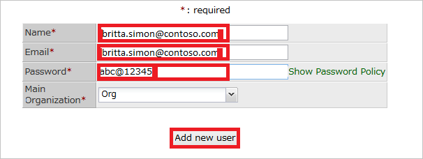

# チュートリアル:Azure AD SSO と Questetra BPM Suite の統合

このチュートリアルでは、Questetra BPM Suite と Azure Active Directory (Azure AD) を統合する方法について説明します。 Questetra BPM Suite と Azure AD を統合すると、次のことができます。

* Questetra BPM Suite にアクセスできるユーザーを Azure AD で制御する。
* ユーザーが自分の Azure AD アカウントで Questetra BPM Suite に自動的にサインインできるようにする。
* 1 つの中央サイト (Azure Portal) で自分のアカウントを管理します。

## 前提条件

開始するには、次が必要です。

* Azure AD サブスクリプション。 サブスクリプションがない場合は、[無料アカウント](https://azure.microsoft.com/free/)を取得できます。
* Questetra BPM Suite でのシングル サインオン (SSO) が有効なサブスクリプション。

## シナリオの説明

このチュートリアルでは、テスト環境で Azure AD のシングル サインオンを構成してテストします。

* Questetra BPM Suite では、**SP** Initiated SSO がサポートされます。

## ギャラリーからの Questetra BPM Suite の追加

Azure AD への Questetra BPM Suite の統合を構成するには、ギャラリーから管理対象 SaaS アプリの一覧に Questetra BPM Suite を追加する必要があります。

1. 職場または学校アカウントか、個人の Microsoft アカウントを使用して、Azure portal にサインインします。
1. 左のナビゲーション ウィンドウで **[Azure Active Directory]** サービスを選択します。
1. **[エンタープライズ アプリケーション]** に移動し、 **[すべてのアプリケーション]** を選択します。
1. 新しいアプリケーションを追加するには、 **[新しいアプリケーション]** を選択します。
1. **[ギャラリーから追加する]** セクションで、検索ボックスに「**Questetra BPM Suite**」と入力します。
1. 結果のパネルから **[Questetra BPM Suite]** を選択し、アプリを追加します。 お使いのテナントにアプリが追加されるのを数秒待機します。

## Questetra BPM Suite に対する Azure AD SSO の構成とテスト

**B.Simon** というテスト ユーザーを使用して、Questetra BPM Suite に対する Azure AD SSO を構成してテストします。 SSO を機能させるには、Azure AD ユーザーと Questetra BPM Suite の関連ユーザーとの間にリンク関係を確立する必要があります。

Questetra BPM Suite に対する Azure AD SSO を構成してテストするには、次の手順を実行します。

1. **[Azure AD SSO の構成](#configure-azure-ad-sso)** - ユーザーがこの機能を使用できるようにします。
    1. **[Azure AD のテスト ユーザーの作成](#create-an-azure-ad-test-user)** - B.Simon で Azure AD のシングル サインオンをテストします。
    1. **[Azure AD テスト ユーザーの割り当て](#assign-the-azure-ad-test-user)** - B.Simon が Azure AD シングル サインオンを使用できるようにします。
1. **[Questetra BPM Suite SSOの構成](#configure-questetra-bpm-suite-sso)** - アプリケーション側でシングル サインオン設定を構成します。
    1. **[Questetra BPM Suite のテスト ユーザーの作成](#create-questetra-bpm-suite-test-user)** - Questetra BPM Suite で B.Simon に対応するユーザーを作成し、Azure AD のそのユーザーにリンクさせます。
1. **[SSO のテスト](#test-sso)** - 構成が機能するかどうかを確認します。

## Azure AD SSO の構成

これらの手順に従って、Azure portal で Azure AD SSO を有効にします。

1. Azure portal の **Questetra BPM Suite** アプリケーション統合ページで、 **[管理]** セクションを見つけ、 **[シングル サインオン]** を選択します。
1. **[シングル サインオン方式の選択]** ページで、 **[SAML]** を選択します。
1. **[SAML によるシングル サインオンのセットアップ]** ページで、 **[基本的な SAML 構成]** の鉛筆アイコンをクリックして設定を編集します。

   

4. **[基本的な SAML 構成]** セクションで、次の手順を実行します。

    a. **[識別子 (エンティティ ID)]** ボックスに、次のパターンを使用して URL を入力します。`https://<subdomain>.questetra.net/`

    b. **[サインオン URL]** ボックスに、次のパターンを使用して URL を入力します。`https://<subdomain>.questetra.net/saml/SSO/alias/bpm`

    > [!NOTE]
    > これらは実際の値ではありません。 これらの値を実際の識別子とサインオン URL で更新してください。 これらの値は、**Questetra BPM Suite** 企業サイトの **[SP Information]\(SP 情報\)** セクションから取得できます。これについては、チュートリアルの後半で説明します。または、[Questetra BPM Suite クライアント サポート チーム](https://www.questetra.com/contact/)にお問い合わせください。 Azure portal の **[基本的な SAML 構成]** セクションに示されているパターンを参照することもできます。

5. **[SAML でシングル サインオンをセットアップします]** ページの **[SAML 署名証明書]** セクションで、 **[ダウンロード]** をクリックして要件のとおりに指定したオプションからの **証明書 (Base64)** をダウンロードして、お使いのコンピューターに保存します。

    

6. **[Questetra BPM Suite のセットアップ]** セクションで、要件のとおりに適切な URL をコピーします。

    

### Azure AD のテスト ユーザーの作成 

このセクションでは、Azure portal 内で B.Simon というテスト ユーザーを作成します。

1. Azure portal の左側のウィンドウから、 **[Azure Active Directory]** 、 **[ユーザー]** 、 **[すべてのユーザー]** の順に選択します。
1. 画面の上部にある **[新しいユーザー]** を選択します。
1. **[ユーザー]** プロパティで、以下の手順を実行します。
   1. **[名前]** フィールドに「`B.Simon`」と入力します。  
   1. **[ユーザー名]** フィールドに「username@companydomain.extension」と入力します。 たとえば、「 `B.Simon@contoso.com` 」のように入力します。
   1. **[パスワードを表示]** チェック ボックスをオンにし、 **[パスワード]** ボックスに表示された値を書き留めます。
   1. **Create** をクリックしてください。

### Azure AD テスト ユーザーの割り当て

このセクションでは、Questetra BPM Suite へのアクセスを許可して、B.Simon が Azure シングル サインオンを使用できるようにします。

1. Azure portal で **[エンタープライズ アプリケーション]** を選択し、 **[すべてのアプリケーション]** を選択します。
1. アプリケーションの一覧で **[Questetra BPM Suite]** を選択します。
1. アプリの概要ページで、 **[管理]** セクションを見つけて、 **[ユーザーとグループ]** を選択します。
1. **[ユーザーの追加]** を選択し、 **[割り当ての追加]** ダイアログで **[ユーザーとグループ]** を選択します。
1. **[ユーザーとグループ]** ダイアログの [ユーザー] の一覧から **[B.Simon]** を選択し、画面の下部にある **[選択]** ボタンをクリックします。
1. ユーザーにロールが割り当てられることが想定される場合は、 **[ロールの選択]** ドロップダウンからそれを選択できます。 このアプリに対してロールが設定されていない場合は、[既定のアクセス] ロールが選択されていることを確認します。
1. **[割り当ての追加]** ダイアログで、 **[割り当て]** をクリックします。

## Questetra BPM Suite SSO を構成する

1. 別の Web ブラウザーのウィンドウで、管理者として **Questetra BPM Suite** 企業サイトにサインインします。

2. 上部のメニューで **[システム設定]** をクリックします。 
   
    ![Questetra BPM Suite 企業サイトから [システム設定] が選択された画面のスクリーンショット。](./media/questetra-bpm-suite-tutorial/settings.png)

3. **[シングルサインオン (SAML)]** ページを開くには、 **[SSO (SAML)]** をクリックします。 

    ![[S S O (SAML)] が選択された画面のスクリーンショット。](./media/questetra-bpm-suite-tutorial/apps.png)

4. **Questetra BPM Suite** 企業サイトの **[SP Information]\(SP 情報\)** セクションで、次の手順に従います。

    a. **[ACS URL]** をコピーし、Azure portal の **[基本的な SAML 構成]** セクションにある **[サインオン URL]** ボックスに貼り付けます。
    
    b. **[Entity ID]\(エンティティ ID\)** をコピーし、Azure portal の **[基本的な SAML 構成]** セクションにある **[識別子]** ボックスに貼り付けます。

5. **Questetra BPM Suite** 企業サイトで、次の手順に従います。 
   
    
   
    a. **[シングル サインオンを有効にする]** を選択します。
   
    b. **[Entity ID]\(エンティティ ID\)** ボックスに、Azure portal からコピーした **Azure AD ID** の値を貼り付けます。
    
    c. **[Sign-in page URL]\(サインイン ページの URL\)** ボックスに、Azure portal からコピーした **ログイン URL** の値を貼り付けます。
    
    d. **[Sign-out page URL]\(サインアウト ページの URL\)** ボックスに、Azure portal からコピーした **ログアウト URL** の値を貼り付けます。
    
    e. **[NameID format]\(NameID の形式\)** ボックスに、「`urn:oasis:names:tc:SAML:1.1:nameid-format:emailAddress`」と入力します。

    f. Azure Portal からダウンロードした **Base-64** でエンコードされた証明書をメモ帳で開き、その内容をクリップボードにコピーしてから、それを **[Validation certificate]\(検証証明書\)** ボックスに貼り付けます。 

    g. **[保存]** をクリックします。

### Questetra BPM Suite テスト ユーザーの作成

このセクションの目的は、Questetra BPM Suite で Britta Simon というユーザーを作成することです。

**Questetra BPM Suite で Britta Simon というユーザーを作成するには、次の手順に従います。**

1. Questetra BPM Suite 企業サイトに管理者としてサインインします。

2. **[システム設定]、[ユーザー一覧]、[新規ユーザー]** の順に移動します。
 
3. [新規ユーザー] ダイアログで、次の手順を実行します。 
   
    
   
    a. **[Name]\(名前\)** ボックスに、ユーザーの **名前** を「britta.simon@contoso.com」と入力します。
   
    b. **[Email]\(電子メール\)** ボックスに、ユーザーの **電子メール** を「britta.simon@contoso.com」と入力します。
   
    c. **[Password]\(パスワード\)** ボックスに、そのユーザーの **パスワード** を入力します。
    
    d. **[新しいユーザーの追加]** をクリックします。

## SSO のテスト 

このセクションでは、次のオプションを使用して Azure AD のシングル サインオン構成をテストします。 

* Azure portal で **[このアプリケーションをテストします]** をクリックします。 これにより、ログイン フローを開始できる Questetra BPM Suite のサインオン URL にリダイレクトされます。 

* Questetra BPM Suite のサインオン URL に直接移動し、そこからログイン フローを開始します。

* Microsoft マイ アプリを使用することができます。 マイ アプリで [Questetra BPM Suite] タイルをクリックすると、Questetra BPM Suite のサインオン URL にリダイレクトされます。 マイ アプリの詳細については、[マイ アプリの概要](../user-help/my-apps-portal-end-user-access.md)に関するページを参照してください。

## 次のステップ

Questetra BPM Suite を構成したら、組織の機密データを流出と侵入からリアルタイムで保護するセッション制御を適用できます。 セッション制御は、条件付きアクセスを拡張したものです。 [Microsoft Defender for Cloud Apps でセッション制御を適用する方法をご覧ください](/cloud-app-security/proxy-deployment-aad)。
