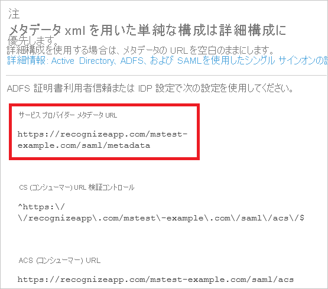
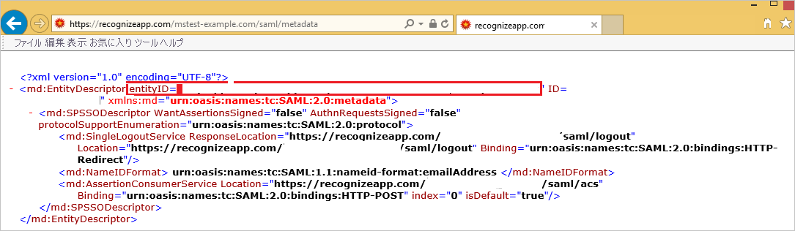

# チュートリアル: Azure Active Directory と Recognize の統合

このチュートリアルでは、Recognize と Azure Active Directory (Azure AD) を統合する方法について説明します。 Azure AD と Recognize を統合すると、次のことが可能になります。

* Recognize にアクセスできるユーザーを Azure AD で制御します。
* ユーザーが自分の Azure AD アカウントを使用して Recognize に自動的にサインインできるようにします。
* 1 つの中央サイト (Azure Portal) で自分のアカウントを管理します。

## 前提条件

開始するには、次が必要です。

* Azure AD サブスクリプション。 サブスクリプションがない場合は、[無料アカウント](https://azure.microsoft.com/free/)を取得できます。
* Recognize でのシングル サインオン (SSO) が有効なサブスクリプション。

## シナリオの説明

このチュートリアルでは、テスト環境で Azure AD のシングル サインオンを構成してテストします。

* Recognize では、**SP** によって開始される SSO がサポートされます。

## ギャラリーからの Recognize の追加

Azure AD への Recognize の統合を構成するには、ギャラリーから管理対象 SaaS アプリの一覧に Recognize を追加する必要があります。

1. 職場または学校アカウントか、個人の Microsoft アカウントを使用して、Azure portal にサインインします。
1. 左のナビゲーション ウィンドウで **[Azure Active Directory]** サービスを選択します。
1. **[エンタープライズ アプリケーション]** に移動し、 **[すべてのアプリケーション]** を選択します。
1. 新しいアプリケーションを追加するには、 **[新しいアプリケーション]** を選択します。
1. **[ギャラリーから追加する]** セクションで、検索ボックスに「**Recognize**」と入力します。
1. 結果のパネルから **[Recognize]** を選択し、アプリを追加します。 お使いのテナントにアプリが追加されるのを数秒待機します。

## Recognize の Azure AD SSO の構成とテスト

**B.Simon** というテスト ユーザーを使用して、Recognize に対する Azure AD SSO を構成してテストします。 SSO が機能するためには、Azure AD ユーザーと Recognize の関連ユーザーとの間にリンク関係を確立する必要があります。

Recognize で Azure AD SSO を構成してテストするには、次の手順に従います。

1. **[Azure AD SSO の構成](#configure-azure-ad-sso)** - ユーザーがこの機能を使用できるようにします。
    1. **[Azure AD のテスト ユーザーの作成](#create-an-azure-ad-test-user)** - B.Simon で Azure AD のシングル サインオンをテストします。
    1. **[Azure AD テスト ユーザーの割り当て](#assign-the-azure-ad-test-user)** - B.Simon が Azure AD シングル サインオンを使用できるようにします。
1. **[Recognize SSO の構成](#configure-recognize-sso)** - アプリケーション側でシングル サインオン設定を構成します。
    1. **[Recognize テスト ユーザーの作成](#create-recognize-test-user)** - Recognize で B.Simon に対応するユーザーを作成し、Azure AD の Britta Simon にリンクさせます。
1. **[SSO のテスト](#test-sso)** - 構成が機能するかどうかを確認します。

## Azure AD SSO の構成

これらの手順に従って、Azure portal で Azure AD SSO を有効にします。

1. Azure portal の **Recognize** アプリケーション統合ページで、 **[管理]** セクションを見つけて、 **[シングル サインオン]** を選択します。
1. **[シングル サインオン方式の選択]** ページで、 **[SAML]** を選択します。
1. **[SAML によるシングル サインオンのセットアップ]** ページで、 **[基本的な SAML 構成]** の鉛筆アイコンをクリックして設定を編集します。

   

4. **[基本的な SAML 構成]** セクションで、**サービス プロバイダー メタデータ ファイル** がある場合は、次の手順に従います。

    >[!NOTE]
    >チュートリアルの「**Recognize シングルサインオンの構成**」セクションで、**サービス プロバイダー メタデータ ファイル** を取得します。

    a. **[メタデータ ファイルをアップロードします]** をクリックします。

    

    b. **フォルダー ロゴ** をクリックしてメタデータ ファイルを選択し、 **[アップロード]** をクリックします。

    

    c. メタデータ ファイルが正常にアップロードされると、**識別子** の値が、[基本的な SAML 構成] セクションに自動的に設定されます。

     **[サインオン URL]** ボックスに、`https://recognizeapp.com/<YOUR_DOMAIN>/saml/sso` の形式で URL を入力します。

    > [!Note]
    > **識別子** の値が自動的に設定されない場合は、チュートリアルの後の方で説明する「**Recognize シングル サインオンの構成**」セクションの「SSO 設定」セクションでサービス プロバイダー メタデータ URL を開いて、識別子の値を取得します。 サインオン URL は実際の値ではありません。 実際のサインオン URL でこの値を更新してください。 この値を取得するには、[Recognize クライアント サポート チーム](mailto:support@recognizeapp.com)にお問い合わせください。 Azure portal の **[基本的な SAML 構成]** セクションに示されているパターンを参照することもできます。

5. **[SAML でシングル サインオンをセットアップします]** ページの **[SAML 署名証明書]** セクションで、 **[ダウンロード]** をクリックして要件のとおりに指定したオプションからの **証明書 (Base64)** をダウンロードして、お使いのコンピューターに保存します。

    

6. **[Recognize のセットアップ]** セクションで、要件に従って適切な URL をコピーします。

    

### Azure AD のテスト ユーザーの作成 

このセクションでは、Azure portal 内で B.Simon というテスト ユーザーを作成します。

1. Azure portal の左側のウィンドウから、 **[Azure Active Directory]** 、 **[ユーザー]** 、 **[すべてのユーザー]** の順に選択します。
1. 画面の上部にある **[新しいユーザー]** を選択します。
1. **[ユーザー]** プロパティで、以下の手順を実行します。
   1. **[名前]** フィールドに「`B.Simon`」と入力します。  
   1. **[ユーザー名]** フィールドに「username@companydomain.extension」と入力します。 たとえば、「 `B.Simon@contoso.com` 」のように入力します。
   1. **[パスワードを表示]** チェック ボックスをオンにし、 **[パスワード]** ボックスに表示された値を書き留めます。
   1. **Create** をクリックしてください。

### Azure AD テスト ユーザーの割り当て

このセクションでは、B.Simon に Recognize へのアクセスを許可することで、このユーザーが Azure シングル サインオンを使用できるようにします。

1. Azure portal で **[エンタープライズ アプリケーション]** を選択し、 **[すべてのアプリケーション]** を選択します。
1. アプリケーションの一覧で **[Recognize]** を選択します。
1. アプリの概要ページで、 **[管理]** セクションを見つけて、 **[ユーザーとグループ]** を選択します。
1. **[ユーザーの追加]** を選択し、 **[割り当ての追加]** ダイアログで **[ユーザーとグループ]** を選択します。
1. **[ユーザーとグループ]** ダイアログの [ユーザー] の一覧から **[B.Simon]** を選択し、画面の下部にある **[選択]** ボタンをクリックします。
1. ユーザーにロールが割り当てられることが想定される場合は、 **[ロールの選択]** ドロップダウンからそれを選択できます。 このアプリに対してロールが設定されていない場合は、[既定のアクセス] ロールが選択されていることを確認します。
1. **[割り当ての追加]** ダイアログで、 **[割り当て]** をクリックします。

## Recognize SSO の構成

1. 別の Web ブラウザーのウィンドウで、管理者として Recognize テナントにサインインします。

2. 右上にある **[Menu (メニュー)]** をクリックします。 **[Company Admin (会社の管理者)]** に移動します。
   
    ![[Settings]\(設定\) メニューの [Company Admin]\(会社の管理者\) が選択された画面のスクリーンショット。](./media/recognize-tutorial/menu.png)

3. 左側のナビゲーション ウィンドウで、 **[Settings (設定)]** をクリックします。
   
    ![ナビゲーション ページから [Settings]\(設定\) が選択された画面のスクリーンショット。](./media/recognize-tutorial/settings.png)

4. **[SSO Settings (SSO 設定)]** セクションで、次の手順に従います。
   
    ![[S S O Settings]\(S S O 設定\) を示すスクリーンショット。ここで、説明されている値を入力できます。](./media/recognize-tutorial/values.png)
    
    a. **[Enable SSO (SSO を有効にする)]** を **[ON]** にします。

    b. **[IDP Entity ID]\(IDP エンティティ ID\)** ボックスに、Azure portal からコピーした **Azure AD ID** の値を貼り付けます。
    
    c. **[Sso target url]\(SSO ターゲット URL\)** ボックスに、Azure portal からコピーした **ログイン URL** の値を貼り付けます。
    
    d. **[Slo target url]\(SLO ターゲット URL\)** ボックスに、Azure portal からコピーした **ログアウト URL** の値を貼り付けます。 
    
    e. ダウンロードした **証明書 (Base64)** ファイルをメモ帳で開き、その内容をクリップボードにコピーし、 **[証明書]** ボックスに貼り付けます。
    
    f. **[Save settings (設定の保存)]** ボタンをクリックします。 

5. **[SSO Settings (SSO 設定)]** セクションに、**Service Provider Metadata url** の URL をコピーします。
   
    

6. 空白のブラウザーで **メタデータ URL リンク** を開き、メタデータ ドキュメントをダウンロードします。 次に、ファイルから EntityDescriptor 値 (entityID) をコピーし、Azure portal の **[基本的な SAML 構成]** の **[識別子]** ボックスに貼り付けます。
    
    

### Recognize テスト ユーザーの作成

Azure AD ユーザーが Recognize にログインできるようにするには、そのユーザーを Recognize にプロビジョニングする必要があります。 Recognize の場合、プロビジョニングは手動で行います。

このアプリは SCIM プロビジョニングをサポートしていませんが、ユーザーをプロビジョニングする代替ユーザー同期があります。 

**ユーザー アカウントをプロビジョニングするには、次の手順に従います。**

1. Recognize 企業サイトに管理者としてサインインします。

2. 右上にある **[Menu (メニュー)]** をクリックします。 **[Company Admin (会社の管理者)]** に移動します。

3. 左側のナビゲーション ウィンドウで、 **[Settings (設定)]** をクリックします。

4. **[User Sync (ユーザー同期)]** セクションで、次の手順に従います。
   
    ![[New User]\(新しいユーザー\)](./media/recognize-tutorial/user.png "[新しいユーザー]")
   
    a. **[Sync Enabled (同期の有効化)]** で **[ON]** を選択します。
   
    b. **[Choose sync provider (同期プロバイダーの選択)]** で、 **[Microsoft / Office 365]** を選択します。
   
    c. **[Run User Sync (ユーザー同期の実行)]** をクリックします。

## SSO のテスト 

このセクションでは、次のオプションを使用して Azure AD のシングル サインオン構成をテストします。 

* Azure portal で **[このアプリケーションをテストします]** をクリックします。 これにより、ログイン フローを開始できる Recognize のサインオン URL にリダイレクトされます。 

* Recognize のサインオン URL に直接移動し、そこからログイン フローを開始します。

* Microsoft マイ アプリを使用することができます。 マイ アプリで [Recognize] タイルをクリックすると、Recognize のサインオン URL にリダイレクトされます。 マイ アプリの詳細については、[マイ アプリの概要](https://support.microsoft.com/account-billing/sign-in-and-start-apps-from-the-my-apps-portal-2f3b1bae-0e5a-4a86-a33e-876fbd2a4510)に関するページを参照してください。

## 次のステップ

Recognize を構成したら、組織の機密データを流出と侵入からリアルタイムで保護するセッション制御を適用できます。 セッション制御は、条件付きアクセスを拡張したものです。 [Microsoft Defender for Cloud Apps でセッション制御を適用する方法をご覧ください](/cloud-app-security/proxy-deployment-aad)。
