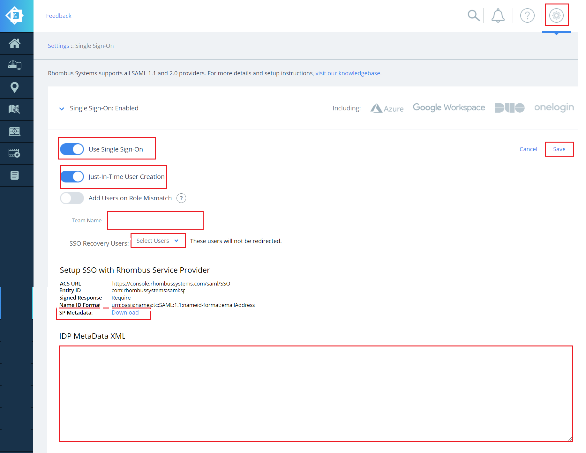

# チュートリアル: Azure Active Directory シングル サインオン (SSO) と Rhombus Systems の統合

このチュートリアルでは、Rhombus Systems と Azure Active Directory (Azure AD) を統合する方法について説明します。 Azure AD と Rhombus Systems を統合すると、次のことができます。

* Rhombus Systems にアクセスできるユーザーを Azure AD で制御する。
* ユーザーが自分の Azure AD アカウントを使用して Rhombus Systems に自動的にサインインできるようにする。
* 1 つの中央サイト (Azure Portal) で自分のアカウントを管理します。

## 前提条件

開始するには、次が必要です。

* Azure AD サブスクリプション。 サブスクリプションがない場合は、[無料アカウント](https://azure.microsoft.com/free/)を取得できます。
* Rhombus Systems でのシングル サインオン (SSO) が有効なサブスクリプション。

## シナリオの説明

このチュートリアルでは、テスト環境で Azure AD の SSO を構成してテストします。

* Rhombus Systems では、**SP Initiated SSO と IDP Initiated SSO** がサポートされます
* Rhombus Systems では、**Just-In-Time** ユーザー プロビジョニングがサポートされます。

> [!NOTE]
> このアプリケーションの識別子は固定文字列値であるため、1 つのテナントで構成できるインスタンスは 1 つだけです。

## ギャラリーからの Rhombus Systems の追加

Azure AD への Rhombus Systems の統合を構成するには、ギャラリーからマネージド SaaS アプリの一覧に Rhombus Systems を追加する必要があります。

1. 職場または学校アカウントか、個人の Microsoft アカウントを使用して、Azure portal にサインインします。
1. 左のナビゲーション ウィンドウで **[Azure Active Directory]** サービスを選択します。
1. **[エンタープライズ アプリケーション]** に移動し、 **[すべてのアプリケーション]** を選択します。
1. 新しいアプリケーションを追加するには、 **[新しいアプリケーション]** を選択します。
1. **[ギャラリーから追加する]** セクションで、検索ボックスに、「**Rhombus Systems**」と入力します。
1. 結果のパネルから **[Rhombus Systems]** を選択し、アプリを追加します。 お使いのテナントにアプリが追加されるのを数秒待機します。

## Rhombus Systems のための Azure AD SSO の構成とテスト

**B.Simon** というテスト ユーザーを使用して、Rhombus Systems 用に Azure AD SSO を構成してテストします。 SSO を機能させるために、Azure AD ユーザーと Rhombus Systems の関連ユーザーとの間にリンク関係を確立する必要があります。

Rhombus Systems 用に Azure AD SSO を構成してテストするには、次の手順を実行します。

1. **[Azure AD SSO の構成](#configure-azure-ad-sso)** - ユーザーがこの機能を使用できるようにします。
    1. **[Azure AD のテスト ユーザーの作成](#create-an-azure-ad-test-user)** - B.Simon で Azure AD のシングル サインオンをテストします。
    1. **[Azure AD テスト ユーザーの割り当て](#assign-the-azure-ad-test-user)** - B.Simon が Azure AD シングル サインオンを使用できるようにします。
1. **[Rhombus Systems SSO の構成](#configure-rhombus-systems-sso)** - アプリケーション側でシングル サインオン設定を構成します。
    1. **[Rhombus Systems テスト ユーザーの作成](#create-rhombus-systems-test-user)** - Rhombus Systems で B.Simon に対応するユーザーを作成し、Azure AD の B.Simon にリンクさせます。
1. **[SSO のテスト](#test-sso)** - 構成が機能するかどうかを確認します。

## Azure AD SSO の構成

これらの手順に従って、Azure portal で Azure AD SSO を有効にします。

1. Azure portal の **Rhombus Systems** アプリケーション統合ページで、 **[管理]** セクションを見つけて、 **[シングル サインオン]** を選択します。
1. **[シングル サインオン方式の選択]** ページで、 **[SAML]** を選択します。
1. **[SAML によるシングル サインオンのセットアップ]** ページで、 **[基本的な SAML 構成]** の鉛筆アイコンをクリックして設定を編集します。

   

1. **サービス プロバイダー メタデータ ファイル** を保持しており、**IDP** Initiated モードに構成したい場合は、 **[基本的な SAML 構成]** セクション上で次の手順を実行します。

    a. **[メタデータ ファイルをアップロードします]** をクリックします。

    

    b. **フォルダー ロゴ** をクリックしてメタデータ ファイルを選択し、 **[アップロード]** をクリックします。

    

    c. メタデータ ファイルが正常にアップロードされると、**識別子** と **応答 URL** の値が、[基本的な SAML 構成] セクションに自動的に設定されます。

    > [!Note]
    > **識別子** と **応答 URL** の値が自動的に設定されない場合は、要件に応じて手動で値を入力してください。

1. アプリケーションを **SP** 開始モードで構成する場合は、 **[追加の URL を設定します]** をクリックして次の手順を実行します。

    **[サインオン URL]** テキスト ボックスに、URL として「`https://console.rhombussystems.com/login/`」と入力します。

1. **[SAML でシングル サインオンをセットアップします]** ページの **[SAML 署名証明書]** セクションで、 **[フェデレーション メタデータ XML]** を探して **[ダウンロード]** を選択し、証明書をダウンロードして、お使いのコンピューターに保存します。

    

1. **[Set up Rhombus Systems]\(Rhombus Systems のセットアップ\)** セクションで、要件に基づいて適切な URL をコピーします。

    

### Azure AD のテスト ユーザーの作成

このセクションでは、Azure portal 内で B.Simon というテスト ユーザーを作成します。

1. Azure portal の左側のウィンドウから、 **[Azure Active Directory]** 、 **[ユーザー]** 、 **[すべてのユーザー]** の順に選択します。
1. 画面の上部にある **[新しいユーザー]** を選択します。
1. **[ユーザー]** プロパティで、以下の手順を実行します。
   1. **[名前]** フィールドに「`B.Simon`」と入力します。  
   1. **[ユーザー名]** フィールドに「username@companydomain.extension」と入力します。 たとえば、「 `B.Simon@contoso.com` 」のように入力します。
   1. **[パスワードを表示]** チェック ボックスをオンにし、 **[パスワード]** ボックスに表示された値を書き留めます。
   1. **Create** をクリックしてください。

### Azure AD テスト ユーザーの割り当て

このセクションでは、B. Simon に Rhombus Systems へのアクセスを許可することで、このユーザーが Azure シングル サインオンを使用できるようにします。

1. Azure portal で **[エンタープライズ アプリケーション]** を選択し、 **[すべてのアプリケーション]** を選択します。
1. アプリケーションの一覧で **[Rhombus Systems]** を選択します。
1. アプリの概要ページで、 **[管理]** セクションを見つけて、 **[ユーザーとグループ]** を選択します。
1. **[ユーザーの追加]** を選択し、 **[割り当ての追加]** ダイアログで **[ユーザーとグループ]** を選択します。
1. **[ユーザーとグループ]** ダイアログの [ユーザー] の一覧から **[B.Simon]** を選択し、画面の下部にある **[選択]** ボタンをクリックします。
1. ユーザーにロールが割り当てられることが想定される場合は、 **[ロールの選択]** ドロップダウンからそれを選択できます。 このアプリに対してロールが設定されていない場合は、[既定のアクセス] ロールが選択されていることを確認します。
1. **[割り当ての追加]** ダイアログで、 **[割り当て]** をクリックします。

## Rhombus Systems の SSO の構成

1. Rhombus Systems 企業サイトに管理者としてログインします。

1. **[Settings]\(設定\)** アイコンに移動して **[Single Sign-On]\(シングル サインオン\)** をクリックします。

1. **[Single Sign-on]\(シングル サインオン\)** ページで、以下の手順を実行します。

    

    1. **[Use Single Sign-On]\(シングル サインオンの使用\)** ボタンを有効にします。

    1. **[Just-In-Time User Creation]\(Just-In-Time ユーザー作成\)** ボタンを有効にします。

    1. テキスト ボックスに有効な **チーム名** を入力します。

    1. **[SSO Recovery Users]\(SSO 復旧ユーザー\)** でドロップダウンから **ユーザーを選択** します。

    1. **SP メタデータ** ファイルをダウンロードして、Azure portal 内の **[基本的な SAML 構成]** セクションにそのメタデータ ファイルをアップロードします。

    1. Azure portal から **フェデレーション メタデータ XML** をメモ帳にコピーし、その内容を **[IDP MetaData XML]\(IDP メタデータ XML\)** テキストボックスに貼り付けます。

    1. **[保存]** をクリックします。

### Rhombus Systems テスト ユーザーの作成

このセクションでは、Britta Simon というユーザーを Rhombus Systems に作成します。 Rhombus Systems では、Just-In-Time ユーザー プロビジョニングがサポートされています。この設定は既定で有効になっています。 このセクションでは、ユーザー側で必要な操作はありません。 Rhombus Systems にユーザーがまだ存在していない場合は、認証後に新しく作成されます。

## SSO のテスト 

このセクションでは、次のオプションを使用して Azure AD のシングル サインオン構成をテストします。 

#### SP Initiated:

* Azure portal で **[このアプリケーションをテストします]** をクリックします。 これにより、Rhombus Systems のサインオン URL にリダイレクトされ、そこからログイン フローを開始できます。  

* Rhombus Systems のサインオン URL に直接移動し、そこからログイン フローを開始します。

#### IDP Initiated:

* Azure portal で **[このアプリケーションをテストします]** をクリックすると、SSO を設定した Rhombus Systems に自動的にサインインされます。 

また、Microsoft マイ アプリを使用して、任意のモードでアプリケーションをテストすることもできます。 マイ アプリで [Rhombus Systems] タイルをクリックすると、SP モードで構成されている場合は、ログイン フローを開始するためのアプリケーション サインオン ページにリダイレクトされます。IDP モードで構成されている場合は、SSO を設定した Rhombus Systems に自動的にサインインされます。 マイ アプリの詳細については、[マイ アプリの概要](https://support.microsoft.com/account-billing/sign-in-and-start-apps-from-the-my-apps-portal-2f3b1bae-0e5a-4a86-a33e-876fbd2a4510)に関するページを参照してください。

## 次のステップ

Rhombus Systems を構成したら、組織の機密データを流出と侵入からリアルタイムで保護するセッション制御を適用することができます。 セッション制御は、条件付きアクセスを拡張したものです。 [Microsoft Defender for Cloud Apps でセッション制御を適用する方法をご覧ください](/cloud-app-security/proxy-deployment-aad)。
