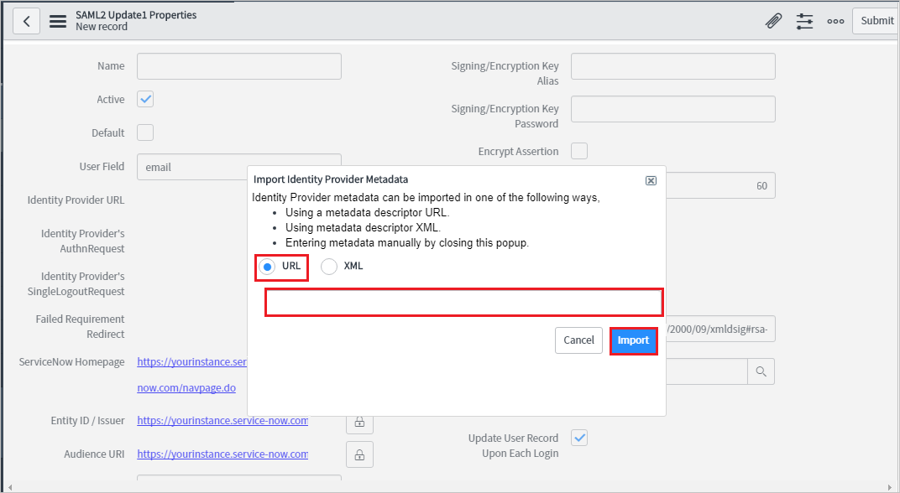

# チュートリアル:ServiceNow を Azure Active Directory と統合する

このチュートリアルでは、ServiceNow と Azure Active Directory (Azure AD) を統合する方法について説明します。 ServiceNow を Azure AD を統合すると、次のことができます。

* ServiceNow にアクセスする Azure AD ユーザーを制御できます。
* ユーザーが自分の Azure AD アカウントを使用して ServiceNow に自動的にサインインできるようにします。
* 1 つの中央サイト (Azure Portal) で自分のアカウントを管理できます。

SaaS アプリと Azure AD の統合の詳細については、「[Azure Active Directory でのアプリケーションへのシングル サインオン](https://docs.microsoft.com/azure/active-directory/active-directory-appssoaccess-whatis)」を参照してください。

## 前提条件

開始するには、次が必要です。

* Azure AD サブスクリプション。 サブスクリプションがない場合は、[無料アカウント](https://azure.microsoft.com/free/)を取得できます。
* ServiceNow でのシングル サインオン (SSO) が有効なサブスクリプション
* ServiceNow の場合は、Calgary バージョン以降の ServiceNow のインスタンスまたはテナント
* ServiceNow Express の場合は、Helsinki バージョン以降の ServiceNow Express のインスタンス
* ServiceNow のテナントで [Multiple Provider Single Sign On プラグイン](https://wiki.servicenow.com/index.php?title=Multiple_Provider_Single_Sign-On#gsc.tab=0)が有効になっている必要があります。 このプラグインを有効にするには、[サービス要求を送信してください](https://hi.service-now.com)。
* 自動構成のために、ServiceNow の Multi-Provider プラグインを有効にします。
* ServiceNow Classic (モバイル) アプリケーションをインストールするには、適切なストアに移動して ServiceNow Classic アプリケーションを検索し、[ダウンロード] をクリックします。

## シナリオの説明

このチュートリアルでは、テスト環境で Azure AD の SSO を構成してテストします。 ServiceNow では、**SP** によって開始される SSO と、[**自動化された**](servicenow-provisioning-tutorial.md)ユーザー プロビジョニングがサポートされます。

ServiceNow Classic (モバイル) アプリケーションを Azure AD と共に構成して SSO を有効にできるようになりました。**Android** と**iOS** の両方のユーザーがサポートされます。 このチュートリアルでは、テスト環境で Azure AD の SSO を構成してテストします。

## ギャラリーからの ServiceNow の追加

Azure AD への ServiceNow の統合を構成するには、ギャラリーから管理対象 SaaS アプリの一覧に ServiceNow を追加する必要があります。

1. 職場または学校アカウントか、個人の Microsoft アカウントを使用して、[Azure portal](https://portal.azure.com) にサインインします。
1. 左のナビゲーション ウィンドウで **[Azure Active Directory]** サービスを選択します。
1. **[エンタープライズ アプリケーション]** に移動し、 **[すべてのアプリケーション]** を選択します。
1. 新しいアプリケーションを追加するには、 **[新しいアプリケーション]** を選択します。
1. **[ギャラリーから追加する]** セクションで、検索ボックスに、「**ServiceNow**」と入力します。
1. 結果ウィンドウで **[ServiceNow]** を選択し、アプリケーションを追加します。 お使いのテナントにアプリが追加されるのを数秒待機します。

## Azure AD シングル サインオンの構成とテスト

**B.Simon** というテスト ユーザーを使用して、ServiceNow に対する Azure AD SSO を構成してテストします。 SSO が機能するために、Azure AD ユーザーと ServiceNow の関連ユーザーの間で、リンク関係が確立されている必要があります。

ServiceNow で Azure AD SSO を構成してテストするには、次の構成要素を完了する必要があります。

1. **[Azure AD SSO の構成](#configure-azure-ad-sso)** - ユーザーがこの機能を使用できるようにします。
2. **[ServiceNow の構成](#configure-servicenow)** - アプリケーション側で SSO 設定を構成します。
3. **[ServiceNow Express 向け Azure AD SSO の構成](#configure-azure-ad-sso-for-servicenow-express)** - ユーザーがこの機能を使用できるようにします。
4. **[ServiceNow Express SSO の構成](#configure-servicenow-express-sso)** - アプリケーション側でシングル サインオン設定を構成します。
5. **[Azure AD のテスト ユーザーの作成](#create-an-azure-ad-test-user)** - B.Simon で Azure AD のシングル サインオンをテストします。
6. **[Azure AD テスト ユーザーの割り当て](#assign-the-azure-ad-test-user)** - B.Simon が Azure AD シングル サインオンを使用できるようにします。
7. **[ServiceNow テスト ユーザーの作成](#create-servicenow-test-user)** - ServiceNow で B.Simon に対応するユーザーを作成し、Azure AD の B.Simon にリンクさせます。
8. **[SSO のテスト](#test-sso)** - 構成が機能するかどうかを確認します。
9. **[ServiceNow Classic (モバイル) の SSO のテスト](#test-sso-for-servicenow-classic-mobile)** - 構成が機能するかどうか検証します。

### Azure AD SSO の構成

これらの手順に従って、Azure portal で Azure AD SSO を有効にします。

1. [Azure portal](https://portal.azure.com/) の **ServiceNow** アプリケーション統合ページで、 **[管理]** セクションを見つけて、 **[シングル サインオン]** を選択します。
1. **[シングル サインオン方式の選択]** ページで、 **[SAML]** を選択します。
1. **[SAML でシングル サインオンをセットアップします]** ページで、 **[基本的な SAML 構成]** の編集/ペン アイコンをクリックして設定を編集します。

   

4. **[基本的な SAML 構成]** セクションで、次の手順を実行します。

    a. **[サインオン URL]** ボックスに、次のパターンを使用して URL を入力します。`https://<instance-name>.service-now.com/navpage.do`

    b. **[識別子 (エンティティ ID)]** ボックスに、次のパターンを使用して URL を入力します。`https://<instance-name>.service-now.com`

    > [!NOTE]
    > これらは実際の値ではありません。 実際のサインオン URL と識別子に値を置き換える必要があります。実際の値については後で説明します。 Azure portal の **[基本的な SAML 構成]** セクションに示されているパターンを参照することもできます。

1. **[SAML でシングル サインオンをセットアップします]** ページの **[SAML 署名証明書]** セクションで、 **[証明書 (Base64)]** を見つけて、 **[ダウンロード]** を選択し、証明書をダウンロードして、お使いのコンピューターに保存します。

   

   a. コピー ボタンをクリックして **[アプリのフェデレーション メタデータ URL]** をコピーし、メモ帳に貼り付けます。このアプリのフェデレーション メタデータ URL はこのチュートリアルで後で使用されます。

    b. **[ダウンロード]** をクリックして **[証明書 (Base64)]** をダウンロードして、コンピューターに証明書ファイルを保存します。

1. **[ServiceNow のセットアップ]** セクションで、要件に基づいて適切な URL をコピーします。

   

### ServiceNow の構成

1. ServiceNow アプリケーションに管理者としてサインオンします。

2. **[Integration - Multiple Provider Single Sign-On Installer (統合 - 複数プロバイダーのシングル サインオン インストーラー)]** プラグインをアクティブ化するには、次の手順に従います。

    a. 左側のナビゲーション ウィンドウの検索バーで **}[System Definition]\(システム定義\)** セクションを検索し、 **[Plugins]\(プラグイン\)** をクリックします。

    

    b. "**Integration - Multiple Provider Single Sign-On Installer**" を検索します。

     

    c. プラグインを選択します。 右クリックして **[Activate/Upgrade]** を選択します。

     

    d. **[Activate (アクティブ化)]** ボタンをクリックします。

     

3. 左側のナビゲーション ウィンドウの検索バーで **[Multi-Provider SSO]** セクションを検索し、 **[Properties]** をクリックします。

    

4. **[Multiple Provider SSO Properties]** ダイアログで、次の手順を実行します。

    

    * **[Enable multiple provider SSO]** で **[Yes]** を選択します。
  
    * **[Enable Auto Importing of users from all identity providers into the user table]** で、 **[Yes]** を選択します。

    * **[Enable debug logging for the multiple provider SSO integration]** で **[Yes]** を選択します。

    * **[The field on the user table that...]** ボックスに、「**user_name**」と入力します。
  
    * **[Save]** をクリックします。

5. **ServiceNow** は自動と手動の 2 つの方法で構成できます。

6. **ServiceNow** を自動的に構成するには、以下の手順に従います。

    * Azure Portal で **ServiceNow** の [シングル サインオン] ページに戻ります。

    * SAML ベースの認証に対応するため、Azure AD による ServiceNow の自動構成を行う ServiceNow 用のワン クリック構成サービスが提供されています。 このサービスを有効にするには、 **[ServiceNow 構成]** セクションに移動し、 **[ServiceNow を構成する]** をクリックして [サインオンの構成] ウィンドウを開きます。

        

    * ServiceNow のインスタンス名、管理者のユーザー名、および管理者パスワードを **[サインオンの構成]** フォームに入力し、 **[今すぐ構成]** をクリックします。 ここで指定する管理者のユーザー名には、ServiceNow で **security_admin** ロールが割り当てられている必要があります。 これとは別に、ServiceNow を手動で構成して Azure AD を SAML ID プロバイダーとして使用させる方法があります。 **[シングル サインオンを手動で構成する]** をクリックして、[クイック リファレンス] セクションから**サインアウト URL、SAML エンティティ ID、および SAML シングル サインオン サービス URL** をコピーします。

        

    * ServiceNow アプリケーションに管理者としてサインオンします。

    * 自動構成では、必要なすべての設定が **ServiceNow** 側で構成されますが、 **[X.509 証明書]** は既定で無効です。 ServiceNow でご使用の ID プロバイダーに手動でマップする必要があります。 同様に次の手順に従ってください。

    * 左側のナビゲーション ウィンドウの検索バーで **[Multi-Provider SSO]** セクションを検索し、 **[ID プロバイダー]** をクリックします。

        

    * 自動的に生成された ID プロバイダーをクリックします

        

    *  **[ID プロバイダー]** セクションで、次の手順に従います。

        

        * **[名前]** ボックスに、構成の名前を入力します (例: **Microsoft Azure フェデレーション シングル サインオン**)。

        * 入力されている **ID プロバイダーの SingleLogoutRequest** の値をテキスト ボックスから削除してください。

        * **[ServiceNow Homepage]** の値をコピーして、Azure portal の **[ServiceNow Basic SAML Configuration]\(ServiceNow の基本的な SAML 構成\)** セクションにある **[サインオン URL]** ボックスに貼り付けます。

            > [!NOTE]
            > ServiceNow インスタンス ホームページは、**ServiceNow テナント URL** と **/navpage.do** を連結した形式です (例: `https://fabrikam.service-now.com/navpage.do`)。

        * **[ServiceNow Homepage]** の値をコピーして、Azure portal の **[ServiceNow Basic SAML Configuration]\(ServiceNow の基本的な SAML 構成\)** セクションにある **[Identifier]\(識別子\)** ボックスに貼り付けます。

        * **[NameID Policy]** の値は必ず `urn:oasis:names:tc:SAML:1.1:nameid-format:unspecified` に設定してください。 

    * **[X.509 証明書]** セクションまで下にスクロールし、 **[編集]** を選択します。

        

    * 証明書を選択し、右矢印のアイコンをクリックして証明書を追加します。

        

    * **[Save]** をクリックします。

    * ページの右上隅にある **[接続をテスト]** をクリックします。

        

    * **[接続のテスト]** をクリックすると、資格情報を入力する必要があるポップアップ ウィンドウが表示され、下のページに結果が表示されます。 **SSO ログアウト テスト結果** エラーが予期されます。このエラーは無視して、 **[アクティブ化]** ボタンをクリックしてください。

        
  
7. **ServiceNow** を手動で構成するには、以下の手順に従います。

    * ServiceNow アプリケーションに管理者としてサインオンします。

    * 左側のナビゲーション ウィンドウで、 **[Identity Providers]** をクリックします。

        

    * **[Identity Providers]\(ID プロバイダー\)** ダイアログ ボックスで、 **[New]\(新規\)** をクリックします。

        

    * **[ID プロバイダー]** ダイアログ ボックスで、 **[SAML]** をクリックします。

        

    * **ID プロバイダーのメタデータのインポート** ポップアップで、次の手順に従います。

        

        * Azure Portal からコピーした **[アプリのフェデレーション メタデータ URL]** を貼り付けます。

        * **[インポート]** をクリックします。

    * IdP メタデータ URL が読み取られ、すべてのフィールド情報が設定されます。

        

        * **[名前]** ボックスに、構成の名前を入力します (例: **Microsoft Azure フェデレーション シングル サインオン**)。

        * 入力されている **ID プロバイダーの SingleLogoutRequest** の値をテキスト ボックスから削除してください。

        * **[ServiceNow Homepage]** の値をコピーして、Azure portal の **[ServiceNow Basic SAML Configuration]\(ServiceNow の基本的な SAML 構成\)** セクションにある **[サインオン URL]** ボックスに貼り付けます。

            > [!NOTE]
            > ServiceNow インスタンス ホームページは、**ServiceNow テナント URL** と **/navpage.do** を連結した形式です (例: `https://fabrikam.service-now.com/navpage.do`)。

        * **[ServiceNow Homepage]** の値をコピーして、Azure portal の **[ServiceNow Basic SAML Configuration]\(ServiceNow の基本的な SAML 構成\)** セクションにある **[Identifier]\(識別子\)** ボックスに貼り付けます。

        * **[NameID Policy]** の値は必ず `urn:oasis:names:tc:SAML:1.1:nameid-format:unspecified` に設定してください。

        * **[詳細設定]** をクリックします。 ServiceNow のデプロイでユーザーを一意に識別するためのフィールドに応じて、 **[User Field]** ボックスに「**email**」または「**user_id**」と入力します。

            > [!NOTE]
            > SAML トークンの一意の識別子として Azure AD ユーザー ID (ユーザーのプリンシパル名) か電子メール アドレスを出力するように Azure AD を構成できます。そのためには、Azure Portal で **[ServiceNow]、[属性]、[シングル サインオン]** セクションの順に移動し、目的のフィールドを **nameidentifier** 属性にマッピングします。 Azure AD に格納される選択した属性 (ユーザー プリンシパル名など) の値と、ServiceNow に格納される入力したフィールド (user_name など) の値が一致している必要があります。

        * ページの右上隅にある **[接続をテスト]** をクリックします。

        * **[接続のテスト]** をクリックすると、資格情報を入力する必要があるポップアップ ウィンドウが表示され、下のページに結果が表示されます。 **SSO ログアウト テスト結果** エラーが予期されます。このエラーは無視して、 **[アクティブ化]** ボタンをクリックしてください。

          

### ServiceNow Express 向け Azure AD SSO の構成

1. [Azure portal](https://portal.azure.com/) の **ServiceNow** アプリケーション統合ページで、 **[シングル サインオン]** を選択します。

    

2. **[シングル サインオン方式の選択]** ダイアログで、 **[SAML/WS-Fed]** モードを選択して、シングル サインオンを有効にします。

    

3. **[SAML でシングル サインオンをセットアップします]** ページで、 **[編集]** アイコンをクリックして **[基本的な SAML 構成]** ダイアログを開きます。

    

4. **[基本的な SAML 構成]** セクションで、次の手順を実行します。

    a. **[サインオン URL]** ボックスに、次のパターンを使用して URL を入力します。`https://<instance-name>.service-now.com/navpage.do`

    b. **[識別子 (エンティティ ID)]** ボックスに、次のパターンを使用して URL を入力します。`https://<instance-name>.service-now.com`

    > [!NOTE]
    > これらは実際の値ではありません。 実際のサインオン URL と識別子に値を置き換える必要があります。実際の値については後で説明します。 Azure portal の **[基本的な SAML 構成]** セクションに示されているパターンを参照することもできます。

5. **[SAML でシングル サインオンをセットアップします]** ページの **[SAML 署名証明書]** セクションで、 **[ダウンロード]** をクリックして要件のとおりに指定したオプションからの**証明書 (Base64)** をダウンロードして、お使いのコンピューターに保存します。

    

6. SAML ベースの認証に対応するため、Azure AD による ServiceNow の自動構成を行う ServiceNow 用のワン クリック構成サービスが提供されています。 このサービスを有効にするには、**ServiceNow の設定** セクションで、 **[ステップ バイ ステップの手順を表示]** をクリックして [サインオンの構成] ウィンドウを開きます。

    

7. ServiceNow のインスタンス名、管理者のユーザー名、および管理者パスワードを **[サインオンの構成]** フォームに入力し、 **[今すぐ構成]** をクリックします。 ここで指定する管理者のユーザー名には、ServiceNow で **security_admin** ロールが割り当てられている必要があります。 これとは別に、ServiceNow を手動で構成して Azure AD を SAML ID プロバイダーとして使用させる方法があります。 **[シングル サインオンを手動で構成する]** をクリックして、[クイック リファレンス] セクションから**ログアウト URL、Azure ID 識別子、およびログイン URL** をコピーします。

    

### ServiceNow Express SSO の構成

1. ServiceNow Express アプリケーションに管理者としてサインオンします。

2. 左側にあるナビゲーション ウィンドウで、 **[Single Sign-On (シングル サインオン)]** をクリックします。

    

3. **[Single Sign-On (シングル サインオン)]** ダイアログで右上の構成アイコンをクリックし、次のプロパティを設定します。

    

    a. **[Enable multiple provider SSO (複数プロバイダー SSO を有効にする)]** を右に切り替えます。

    b. **[Enable debug logging for the multiple provider SSO integration (複数プロバイダー SSO 統合でのデバッグ ログの有効化)]** を右に切り替えます。

    c. **[The field on the user table that...]** ボックスに、「**user_name**」と入力します。

4. **[Single Sign-On (シングル サインオン)]** ダイアログで、 **[Add New Certificate (新しい証明書の追加)]** をクリックします。

    

5. **[X.509 Certificates]** ダイアログで、次の手順を実行します。

    

    a. **[Name]\(名前\)** ボックスに、構成の名前を入力します (例:**TestSAML2.0**)。

    b. **[アクティブ]** を選択します。

    c. **[Format]** で **[PEM]** を選択します。

    d. **[Type]** で **[Trust Store Cert]** を選択します。

    e. Azure Portal からダウンロードした Base64 エンコードの証明書をメモ帳で開き、その内容をクリップボードにコピーして、 **[PEM Certificate]** ボックスに貼り付けます。

    f. **[Update]\(更新\)** をクリックします。

6. **[Single Sign-On (シングル サインオン)]** ダイアログで、 **[Add New IdP (新しい IdP の追加)]** をクリックします。

    

7. **[Add New Identity Provider (新しい ID プロバイダーの追加)]** ダイアログの **[Configure Identity Provider (ID プロバイダーの構成)]** で、次の手順に従います。

    

    a. **[Name]\(名前\)** ボックスに、構成の名前を入力します (例:**SAML 2.0**)。

    b. **[Identity Provider URL]\(ID プロバイダー URL\)** フィールドに、Azure Portal からコピーした **ID プロバイダー ID** の値を貼り付けます。

    c. **[Identity Provider's AuthnRequest]\(ID プロバイダーの AuthnRequest\)** フィールドに、Azure Portal からコピーした**認証要求 URL** の値を貼り付けます。

    d. **[Identity Provider's SingleLogoutRequest]\(ID プロバイダーの SingleLogoutRequest\)** フィールドに、Azure portal からコピーした**ログアウト URL** の値を貼り付けます

    e. **[Identity Provider Certificate (ID プロバイダー証明書)]** で、前の手順で作成した証明書を選択します。

8. **[Advanced Settings (詳細設定)]** をクリックし、 **[Additional Identity Provider Properties (追加の ID プロバイダーのプロパティ)]** で、次の手順に従います。

    

    a. **[Protocol Binding for the IDP's SingleLogoutRequest]** ボックスに、「**urn:oasis:names:tc:SAML:2.0:bindings:HTTP-Redirect**」と入力します。

    b. **[NameID Policy (NameID ポリシー)]** ボックスに「**urn:oasis:names:tc:SAML:1.1:nameid-format:unspecified**」と入力します。

    c. **[AuthnContextClassRef Method (AuthnContextClassRef メソッド)]** に「`http://schemas.microsoft.com/ws/2008/06/identity/authenticationmethod/password`」と入力します。

    d. **[Create an AuthnContextClass]** をオフにします。

9. **[Additional Service Provider Properties (追加のサービス プロバイダーのプロパティ)]** で、次の手順に従います。

    

    a. **[ServiceNow Homepage]** ボックスに ServiceNow インスタンス ホームページの URL を入力します。

    > [!NOTE]
    > ServiceNow インスタンス ホームページは、**ServiceNow テナント URL** と **/navpage.do** を連結した形式です (例: `https://fabrikam.service-now.com/navpage.do`)。

    b. **[Entity ID / Issuer]** ボックスに、ServiceNow テナントの URL を入力します。

    c. **[Audience URI (対象ユーザー URI)]** ボックスに、ServiceNow テナントの URL を入力します。

    d. **[Clock Skew]** ボックスに「**60**」と入力します。

    e. ServiceNow のデプロイでユーザーを一意に識別するためのフィールドに応じて、 **[User Field]** ボックスに「**email**」または「**user_id**」と入力します。

    > [!NOTE]
    > SAML トークンの一意の識別子として Azure AD ユーザー ID (ユーザーのプリンシパル名) か電子メール アドレスを出力するように Azure AD を構成できます。そのためには、Azure Portal で **[ServiceNow]、[属性]、[シングル サインオン]** セクションの順に移動し、目的のフィールドを **nameidentifier** 属性にマッピングします。 Azure AD に格納される選択した属性 (ユーザー プリンシパル名など) の値と、ServiceNow に格納される入力したフィールド (user_name など) の値が一致している必要があります。

    f. **[Save]** をクリックします。

### Azure AD のテスト ユーザーの作成

このセクションでは、Azure portal 内で B.Simon というテスト ユーザーを作成します。

1. Azure portal の左側のウィンドウから、 **[Azure Active Directory]** 、 **[ユーザー]** 、 **[すべてのユーザー]** の順に選択します。
1. 画面の上部にある **[新しいユーザー]** を選択します。
1. **[ユーザー]** プロパティで、以下の手順を実行します。
   1. **[名前]** フィールドに「`B.Simon`」と入力します。  
   1. **[ユーザー名]** フィールドに「username@companydomain.extension」と入力します。 たとえば、「 `B.Simon@contoso.com` 」のように入力します。
   1. **[パスワードを表示]** チェック ボックスをオンにし、 **[パスワード]** ボックスに表示された値を書き留めます。
   1. **Create** をクリックしてください。

### Azure AD テスト ユーザーの割り当て

このセクションでは、B.Simon に ServiceNow へのアクセスを許可することで、このユーザーが Azure シングル サインオンを使用できるようにします。

1. Azure portal で **[エンタープライズ アプリケーション]** を選択し、 **[すべてのアプリケーション]** を選択します。
1. アプリケーションの一覧で **[ServiceNow]** を選択します。
1. アプリの概要ページで、 **[管理]** セクションを見つけて、 **[ユーザーとグループ]** を選択します。

   ![[ユーザーとグループ] リンク](common/users-groups-blade.png)

1. **[ユーザーの追加]** を選択し、 **[割り当ての追加]** ダイアログで **[ユーザーとグループ]** を選択します。

    ![[ユーザーの追加] リンク](common/add-assign-user.png)

1. **[ユーザーとグループ]** ダイアログの [ユーザー] の一覧から **[B.Simon]** を選択し、画面の下部にある **[選択]** ボタンをクリックします。
1. SAML アサーション内に任意のロール値が必要な場合、 **[ロールの選択]** ダイアログでユーザーに適したロールを一覧から選択し、画面の下部にある **[選択]** をクリックします。
1. **[割り当ての追加]** ダイアログで、 **[割り当て]** をクリックします。

### ServiceNow テスト ユーザーの作成

このセクションの目的は、ServiceNow で Britta Simon というユーザーを作成することです。 ServiceNow では、自動ユーザー プロビジョニングがサポートされています。この設定は、既定で有効になっています。 自動ユーザー プロビジョニングの構成方法の詳細については、[こちら](servicenow-provisioning-tutorial.md)を参照してください。

> [!NOTE]
> ユーザーを手動で作成する必要がある場合、[ServiceNow クライアント サポート チーム](https://www.servicenow.com/support/contact-support.html)に問い合わせる必要があります

### SSO のテスト

アクセス パネルで [ServiceNow] タイルを選択すると、SSO を設定した ServiceNow に自動的にサインインします。 アクセス パネルの詳細については、[アクセス パネルの概要](https://docs.microsoft.com/azure/active-directory/active-directory-saas-access-panel-introduction)に関する記事を参照してください。

## ServiceNow Classic (モバイル) の SSO をテストする

1. **ServiceNow Classic (モバイル)** アプリケーションを開き、次の手順を実行します。

    a. 画面の下の **追加**の記号をクリックします。

    

    b. ServiceNow インスタンス名を入力し、 **[続行]** をクリックします。

    

    c. **[ログイン]** 画面で、次の手順に従います。

    

    *  **Username** (B.simon@contoso.com など) を入力します。

    *  **[USE EXTERNAL LOGIN]\(外部ログインの使用\)** をクリックします。サインインのため Azure AD ページにリダイレクトされます。
    
    *  資格情報を入力し、任意のサード パーティの認証またはその他の有効になっているセキュリティ機能がある場合、ユーザーはそれに対応する必要があり、**ホーム ページ**が次に示すように表示されます。

        

## その他のリソース

- [SaaS アプリと Azure Active Directory を統合する方法に関するチュートリアルの一覧](https://docs.microsoft.com/azure/active-directory/active-directory-saas-tutorial-list)

- [Azure Active Directory でのアプリケーション アクセスとシングル サインオンとは](https://docs.microsoft.com/azure/active-directory/active-directory-appssoaccess-whatis)

- [Azure Active Directory の条件付きアクセスとは](https://docs.microsoft.com/azure/active-directory/conditional-access/overview)

- [[ユーザー プロビジョニングの構成]](servicenow-provisioning-tutorial.md)