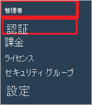

# チュートリアル: Azure Active Directory と Skills Base の統合

このチュートリアルでは、Skills Base と Azure Active Directory (Azure AD) を統合する方法について説明します。 Skills Base と Microsoft Azure Active Directory を統合すると、次のことができます。

* Skills Base にアクセスできるユーザーを Microsoft Azure Active Directory で制御します。
* ユーザーが自分の Microsoft Azure Active Directory アカウントを使用して Skills Base に自動的にサインインできるようにします。
* 1 つの中央サイト (Azure Portal) で自分のアカウントを管理します。

## 前提条件

開始するには、次が必要です。

* Azure AD サブスクリプション。 サブスクリプションがない場合は、[無料アカウント](https://azure.microsoft.com/free/)を取得できます。
* Skills Base でのシングル サインオン (SSO) が有効なサブスクリプション。

> [!NOTE]
> この統合は、Azure AD 米国政府クラウド環境から利用することもできます。 このアプリケーションは、Azure AD 米国政府クラウドのアプリケーション ギャラリーにあります。パブリック クラウドの場合と同じように構成してください。

## シナリオの説明

このチュートリアルでは、テスト環境で Azure AD のシングル サインオンを構成してテストします。

* Skills Base では、**SP** Initiated SSO がサポートされます。
* Skills Base では、**Just-In-Time** ユーザー プロビジョニングがサポートされます。

> [!NOTE]
> このアプリケーションの識別子は固定文字列値であるため、1 つのテナントで構成できるインスタンスは 1 つだけです。

## ギャラリーからの Skills Base の追加

Azure AD への Skills Base の統合を構成するには、ギャラリーから管理対象 SaaS アプリの一覧に Skills Base を追加する必要があります。

1. 職場または学校アカウントか、個人の Microsoft アカウントを使用して、Azure portal にサインインします。
1. 左のナビゲーション ウィンドウで **[Azure Active Directory]** サービスを選択します。
1. **[エンタープライズ アプリケーション]** に移動し、 **[すべてのアプリケーション]** を選択します。
1. 新しいアプリケーションを追加するには、 **[新しいアプリケーション]** を選択します。
1. **[ギャラリーから追加する]** セクションで、検索ボックスに「**Skills Base**」と入力します。
1. 結果のパネルから **[Skills Base]** を選択し、アプリを追加します。 お使いのテナントにアプリが追加されるのを数秒待機します。

## Skills Base 用の Microsoft Azure Active Directory SSO の構成とテスト

**B.Simon** というテスト ユーザーを使用して、Skills Base と一緒に Microsoft Azure Active Directory SSO を構成してテストします。 SSO を機能させるためには、Azure AD ユーザーと Skills Base の関連ユーザーとの間にリンク関係を確立する必要があります。

Microsoft Azure Active Directory SSO を Skills Base と一緒に構成してテストするには、次の手順を実行します。

1. **[Azure AD SSO の構成](#configure-azure-ad-sso)** - ユーザーがこの機能を使用できるようにします。
    1. **[Azure AD のテスト ユーザーの作成](#create-an-azure-ad-test-user)** - B.Simon で Azure AD のシングル サインオンをテストします。
    1. **[Azure AD テスト ユーザーの割り当て](#assign-the-azure-ad-test-user)** - B.Simon が Azure AD シングル サインオンを使用できるようにします。
1. **[Skills Base SSO の構成](#configure-skills-base-sso)** - アプリケーション側でシングル サインオン設定を構成します。
    1. **[Skills Base のテスト ユーザーの作成](#create-skills-base-test-user)** - Skills Base に、Microsoft Azure Active Directory の B.Simon を表すユーザーにリンクされた対応ユーザーを作成します。
1. **[SSO のテスト](#test-sso)** - 構成が機能するかどうかを確認します。

## Azure AD SSO の構成

これらの手順に従って、Azure portal で Azure AD SSO を有効にします。

1. Azure portal の **Skills Base** アプリケーション統合ページで、 **[管理]** セクションを見つけて、 **[シングル サインオン]** を選択します。
1. **[シングル サインオン方式の選択]** ページで、 **[SAML]** を選択します。
1. **[SAML によるシングル サインオンのセットアップ]** ページで、 **[基本的な SAML 構成]** の鉛筆アイコンをクリックして設定を編集します。

   

4. **[基本的な SAML 構成]** セクションで、次の手順を実行します。

    **[サインオン URL]** ボックスに、`https://app.skills-base.com/o/<customer-unique-key>` という形式で URL を入力します。

    > [!NOTE]
    > Skills Base アプリケーションからサインオン URL を取得できます。 管理者としてログインし、[管理] > [設定] > [インスタンスの詳細] > [ショートカット] リンクに移動してください。 サインオン URL をコピーし、上のテキスト ボックスに貼り付けます。

5. **[SAML でシングル サインオンをセットアップします]** ページの **[SAML 署名証明書]** セクションで、 **[ダウンロード]** をクリックして、要件のとおりに指定したオプションから **フェデレーション メタデータ XML** をダウンロードして、お使いのコンピューターに保存します。

    

6. **[Skills Base のセットアップ]** セクションで、要件に従って適切な URL をコピーします。

    

### Azure AD のテスト ユーザーの作成

このセクションでは、Azure portal 内で B.Simon というテスト ユーザーを作成します。

1. Azure portal の左側のウィンドウから、 **[Azure Active Directory]** 、 **[ユーザー]** 、 **[すべてのユーザー]** の順に選択します。
1. 画面の上部にある **[新しいユーザー]** を選択します。
1. **[ユーザー]** プロパティで、以下の手順を実行します。
   1. **[名前]** フィールドに「`B.Simon`」と入力します。  
   1. **[ユーザー名]** フィールドに「username@companydomain.extension」と入力します。 たとえば、「 `B.Simon@contoso.com` 」のように入力します。
   1. **[パスワードを表示]** チェック ボックスをオンにし、 **[パスワード]** ボックスに表示された値を書き留めます。
   1. **Create** をクリックしてください。

### Azure AD テスト ユーザーの割り当て

このセクションでは、B.Simon に Skills Base へのアクセスを許可することで、このユーザーが Azure シングル サインオンを使用できるようにします。

1. Azure portal で **[エンタープライズ アプリケーション]** を選択し、 **[すべてのアプリケーション]** を選択します。
1. アプリケーションの一覧で **[Skills Base]** を選択します。
1. アプリの概要ページで、 **[管理]** セクションを見つけて、 **[ユーザーとグループ]** を選択します。
1. **[ユーザーの追加]** を選択し、 **[割り当ての追加]** ダイアログで **[ユーザーとグループ]** を選択します。
1. **[ユーザーとグループ]** ダイアログの [ユーザー] の一覧から **[B.Simon]** を選択し、画面の下部にある **[選択]** ボタンをクリックします。
1. ユーザーにロールが割り当てられることが想定される場合は、 **[ロールの選択]** ドロップダウンからそれを選択できます。 このアプリに対してロールが設定されていない場合は、[既定のアクセス] ロールが選択されていることを確認します。
1. **[割り当ての追加]** ダイアログで、 **[割り当て]** をクリックします。

## Skills Base SSO の構成

1. 別の Web ブラウザー ウィンドウで、セキュリティ管理者として Skills Base にログインします。

2. メニュー左側の **[ADMIN]\(管理\)** で、 **[Authentication]\(認証\)** をクリックします。

    

3. **[Authentication]\(認証\)** ページの [Single Sign-On]\(シングル サインオン\) で、 **[SAML 2]** を選択します。

    ![[Single Sign-On]\(シングル サインオン\) で SAML 2 が選択された [Authentication]\(認証\) ページのスクリーンショット。](./media/skillsbase-tutorial/configuration.png)

4. **[Authentication]\(認証\)** ページで、次の手順を実行します。

    ![[Authentication]\(認証\) ページのスクリーンショット。ここでは、説明されている値を入力することができます。](./media/skillsbase-tutorial/save-configuration.png)

    a. **[Status]\(状態\)** オプションの横にある **[Update IdP metadata]\(IdP メタデータの更新\)** をクリックし、Azure Portal からダウンロードしたメタデータ XML のコンテンツを、指定のテキストボックスに貼り付けます。

    > [!Note]
    > Idp メタデータは、上のスクリーンショットに示すように、**メタデータ検証** ツールを使用して検証することもできます。

    b. **[保存]** をクリックします。

### Skills Base のテスト ユーザーの作成

このセクションでは、Britta Simon というユーザーを Skills Base に作成します。 Skills Base では、Just-In-Time ユーザー プロビジョニングがサポートされています。この設定は既定で有効になっています。 このセクションでは、ユーザー側で必要な操作はありません。 Skills Base にユーザーがまだ存在していない場合は、認証後に新規に作成されます。

> [!Note]
> ユーザーを手動で作成する必要がある場合は、[こちら](http://wiki.skills-base.net/index.php?title=Adding_people_and_enabling_them_to_log_in)の指示に従ってください。

## SSO のテスト

このセクションでは、次のオプションを使用して Azure AD のシングル サインオン構成をテストします。 

* Azure portal で **[このアプリケーションをテストします]** をクリックします。 これにより、ログイン フローを開始できる Skills Base のサインオン URL にリダイレクトされます。 

* Skills Base のサインオン URL に直接移動し、そこからログイン フローを開始します。

* Microsoft マイ アプリを使用することができます。 マイ アプリで [Skills Base] タイルをクリックすると、Skills Base のサインオン URL にリダイレクトされます。 マイ アプリの詳細については、[マイ アプリの概要](https://support.microsoft.com/account-billing/sign-in-and-start-apps-from-the-my-apps-portal-2f3b1bae-0e5a-4a86-a33e-876fbd2a4510)に関するページを参照してください。

## 次のステップ

Skills Base を構成したら、組織の機密データを流出と侵入からリアルタイムで保護するセッション制御を適用できます。 セッション制御は、条件付きアクセスを拡張したものです。 [Microsoft Defender for Cloud Apps でセッション制御を適用する方法をご覧ください](/cloud-app-security/proxy-deployment-aad)。
