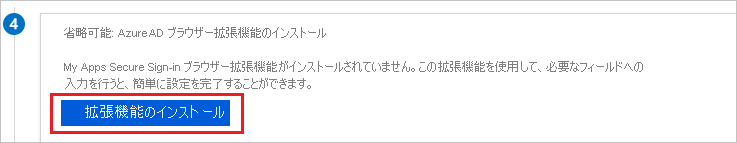
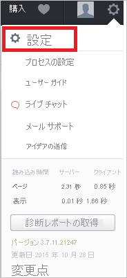
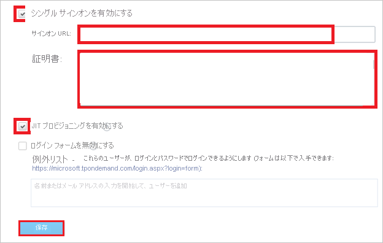

# チュートリアル: Azure Active Directory と TargetProcess の統合

このチュートリアルでは、TargetProcess と Azure Active Directory (Azure AD) を統合する方法について説明します。 Azure AD と TargetProcess を統合すると、次のことができます。

* TargetProcess にアクセスするユーザーを Azure AD で管理する。
* ユーザーが自分の Azure AD アカウントを使用して TargetProcess に自動的にサインインできるようにする。
* 1 つの中央サイト (Azure Portal) で自分のアカウントを管理します。

## 前提条件

開始するには、次が必要です。

* Azure AD サブスクリプション。 サブスクリプションがない場合は、[無料アカウント](https://azure.microsoft.com/free/)を取得できます。
* TargetProcess でのシングル サインオン (SSO) が有効なサブスクリプション。

## シナリオの説明

このチュートリアルでは、テスト環境で Azure AD のシングル サインオンを構成してテストします。

* TargetProcess では、**SP** によって開始される SSO がサポートされます。
* TargetProcess では、**Just-In-Time** ユーザー プロビジョニングがサポートされます。

## ギャラリーから TargetProcess を追加する

Azure AD への TargetProcess の統合を構成するには、ギャラリーから管理対象 SaaS アプリの一覧に TargetProcess を追加する必要があります。

1. 職場または学校アカウントか、個人の Microsoft アカウントを使用して、Azure portal にサインインします。
1. 左のナビゲーション ウィンドウで **[Azure Active Directory]** サービスを選択します。
1. **[エンタープライズ アプリケーション]** に移動し、 **[すべてのアプリケーション]** を選択します。
1. 新しいアプリケーションを追加するには、 **[新しいアプリケーション]** を選択します。
1. **[ギャラリーから追加する]** セクションで、検索ボックスに「**TargetProcess**」と入力します。
1. 結果パネルで **[TargetProcess]** を選択し、アプリを追加します。 お使いのテナントにアプリが追加されるのを数秒待機します。

## TargetProcess の Azure AD SSO の構成とテスト

**B.Simon** というテスト ユーザーを使用して、TargetProcess に対する Azure AD SSO を構成してテストします。 SSO が機能するためには、Azure AD ユーザーと TargetProcess の関連ユーザーとの間にリンク関係を確立する必要があります。

TargetProcess に対して Azure AD SSO を構成してテストするには、次の手順を実行します。

1. **[Azure AD SSO の構成](#configure-azure-ad-sso)** - ユーザーがこの機能を使用できるようにします。
    1. **[Azure AD のテスト ユーザーの作成](#create-an-azure-ad-test-user)** - B.Simon で Azure AD のシングル サインオンをテストします。
    1. **[Azure AD テスト ユーザーの割り当て](#assign-the-azure-ad-test-user)** - B.Simon が Azure AD シングル サインオンを使用できるようにします。
1. **[TargetProcess SSO の構成](#configure-targetprocess-sso)** - アプリケーション側でシングル サインオン設定を構成します。
    1. **[TargetProcess のテスト ユーザーの作成](#create-targetprocess-test-user)** - Azure AD の B.Simon にリンクさせるために、対応するユーザーを TargetProcess で作成します。
1. **[SSO のテスト](#test-sso)** - 構成が機能するかどうかを確認します。

## Azure AD SSO の構成

これらの手順に従って、Azure portal で Azure AD SSO を有効にします。

1. Azure portal の **TargetProcess** アプリケーション統合ページで、 **[管理]** セクションを探して、 **[シングル サインオン]** を選択します。
1. **[シングル サインオン方式の選択]** ページで、 **[SAML]** を選択します。
1. **[SAML によるシングル サインオンのセットアップ]** ページで、 **[基本的な SAML 構成]** の鉛筆アイコンをクリックして設定を編集します。

   

4. **[基本的な SAML 構成]** セクションで、次の手順を実行します。

    a. **[識別子 (エンティティ ID)]** ボックスに、次のパターンを使用して URL を入力します。`https://<SUBDOMAIN>.tpondemand.com/`

    b. **[サインオン URL]** ボックスに、次のパターンを使用して URL を入力します。`https://<SUBDOMAIN>.tpondemand.com/`

    > [!NOTE]
    > これらは実際の値ではありません。 これらの値を実際の識別子とサインオン URL で更新してください。 これらの値を取得するには、[TargetProcess クライアント サポート チーム](mailto:support@targetprocess.com)に連絡してください。 Azure portal の **[基本的な SAML 構成]** セクションに示されているパターンを参照することもできます。

5. **[SAML でシングル サインオンをセットアップします]** ページの **[SAML 署名証明書]** セクションで、 **[ダウンロード]** をクリックして要件のとおりに指定したオプションからの **証明書 (Base64)** をダウンロードして、お使いのコンピューターに保存します。

    

6. **[Setup TargetProcess]\(TargetProcess のセットアップ\)** セクションで、要件のとおりの適切な URL をコピーします。

    

### Azure AD のテスト ユーザーの作成

このセクションでは、Azure portal 内で B.Simon というテスト ユーザーを作成します。

1. Azure portal の左側のウィンドウから、 **[Azure Active Directory]** 、 **[ユーザー]** 、 **[すべてのユーザー]** の順に選択します。
1. 画面の上部にある **[新しいユーザー]** を選択します。
1. **[ユーザー]** プロパティで、以下の手順を実行します。
   1. **[名前]** フィールドに「`B.Simon`」と入力します。  
   1. **[ユーザー名]** フィールドに「username@companydomain.extension」と入力します。 たとえば、「 `B.Simon@contoso.com` 」のように入力します。
   1. **[パスワードを表示]** チェック ボックスをオンにし、 **[パスワード]** ボックスに表示された値を書き留めます。
   1. **Create** をクリックしてください。

### Azure AD テスト ユーザーの割り当て

このセクションでは、B.Simon に対して、TargetProcess へのアクセスを許可して Azure シングル サインオンを使用できるようにします。

1. Azure portal で **[エンタープライズ アプリケーション]** を選択し、 **[すべてのアプリケーション]** を選択します。
1. アプリケーションの一覧で **[TargetProcess]** を選択します。
1. アプリの概要ページで、 **[管理]** セクションを見つけて、 **[ユーザーとグループ]** を選択します。
1. **[ユーザーの追加]** を選択し、 **[割り当ての追加]** ダイアログで **[ユーザーとグループ]** を選択します。
1. **[ユーザーとグループ]** ダイアログの [ユーザー] の一覧から **[B.Simon]** を選択し、画面の下部にある **[選択]** ボタンをクリックします。
1. ユーザーにロールが割り当てられることが想定される場合は、 **[ロールの選択]** ドロップダウンからそれを選択できます。 このアプリに対してロールが設定されていない場合は、[既定のアクセス] ロールが選択されていることを確認します。
1. **[割り当ての追加]** ダイアログで、 **[割り当て]** をクリックします。

## TargetProcess SSO の構成

1. **TargetProcess** 内での構成を自動化するには、 **[拡張機能のインストール]** をクリックして **マイアプリによるセキュリティで保護されたサインイン拡張機能** をインストールする必要があります。

    

1. ブラウザーに拡張機能を追加した後、 **[Setup TargetProcess] \(TargetProcess のセットアップ\)** をクリックすると、TargetProcess アプリケーションに移動します。 そこから、管理者資格情報を提供して TargetProcess にサインインします。 ブラウザー拡張機能によりアプリケーションが自動的に構成され、手順 3 ～ 7 が自動化されます。

    

    **アプリケーションを手動で構成する場合は、次の手順を実行します。**

1. 管理者として TargetProcess アプリケーションにサインオンします。

1. 上部のメニューで、[**セットアップ**] をクリックします。

    

1. **[Settings]\(設定\)** タブをクリックします。

    

1. **[Single Sign-on]\(シングル サインオン\)** タブをクリックします。

    

1. [Single Sign-on] の設定ダイアログで、次の手順を実行します。

    

    a. **[Enable Single Sign-on (シングル サインオンを有効にする)]** をクリックします。

    b. **[Sign-on URL]\(サインオン URL\)** ボックスに、Azure portal からコピーした **ログイン URL** の値を貼り付けます。

    c. ダウンロードした証明書をメモ帳で開き、その内容をコピーして、 **[証明書]** ボックスに貼り付けます。

    d. **[Enable JIT Provisioning]** をクリックします。

    e. **[保存]** をクリックします。

### TargetProcess テスト ユーザーの作成

このセクションでは、Britta Simon というユーザーを TargetProcess に作成します。 TargetProcess では、Just-In-Time ユーザー プロビジョニングがサポートされています。この設定は既定で有効になっています。 このセクションでは、ユーザー側で必要な操作はありません。 TargetProcess にユーザーがまだ存在していない場合は、認証後に新規に作成されます。

> [!Note]
> ユーザーを手動で作成する必要がある場合は、[TargetProcess のサポート チーム](mailto:support@targetprocess.com)にお問い合わせください。

## SSO のテスト

このセクションでは、次のオプションを使用して Azure AD のシングル サインオン構成をテストします。 

* Azure portal で **[このアプリケーションをテストします]** をクリックします。 これにより、ログイン フローを開始できる TargetProcess のサインオン URL にリダイレクトされます。 

* TargetProcess のサインオン URL に直接移動し、そこからログイン フローを開始します。

* Microsoft マイ アプリを使用することができます。 マイ アプリで [TargetProcess] タイルをクリックすると、TargetProcess サインオン URL にリダイレクトされます。 マイ アプリの詳細については、[マイ アプリの概要](https://support.microsoft.com/account-billing/sign-in-and-start-apps-from-the-my-apps-portal-2f3b1bae-0e5a-4a86-a33e-876fbd2a4510)に関するページを参照してください。

## 次のステップ

TargetProcess を構成したら、組織の機密データを流出と侵入からリアルタイムで保護するセッション制御を適用できます。 セッション制御は、条件付きアクセスを拡張したものです。 [Microsoft Defender for Cloud Apps でセッション制御を強制する方法](/cloud-app-security/proxy-deployment-aad)をご覧ください。
