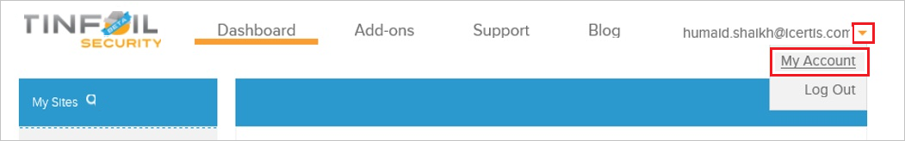
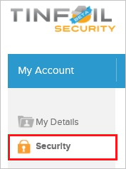
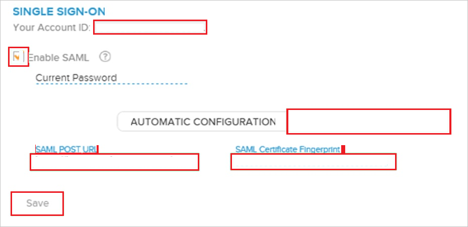

# チュートリアル: Azure AD SSO と TINFOIL SECURITY の統合

このチュートリアルでは、TINFOIL SECURITY と Azure Active Directory (Azure AD) を統合する方法について説明します。 Azure AD と TINFOIL SECURITY を統合すると、次のことができます。

* TINFOIL SECURITY にアクセスできるユーザーを Azure AD で制御できます。
* ユーザーが自分の Azure AD アカウントを使用して TINFOIL SECURITY に自動的にサインインできるように設定できます。
* 1 つの中央サイト (Azure Portal) で自分のアカウントを管理します。

## 前提条件

開始するには、次が必要です。

* Azure AD サブスクリプション。 サブスクリプションがない場合は、[無料アカウント](https://azure.microsoft.com/free/)を取得できます。
* TINFOIL SECURITY でのシングル サインオン (SSO) が有効なサブスクリプション。

## シナリオの説明

このチュートリアルでは、テスト環境で Azure AD の SSO を構成してテストします。

* TINFOIL SECURITY では、**IDP** Initiated SSO がサポートされています。

> [!NOTE]
> このアプリケーションの識別子は固定文字列値であるため、1 つのテナントで構成できるインスタンスは 1 つだけです。

## ギャラリーからの TINFOIL SECURITY の追加

Azure AD への TINFOIL SECURITY の統合を構成するには、ギャラリーから管理対象 SaaS アプリの一覧に TINFOIL SECURITY を追加する必要があります。

1. 職場または学校アカウントか、個人の Microsoft アカウントを使用して、Azure portal にサインインします。
1. 左のナビゲーション ウィンドウで **[Azure Active Directory]** サービスを選択します。
1. **[エンタープライズ アプリケーション]** に移動し、 **[すべてのアプリケーション]** を選択します。
1. 新しいアプリケーションを追加するには、 **[新しいアプリケーション]** を選択します。
1. **[ギャラリーから追加する]** セクションで、検索ボックスに「**TINFOIL SECURITY**」と入力します。
1. 結果のパネルから **[TINFOIL SECURITY]** を選択し、アプリを追加します。 お使いのテナントにアプリが追加されるのを数秒待機します。

## TINFOIL SECURITY の Azure AD SSO の構成とテスト

**B.Simon** というテスト ユーザーを使用して、TINFOIL SECURITY に対する Azure AD SSO を構成してテストします。 SSO が機能するためには、Azure AD ユーザーと TINFOIL SECURITY の関連ユーザーとの間にリンク関係を確立する必要があります。

TINFOIL SECURITY に対して Azure AD SSO を構成してテストするには、次の手順を行います。

1. **[Azure AD SSO の構成](#configure-azure-ad-sso)** - ユーザーがこの機能を使用できるようにします。
    1. **[Azure AD のテスト ユーザーの作成](#create-an-azure-ad-test-user)** - B.Simon で Azure AD のシングル サインオンをテストします。
    1. **[Azure AD テスト ユーザーの割り当て](#assign-the-azure-ad-test-user)** - B.Simon が Azure AD シングル サインオンを使用できるようにします。
1. **[TINFOIL SECURITY の SSO の構成](#configure-tinfoil-security-sso)** - アプリケーション側でシングル サインオン設定を構成します。
    1. **[TINFOIL SECURITY のテスト ユーザーの作成](#create-tinfoil-security-test-user)** - TINFOIL SECURITY で B.Simon に対応するユーザーを作成し、Azure AD の B.Simon にリンクさせます。
1. **[SSO のテスト](#test-sso)** - 構成が機能するかどうかを確認します。

## Azure AD SSO の構成

これらの手順に従って、Azure portal で Azure AD SSO を有効にします。

1. Azure portal の **TINFOIL SECURITY** アプリケーション統合ページで、 **[管理]** セクションを見つけて、 **[シングル サインオン]** を選択します。
1. **[シングル サインオン方式の選択]** ページで、 **[SAML]** を選択します。
1. **[SAML によるシングル サインオンのセットアップ]** ページで、 **[基本的な SAML 構成]** の鉛筆アイコンをクリックして設定を編集します。

   

1. **[基本的な SAML 構成]** セクションでは、アプリケーションは事前に構成されており、必要な URL は既に Azure で事前に設定されています。 構成を保存するには、 **[保存]** ボタンをクリックします。

1. Visitly アプリケーションは、特定の形式の SAML アサーションを使用するため、カスタム属性のマッピングを SAML トークンの属性の構成に追加する必要があります。 次のスクリーンショットには、既定の属性一覧が示されています。

    

1. その他に、Visitly アプリケーションでは、いくつかの属性が SAML 応答で返されることが想定されています。それらの属性を次に示します。 これらの属性も値が事前に設定されますが、要件に従ってそれらの値を確認することができます。

    | 名前 | ソース属性 |
    | ------------------- | -------------|
    | accountid | UXXXXXXXXXXXXX |

    > [!NOTE]
    > accountid の値については、このチュートリアルの中で後述します。

1. **[SAML 署名証明書]** セクションで **[編集]** ボタンをクリックして、 **[SAML 署名証明書]** ダイアログを開きます。

    

1. **[SAML 署名証明書]** セクションで **[Thumbprint Value]\(拇印の値\)** をコピーし、お使いのコンピューターに保存します。

    ![[Thumbprint]\(拇印\) の値をコピーする](common/copy-thumbprint.png)

1. **[TINFOIL SECURITY のセットアップ]** セクションで、要件に基づいて適切な URL をコピーします。

    

### Azure AD のテスト ユーザーの作成

このセクションでは、Azure portal 内で B.Simon というテスト ユーザーを作成します。

1. Azure portal の左側のウィンドウから、 **[Azure Active Directory]** 、 **[ユーザー]** 、 **[すべてのユーザー]** の順に選択します。
1. 画面の上部にある **[新しいユーザー]** を選択します。
1. **[ユーザー]** プロパティで、以下の手順を実行します。
   1. **[名前]** フィールドに「`B.Simon`」と入力します。  
   1. **[ユーザー名]** フィールドに「username@companydomain.extension」と入力します。 たとえば、「 `B.Simon@contoso.com` 」のように入力します。
   1. **[パスワードを表示]** チェック ボックスをオンにし、 **[パスワード]** ボックスに表示された値を書き留めます。
   1. **Create** をクリックしてください。

### Azure AD テスト ユーザーの割り当て

このセクションでは、B.Simon に TINFOIL SECURITY へのアクセスを許可することで、このユーザーが Azure シングル サインオンを使用できるようにします。

1. Azure portal で **[エンタープライズ アプリケーション]** を選択し、 **[すべてのアプリケーション]** を選択します。
1. アプリケーションの一覧で **[TINFOIL SECURITY]** を選択します。
1. アプリの概要ページで、 **[管理]** セクションを見つけて、 **[ユーザーとグループ]** を選択します。
1. **[ユーザーの追加]** を選択し、 **[割り当ての追加]** ダイアログで **[ユーザーとグループ]** を選択します。
1. **[ユーザーとグループ]** ダイアログの [ユーザー] の一覧から **[B.Simon]** を選択し、画面の下部にある **[選択]** ボタンをクリックします。
1. SAML アサーション内に任意のロール値が必要な場合、 **[ロールの選択]** ダイアログでユーザーに適したロールを一覧から選択し、画面の下部にある **[選択]** をクリックします。
1. **[割り当ての追加]** ダイアログで、 **[割り当て]** をクリックします。

## TINFOIL SECURITY の SSO の構成

1. 別の Web ブラウザーのウィンドウで、TINFOIL SECURITY の企業サイトに管理者としてサインインします。

1. 上部のツール バーの **[My Account]** をクリックします。

    

1. **[セキュリティ]** をクリックします。

    

1. **[シングル サインオン]** 構成ページで、次の手順を実行します。

    

    a. **[Enable SAML]** を選択します。

    b. **[Manual Configuration]** をクリックします。

    c. **[SAML Post URL]\(SAML POST の URL\)** ボックスに、Azure portal からコピーした **[ログイン URL]** の値を貼り付けます

    d. **[SAML Certificate Fingerprint]\(SAML 証明書フィンガープリント\)** ボックスに、 **[SAML 署名証明書]** セクションからコピーした **拇印** の値を貼り付けます。
  
    e. **[Your Account ID]\(アカウント ID\)** の値をコピーし、Azure portal の **[ユーザー属性とクレーム]** セクションの **[ソース属性]** ボックスに値を貼り付けます。

    f. **[保存]** をクリックします。

### TINFOIL SECURITY のテスト ユーザーの作成

Azure AD ユーザーが TINFOIL SECURITY にサインインできるようにするには、そのユーザーを TINFOIL SECURITY にプロビジョニングする必要があります。 TINFOIL SECURITY の場合、プロビジョニングは手動で行います。

**ユーザーをプロビジョニングするには、次の手順に従います。**

1. ユーザーがエンタープライズ アカウントに参加している場合は、[TINFOIL SECURITY サポート チームに連絡](https://www.tinfoilsecurity.com/contact)して、ユーザー アカウントを作成する必要があります。

1. 通常の TINFOIL SECURITY SaaS ユーザーは、グループ作業者をユーザーの任意のサイトに追加できます。 ここでは、新しい TINFOIL SECURITY ユーザー アカウントを作成するための招待状を指定した電子メール アドレスに送信するプロセスが起動します。

> [!NOTE]
> TINFOIL SECURITY から提供されている他の TINFOIL SECURITY ユーザー アカウント作成ツールまたは API を使用して、Azure AD ユーザー アカウントをプロビジョニングできます。

## SSO のテスト

このセクションでは、次のオプションを使用して Azure AD のシングル サインオン構成をテストします。

* Azure portal で [このアプリケーションをテストします] をクリックすると、SSO を設定した TINFOIL SECURITY に自動的にサインインします。

* Microsoft マイ アプリを使用することができます。 マイ アプリで [TINFOIL SECURITY] タイルをクリックすると、SSO を設定した TINFOIL SECURITY に自動的にサインインします。 マイ アプリの詳細については、[マイ アプリの概要](../user-help/my-apps-portal-end-user-access.md)に関するページを参照してください。

## 次のステップ

TINFOIL SECURITY を構成したら、組織の機密データの流出と侵入をリアルタイムで保護するセッション制御を適用することができます。 セッション制御は、条件付きアクセスを拡張したものです。 [Microsoft Defender for Cloud Apps でセッション制御を適用する方法をご覧ください](/cloud-app-security/proxy-deployment-aad)。
