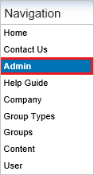
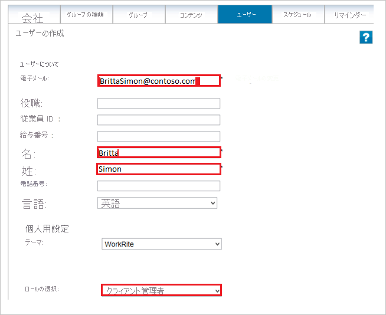

# チュートリアル: Azure AD SSO と Workrite の統合

このチュートリアルでは、Workrite と Azure Active Directory (Azure AD) を統合する方法について説明します。 Azure AD と Workrite を統合すると、次のことができます。

* Workrite にアクセスできるユーザーを Azure AD で制御する。
* ユーザーが自分の Azure AD アカウントを使用して Workrite に自動的にサインインできるようにする。
* 1 つの中央サイト (Azure Portal) で自分のアカウントを管理します。

## 前提条件

Azure AD と Workrite の統合を構成するには、次のものが必要です。

* Azure AD サブスクリプション。 Azure AD の環境がない場合は、[無料アカウント](https://azure.microsoft.com/free/)を取得できます。
* Workrite でのシングル サインオンが有効なサブスクリプション。

## シナリオの説明

このチュートリアルでは、テスト環境で Azure AD のシングル サインオンを構成してテストします。

* Workrite では、**SP** initiated SSO がサポートされます。

> [!NOTE]
> このアプリケーションの識別子は固定文字列値であるため、1 つのテナントで構成できるインスタンスは 1 つだけです。

## ギャラリーからの Workrite の追加

Azure AD への Workrite の統合を構成するには、ギャラリーから管理対象 SaaS アプリの一覧に Workrite を追加する必要があります。

1. 職場または学校アカウントか、個人の Microsoft アカウントを使用して、Azure portal にサインインします。
1. 左のナビゲーション ウィンドウで **[Azure Active Directory]** サービスを選択します。
1. **[エンタープライズ アプリケーション]** に移動し、 **[すべてのアプリケーション]** を選択します。
1. 新しいアプリケーションを追加するには、 **[新しいアプリケーション]** を選択します。
1. **[ギャラリーから追加する]** セクションで、検索ボックスに「**Workrite**」と入力します。
1. 結果のパネルから **[Workrite]** を選択し、アプリを追加します。 お使いのテナントにアプリが追加されるのを数秒待機します。

## Workrite の Azure AD SSO の構成とテスト

**B.Simon** というテスト ユーザーを使用して、Workrite での Azure AD SSO を構成してテストします。 SSO が機能するためには、Azure AD ユーザーと Workrite の関連ユーザーとの間にリンク関係を確立する必要があります。

Workrite 用に Azure AD SSO を構成してテストするには、次の手順に従います。

1. **[Azure AD SSO の構成](#configure-azure-ad-sso)** - ユーザーがこの機能を使用できるようにします。
    1. **[Azure AD のテスト ユーザーの作成](#create-an-azure-ad-test-user)** - B.Simon で Azure AD のシングル サインオンをテストします。
    1. **[Azure AD テスト ユーザーの割り当て](#assign-the-azure-ad-test-user)** - B.Simon が Azure AD シングル サインオンを使用できるようにします。
1. **[Workrite SSO の構成](#configure-workrite-sso)** - アプリケーション側でシングル サインオン設定を構成します。
    1. **[Workrite のテスト ユーザーの作成](#create-workrite-test-user)** - Workrite で B.Simon に対応するユーザーを作成し、Azure AD のこのユーザーにリンクさせます。
1. **[SSO のテスト](#test-sso)** - 構成が機能するかどうかを確認します。

## Azure AD SSO の構成

これらの手順に従って、Azure portal で Azure AD SSO を有効にします。

1. Azure portal の **Workrite** アプリケーション統合ページで、 **[管理]** セクションを見つけて、 **[シングル サインオン]** を選択します。
1. **[シングル サインオン方式の選択]** ページで、 **[SAML]** を選択します。
1. **[SAML によるシングル サインオンのセットアップ]** ページで、 **[基本的な SAML 構成]** の鉛筆アイコンをクリックして設定を編集します。

   

4. **[基本的な SAML 構成]** セクションで、次の手順を実行します。

    **[サインオン URL]** ボックスに、`https://app.workrite.co.uk/securelogin/samlgateway.aspx?id=<uniqueid>` という形式で URL を入力します。

    > [!NOTE]
    > この値は実際のものではありません。 実際のサインオン URL でこの値を更新してください。 この値を取得するには、[Workrite クライアント サポート チーム](mailto:support@workrite.co.uk)にお問い合わせください。 Azure portal の **[基本的な SAML 構成]** セクションに示されているパターンを参照することもできます。

5. **[SAML でシングル サインオンをセットアップします]** ページの **[SAML 署名証明書]** セクションで、 **[ダウンロード]** をクリックして要件のとおりに指定したオプションからの **証明書 (Base64)** をダウンロードして、お使いのコンピューターに保存します。

    

6. **[Set up Workrite]\(Workrite の設定\)** セクションで、要件どおりの適切な URL をコピーします。

    

### Azure AD のテスト ユーザーの作成 

このセクションでは、Azure portal 内で B.Simon というテスト ユーザーを作成します。

1. Azure portal の左側のウィンドウから、 **[Azure Active Directory]** 、 **[ユーザー]** 、 **[すべてのユーザー]** の順に選択します。
1. 画面の上部にある **[新しいユーザー]** を選択します。
1. **[ユーザー]** プロパティで、以下の手順を実行します。
   1. **[名前]** フィールドに「`B.Simon`」と入力します。  
   1. **[ユーザー名]** フィールドに「username@companydomain.extension」と入力します。 たとえば、「 `B.Simon@contoso.com` 」のように入力します。
   1. **[パスワードを表示]** チェック ボックスをオンにし、 **[パスワード]** ボックスに表示された値を書き留めます。
   1. **Create** をクリックしてください。

### Azure AD テスト ユーザーの割り当て

このセクションでは、B. Simon に Workrite へのアクセスを許可することで、このユーザーが Azure シングル サインオンを使用できるようにします。

1. Azure portal で **[エンタープライズ アプリケーション]** を選択し、 **[すべてのアプリケーション]** を選択します。
1. アプリケーションの一覧で **[Workrite]** を選択します。
1. アプリの概要ページで、 **[管理]** セクションを見つけて、 **[ユーザーとグループ]** を選択します。
1. **[ユーザーの追加]** を選択し、 **[割り当ての追加]** ダイアログで **[ユーザーとグループ]** を選択します。
1. **[ユーザーとグループ]** ダイアログの [ユーザー] の一覧から **[B.Simon]** を選択し、画面の下部にある **[選択]** ボタンをクリックします。
1. ユーザーにロールが割り当てられることが想定される場合は、 **[ロールの選択]** ドロップダウンからそれを選択できます。 このアプリに対してロールが設定されていない場合は、[既定のアクセス] ロールが選択されていることを確認します。
1. **[割り当ての追加]** ダイアログで、 **[割り当て]** をクリックします。

## Workrite の SSO の構成

**Workrite** 側でシングル サインオンを構成するには、ダウンロードした **証明書 (Base64)** と Azure portal からコピーした適切な URL を [Workrite サポート チーム](mailto:support@workrite.co.uk)に送信する必要があります。 サポート チームはこれを設定して、SAML SSO 接続が両方の側で正しく設定されるようにします。

### Workrite のテスト ユーザーの作成

このセクションの目的は、Workrite で Britta Simon というユーザーを作成することです。

**Workrite で Britta Simon というユーザーを作成するには、次の手順に従います。**

1. Workrite 企業サイトに管理者としてサインオンします。

2. ナビゲーション ウィンドウで **[Admin]** をクリックします。
   
    

3. クイック リンクに移動し、 **[ユーザーの作成]** をクリックします。
   
    ![[ユーザーの作成] セクション](./media/workrite-tutorial/user.png)

4. [**ユーザーの作成**] ダイアログ ボックスで、次の手順を実行します。
   
    
    
    a. **[Email]\(メール\)** ボックスに、ユーザーのメール アドレス (Brittasimon@contoso.com など) を入力します。

    b. **[名]** ボックスに、ユーザーの名を入力します (この例では Britta)。

    c. **[姓]** ボックスに、ユーザーの姓を入力します (この例では Simon)。
    
    d. **[ロールの選択]** で **[クライアント管理者]** を選択します。
    
    e. **[保存]** をクリックします。

## SSO のテスト 

このセクションでは、次のオプションを使用して Azure AD のシングル サインオン構成をテストします。 

* Azure portal で **[このアプリケーションをテストします]** をクリックします。 これにより、ログイン フローを開始できる Workrite のサインオン URL にリダイレクトされます。 

* Workrite のサインオン URL に直接移動し、そこからログイン フローを開始します。

* Microsoft マイ アプリを使用することができます。 マイ アプリで [Workrite] タイルをクリックすると、Workrite のサインオン URL にリダイレクトされます。 マイ アプリの詳細については、[マイ アプリの概要](../user-help/my-apps-portal-end-user-access.md)に関するページを参照してください。

## 次のステップ

Workrite を構成したら、自分の組織の機密データを流出と侵入からリアルタイムで保護するセッション制御を適用できます。 セッション制御は、条件付きアクセスを拡張したものです。 [Microsoft Defender for Cloud Apps でセッション制御を適用する方法をご覧ください](/cloud-app-security/proxy-deployment-aad)。
