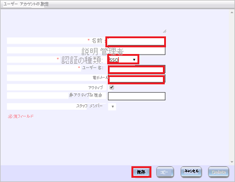

# チュートリアル:Azure Active Directory シングル サインオン (SSO) と Workware の統合

このチュートリアルでは、Workware と Azure Active Directory (Azure AD) を統合する方法について説明します。 Azure AD と Workware を統合すると、次のことができます。

* Workware にアクセスできるユーザーを Azure AD で制御できます。
* ユーザーが自分の Azure AD アカウントで自動的に Workware にサインインできるように設定できます。
* 1 つの中央サイト (Azure Portal) で自分のアカウントを管理します。

## 前提条件

開始するには、次が必要です。

* Azure AD サブスクリプション。 サブスクリプションがない場合は、[無料アカウント](https://azure.microsoft.com/free/)を取得できます。
* Workware でのシングル サインオン (SSO) が有効になったサブスクリプション。

## シナリオの説明

このチュートリアルでは、テスト環境で Azure AD の SSO を構成してテストします。

* Workware では、**IDP** Initiated SSO がサポートされます

## ギャラリーからの Workware の追加

Azure AD への Workware の統合を構成するには、ギャラリーからマネージド SaaS アプリの一覧に Workware を追加する必要があります。

1. 職場または学校アカウントか、個人の Microsoft アカウントを使用して、Azure portal にサインインします。
1. 左のナビゲーション ウィンドウで **[Azure Active Directory]** サービスを選択します。
1. **[エンタープライズ アプリケーション]** に移動し、 **[すべてのアプリケーション]** を選択します。
1. 新しいアプリケーションを追加するには、 **[新しいアプリケーション]** を選択します。
1. **[ギャラリーから追加する]** セクションで、検索ボックスに、「**Workware**」と入力します。
1. 結果のパネルから **Workware** を選択し、アプリを追加します。 お使いのテナントにアプリが追加されるのを数秒待機します。

## Workware の Azure AD SSO の構成とテスト

**B.Simon** というテスト ユーザーを使用して、Workware に対する Azure AD SSO を構成してテストします。 SSO が機能するためには、Azure AD ユーザーと Workware の関連ユーザーとの間にリンク関係を確立する必要があります。

Workware に対して Azure AD SSO を構成してテストするには、次の手順を行います。

1. **[Azure AD SSO の構成](#configure-azure-ad-sso)** - ユーザーがこの機能を使用できるようにします。
    * **[Azure AD のテスト ユーザーの作成](#create-an-azure-ad-test-user)** - B.Simon で Azure AD のシングル サインオンをテストします。
    * **[Azure AD テスト ユーザーの割り当て](#assign-the-azure-ad-test-user)** - B.Simon が Azure AD シングル サインオンを使用できるようにします。
1. **[Workware の SSO の構成](#configure-workware-sso)** - アプリケーション側でシングル サインオン設定を構成します。
    * **[Workware のテスト ユーザーの作成](#create-workware-test-user)** - Workware で B.Simon に対応するユーザーを作成し、Azure AD のこのユーザーにリンクさせます。
1. **[SSO のテスト](#test-sso)** - 構成が機能するかどうかを確認します。

## Azure AD SSO の構成

これらの手順に従って、Azure portal で Azure AD SSO を有効にします。

1. Azure portal の **Workware** アプリケーション統合ページで、 **[管理]** セクションを探して、 **[シングル サインオン]** を選択します。
1. **[シングル サインオン方式の選択]** ページで、 **[SAML]** を選択します。
1. **[SAML でシングル サインオンをセットアップします]** ページで、 **[基本的な SAML 構成]** の編集 (ペン) アイコンをクリックして設定を編集します。

   

1. **[SAML でシングル サインオンをセットアップします]** ページで、次のフィールドの値を入力します。

    a. **[識別子]** ボックスに、`<WORKWARE_URL>/WW/AuthServices` の形式で URL を入力します。

    b. **[応答 URL]** ボックスに、`<WORKWARE_URL>/WW/AuthServices/Acs` のパターンを使用して URL を入力します

    > [!NOTE]
    > これらは実際の値ではありません。 実際の識別子と応答 URL でこれらの値を更新します。 これらの値を取得するには、[Workware クライアント サポート チーム](mailto:support@activeops.com)にお問い合わせください。 Azure portal の **[基本的な SAML 構成]** セクションに示されているパターンを参照することもできます。

1. **[SAML でシングル サインオンをセットアップします]** ページの **[SAML 署名証明書]** セクションで、 **[フェデレーション メタデータ XML]** を探して **[ダウンロード]** を選択し、証明書をダウンロードして、お使いのコンピューターに保存します。

    

1. **[Workware のセットアップ]** セクションで、要件に基づいて適切な URL をコピーします。

    
### Azure AD のテスト ユーザーの作成

このセクションでは、Azure portal 内で B.Simon というテスト ユーザーを作成します。

1. Azure portal の左側のウィンドウから、 **[Azure Active Directory]** 、 **[ユーザー]** 、 **[すべてのユーザー]** の順に選択します。
1. 画面の上部にある **[新しいユーザー]** を選択します。
1. **[ユーザー]** プロパティで、以下の手順を実行します。
   1. **[名前]** フィールドに「`B.Simon`」と入力します。  
   1. **[ユーザー名]** フィールドに「username@companydomain.extension」と入力します。 たとえば、「 `B.Simon@contoso.com` 」のように入力します。
   1. **[パスワードを表示]** チェック ボックスをオンにし、 **[パスワード]** ボックスに表示された値を書き留めます。
   1. **Create** をクリックしてください。

### Azure AD テスト ユーザーの割り当て

このセクションでは、B. Simon に Workware へのアクセスを許可することで、このユーザーが Azure シングル サインオンを使用できるようにします。

1. Azure portal で **[エンタープライズ アプリケーション]** を選択し、 **[すべてのアプリケーション]** を選択します。
1. アプリケーションの一覧で **[Workware]** を選択します。
1. アプリの概要ページで、 **[管理]** セクションを見つけて、 **[ユーザーとグループ]** を選択します。
1. **[ユーザーの追加]** を選択し、 **[割り当ての追加]** ダイアログで **[ユーザーとグループ]** を選択します。
1. **[ユーザーとグループ]** ダイアログの [ユーザー] の一覧から **[B.Simon]** を選択し、画面の下部にある **[選択]** ボタンをクリックします。
1. ユーザーにロールが割り当てられることが想定される場合は、 **[ロールの選択]** ドロップダウンからそれを選択できます。 このアプリに対してロールが設定されていない場合は、[既定のアクセス] ロールが選択されていることを確認します。
1. **[割り当ての追加]** ダイアログで、 **[割り当て]** をクリックします。

## Workware SSO の構成

Workware で SSO 機能を使用するには、次の設定を完了する必要があります。

#### Workware システム管理者の SSO アクセス許可を有効にする

* Workware のシステム管理者が SSO 認証を設定できるようにするには、SSO 認証のアクセス許可 ( **[Administration]\(管理\) > [System Settings]\(システム設定\) の [System configuration permissions]\(システム構成のアクセス許可\) カテゴリ > [Permissions to Role]\(ロールへのアクセス許可\)** 画面) を Workware システム管理者に対して有効にする必要があります。

    ![[SSO Authentication]\(SSO 認証\) のアクセス許可](./media/workware-tutorial/permission.png)

#### Workware で SSO 認証を設定する

1. **[System Settings]\(システム設定\)** ページに移動し、 **[SSO Authentication]\(SSO 認証\)** をクリックします

1. **[SSO Authentication]\(SSO 認証\)** セクションで **[Add SSO Authentication]\(SSO 認証の追加\)** ボタンをクリックし、次の手順を実行します。 

    ![[SSO Authentication]\(SSO 認証\)](./media/workware-tutorial/authentication.png)

    1. **[External Identity Provider]\(外部 ID プロバイダー\)** で、IDP の名前を指定します。
    1. **[Authentication Type]\(認証の種類\)** として **[SAML2.0]** を選択します
    1. **[Identity Provider SignIn URL]\(ID プロバイダーのサインイン URL\)** ボックスに、Azure portal からコピーした **ログイン URL** の値を入力します。
    1. **[Identity Provider Issuer URL]\(ID プロバイダーの発行者 URL\)** ボックスに、Azure portal からコピーした **Azure AD 識別子** の値を入力します。
    1. **[Identity Provider Logout URL]\(ID プロバイダーのログアウト URL\)** ボックスに、Azure portal からコピーした **ログアウト URL** の値を入力します。
    1. **[Enable]\(有効にする\)** をクリックします。
    1. ダウンロードした **証明書** を Azure portal から **ID プロバイダー証明書** にアップロードします。
    1. **[保存]**

### Workware テスト ユーザーの作成

1. Workware の Web サイトに管理者としてサインインします。

1. **[Admin]\(管理\) > [Create / View]\(作成 / 表示\) > [User Accounts]\(ユーザー アカウント\) > [Add New]\(新規追加\)** の順に選択します

1. 次のページで、以下の手順を実行します。

    

    a. **[Name]\(名前\)** フィールドに有効な名前を入力します。

    b. **[Authentication Type]\(認証の種類\)** として **SSO** を選択します。

    c. 必須フィールドに入力し、 **[Save]\(保存\)** をクリックします。

## SSO のテスト 

このセクションでは、次のオプションを使用して Azure AD のシングル サインオン構成をテストします。

* Azure portal で [このアプリケーションをテストします] をクリックすると、SSO を設定した Workware に自動的にサインインされます

* Microsoft アクセス パネルを使用することができます。 アクセス パネルで [Workware] タイルをクリックすると、SSO を設定した Workware に自動的にサインインします。 アクセス パネルの詳細については、[アクセス パネルの概要](../user-help/my-apps-portal-end-user-access.md)に関する記事を参照してください。

## 次のステップ

Workware を構成したら、ご自分の組織の機密データの流出と侵入をリアルタイムで保護するセッション制御を適用することができます。 セッション制御は、条件付きアクセスを拡張したものです。 [Microsoft Cloud App Security でセッション制御を強制する方法](/cloud-app-security/proxy-deployment-any-app)をご覧ください。