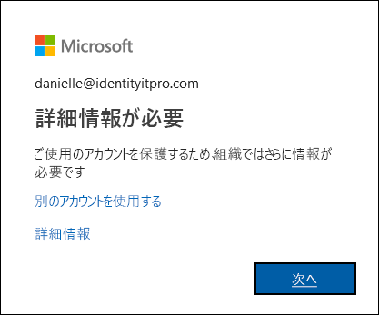

# 追加認証ページとは

あなたの組織では、あなたがサインインするときに本人であることを確認する追加の手順を採用しています。 この追加のセキュリティ検証は、2 要素認証とも呼ばれます。 これは、ユーザー名、パスワード、モバイル デバイスまたは電話の組み合わせで構成されます。 alain@outlook.com などの Microsoft アカウントで 2 要素認証をオフにするだけの場合は、「[Microsoft アカウントの 2 段階認証を有効または無効にする](https://support.microsoft.com/help/4028586/microsoft-account-turning-two-step-verification-on-or-off)」の手順に従います。

2 要素認証では、次の 2 つの形式の認証を使用するため、パスワードだけよりも安全性が高くなります。

- ユーザーが知っているも (パスワードなど)。
- ユーザーが所持しているもの (携帯電話やその他のデバイス)。

2 要素認証を使用すると、悪意のあるハッカーがなりすますのを防ぐのに役立ちます。 パスワードが知られてしまった場合でも、デバイスは持っていない可能性が高いです。

>[!Important]
>従業員その他のユーザーに対して 2 要素認証を有効にする方法に関する情報を探している管理者の方は、「[Azure Active Directory 認証のドキュメント](../authentication/index.yml)」を参照してください。 この記事は、職場または学校アカウント (alain@contoso.com など) で 2 要素認証を使用しようとしているユーザーを対象としています。

## この機能の使用を決定するユーザー

2 要素認証を使用するかどうかを誰が決定するかは、所有しているアカウントの種類によって異なります。

- **職場または学校のアカウント。** 職場または学校アカウント (alain@contoso.com など) を使用している場合、お客様が 2 要素認証を使用するかどうかは、特定の認証方法と共にお客様の組織が決定します。 この機能を使用しなければならないことは組織の決定であるため、個人でこれを無効にすることはできません。

- **個人の Microsoft アカウント。** 個人の Microsoft アカウント (alain@outlook.com など) の場合、2 要素認証の設定を選択できます。 [Microsoft アカウントに対する 2 要素認証のオンとオフの切り替え](https://support.microsoft.com/help/4028586/microsoft-account-turning-two-step-verification-on-or-off)に関するページの簡単な手順を使用して、いつでもオンまたはオフにすることができます。

    >[!Note]
    >2 要素認証およびいずれかの個人用 Microsoft アカウントで問題が発生している場合は、[Microsoft アカウントで 2 段階認証を使用する方法](https://support.microsoft.com/help/12408/microsoft-account-how-to-use-two-step-verification)に関するページでいくつかの推奨事項をご確認ください。

## [追加のセキュリティ確認] ページを開く

ご自分の組織で 2 要素認証がオンにされると、サインインするたびに、ご自分のアカウントのセキュリティを確保する詳細情報の提供を求めるプロンプトが表示されます。

### [追加のセキュリティ確認] ページにアクセスするには

1. **[詳細情報が必要]** プロンプトで **[次へ]** を選択します。

    **[追加のセキュリティ確認]** ページが表示されます。

2. **[追加のセキュリティ確認]** ページで、職場または学校アカウントにサインインするときに本人確認を行うために使用する使用する 2 要素認証の方法を選択します。 選択できるオプションは次のとおりです。

    | 連絡方法 | 説明 |
    | --- | --- |
    | モバイル アプリ | <ul><li>**[確認のため通知を受け取る]** : このオプションは、ユーザーのスマート フォンまたはタブレット上の認証アプリに通知をプッシュします。 通知を確認し、適切である場合は、アプリで **[認証]** を選択するだけです。 会社または学校の場合は、認証する前に PIN を入力する必要があります。</li><li>**[確認コードを使用する]** : このモードでは、アプリにより 30 秒ごとに更新される確認コードが生成されます。 サインイン画面に最新の確認コードを入力します。 Microsoft Authenticator アプリは、[Android](https://go.microsoft.com/fwlink/?linkid=866594) および [iOS](https://go.microsoft.com/fwlink/?linkid=866594) で利用できます。</li></ul> |
    | 認証用電話 | <ul><li>**[電話]** はユーザーが指定した電話番号に自動音声通話を行います。 呼び出しに応答し、電話のキーパッドの # (シャープ記号) を押して認証を行います。</li><li>**[テキスト メッセージ]** は確認コードを含むテキスト メッセージを送信します。 テキスト内の指示に従って、テキスト メッセージに返信するか、指定された確認コードをサインイン インターフェイスに入力します。</li></ul> |
    | 会社電話 | ユーザーが設定した電話番号に自動音声通話を行います。 呼び出しに応答し、電話のキーパッドの # (シャープ記号) を押して認証を行います。 |

## 次のステップ

**[追加のセキュリティ確認]** ページで 2 要素認証の方法を選択したら、それを設定する必要があります。

- [モバイル デバイスを認証方法として設定する](multi-factor-authentication-setup-phone-number.md)

- [会社の電話を認証方法として設定する](multi-factor-authentication-setup-office-phone.md)

- [Microsoft Authenticator アプリを認証方法として設定する](multi-factor-authentication-setup-auth-app.md)

## 関連リソース

- [2 要素認証を使用してサインインする](multi-factor-authentication-end-user-signin.md)

- [2 要素認証のサポートを受ける](multi-factor-authentication-end-user-troubleshoot.md)