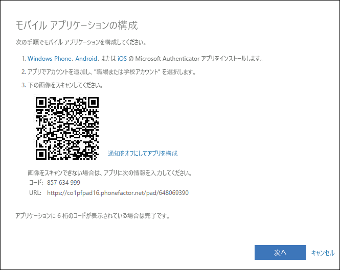

# 認証アプリを 2 要素認証方法として設定する

セキュリティ確認方法としてモバイル デバイスに通知を送信するか、確認コードを送信するように認証アプリを設定することができます。 Microsoft Authenticator アプリを使用することは必須ではなく、設定プロセス時に別のアプリを選択することもできます。 ただし、この記事では、Microsoft Authenticator アプリを使用します。

>[!Important]
>アカウントを追加する前に、Microsoft Authenticator アプリをダウンロードしてインストールする必要があります。 まだ完了していない場合は、「[アプリのダウンロードとインストール](user-help-auth-app-download-install.md)」という記事の手順に従ってください。

>[!Note]
> モバイル アプリ オプションが灰色表示される場合、検証に認証アプリを使用することを組織が許可していない可能性があります。 この場合、別の方法を選択するか、管理者に支援を要請する必要があります。

## 通知を送信するように Microsoft Authenticator アプリを設定する

1. **[追加のセキュリティ確認]** ページの **[手順 1: ご希望のご連絡方法をお知らせください]** 領域で **[モバイル アプリ]** を選択します。

2. **[モバイル アプリをどのような用途で使用されますか?]** 領域で **[確認のため通知を受け取る]** を選択し、 **[設定]** を選択します。

    ![[モバイル アプリ] を選択し、[確認のため通知を受け取る] オプションをオンにした [追加のセキュリティ確認] ページ](media/multi-factor-authentication-verification-methods/multi-factor-authentication-auth-app-notification.png)

    **[モバイル アプリケーションの構成]** ページが表示されます。

    

3. Microsoft Authenticator アプリを開き、右上の **[Customize and control]\(カスタマイズと制御\)** アイコンから **[アカウントの追加]** を選択して、 **[職場または学校アカウント]** を選択します。

    >[!Note]
    >初めて Microsoft Authenticator アプリを設定する場合は、アプリによるカメラへのアクセスを許可するか (iOS)、またはアプリによる画像の撮影とビデオの録画を許可するか (Android) を確認するメッセージが表示されることがあります。 認証アプリがカメラにアクセスして、次の手順で QR コードを撮影できるようにするには、 **[許可]** を選択する必要があります。 カメラを許可しない場合でも、認証アプリを設定できますが、手動でコード情報を追加する必要があります。 コードを手動で追加する方法の詳細については、「[アプリにアカウントを手動で追加する](user-help-auth-app-add-account-manual.md)」を参照してください。

4. デバイスのカメラを使用して、コンピューターの **[モバイル アプリケーションの構成]** 画面から QR コードをスキャンして、 **[次へ]** を選択します。

5. コンピューターの **[追加のセキュリティ確認]** ページに戻って、構成が正常に完了したというメッセージが表示されていることを確認します。 **[次へ]** を選択します。

    ![正常に終了したことを示すメッセージが表示された [追加のセキュリティ確認] ページ](media/multi-factor-authentication-verification-methods/multi-factor-authentication-auth-app-notification-confirm.png)

    認証アプリは、テストとしてモバイル デバイスに通知を送信します。

6. モバイル デバイスで、 **[承認]** を選択します。

7. 使用しているコンピューターで、 **[手順 3: モバイル アプリにアクセスできなくなった場合]** 領域にモバイル デバイスの電話番号を追加し、 **[次へ]** を選択します。

    何らかの理由でモバイル アプリにアクセスできないか、モバイル アプリを使用できない場合は、バックアップとして機能するモバイル デバイスの電話番号を追加することを強くお勧めします。

8. **[手順 4: 既存のアプリケーションを使用し続ける]** 領域から、指定されたアプリ パスワードをコピーし、それを安全な場所に貼り付けます。

    ![[追加のセキュリティ確認] ページの [アプリ パスワード] 領域](media/multi-factor-authentication-verification-methods/multi-factor-authentication-app-passwords.png)

    >[!Note]
    >古いアプリでアプリ パスワードを使用する方法の詳細については、「[アプリ パスワードの管理](multi-factor-authentication-end-user-app-passwords.md)」を参照してください。 2 要素認証をサポートしていない古いアプリを引き続き使用する場合のみ、アプリ パスワードを使用する必要があります。

9. **[完了]** を選択します。

## 確認コードを使用するように Microsoft Authenticator アプリを設定する

1. **[追加のセキュリティ確認]** ページの **[手順 1: ご希望のご連絡方法をお知らせください]** 領域で **[モバイル アプリ]** を選択します。

2. **[モバイル アプリをどのような用途で使用されますか?]** 領域で **[確認コードを使用する]** を選択し、 **[設定]** を選択します。

    ![[モバイル アプリ] を選択し、[確認のため通知を受け取る] オプションをオンにした [追加のセキュリティ確認] ページ](media/multi-factor-authentication-verification-methods/multi-factor-authentication-auth-app-verification-code.png)

    **[モバイル アプリケーションの構成]** ページが表示されます。

    

3. Microsoft Authenticator アプリを開き、右上の **[Customize and control]\(カスタマイズと制御\)** アイコンから **[アカウントの追加]** を選択して、 **[職場または学校アカウント]** を選択します。

    >[!Note]
    >初めて Microsoft Authenticator アプリを設定する場合は、アプリによるカメラへのアクセスを許可するか (iOS)、またはアプリによる画像の撮影とビデオの録画を許可するか (Android) を確認するメッセージが表示されることがあります。 認証アプリがカメラにアクセスして、次の手順で QR コードを撮影できるようにするには、 **[許可]** を選択する必要があります。 カメラを許可しない場合でも、認証アプリを設定できますが、手動でコード情報を追加する必要があります。 コードを手動で追加する方法の詳細については、「[アプリにアカウントを手動で追加する](user-help-auth-app-add-account-manual.md)」を参照してください。

4. デバイスのカメラを使用して、コンピューターの **[モバイル アプリケーションの構成]** 画面から QR コードをスキャンして、 **[次へ]** を選択します。

5. コンピューターの **[追加のセキュリティ確認]** ページに戻って、構成が正常に完了したというメッセージが表示されていることを確認します。 **[次へ]** を選択します。

    ![正常に終了したことを示すメッセージが表示された [追加のセキュリティ確認] ページ](media/multi-factor-authentication-verification-methods/multi-factor-authentication-auth-app-verification-confirm.png)

    認証アプリからテストとして確認コードが要求されます。

6. Microsoft Authenticator アプリで、職場または学校のご利用のアカウントまで下方向にスクロールし、6 桁のコードをアプリからコピーして、コンピューターの **[手順 2: モバイル アプリから確認パスワードを入力してください]** ボックスに貼り付け、 **[確認]** を選択します。

    ![確認コードをテストする [追加のセキュリティ確認] ページ](media/multi-factor-authentication-verification-methods/multi-factor-authentication-auth-app-verification-test.png)

7. 使用しているコンピューターで、 **[手順 3: モバイル アプリにアクセスできなくなった場合]** 領域にモバイル デバイスの電話番号を追加し、 **[次へ]** を選択します。

    何らかの理由でモバイル アプリにアクセスできないか、モバイル アプリを使用できない場合は、バックアップとして機能するモバイル デバイスの電話番号を追加することを強くお勧めします。

8. **[手順 4: 既存のアプリケーションを使用し続ける]** 領域から、指定されたアプリ パスワードをコピーし、それを安全な場所に貼り付けます。

    ![[追加のセキュリティ確認] ページの [アプリ パスワード] 領域](media/multi-factor-authentication-verification-methods/multi-factor-authentication-app-passwords.png)

    >[!Note]
    >古いアプリでアプリ パスワードを使用する方法の詳細については、「[アプリ パスワードの管理](multi-factor-authentication-end-user-app-passwords.md)」を参照してください。 2 要素認証をサポートしていない古いアプリを引き続き使用する場合のみ、アプリ パスワードを使用する必要があります。

9. **[完了]** を選択します。

## 次のステップ

2 要素認証方法を設定した後、方法の追加、設定とアプリ パスワードの管理、サインインを行うことができます。また、2 要素認証に関連する一般的な問題についてサポートを受けることもできます。

- [2 要素認証方法の設定を管理する](multi-factor-authentication-end-user-manage-settings.md)

- [アプリ パスワードの管理](multi-factor-authentication-end-user-app-passwords.md)

- [2 要素認証を使用してサインインする](multi-factor-authentication-end-user-signin.md)

- [2 要素認証のサポートを受ける](multi-factor-authentication-end-user-troubleshoot.md)
