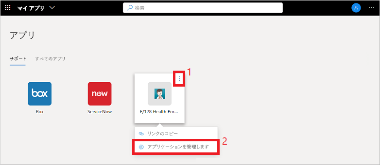
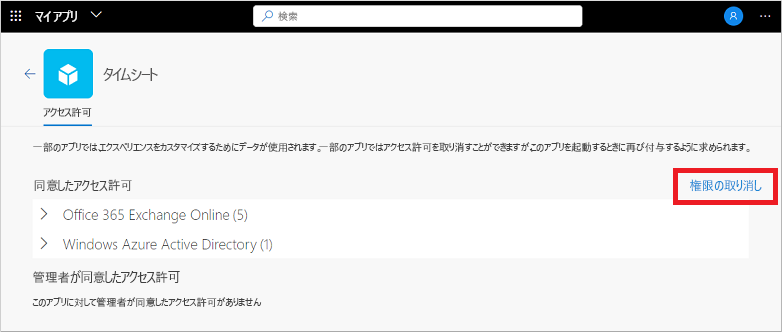

# マイ アプリ (プレビュー) ポータルでのアプリケーションのアクセス許可の編集または取り消し

**マイ アプリ** (プレビュー) ポータルで組織のアプリケーションを使用する場合、多くの場合、アクセス許可を付与し、アカウント情報を保存します。 データをセキュリティで保護し続けるには、アクセス許可を確認したり取り消したり、保存されているアカウントの資格情報をクリアしたりする必要がある場合があります。 アクセス許可またはアカウントを削除すると、一部のアプリ機能が無効になる可能性があります。 アクセス許可またはアカウントを削除した後に問題が発生した場合は、組織のヘルプデスクにサポートを依頼してください。

[!INCLUDE [preview-notice](../../../includes/active-directory-end-user-my-apps-and-workspaces.md)]

>[!Important]
>このコンテンツはユーザーを対象としています。 管理者の方は、「[アプリケーション管理のドキュメント](https://docs.microsoft.com/azure/active-directory/manage-apps/access-panel-workspaces)」で、クラウドベースのアプリの設定と管理の方法を詳しくご覧いただけます。

## アプリのアクセス許可の管理

自分または管理者によって同意されたアクセス許可を表示するには、 **[マイ アプリ]** ポータルでアプリにマウス ポインターを置いて **[...]** を選択し、 **[アプリケーションの管理]** を選択します。

アクセス許可ウィンドウの上部には、個人的に同意したものが表示されます。 アプリのアクセス許可の例には、カレンダー、連絡先、またはカメラにアクセスする機能があります。

**[権限の取り消し]** を選択することにより、同意したアクセス許可を取り消すことができます。しかし、アクセス許可を削除すると、アプリの機能の一部が無効になる場合があります。 アクセス許可またはアカウントを削除した後に問題が発生した場合は、組織のヘルプデスクにサポートを依頼してください。

[アクセス許可] ウィンドウの下部に、管理者が代理として同意した内容が表示されます。 管理者が同意したアクセス許可がない場合、このセクションは表示されません。 管理者はこれらのアクセス許可に同意しているので、これらを取り消すことはできません。組織のポリシーで必須であることが多いです。

## 次のステップ

アプリのアクセス許可と保存されたアカウントを **マイ アプリ** ポータルで管理した後、次のことを行うことができます。

- 自分のアプリを、組織が作成して提供しているさまざまなカテゴリに整理できます。 詳細については、「[マイ アプリ (プレビュー) ポータルでのワークスペースへのアクセスおよび使用](my-applications-portal-workspaces.md)」を参照してください。

## 関連記事

- [自分のプロファイルとアカウント情報の更新](my-account-portal-overview.md)。 **マイ プロファイル** (プレビュー) ポータルに表示される自分の個人情報を更新する方法について説明します。

- [所属組織の管理](my-account-portal-organizations-page.md)。 **マイ プロファイル** ポータルの **[組織]** ページで、自分の組織に関連した情報を表示して管理する方法について説明します。

- [お使いの接続デバイスの管理](my-account-portal-devices-page.md)。 **マイ プロファイル** ポータルの **[デバイス]** ページから、自分の職場または学校アカウントで接続しているデバイスを管理する方法について説明します。