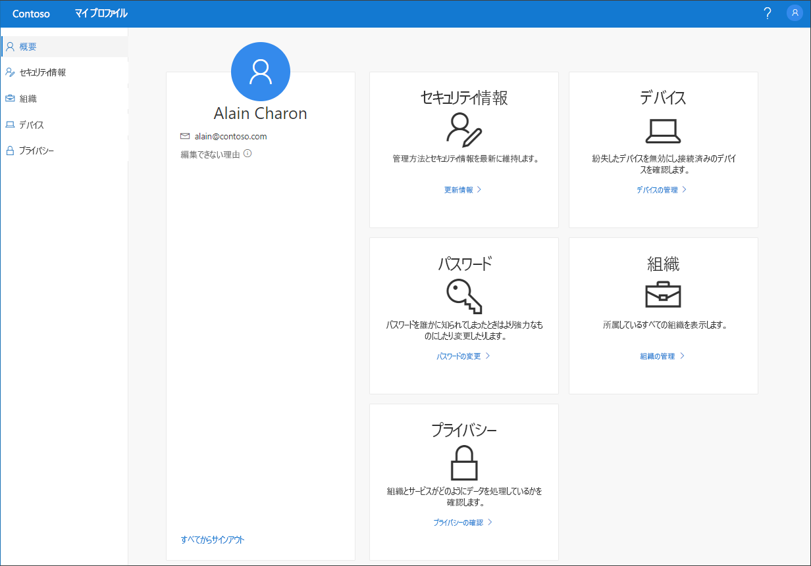

# マイ プロファイル (プレビュー) ポータルの概要

[!INCLUDE [preview-notice](../../../includes/active-directory-end-user-preview-notice-myprofile.md)]

**マイ プロファイル** (プレビュー) ポータルでは、職場または学校アカウントを管理するために、セキュリティ情報の設定と管理や、接続されている組織とデバイスの管理を行うことができるほか、所属する組織で自分のデータがどのように使用されているかを確認することができます。

>[!Important]
>このコンテンツはユーザーを対象としています。 管理者の方は、Azure Active Directory (Azure AD) 環境の設定と管理方法の詳細については、「[Azure Active Directory のドキュメント](https://docs.microsoft.com/azure/active-directory)」を参照してください。

## マイ プロファイル ポータルへのアクセス

**マイ プロファイル** ポータル (https://myprofile.microsoft.com) ) には、次のブラウザーの最新バージョンからアクセスできます。

- Chrome
- Microsoft Edge
- Safari
- Firefox
- Internet Explorer 11

## マイ プロファイル ポータルに関する記事

**マイ プロファイル** ポータルの機能の詳細と使用方法については、次の記事を参照してください。

|記事 |説明 |
|------|------------|
| [セキュリティ情報を追加する](user-help-security-info-overview.md) | Microsoft Authenticator アプリ、テキスト メッセージ、または電話を認証方法として設定する方法を説明する記事を複数紹介しています。 また、忘れてしまったパスワードをリセットできるように、必要に応じてメール アドレスまたは事前定義のセキュリティの質問を追加する方法に関する記事も紹介しています。|
| [接続されている組織を表示または脱退する](myprofile-portal-organizations-page.md) | 職場または学校アカウントに接続されている組織を表示する方法と、その組織から脱退する方法を説明します。|
| [接続されているデバイスを表示または無効化する](myprofile-portal-devices-page.md) | 職場または学校アカウントに接続されているデバイスを表示する方法と無効化する方法を説明します。|
| [プライバシーに関連する情報の表示](myprofile-portal-privacy-page.md) | 職場または学校アカウントに接続されているオンライン サービス、および組織の利用規約を表示する方法を説明します。|
