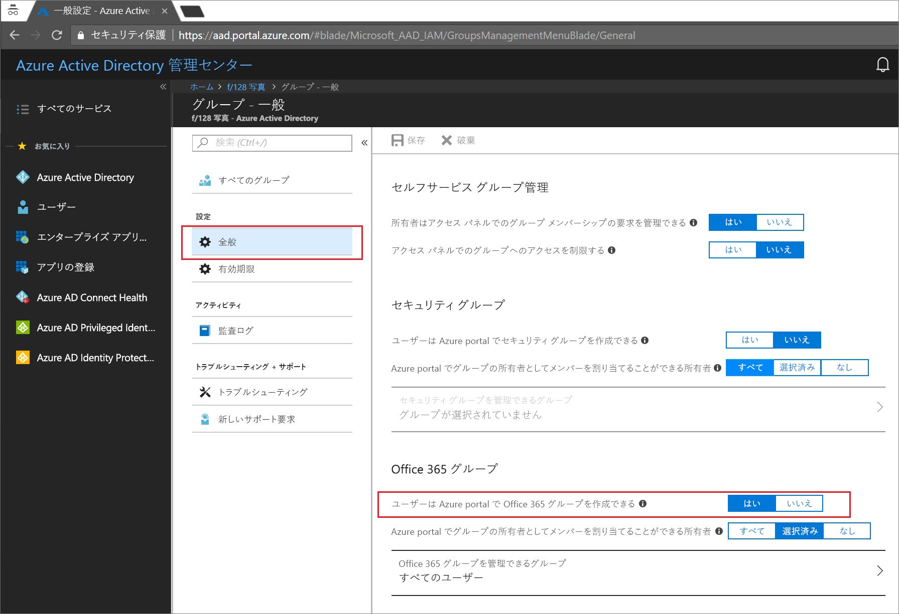
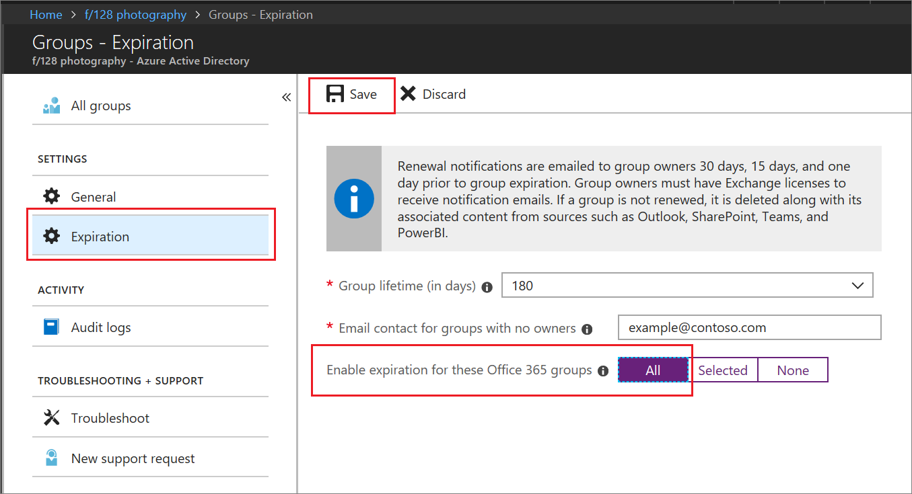

# クイック スタート:Azure Active Directory における Office 365 グループの有効期限を設定する

このクイック スタートでは、Office 365 グループの有効期限ポリシーを設定します。 ユーザーが独自のグループを設定できるようになっていると、未使用のグループが増えてしまうことがあります。 未使用のグループを管理する 1 つの方法は、それらのグループに有効期限を設定することです。グループを手動で削除するというメンテナンスの負担が軽減されます。

有効期限ポリシーは次のように単純なものです。

* 有効期限が迫っているグループを更新するよう、そのグループの所有者に通知します。
* 更新されないグループはすべて削除されます。
* 削除された Office 365 グループは、30 日以内であれば、グループの所有者または Azure AD 管理者が復元できます。

Azure サブスクリプションをお持ちでない場合は、開始する前に[無料アカウントを作成](https://azure.microsoft.com/free/)してください。

## 前提条件

グループの有効期限を設定するには、組織のグローバル管理者またはユーザー管理者であることが必要です。

## ユーザーによるグループの作成を有効にする

1. 組織のグローバル管理者アカウントまたはユーザー管理者アカウントで [Azure portal](https://portal.azure.com) にサインインします。

2. **[グループ]** を選択し、**[全般]** を選択します。
  
   

3. **[ユーザーは Office 365 グループを作成できます]** を **[はい]** に設定します。

4. 最後に **[保存]** を選択してグループの設定を保存します。

## グループの有効期限の設定

1. [Azure portal](https://portal.azure.com) にサインインし、**[Azure Active Directory]** > **[グループ]** > **[有効期限]** の順に選択して有効期限の設定を開きます。
  
   

2. 期限切れの間隔を設定します。 プリセット値を選択するか、31 日を超えるカスタム値を入力します。 

3. グループに所有者がいない場合に、有効期限の通知を送信するメール アドレスを指定します。

4. このクイック スタートでは、**[これらの Office 365 グループの有効期限を有効にする]** を **[すべて]** に設定します。

5. 最後に **[保存]** を選択して有効期限の設定を保存します。

これで完了です。 このクイック スタートを通じて、選択した Office 365 グループの有効期限ポリシーを正しく設定することができました。

## リソースのクリーンアップ

### 有効期限ポリシーを削除するには

1. テナントの全体管理者アカウントで [Azure portal](https://portal.azure.com) にサインインしていることを確認します。
2. **[Azure Active Directory]** > **[グループ]** > **[有効期限]** の順に選択します。
3. **[これらの Office 365 グループの有効期限を有効にする]** を **[なし]** に設定します。

### ユーザーによるグループの作成を無効にするには

1. **[Azure Active Directory]** > **[グループ]** > **[全般]** の順に選択します。 
2. Azure portal で **[ユーザーは Office 365 グループを作成できます]** を **[いいえ]** に設定します。

## 次の手順

技術的な制約やカスタム禁止単語リストの追加、Office 365 の各アプリ間のエンド ユーザー エクスペリエンスを含む有効期限の詳細については、次の記事を参照してください。こうした有効期限ポリシーについて詳しく説明されています。

> [!div class="nextstepaction"]
> [有効期限ポリシーの詳細](groups-lifecycle.md)
