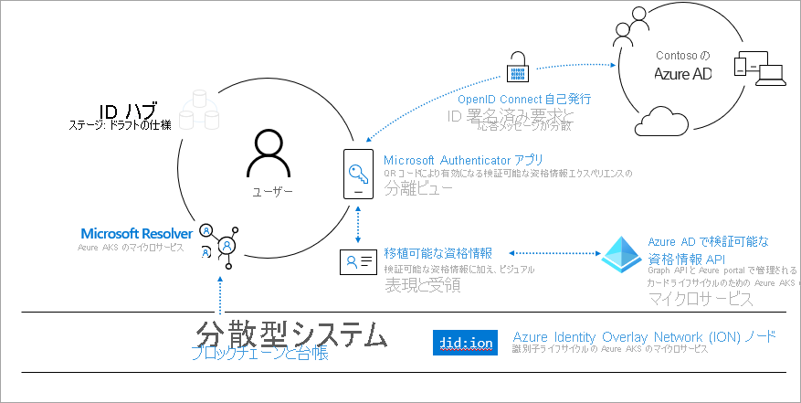
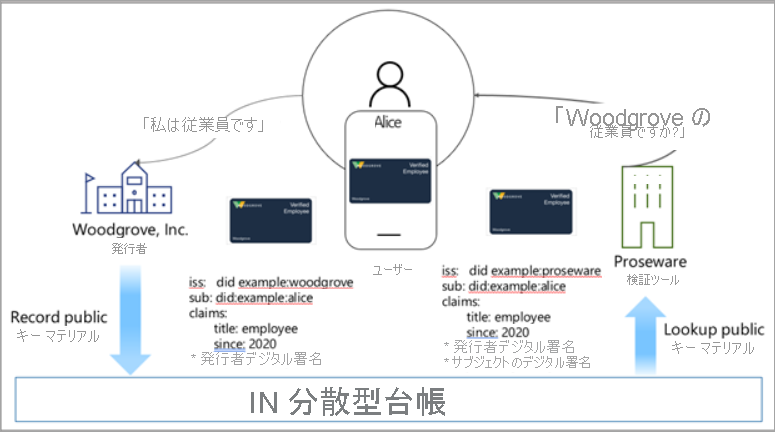
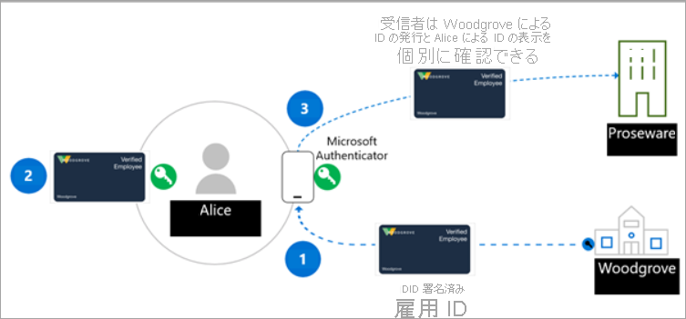

# <a name="introduction-to-azure-active-directory-verifiable-credentials-preview"></a>Azure Active Directory Verifiable Credentials (プレビュー) の概要

> [!IMPORTANT]
> Azure Active Directory Verifiable Credentials は現在、パブリック プレビュー段階です。
> このプレビュー バージョンはサービス レベル アグリーメントなしで提供されています。運用環境のワークロードに使用することはお勧めできません。 特定の機能はサポート対象ではなく、機能が制限されることがあります。 詳しくは、[Microsoft Azure プレビューの追加使用条件](https://azure.microsoft.com/support/legal/preview-supplemental-terms/)に関するページをご覧ください。

私たちが豊富なエクスペリエンスにアクセスするために使用するアプリ、サービス、デバイスと、私たちのデジタルおよび現実の生活とのつながりは、ますます強くなっています。 このデジタル変革のおかげで、以前には想像できなかった方法で、数百の会社や数千の他のユーザーとやり取りできます。

しかし、ID データがセキュリティ侵害にさらされることがあまりにも多くなっています。 これらの侵害は人々の生活に作用し、社会的、職業的、経済的な生活に影響を及ぼします。 Microsoft はより良い方法があると考えています。 すべての人は自分が所有および管理する ID を持ち、デジタル ID の要素を安全に保存してプライバシーを守る権利があります。 この入門編では、さまざまなコミュニティと提携し、信頼性と相互運用性が高くオープンな標準ベースの分散化 ID (DID) ソリューションを個人と組織のために構築している Microsoft の取り組みについて説明します。

## <a name="why-we-need-decentralized-identity"></a>分散化 ID が必要な理由

今や職場や家庭において、私たちが使用するあらゆるアプリ、サービス、デバイスでデジタル ID が使用されています。 これは、イベントのチケットの購入、ホテルへのチェックイン、ランチの注文まで、私たちの生活におけるあらゆる発言、行動、経験から成り立っています。 現在、私たちの ID とすべてのデジタルなやり取りは他者によって所有および制御されています。その一部については、私たちは気付いてすらいません。

通常、ユーザーはいくつかのアプリとデバイスに同意を付与します。 この方法では、だれがどのような情報にアクセスできるのかを追跡するのに、ユーザーの側で高度な警戒が必要となります。 企業の最前線におけるコンシューマーとパートナーのコラボレーションでは、関連するすべてのプライバシーとセキュリティを維持する方法でデータを安全に交換するために、高度なオーケストレーションが必要です。

Microsoft は標準ベースの分散化 ID システムによって、ユーザーと組織が自身のデータをより効果的に管理できる新しい一連のエクスペリエンスを実現したり、アプリ、デバイス、サービス プロバイダーに高度な信頼性とセキュリティを提供したりできると考えています

## <a name="lead-with-open-standards"></a>オープン標準によるリード

Microsoft は、お客様、パートナー、コミュニティと緊密に連携し、次世代の分散化 ID ベースのエクスペリエンスを実現しようとしています。Microsoft は、この分野で優れた貢献を行っている個人および組織と提携できることを嬉しく思っています。 DID エコシステムが成長するには、標準、技術的なコンポーネント、コード成果物がオープンソースで、すべての人にとってアクセスできるものでなければなりません。

Microsoft は、Decentralized Identity Foundation (DIF)、W3C Credentials Community Group、広範な ID コミュニティのメンバーと積極的にコラボレーションしています。 これらのグループと協力し、重要な標準の特定と開発を進めてきました。Microsoft のサービスには、次の標準が実装されています。

* [W3C 分散化識別子](https://www.w3.org/TR/did-core/)
* [W3C 検証可能な資格情報](https://www.w3.org/TR/vc-data-model/)
* [DIF Sidetree](https://identity.foundation/sidetree/spec/)
* [DIF 既知の DID 構成](https://identity.foundation/specs/did-configuration/)
* [DIF DID-SIOP](https://identity.foundation/did-siop/)
* [DIF Presentation Exchange](https://identity.foundation/presentation-exchange/)


## <a name="what-are-dids"></a>DID とは何か

DID を理解するには、それらを現在の ID システムと比較してみることが有効です。 メール アドレスとソーシャル ネットワークの ID は、コラボレーションのための、人間にとってわかりやすい別名です。しかし現在、コラボレーションに限らないさまざまなシナリオでデータ アクセスの制御ポイントとして機能するために、過剰な負荷がかかっています。 そのため、潜在的な問題が生じます。これらの ID へのアクセスは、外部の人間によっていつでも取り消される可能性があるためです。

分散化識別子 (DID) は異なります。 DID は、ION などの分散化システムに基づく、ユーザー生成自己所有グローバル一意識別子です。 不変性のより確実な保証、検閲防止、改ざんの回避など、固有の特性を備えています。 これらの属性は、自己所有とユーザーによる制御を実現することを目的とする ID システムにとって非常に重要です。 

Microsoft の検証可能な資格情報ソリューションでは分散化資格情報 (DID) を使用し、証明書利用者 (検証者) が検証可能な資格情報の所有者であることを示す情報を証明する証拠として、暗号で署名します。 そのため、Microsoft のサービスをベースにして検証可能な資格情報ソリューションを作成する方は、どなたも分散化識別子の基本を理解することをお勧めします。
## <a name="what-are-verifiable-credentials"></a>検証可能な資格情報とは何か

 私たちは日々の生活で ID を使用しています。 私たちは、車を操作できることを示す証拠として、運転免許証を使用しています。 大学は、一定の教育レベルに到達したことを証明する免状を発行します。 私たちは他国に到着したときに、自分たちの身分を当局に証明するためにパスポートを使用します。 データ モデルでは、インターネットを介しながらもユーザーのプライバシーを尊重する安全な方法で作業するときに、これらの各種シナリオに対応する方法について説明します。 その他の情報については、「[検証可能な資格情報のデータ モデル 1.0](https://www.w3.org/TR/vc-data-model/)」を参照してください。

簡単に言えば、検証可能な資格情報は、対象についての情報を証明する発行者によって実行されたクレームで構成されるデータ オブジェクトです。 これらのクレームはスキーマによって識別され、DID、発行者、対象を含みます。 発行者の DID によって、その情報を証明する証拠としてデジタル署名が作成されます。


## <a name="how-does-decentralized-identity-work"></a>分散化 ID のしくみ

私たちには新しい形式の ID が必要です。 テクノロジと標準を組み合わせて自己所有や検閲防止などの重要な ID 属性を実現する ID が必要です。 これらの機能は既存のシステムを使用して実現することは困難です。

これらの展望を実現するには、7 つの主要なイノベーションで構成された技術的な基盤が必要です。 重要なイノベーションの 1 つは、ユーザーによって所有される識別子、そのような識別子に関連付けられたキーを管理するユーザー エージェント、暗号化され、ユーザーによって制御されるデータストアです。



**1. W3C 分散化識別子 (DID)** 。一切の組織または政府から独立してユーザーが作成、所有、管理する ID。 DID は、公開キー マテリアル、認証記述子、サービス エンドポイントを含む JSON ドキュメントで構成された分散公開キー インフラストラクチャ (DPKI) メタデータにリンクされたグローバル一意識別子です。

**2. 分散化システム: ION (Identity Overlay Network)** 。ION は、純粋に決定論的な Sidetree プロトコルに基づく、レイヤー 2 のオープンなアクセス許可なしネットワークです。これには、特別なトークンも、信頼された検証ツールも、その他のコンセンサス メカニズムも必要ありません。この操作に必要なのは、ビットコインのタイム チェーンの直線的な進行だけです。 Microsoft は、アプリとサービスに統合するための ION ネットワークの操作を容易にする [npm パッケージをオープンソース化](https://www.npmjs.com/package/@decentralized-identity/ion-tools)しました。 ライブラリには、新しい DID の作成、キーの生成、ビットコイン ブロックチェーンでの DID のアンカーが含まれています。 

**3. DID ユーザー エージェントまたはウォレット: Microsoft Authenticator アプリ**。現実のユーザーが分散化 ID と検証可能な資格情報を使用できるようにします。 Authenticator では、DID を作成し、検証可能な資格情報の発行と表示の要求を容易にして、暗号化されたウォレット ファイルを通じて DID シードのバックアップを管理します。

**4. Microsoft リゾルバー**。```did:ion``` メソッドを使用して ION ノードに接続して DID を検索および解決し、DID ドキュメント オブジェクト (DDO) を返す API。 DDO には、公開キーやサービス エンドポイントなど、DID に関連付けられた DPKI メタデータが含まれています。 

**5. Azure Active Directory Verified Credentials Service**。```did:ion``` メソッドを使用して署名される [W3C 検証可能な資格情報](https://www.w3.org/TR/vc-data-model/)向けの発行および検証 API とオープンソースの SDK。 これらにより、ID 所有者によるクレームの生成、表示、検証が可能になります。 これが、システムのユーザー間における信頼の基礎を形成します。

## <a name="a-sample-scenario"></a>サンプル シナリオ

VC のしくみを説明するために使用するシナリオには、以下が登場します。

- Woodgrove Inc.という会社。
- Proseware。Woodgrove の従業員に割引を提供している会社。
- Alice。Woodgrove, Inc. の従業員であり、Proseware から割引を受けようとしている


今日、Alice はユーザー名とパスワードを入力して、Woodgrove のネットワーク環境にログオンします。 Woodgrove は、Alice が Woodgrove の従業員であることをより管理性の高い方法で証明できる VC ソリューションをデプロイしています。 Proseware は、Woodgrove の VC ソリューションと互換性のある VC ソリューションを使用していて、雇用の証拠として Woodgrove によって発行された資格情報を受け取ります。

資格情報の発行者である Woodgrove Inc. は、公開キーと秘密キーを作成します。 公開キーは ION に格納されます。 キーがインフラストラクチャに追加されると、ブロックチェーンベースの分散型台帳にエントリが記録されます。 発行者は、ウォレット アプリケーションに格納されている秘密キーを Alice に提供します。 Alice が秘密キーを正常に使用するたびに、トランザクションがウォレット アプリケーションに記録されます。



## <a name="roles-in-a-verifiable-credential-solution"></a>検証可能な資格情報ソリューションのロール 

検証可能な資格情報ソリューションには主に 3 つのアクターがあります。 次の図で説明します。

- **手順 1**: **ユーザー** が発行者に対して検証可能な資格情報を要求します。
- **手順 2**: 資格情報の **発行者** が、ユーザーによって提供された証拠が正確であることを証明し、DID を使用して署名された検証可能な資格情報を作成します。ユーザーの DID は対象です。
- **手順 3**: ユーザーが自分の DID を使用して検証可能なプレゼンテーション (VP) に署名し、**検証者** に送信します。 次に検証者が、DPKI にある公開キーと照合を行って、資格情報を検証します。

このシナリオのロールは次のとおりです。



**発行者** – 発行者は、ユーザーに情報を要求する発行ソリューションを作成する組織です。 この情報は、ユーザーの ID を検証するために使用されます。 たとえば Woodgrove, Inc. には、検証可能な資格情報 (VC) を作成してすべての従業員に配布することができる発行ソリューションがあります。 従業員は Authenticator アプリを使用し、自分たちのユーザー名とパスワードを使ってサインインします。これにより、ID トークンが発行元サービスに渡されます。 送信された ID トークンを Woodgrove, Inc. が検証すると、従業員についてのクレームを含み、Woodgrove, Inc. の DID で署名された VC が、発行ソリューションによって作成されます。 これで従業員は、自分の雇用者によって署名された検証可能な資格情報を手に入れます。これには、従業員 DID が対象 DID として含まれています。  

**ユーザー** – ユーザーは、VC を要求している人物またはエンティティです。 たとえば、Alice は Woodgrove, Inc. の新しい従業員であり、雇用の証拠となる検証可能な資格情報を前に発行されました。 Alice は Proseware で割引を受けるために雇用の証拠を提示する必要がある場合に、Alice が DID の所有者であることを証明する検証可能なプレゼンテーションに署名して、自分の Authenticator アプリで資格情報へのアクセスを許可できます。 Proseware は、Woodgrove, Inc. によって発行された資格情報を検証することができます。その資格情報の所有者は Alice です。 

**検証者** – 検証者は、自分が信頼する 1 人または複数の発行者からのクレームを検証する必要がある会社またはエンティティです。 たとえば、Proseware は Woodgrove, Inc. を信頼しており、従業員の ID の検証と本物の有効な VC の発行という適切な仕事を実行します。 Alice が自分の仕事に必要な装備の注文を試行すると、Proseware は SIOP や Presentation Exchange などのオープン標準を使用して、Woodgrove の従業員であることを証明するユーザーに対して資格情報を要求します。たとえば、Proseware は、携帯電話のカメラでスキャンできる QR コードが記載された Web サイトへのリンクを Alice に提供する可能性があります。 これにより、固有の VC の要求が開始されます。それが Authenticator によって分析され、Alice は自分が雇用されていることを Proseware に示す要求を承認できるようになります。 Proseware は、検証可能なプレゼンテーションの信頼性を検証するために、検証可能な資格情報のサービス API または SDK を使用できます。 Alice から得た情報に基づいて、Alice に割引を提供します。 Woodgrove, Inc. が自社の従業員に VC を発行していることを、その他の会社や組織が知っている場合は、それらも検証者ソリューションを作成し、Woodgrove, Inc. の検証可能な資格情報を使用して、Woodgrove, Inc. の従業員のみを対象とした特別なオファーを提供できます。

## <a name="next-steps"></a>次の手順

DID と検証可能な資格情報について確認したところで、スタート ガイド記事か、検証可能な資格情報の概念について詳しく説明している Microsoft のいずれかの記事に従って、それらを自分で試してみてください。

- [検証可能な資格情報のスタート ガイド](get-started-verifiable-credentials.md)
- [資格情報をカスタマイズする方法](credential-design.md)
- [検証可能な資格情報に関する FAQ](verifiable-credentials-faq.md)