# <a name="issue-azure-ad-verifiable-credentials-from-an-application-preview"></a>アプリケーションから Azure AD の検証可能な資格情報を発行する (プレビュー)

このチュートリアルでは、お使いのローカル コンピューターから Azure Active Directory (Azure AD) テナントに接続するサンプル アプリケーションを実行します。 このアプリケーションを使用して、検証済み資格情報エキスパート カードを発行して検証します。

この記事では、次の方法について説明します。

> [!div class="checklist"]
>
> - Azure AD の検証可能な資格情報構成ファイルを格納するための Azure Blob Storage を設定する。
> - 検証可能な資格情報構成ファイルを作成してアップロードする。
> - Azure で検証済み資格情報エキスパート カードを作成する。
> - 資格情報と環境の詳細を収集して、サンプル アプリケーションを設定する。
> - サンプル アプリケーション コードをローカル コンピューターにダウンロードする。
> - ご自分の検証済みの資格情報のエキスパート カードと環境の詳細を使用して、サンプル アプリケーションを更新する。
> - サンプル アプリケーションを実行し、最初の検証済み資格情報エキスパート カードを発行する。
> - 検証済み資格情報エキスパート カードを検証する。

次の図は、Azure AD の検証可能な資格情報のアーキテクチャと構成するコンポーネントを示しています。

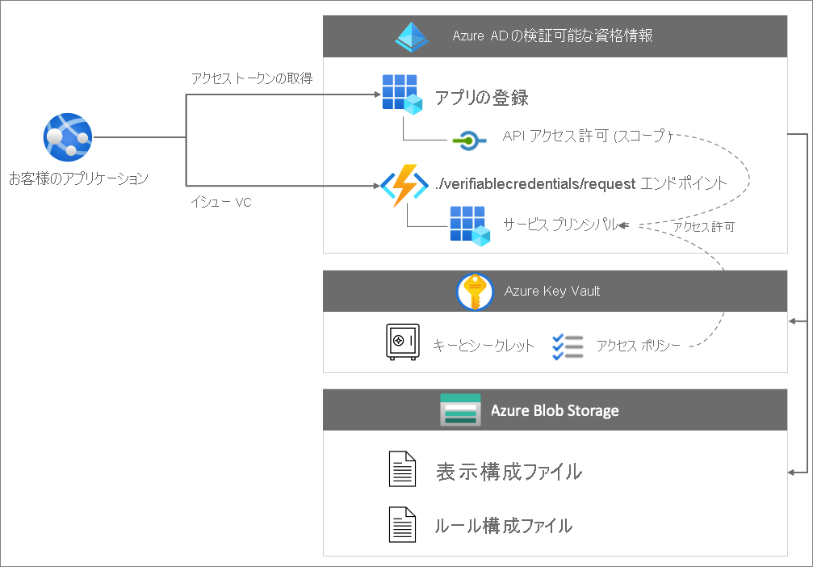

## <a name="prerequisites"></a>前提条件

- [Azure AD の検証可能な資格情報にテナントを設定する](./verifiable-credentials-configure-tenant.md)。
- サンプル アプリをホストするリポジトリを複製するために、[GIT](https://git-scm.com/downloads) をインストールする。
- [Visual Studio Code](https://code.visualstudio.com/Download)、または同様のコード エディター。
- [.NET 5.0](https://dotnet.microsoft.com/download/dotnet/5.0)。
- [ngrok](https://ngrok.com/) (無料)。
- Microsoft Authenticator を備えたモバイル デバイス:
  - Android バージョン 6.2108.5654 以降がインストールされていること。
  - iOS バージョン 6.5.82 以降がインストールされていること。

## <a name="create-a-storage-account"></a>ストレージ アカウントの作成

Azure Blob Storage は、クラウド向けのオブジェクト ストレージ ソリューションです。 Azure AD の検証可能な資格情報サービスでは、サービスが検証可能な資格情報を発行するときに、[Azure Blob Storage](../../storage/blobs/storage-blobs-introduction.md) を使用して構成ファイルが格納されます。

次の手順に従って、Blob Storage を作成して構成します。

1. Azure Blob Storage アカウントを持っていない場合は、[作成します](../../storage/common/storage-account-create.md)。
1. ストレージ アカウントを作成したら、コンテナーを作成します。 ストレージ アカウントの左側のメニューで、 **[データ ストレージ]** セクションまでスクロールし、 **[コンテナー]** を選択します。
1. **[+ コンテナー]** を選択します。
1. 新しいコンテナーの名前を入力します。 コンテナー名は小文字である必要があり、英文字または数字で始まる必要があり、英文字、数字、ダッシュ (-) 文字のみを含めることができます。 例: *vc-container*。
1. **[パブリック アクセス レベル]** は **[プライベート (匿名アクセスはありません)]** に設定します。
1. **［作成］** を選択します  

   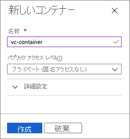

## <a name="grant-access-to-the-container"></a>コンテナーへのアクセスを許可する

コンテナーを作成したら、サインインしたユーザーに適切なロール割り当てを付与して、ユーザーが Blob Storage 内のファイルにアクセスできるようにします。

1. コンテナーの一覧から、**vc-container** を選びます。

1. メニューから **[アクセス制御 (IAM)]** を選びます。

1. **[+ 追加]** を選び、 **[ロールの割り当ての追加]** を選びます。

     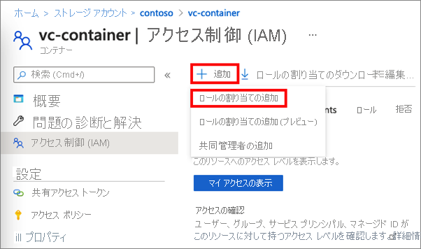

1. **[ロールの割り当ての追加]** で、次を行います。

    1. **[ロール]** で、 **[ストレージ BLOB データ閲覧者]** を選択します。

    1. **[アクセスの割り当て先]** で、 **[ユーザー、グループ、またはサービス プリンシパル]** を選びます。

    1. 次に、これらの手順を実行するために使用しているアカウントを検索して選びます。

        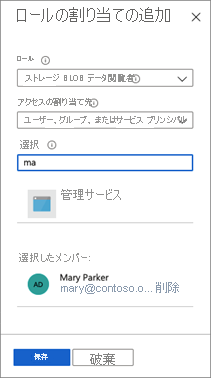

>[!IMPORTANT]
>既定では、コンテナーの作成者には所有者ロールが割り当てられます。 所有者ロールのままでは不十分です。 アカウントにはストレージ BLOB データ閲覧者ロールが必要です。 詳細については、「[Azure portal を使用して BLOB とキュー データへのアクセスのための Azure ロールを割り当てる](../../storage/blobs/assign-azure-role-data-access.md)」を参照してください。

### <a name="upload-the-configuration-files"></a>構成ファイルをアップロードする

Azure AD の検証可能な資格情報では、規則ファイルと表示ファイルの 2 つの JSON 構成ファイルが使用されます。 

- "*規則*" ファイルには、検証可能な資格情報の重要なプロパティが記述されています。 特に、検証可能な資格情報を発行する前に、サブジェクト (ユーザー) が指定する必要がある要求について記述されています。 
- "*表示*" ファイルは、資格情報のブランド化とクレームのスタイル設定を制御します。

このセクションでは、サンプルの規則と表示のファイルをストレージにアップロードします。 詳細については、「[検証可能な資格情報をカスタマイズする方法](credential-design.md)」を参照してください。

構成ファイルをアップロードするには、次の手順を実行します。

1. 次の JSON をコピーし、その内容を *VerifiedCredentialExpertDisplay.json* という名前のファイルに保存します。

    ```json
    {
      "default": {
        "locale": "en-US",
        "card": {
          "title": "Verified Credential Expert",
          "issuedBy": "Microsoft",
          "backgroundColor": "#2E4053",
          "textColor": "#ffffff",
          "logo": {
            "uri": "https://didcustomerplayground.blob.core.windows.net/public/VerifiedCredentialExpert_icon.png",
            "description": "Verified Credential Expert Logo"
          },
          "description": "Use your verified credential to prove to anyone that you know all about verifiable credentials."
        },
        "consent": {
          "title": "Do you want to get your Verified Credential?",
          "instructions": "Sign in with your account to get your card."
        },
        "claims": {
          "vc.credentialSubject.firstName": {
            "type": "String",
            "label": "First name"
          },
          "vc.credentialSubject.lastName": {
            "type": "String",
            "label": "Last name"
          }
        }
      }
    }
    ```

1. 次の JSON をコピーし、その内容を *VerifiedCredentialExpertRules.json* という名前のファイルに保存します。 次の検証可能な資格情報では、`firstName` と `lastName` という 2 つの単純な要求が定義されています。

    ```json
    {
      "attestations": {
        "idTokens": [
          {
            "id": "https://self-issued.me",
            "mapping": {
              "firstName": { "claim": "$.given_name" },
              "lastName": { "claim": "$.family_name" }
            },
            "configuration": "https://self-issued.me",
            "client_id": "",
            "redirect_uri": ""
          }
        ]
      },
      "validityInterval": 2592001,
      "vc": {
        "type": [ "VerifiedCredentialExpert" ]
      }
    }
    ```
    
1. Azure portal で、[作成した](#create-a-storage-account) Azure Blob Storage コンテナーに移動します。

1. 左側のメニューで **[コンテナー]** を選択して、含まれている BLOB の一覧を表示します。 次に、前に作成した **vc-container** を選択します。

1. **[アップロード]** ボタンを選んでアップロード ペインを開き、ローカル ファイル システムを参照して、アップロードするファイルを見つけます。 **VerifiedCredentialExpertDisplay.json** と **VerifiedCredentialExpertRules.json** のファイルを選択します。 次に、 **[アップロード]** を選択して、コンテナーにファイルをアップロードします。

## <a name="create-the-verified-credential-expert-card-in-azure"></a>Azure で検証済み資格情報エキスパート カードを作成する

この手順では、Azure AD の検証可能な資格情報を使用して検証済み資格情報エキスパート カードを作成します。 検証済みの資格情報を作成すると、Azure AD テナントで、プロセスを開始するユーザーに対してこの資格情報を発行することができます。

1. [Azure portal](https://portal.azure.com/) を使用して、"*検証可能な資格情報*" を検索します。 次に、 **[検証可能な資格情報 (プレビュー)]** を選びます。
1. [テナントを設定](verifiable-credentials-configure-tenant.md)すると、 **[新しい資格情報の作成]** ウィンドウが表示されます。 開いていない場合、またはさらに資格情報を作成する場合は、左側のメニューで **[資格情報]** を選択します。 次に、 **[+ 資格情報]** を選択します。
1. **[新しい資格情報の作成]** で、次の操作を行います。

    1. **[名前]** に「**VerifiedCredentialExpert**」と入力します。 この名前は検証可能な資格情報を識別するためにポータル内で使用されます。 これは、検証可能な資格情報のコントラクトの一部として含まれます。

    1. **[サブスクリプション]** には、Blob Storage を作成した Azure AD サブスクリプションを選びます。

    1. **[Display file]\(表示ファイル\)** で、 **[表示ファイルの選択]** を選びます。 [ストレージ アカウント] セクションで、**vc-container** を選びます。 次に **VerifiedCredentialExpertDisplay.json** ファイルを選択し、 **[選択]** をクリックします。

    1. **[規則ファイル]** で **規則ファイルを選択** します。 [ストレージ アカウント] セクションで、**vc-container** を選択します。 次に **VerifiedCredentialExpertRules.json** ファイルを選び、 **[選択]** を選びます。

    1. **［作成］** を選択します    

次のスクリーンショットでは、新しい資格情報を作成する方法を示しています。

  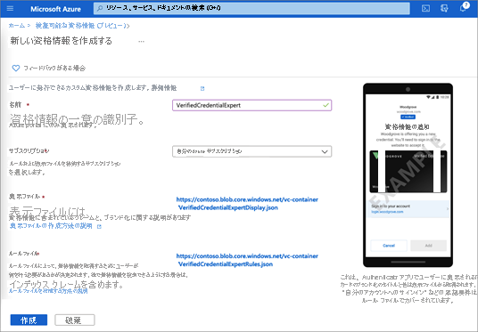

## <a name="gather-credentials-and-environment-details"></a>資格情報と環境の詳細を収集する

新しい資格情報を作成したので、お使いの環境と作成した資格情報に関する情報を収集します。 これらの情報は、サンプル アプリケーションを設定するときに使用します。

1. [検証可能な資格情報] で、 **[資格情報]** を選びます。 資格情報の一覧から、以前に作成した **VerifiedCredentialExpert** を選びます。

    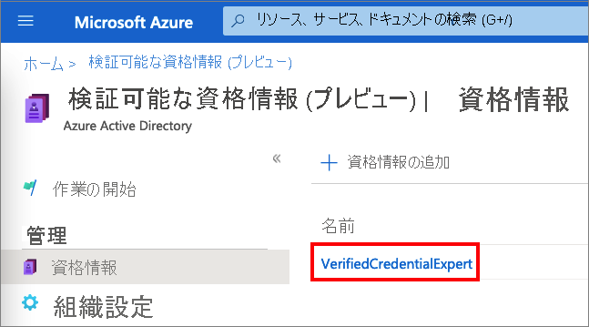

1. **資格情報の発行 URL** をコピーします。 この URL は規則ファイルと表示ファイルを組み合わせたものです。 これは、検証可能な資格情報の発行要件がユーザーに表示される前に Authenticator によって評価される URL です。 後で使うためにこれを記録します。

1. **分散化識別子** をコピーして、後で使うために記録します。

1. **テナント ID** をコピーして、後で使うために記録します。

   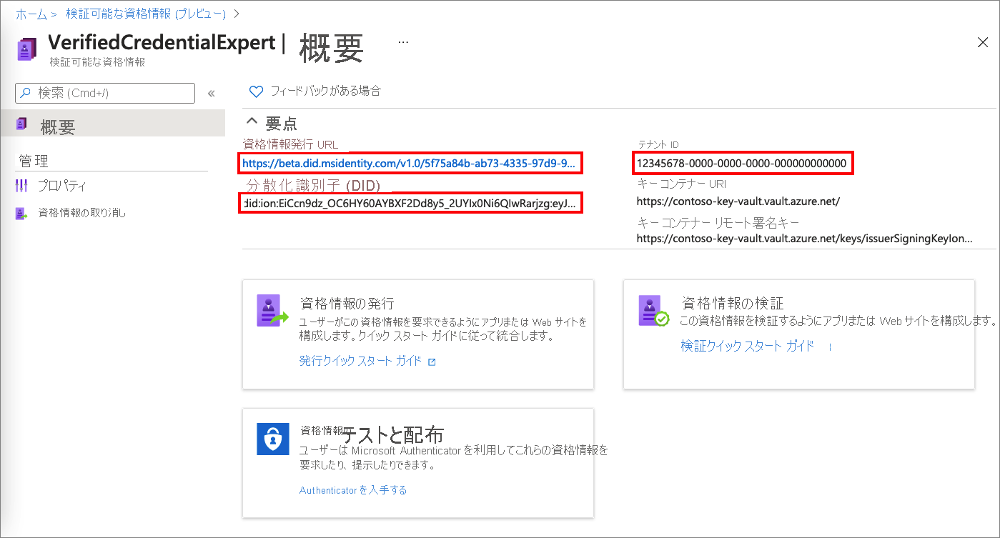

## <a name="download-the-sample-code"></a>サンプル コードのダウンロード

このサンプル アプリケーションは .NET で利用でき、コードは GitHub リポジトリに保持されています。 [GitHub](https://github.com/Azure-Samples/active-directory-verifiable-credentials-dotnet) からサンプル コードをダウンロードするか、リポジトリを自分のローカル コンピューターにクローンします。


```bash
git clone https://github.com/Azure-Samples/active-directory-verifiable-credentials-dotnet.git
```

## <a name="configure-the-verifiable-credentials-app"></a>検証可能な資格情報アプリを構成する

作成した登録済みアプリケーションに対してクライアント シークレットを作成します。 このサンプル アプリケーションでは、トークンを要求するときに、このクライアント シークレットを使ってその ID を証明します。

1. **Azure Active Directory** 内にある **[アプリの登録]** ページに移動します。

1. 前に作成した **verifiable-credentials-app** アプリケーションを選択します。

1. 名前を選び、登録の詳細に移動します。

1. **アプリケーション (クライアント) ID** をコピーして、後で使用できるように保存します。  

     

1. メイン メニューの **[管理]** で **[証明書とシークレット]** を選びます。

1. **[新しいクライアント シークレット]** を選び、次の手順を実行します。

    1. **[説明]** にクライアント シークレットの説明を入力します (例: **vc-sample-secret**)。

    1. **[有効期限]** で、シークレットが有効な期間 (6 か月など) を選びます。 その後、 **[追加]** を選択します。

    1. シークレットの **値** を記録します。 この値は、後の手順での構成に使用します。 シークレットの値は再び表示されることはなく、他の方法で取得することもできません。 表示されたらすぐに記録してください。

この時点で、サンプル アプリケーションを設定するために必要なすべての情報が表示されます。

## <a name="update-the-sample-application"></a>サンプル アプリケーションを更新する

次に、サンプル アプリの発行者コードに変更を加えて、検証可能な資格情報の URL でそれを更新します。 この手順により、独自のテナントを使用して、検証可能な資格情報を発行できます。

1. *active-directory-verifiable-credentials-dotnet-main* フォルダーで Visual Studio Code を開き、*1.asp-net-core-api-idtokenhint* フォルダー内のプロジェクトを選びます。

1. プロジェクトのルート フォルダーで、*appsettings.json* ファイルを開きます。 このファイルには、ご自分の Azure AD の検証可能な資格情報に関する情報が含まれています。 前の手順で記録した情報を使用して、次のプロパティを更新します。

    1. **Tenant ID:** ご自分のテナント ID
    1. **Client ID:** ご自分のクライアント ID
    1. **Client Secret**: ご自分のクライアント シークレット
    1. **IssuerAuthority**: ご自分の分散化識別子
    1. **VerifierAuthority**: ご自分の分散化識別子
    1. **Credential Manifest**: ご自分の資格情報の発行 URL

1. *appsettings.json* ファイルを保存します。

次の JSON は、完全な *appsettings.json* ファイルを示しています。

```json
{
  "AppSettings": {
    "Endpoint": "https://beta.did.msidentity.com/v1.0/{0}/verifiablecredentials/request",
    "VCServiceScope": "bbb94529-53a3-4be5-a069-7eaf2712b826/.default",
    "Instance": "https://login.microsoftonline.com/{0}",

    "TenantId": "12345678-0000-0000-0000-000000000000",
    "ClientId": "33333333-0000-0000-0000-000000000000",
    "ClientSecret": "123456789012345678901234567890",
    "CertificateName": "[Or instead of client secret: Enter here the name of a certificate (from the user cert store) as registered with your application]",
    "IssuerAuthority": "did:ion:EiCcn9dz_OC6HY60AYBXF2Dd8y5_2UYIx0Ni6QIwRarjzg:eyJkZWx0YSI6eyJwYXRjaGVzIjpbeyJhY3Rpb24iOiJyZXBsYWNlIiwiZG9jdW1lbnQiOnsicHVibGljS2V5cyI6W3siaWQiOiJzaWdfN2U4MmYzNjUiLCJwdWJsaWNLZXlKd2siOnsiY3J2Ijoic2VjcDI1NmsxIiwia3R5IjoiRUMiLCJ4IjoiaUo0REljV09aWVA...",
    "VerifierAuthority": " did:ion:EiCcn9dz_OC6HY60AYBXF2Dd8y5_2UYIx0Ni6QIwRarjzg:eyJkZWx0YSI6eyJwYXRjaGVzIjpbeyJhY3Rpb24iOiJyZXBsYWNlIiwiZG9jdW1lbnQiOnsicHVibGljS2V5cyI6W3siaWQiOiJzaWdfN2U4MmYzNjUiLCJwdWJsaWNLZXlKd2siOnsiY3J2Ijoic2VjcDI1NmsxIiwia3R5IjoiRUMiLCJ4IjoiaUo0REljV09aWVA...",
    "CredentialManifest":  "https://beta.did.msidentity.com/v1.0/12345678-0000-0000-0000-000000000000/verifiableCredential/contracts/VerifiedCredentialExpert"
  }
}
```

## <a name="issue-your-first-verified-credential-expert-card"></a>最初の検証済みの資格情報エキスパート カードを発行する

これで、サンプル アプリケーションを実行して、最初の検証済み資格情報エキスパート カードを発行する準備ができました。

1. Visual Studio Code から、*Verifiable_credentials_DotNet* プロジェクトを実行します。 または、コマンド シェルから、次のコマンドを実行します。

    ```bash
    cd active-directory-verifiable-credentials-dotnet/1-asp-net-core-api-idtokenhint  dotnet build "AspNetCoreVerifiableCredentials.csproj" -c Debug -o .\\bin\\Debug\\netcoreapp3.  dotnet run
    ```

1. 別のターミナルで、次のコマンドを実行します。 このコマンドは [ngrok](https://ngrok.com/) を実行して 3000 に URL を設定し、インターネット上で一般公開します。

    ```bash
    ngrok http 5000
    ```

    >[!NOTE]
    > 一部のコンピューターでは、`./ngrok http 3000` の形式でコマンドを実行する必要がある場合があります。

1. ngrok によって生成された HTTPS URL を開きます。

     

1. Web ブラウザーから **[Get Credential]\(資格情報の取得\)** を選択します。

     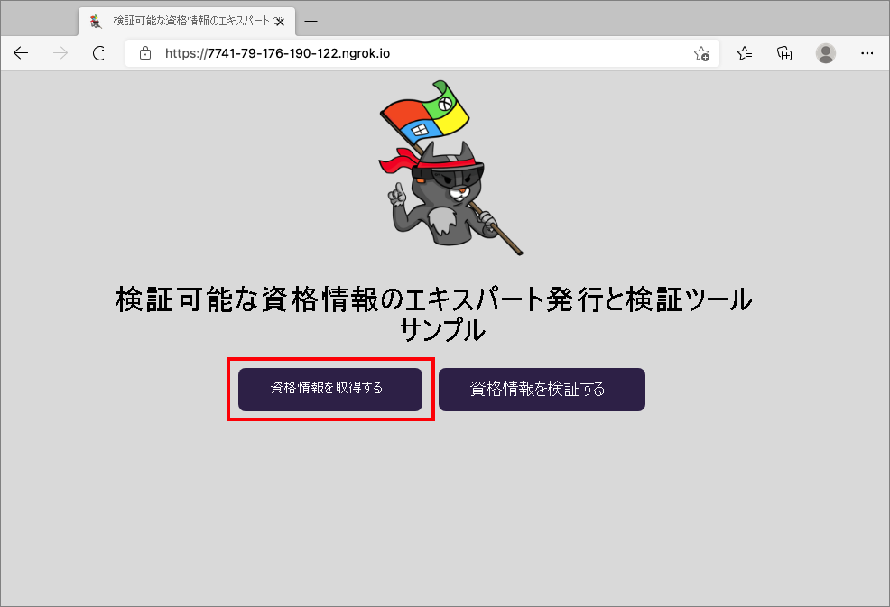

1. お使いのモバイル デバイスを使用して、Authenticator アプリで QR コードをスキャンします。 また、お使いのカメラから QR コードを直接スキャンして、Authenticator アプリを開くこともできます。

    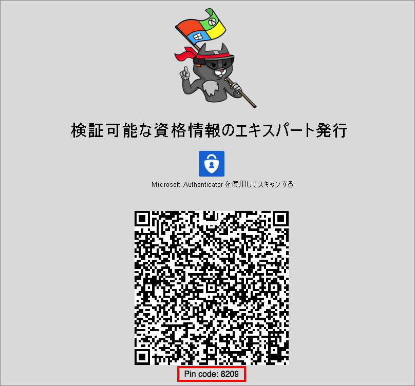

1. この時点で、このアプリまたは Web サイトは危険である可能性があることを示す警告メッセージが表示されます。 **[詳細]** を選択します。

     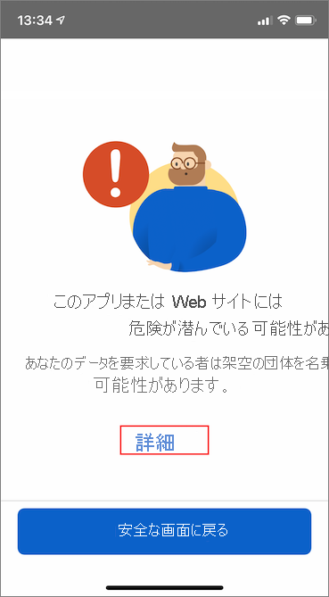

1. 危険な Web サイトの警告で、 **[Proceed anyways (unsafe)]\(このまま続行 (安全ではありません)\)** を選択します。 この警告が表示されるのは、ドメインが分散識別子 (DID) にリンクされていないためです。 ドメインを検証するには、「[ドメインを分散識別子 (DID) にリンクする](how-to-dnsbind.md)」のガイダンスに従います。 このチュートリアルでは、ドメインの登録をスキップし、 **[Proceed anyways (unsafe)]\(このまま続行 (安全ではありません)\)** を選択します。

     

1. QR コードをスキャンした画面に表示される PIN コードを入力するように求めるメッセージが表示されます。 PIN によって、発行にさらなる保護レイヤーが追加されます。 PIN コードは、発行 QR コードが表示されるたびランダムに生成されます。

     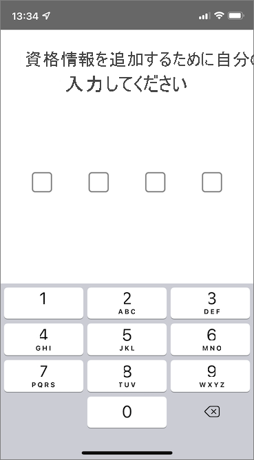

1. PIN 番号を入力すると、 **[資格情報の追加]** 画面が表示されます。 画面上部に、赤色で **[Not verified]\(未検証\)** というメッセージが表示されます。 この警告は、前述のドメイン検証の警告に関連しています。

1. **[追加]** を 選択して、新しい検証可能な資格情報を受け入れます。

    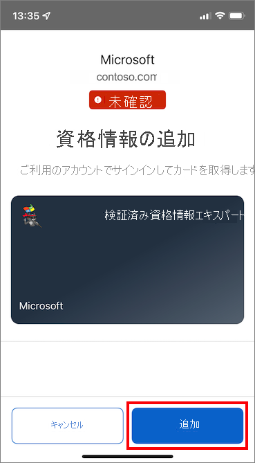

おめでとうございます。 検証済み資格情報エキスパートの検証可能な資格情報を取得できました。

  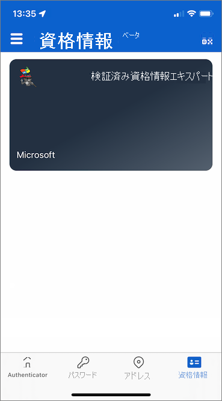

サンプル アプリに戻ります。 資格情報が正常に発行されたことが示されます。

  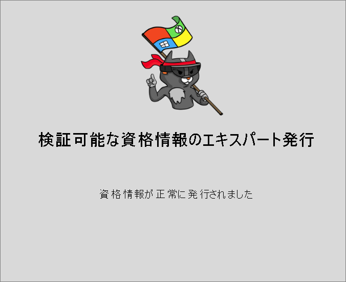

## <a name="verify-the-verified-credential-expert-card"></a>検証済み資格情報エキスパート カードを検証する

これで、サンプル アプリケーションをもう一度実行して、検証済み資格情報エキスパート カードを検証する準備ができました。

1. ブラウザーの [戻る] ボタンをクリックして、サンプル アプリのホーム ページに戻ります。

1. **[Verify Credential]\(資格情報の確認\)** を選択します。  

   ![[Verify Credential]\(資格情報の確認\) ボタンを選択する方法を示すスクリーンショット。](media/verifiable-credentials-configure-issuer/verify-credential.png)

1. Authenticator アプリを使用して QR コードをスキャンするか、お使いのモバイル カメラから直接スキャンします。

1. 警告メッセージが表示されたら、 **[詳細]** を選択します。 次に、 **[Proceed anyways (unsafe)]\(このまま続行 (安全ではありません)\)** を選択します。

1. **[許可]** を選択してプレゼンテーション要求を承認します。

    

1. プレゼンテーション要求を承認すると、要求が承認されたことを確認できます。 また、ログを確認することもできます。 ログを表示するには、検証可能な資格情報を選択します。  

    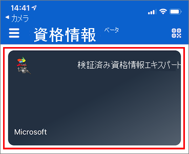

1. 次に、 **[最近のアクティビティ]** を選択します。  

    ![資格情報の履歴に移動する [最近のアクティビティ] ボタンを示すスクリーンショット。](media/verifiable-credentials-configure-issuer/verifable-credential-history.jpg)

1. これで、検証可能な資格情報の最近のアクティビティが表示されます。

    

1. サンプル アプリに戻ります。 検証可能な資格情報のプレゼンテーションが受信されたことが表示されます。  
    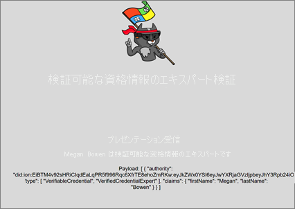

## <a name="verifiable-credential-names"></a>検証可能な資格情報の名前 

検証可能な資格情報には、資格情報の名と姓の値に **Megan Bowen** が含まれています。 これらの値は、サンプル アプリケーションでハードコーディングされ、ペイロードでの発行時に検証可能な資格情報に追加されました。 

実際のシナリオでは、ユーザーの詳細はアプリケーションによって ID プロバイダーからプルされます。 次のコード スニペットは、サンプル アプリケーションで名前が設定されている場所を示しています。 

```csharp
//file: IssuerController.cs
[HttpGet("/api/issuer/issuance-request")]
public async Task<ActionResult> issuanceRequest()
  {
    ...

    // Here you could change the payload manifest and change the first name and last name.
    payload["issuance"]["claims"]["given_name"] = "Megan";
    payload["issuance"]["claims"]["family_name"] = "Bowen";
    ...
}
  ```

## <a name="next-steps"></a>次の手順

[次のステップ](verifiable-credentials-configure-verifier.md)では、サードパーティ アプリケーション (証明書利用者アプリケーションとも呼ばれます) が、独自の Azure AD テナントの検証可能な資格情報 API サービスを使用して資格情報を検証する方法について説明します。

