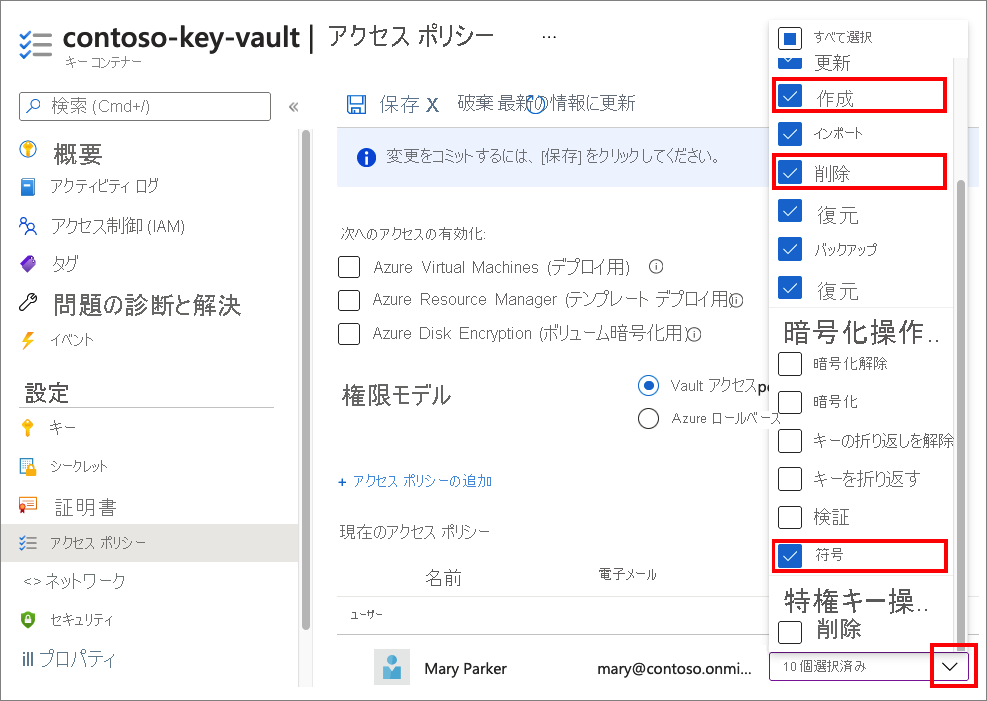
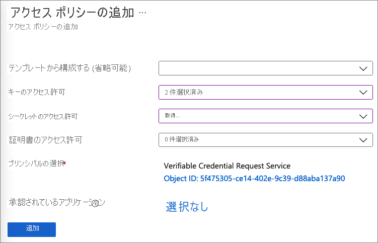
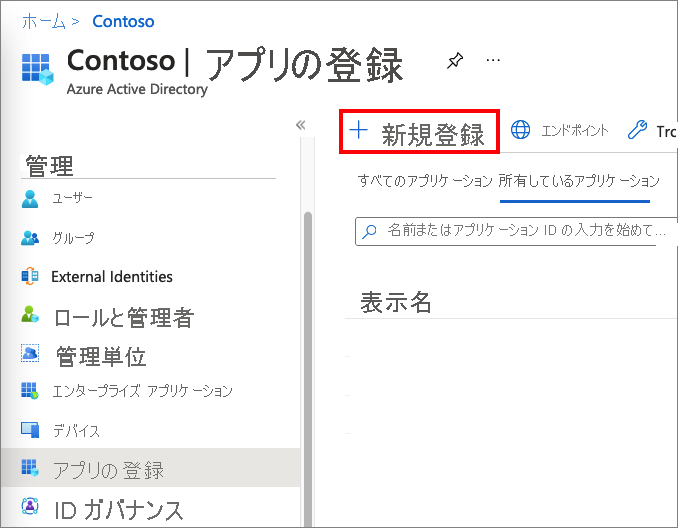
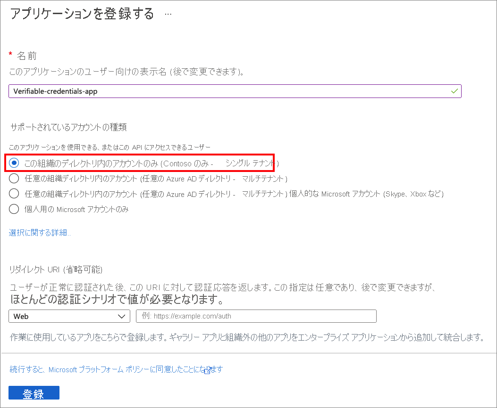
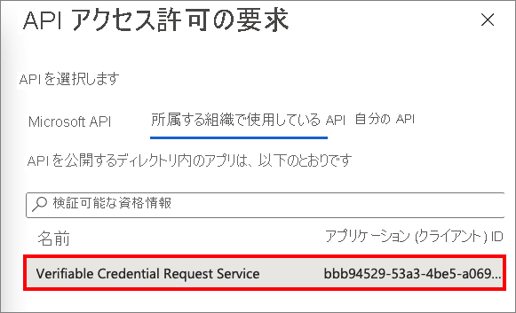
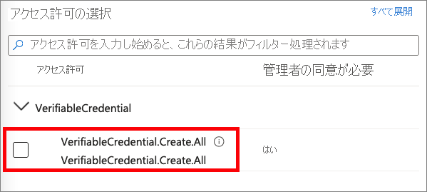
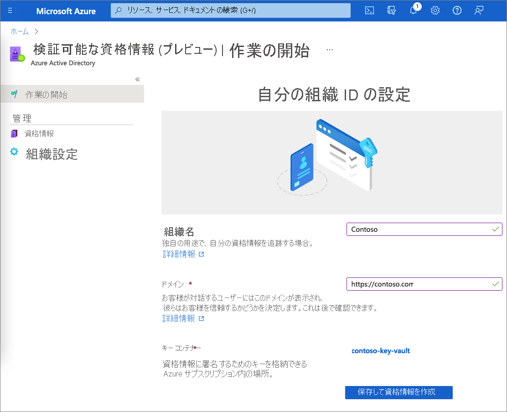

# <a name="configure-your-tenant-for-azure-ad-verifiable-credentials-preview"></a>Azure AD の検証可能な資格情報のためのテナントを構成する (プレビュー)

Azure Active Directory (Azure AD) の検証可能な資格情報では、シームレスで分散化された ID ソリューションを使用して組織を保護します。 このサービスを使用すると、資格情報を発行して検証できます。 発行者の場合、Azure AD によって、独自の検証可能な資格情報を発行するためにカスタマイズして使用できるサービスが提供されます。 検証者の場合、このサービスによって、アプリとサービス内で検証可能な資格情報を簡単に要求して受け入れることができる無料の REST API が提供されます。

このチュートリアルでは、この資格情報サービスを使用できるように Azure AD テナントを構成する方法について説明します。

具体的には、次の方法を学習します。

> [!div class="checklist"]
>
> - サービス プリンシパルを設定する
> - Azure Key Vault でキー コンテナーを作成する
> - アプリケーションを Azure AD に登録する
> - 検証可能な資格情報サービスを設定する

次の図は、Azure AD の検証可能な資格情報のアーキテクチャと構成するコンポーネントを示しています。


## <a name="prerequisites"></a>前提条件

- Azure サブスクリプションをお持ちでない場合は、[無料でアカウントを作成](https://azure.microsoft.com/free/?WT.mc_id=A261C142F)してください。
- テナントで [Azure Active Directory Premium エディション](../../active-directory/fundamentals/active-directory-get-started-premium.md)のサブスクリプションにサインアップします。
- 構成するディレクトリの[グローバル管理者](../../active-directory/roles/permissions-reference.md#global-administrator)アクセス許可を持っていることを確認します。
- [PowerShell](/powershell/scripting/install/installing-powershell) 7.0.6 LTS-x64、PowerShell 7.1.3-x64、またはそれ以降がインストールされていることを確認します。

## <a name="set-up-a-service-principal"></a>サービス プリンシパルを設定する

Request Service API のためのサービス プリンシパルを作成します。 このサービス API は、Azure AD の検証可能な資格情報を発行または検証するために使用する Microsoft サービスです。

サービス プリンシパルを作成するには、次を実行します。

1. 次の PowerShell コマンドを実行します。 これらのコマンドにより、`AzureAD` モジュールがインストールされて、インポートされます。 詳細については、「[Azure Az PowerShell モジュールをインストールする](/powershell/azure/install-az-ps#installation)」を参照してください。

    ```powershell
    if ((Get-Module -ListAvailable -Name "AzureAD") -eq $null) {  Install-Module "AzureAD" -Scope CurrentUser }  Import-Module AzureAD
    ```

1. 次の PowerShell コマンドを実行して、Azure AD テナントに接続します。 \<*your-tenant-ID*> を [Azure AD テナント ID](../../active-directory/fundamentals/active-directory-how-to-find-tenant.md) に置き換えます。

    ```powershell
    Connect-AzureAD -TenantId <your-tenant-ID>
    ```

1. 同じ PowerShell セッションで、次のコマンドを実行します。 `AppId` `bbb94529-53a3-4be5-a069-7eaf2712b826` は、検証可能な資格情報 Microsoft サービスを示しています。

    ```powershell
    New-AzureADServicePrincipal -AppId "bbb94529-53a3-4be5-a069-7eaf2712b826" -DisplayName "Verifiable Credential Request Service" 
    ```

## <a name="create-a-key-vault"></a>Key Vault を作成します

[Azure Key Vault](../../key-vault/general/basic-concepts.md) は、シークレットとキーを安全に保管しアクセスできるようにするクラウド サービスです。 検証可能な資格情報サービスでは、Azure Key Vault に公開キーと秘密キーが格納されます。 これらのキーは、資格情報の署名と検証に使用されます。

Azure Key Vault のインスタンスがない場合は、次の手順に従って、Azure portal を使用してキー コンテナーを作成します。

>[!NOTE]
>既定では、キー コンテナーを作成したアカウントのみにアクセス権があります。 検証可能な資格情報サービスはキー コンテナーにアクセスする必要があります。 キー コンテナーには、構成中に使用されるアカウントでキーの作成と削除を行うことができるようにするアクセス ポリシーを構成する必要があります。 構成中に使用されるアカウントでは、検証可能な資格情報のドメイン バインドを作成する目的で署名するためのアクセス許可も必要です。 テスト中に同じアカウントを使用する場合は、コンテナーの作成者に既定で付与されるアクセス許可のほかに、署名するためのアクセス許可をそのアカウントに付与するように既定のポリシーを変更してください。

### <a name="set-access-policies-for-the-key-vault"></a>キー コンテナーのアクセス ポリシーを設定する

キー コンテナーを作成すると、検証可能な資格情報によって、メッセージ セキュリティを確保するために使用される一連のキーが生成されます。 これらのキーは、Key Vault に格納されます。 キー セットは、検証可能な資格情報の署名、更新、および回復に使用します。

Key Vault の[アクセス ポリシー](../../key-vault/general/assign-access-policy.md)では、指定されたセキュリティ プリンシパルによって、Key Vault のシークレットとキーの操作を実行できるかどうかが定義されます。 Azure AD の検証可能な資格情報サービスの管理者アカウントと、作成した Request Service API プリンシパルの両方について、キー コンテナーにアクセス ポリシーを設定します。

1. [Azure portal](https://portal.azure.com/) で、このチュートリアルで使用するキー コンテナーに移動します。

1. **[設定]** の **[アクセス ポリシー]** を選択します。

1. **[アクセス ポリシーの追加]** の **[ユーザー]** で、このチュートリアルを実行するために使用するアカウントを選択します。

1. **[キーのアクセス許可]** で、 **[作成]** 、 **[削除]** 、 **[署名]** のアクセス許可が選択されていることを確認します。 既定では、 **[作成]** と **[削除]** は既に有効になっています。 更新する必要があるキーのアクセス許可は、 **[署名]** のみです。

    

1. 変更を保存するには、 **[保存]** を選択します。

1. **[+ アクセス ポリシーの追加]** を選択して、**Verifiable Credential Request Service** のサービス プリンシパルにアクセス許可を追加します。

1. **[アクセス ポリシーの追加]** で、次を行います。

    1. **[キーのアクセス許可]** で、 **[取得]** と **[署名]** を選択します。

    1. **[シークレットのアクセス許可]** で、 **[取得]** を選択します。

    1. **[プリンシパルの選択]** で、 **[Verifiable Credential Request Service]** を選択します。

    1. **[追加]** を選択します。  
        
       

1. **[保存]** を選択して、作成した新しいポリシーを保存します。

## <a name="register-an-application-in-azure-ad"></a>アプリケーションを Azure AD に登録する

Azure AD の検証可能な資格情報の要求サービスは、発行と検証のためのアクセス トークンを取得できる必要があります。 アクセス トークンを取得するには、Web アプリケーションを登録し、前の手順で設定した API Verifiable Credential Request Service のための API アクセス許可を付与します。

1. 管理者アカウントで [Azure portal](https://portal.azure.com/) にサインインします。

1. 複数のテナントにアクセスできる場合は、 **[ディレクトリ + サブスクリプション]** :::image type="icon" source="media/verifiable-credentials-configure-tenant/portal-directory-subscription-filter.png" border="false"::: アイコンを選択します。 次に、お使いの **Azure Active Directory** を探して選択します。

1. **[管理]** で **[アプリの登録]**  >  **[新規登録]** の順に選択します。  

   

1. アプリケーションの表示名を入力します。 たとえば、*verifiable-credentials-app* と指定します。

1. **[サポートされているアカウントの種類]** で、 **[Accounts in this organizational directory only (Default Directory only - Single tenant)]\(この組織ディレクトリのアカウントのみ (既定のディレクトリのみ - シングル テナント)\)** を選択します。

1. **[登録]** を選択して、アプリケーションを作成します。

   

### <a name="grant-permissions-to-get-access-tokens"></a>アクセス トークンを取得するためにアクセス許可を付与する

この手順では、[手順 1](#set-up-a-service-principal) で作成した Verifiable Credential Request Service のプリンシパルにアクセス許可を付与します。

必要なアクセス許可を追加するには、次の手順に従います。

1. **verifiable-credentials-app** アプリケーション詳細ページで作業を続けます。 **[API のアクセス許可]** 、 **[アクセス許可の追加]** の順に選択します。
    
    

1. **[所属する組織で使用している API]** を選択します。

1. 以前作成したサービス プリンシパルである、**Verifiable Credential Request Service** を検索し、それを選択します。
    
    

1. **[アプリケーションのアクセス許可]** を選択し、 **[VerifiableCredential.Create.All]** を展開します。

    

1. **[アクセス許可の追加]** を選択します.

1. **[\<your tenant name\> に管理者の同意を与えます]** を選択します。

## <a name="set-up-verifiable-credentials"></a>検証可能な資格情報の設定 

Azure AD の検証可能な資格情報を設定するには、次の手順を実行します。

1. [Azure portal](https://portal.azure.com/) で、*検証可能な資格情報* を検索します。 次に、 **[検証可能な資格情報 (プレビュー)]** を選択します。

1. 左側のメニューから、 **[はじめに]** を選択します。

1. 次の情報を指定して、組織を設定します。

    1. **組織名**: 検証可能な資格情報内で自分のビジネスを参照する名前を入力します。 顧客にこの名前は表示されません。

    1. **ドメイン:** 分散化 ID (DID) ドキュメントのサービス エンドポイントに追加されるドメインを入力します。 ドメインは、ユーザーがお客様のビジネスについて知っている具体的な何かに DID をバインドするものです。 Microsoft Authenticator とその他のデジタル ウォレットでは、DID がドメインにリンクされていることを検証するために、この情報を使用します。 DID を検証できる場合、ウォレットには検証済み記号が表示されます。 ウォレットで DID を検証できない場合、検証できない資格情報が組織によって発行されたことがユーザーに通知されます。   
            
        >[!IMPORTANT]
        > ドメインはリダイレクトしないようにします。 そうしないと、DID とドメインはリンクできません。 ドメインに HTTPS を使用してください。 (例: `https://contoso.com`)。

    1. **キー コンテナー**: 前に作成したキー コンテナーの名前を入力します。

1. **[Save and create credential]\(保存して資格情報を作成\)** を選択します。  
    
    

## <a name="next-steps"></a>次の手順

- [Azure AD の検証可能な資格情報を Web アプリケーションから発行する方法について学習します](verifiable-credentials-configure-issuer.md)。
- [Azure AD の検証可能な資格情報を検証する方法について学習します](verifiable-credentials-configure-verifier.md)。
