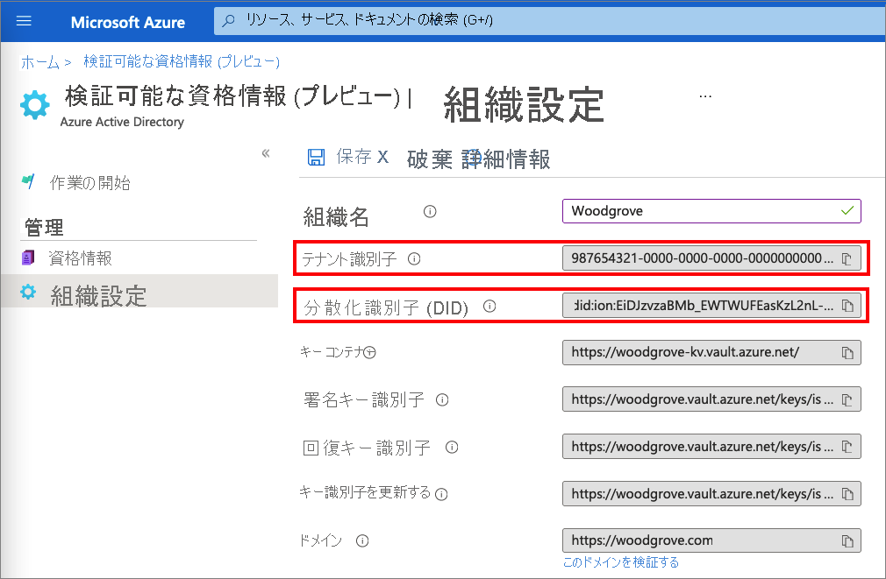
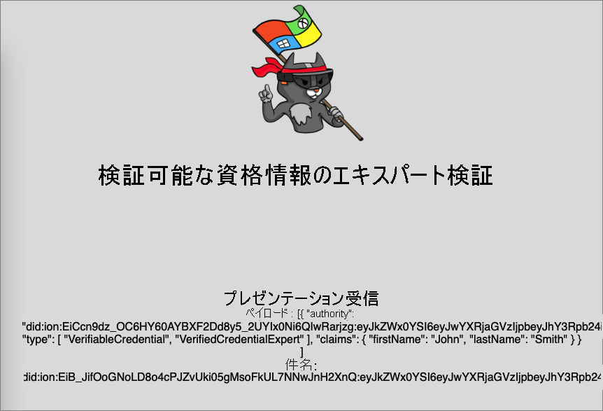

# <a name="configure-azure-ad-verifiable-credentials-verifier-preview"></a>Azure AD の検証可能な資格情報の検証ツールを構成する (プレビュー)

「[アプリケーションから Azure AD の検証可能な資格情報を発行する (プレビュー)](verifiable-credentials-configure-issuer.md)」では、同じ Azure Active Directory (Azure AD) テナントを使用して資格情報を発行および検証する方法について説明します。 このチュートリアルでは、最初の検証可能な資格情報 (検証済み資格情報エキスパート カード) を提示して検証するために必要な手順について説明します。

検証者は、検証済み資格情報エキスパート カードを持つサブジェクトに対して特権のロックを解除します。 このチュートリアルでは、ローカル コンピューターからサンプル アプリケーションを実行します。検証済み資格情報エキスパート カードの提示が求められたら、それを検証します。

この記事では、次の方法について説明します。

> [!div class="checklist"]
>
> - サンプル アプリケーション コードをローカル コンピューターにダウンロードする
> - Azure AD テナントで Azure AD の検証可能な資格情報をセットアップする
> - 資格情報と環境の詳細を収集してサンプル アプリケーションをセットアップし、検証済み資格情報エキスパート カードの詳細を使用してサンプル アプリケーションを更新する
> - サンプル アプリケーションを実行し、検証可能な資格情報の発行プロセスを開始する

## <a name="prerequisites"></a>前提条件

- [Azure AD の検証可能な資格情報にテナントを設定する](verifiable-credentials-configure-tenant.md)。
- サンプル アプリをホストするリポジトリをクローンする場合、[Git](https://git-scm.com/downloads) をインストールする。
- [Visual Studio Code](https://code.visualstudio.com/Download)、または同様のコード エディター。
- [.NET 5.0](https://dotnet.microsoft.com/download/dotnet/5.0)。
- [ngrok](https://ngrok.com/) (無料)。
- Microsoft Authenticator を備えたモバイル デバイス:
  - Android バージョン 6.2108.5654 以降がインストールされていること。
  - iOS バージョン 6.5.82 以降がインストールされていること。

## <a name="gather-tenant-details-to-set-up-your-sample-application"></a>テナントの詳細を収集してサンプル アプリケーションを設定する

Azure AD の検証可能な資格情報サービスを設定したので、お使いの環境と設定した検証可能な資格情報に関する情報を収集します。 これらの情報は、サンプル アプリケーションを設定するときに使用します。

1. **[検証可能な資格情報 (プレビュー)]** から、 **[組織の設定]** を選択します。
1. **テナント識別子** の値をコピーして、後で使うために記録します。
1. **分散化識別子** の値をコピーして、後で使うために記録します。

次のスクリーンショットは、必要な値をコピーする方法を示しています。



## <a name="download-the-sample-code"></a>サンプル コードのダウンロード

このサンプル アプリケーションは .NET で利用でき、コードは GitHub リポジトリに保持されています。 [GitHub リポジトリ](https://github.com/Azure-Samples/active-directory-verifiable-credentials-dotnet)からサンプル コードをダウンロードするか、リポジトリを自分のローカル コンピューターにクローンします。

```bash
git clone git@github.com:Azure-Samples/active-directory-verifiable-credentials-dotnet.git 
```

## <a name="configure-the-verifiable-credentials-app"></a>検証可能な資格情報アプリを構成する

作成した登録済みアプリケーションに対してクライアント シークレットを作成します。 このサンプル アプリケーションでは、トークンを要求するときに、このクライアント シークレットを使ってその ID を証明します。

1. Azure AD で、 **[アプリの登録]** に移動します。

1. 前に作成した **verifiable-credentials-app** アプリケーションを選択します。

1. 名前を選択して、**アプリの登録の詳細** に移動します。

1. **アプリケーション (クライアント) ID** の値をコピーして、後で使用できるように保存します。 

    

1. **アプリ登録の詳細** で、メイン メニューの **[管理]** から **[証明書とシークレット]** を選択します。

1. **[新しいクライアント シークレット]** を選択します。

    1. **[説明]** ボックスにクライアント シークレットの説明を入力します (例: vc-sample-secret)。

    1. **[有効期限]** で、シークレットが有効な期間 (6 か月など) を選びます。 その後、 **[追加]** を選択します。

    1. シークレットの **値** を記録します。 この値は、後の手順での構成に使用します。 シークレットの値は、再度表示することも、その他の方法で取得することもできないため、表示されたらすぐに記録してください。

この時点で、サンプル アプリケーションを設定するために必要なすべての情報が表示されます。

## <a name="update-the-sample-application"></a>サンプル アプリケーションを更新する

次に、サンプル アプリの発行者コードに変更を加えて、検証可能な資格情報の URL でそれを更新します。 この手順により、独自のテナントを使用して、検証可能な資格情報を発行できます。

1. *active-directory-verifiable-credentials-dotnet-main* ディレクトリで **Visual Studio Code** を開きます。 *1. asp-net-core-api-idtokenhint* ディレクトリ内のプロジェクトを選択します。

1. プロジェクトのルート フォルダーで、*appsettings.json* ファイルを開きます。 このファイルには、Azure AD の検証可能な資格情報の、ご自分の資格情報に関する情報が含まれています。 上記の手順で以前に記録した情報を使用して、次のプロパティを更新します。

    1. **Tenant ID**: ご自分のテナント ID
    1. **Client ID**: ご自分のクライアント ID
    1. **Client Secret**: ご自分のクライアント シークレット
    1. **VerifierAuthority**: ご自分の分散化識別子
    1. **CredentialManifest**: ご自分の資格情報の発行 URL

1. *appsettings.json* ファイルを保存します。

次の JSON は、完全な *appsettings.json* ファイルを示しています。

```json
{

 "AppSettings": {
   "Endpoint": "https://beta.did.msidentity.com/v1.0/{0}/verifiablecredentials/request",
   "VCServiceScope": "bbb94529-53a3-4be5-a069-7eaf2712b826/.default",
   "Instance": "https://login.microsoftonline.com/{0}",
   "TenantId": "987654321-0000-0000-0000-000000000000",
   "ClientId": "555555555-0000-0000-0000-000000000000",
   "ClientSecret": "123456789012345678901234567890",
   "VerifierAuthority": "did:ion:EiDJzvzaBMb_EWTWUFEasKzL2nL-BJPhQTzYWjA_rRz3hQ:eyJkZWx0YSI6eyJwYXRjaGVzIjpbeyJhY3Rpb24iOiJyZXBsYWNlIiwiZG9jdW1lbnQiOnsicHVibGljS2V5cyI6W3siaWQiOiJzaWdfMmNhMzY2YmUiLCJwdWJsaWNLZXlKd2siOnsiY3J2Ijoic2VjcDI1NmsxIiwia3R5IjoiRUMiLCJ4IjoiZDhqYmduRkRGRElzR1ZBTWx5aDR1b2RwOGV4Q2dpV3dWUGhqM0N...",
   "CredentialManifest": " https://beta.did.msidentity.com/v1.0/987654321-0000-0000-0000-000000000000/verifiableCredential/contracts/VerifiedCredentialExpert"
 }
}
```

## <a name="run-and-test-the-sample-app"></a>サンプル アプリを実行してテストする

これで、サンプル アプリケーションを実行して、最初の検証済み資格情報エキスパート カードを提示して検証する準備ができました。

1. Visual Studio Code から、*Verifiable_credentials_DotNet* プロジェクトを実行します。 または、コマンド シェルから、次のコマンドを実行します。

    ```bash
    cd active-directory-verifiable-credentials-dotnet/1. asp-net-core-api-idtokenhint  dotnet build "asp-net-core-api-idtokenhint.csproj" -c Debug -o .\bin\Debug\netcoreapp3.1  
    dotnet run
    ```

1. 別のターミナルで、次のコマンドを実行します。 このコマンドは [ngrok](https://ngrok.com/) を実行して 3000 に URL を設定し、インターネット上で一般公開します。

    ```bash
    ngrok http 3000 
    ```
    
    >[!NOTE]
    > 一部のコンピューターでは、`./ngrok http 3000` の形式でコマンドを実行する必要がある場合があります。

1. ngrok によって生成された HTTPS URL を開きます。

    

1. Web ブラウザーから **[Verify Credential]\(資格情報の検証\)** を選択します。

    ![サンプル アプリから [Verify Credential]\(資格情報の検証\) を選択する方法を示すスクリーンショット。](media/verifiable-credentials-configure-verifier/verify-credential.png)

1. Authenticator を使用して QR コードをスキャンするか、お使いのモバイル カメラから直接スキャンします。

1. "*このアプリまたは Web サイトが危険である可能性がある*" という警告メッセージが表示されたら、 **[詳細設定]** を選択します。 この警告が表示されるのは、ドメインが検証されていないためです。 このチュートリアルでは、ドメインの登録を省略できます。  

    ![危険な認証アプリの警告で [詳細設定] を選択する方法を示すスクリーンショット。](media/verifiable-credentials-configure-verifier/at-risk.png)
    

1. 危険な Web サイトの警告で、 **[Proceed anyways (unsafe)]\(このまま続行 (安全ではありません)\)** を選択します。  
 
    

1. **[許可]** を選択して要求を承認します。

    

1. 要求を承認すると、要求が承認されたことを確認できます。 また、ログを確認することもできます。 ログを表示するには、検証可能な資格情報を選択します。

    

1. 次に、 **[最近のアクティビティ]** を選択します。  

    ![資格情報の履歴に移動する [最近のアクティビティ] ボタンを示すスクリーンショット。](media/verifiable-credentials-configure-verifier/verifable-credential-history.jpg)

1. **[最近のアクティビティ]** には、検証可能な資格情報の最近のアクティビティが表示されます。

    

1. サンプル アプリに戻ります。 検証可能な資格情報のプレゼンテーションが受信されたことが表示されます。

    

## <a name="next-steps"></a>次の手順

[検証可能な資格情報をカスタマイズする方法](credential-design.md)について確認します。
